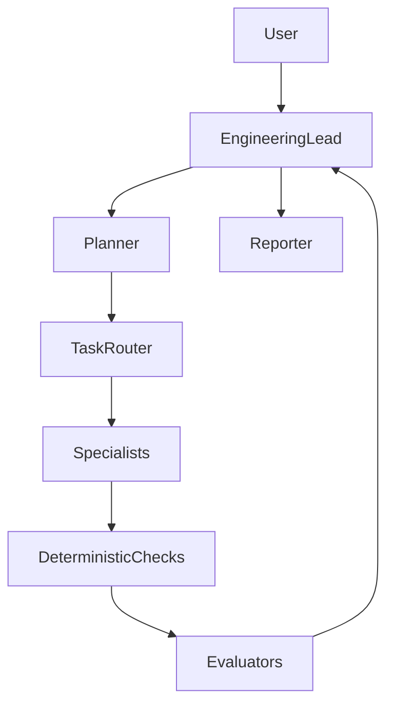

# ADR: Pi AI Harness Program

Status: Proposed

Date: 2026-05-08

## Context

Pi already exposes the right substrate for serious harness work: TypeScript extensions, Agent Skills, session JSONL trees with fork/clone, compaction, tool interception, custom commands, `appendEntry` state, JSON/RPC modes, and shareable Pi packages. Reliability for coding agents comes mostly from the **harness** (context, tools, guardrails, memory, observability, feedback, workflow control), not from prompt tweaks alone.

We want a **program-level** stance: composable packages that encode feedforward guidance and feedback checks, without forcing a giant orchestration framework into Pi core or into a single repo. At the same time, multi-step quality workflows (plan → implement → verify → review) need clear architecture so implementers do not collapse “generator” and “evaluator” into one self-approving agent, or jump straight to a generic DAG executor.

Durable retrieval memory for this program is specified separately in the QMD Subconscious ADR/PRD. This ADR covers the **harness shape** around that slice: safety, loops, roles, isolation, and observability.

## Decision

1. **Package-first delivery**  
   Ship harness value as Pi packages (extensions, skills, prompts, optional themes), not as changes assumed to live in Pi upstream. Core Pi stays conceptually thin; packages own policy, loops, and orchestration commands.

2. **Deterministic checks before inferential judgment**  
   Prefer `tsc`, lint, tests, schema validation, path gates, and command allowlists before asking an LLM to “sign off.” LLM evaluators handle what cannot be reduced to checks: product fit, architecture judgment, suspicious diffs, UX.

3. **Generator and evaluator are never the same actor**  
   The agent that edits code must not be the final authority on pass/fail. Evaluators receive the task contract, diff, and verification output; they return structured findings and do not mutate the codebase. A supervisor or **Engineering Lead** role routes retries to generators.

4. **Default workflow is a small serial loop**  
   First automation target: planner (acceptance criteria) → generator (small diff) → deterministic checks → evaluator (structured pass/fail) → bounded retry → reporter. Parallelism and dynamic routing are deferred until this loop is stable and bottlenecks are measured.

5. **Context isolation via session tree**  
   When multiple agent sessions or branches are used for specialists, prefer **forked branches or separate sessions** over one shared mega-context for unrelated work. Keeps tokens down and reduces cross-contamination; aligns with Pi’s JSONL session tree.

6. **Workers are contracts, not personas**  
   Specialist agents are defined by role, scope (`writes_to` / `cannot_touch`), inputs, outputs, constraints, and `required_checks`—structured YAML or JSON—not open-ended “personalities.” User-facing language may use **Engineering Lead** and **Specialists**; internal docs keep planner / generator / evaluator terminology.

7. **Memory is layered and retrieval-based**  
   Session JSONL remains the raw source of truth. Compaction summaries are context aids, not the only long-term record. Durable project/global memory and harness learnings follow the QMD Subconscious model where that product is adopted; injection stays selective and budgeted.

8. **Observability and audit are first-class**  
   Preserve raw traces (tool outputs, commands, failures) for diagnosis. Provide a **harness audit** surface (commands such as `/harness:audit`) that lists loaded context, extensions, tools, skills, session branch state, policy, and recent blocks—so failures are debugged as harness issues, not only model issues.

9. **Canonical user-facing command family: `harness:*`**  
   Illustrative commands in learning notes (`orch:*`, etc.) are superseded for this program by a single namespace: e.g. `/harness:run`, `/harness:audit`, `/harness:policy`, for consistency and discoverability.

## Architecture

High-level flow (roles may map to separate sessions or branches when implemented):

- **Engineering Lead**: sole user-facing coordinator; decomposition, routing, retries, synthesis, verification orchestration; does not self-approve and should not own large direct edits.
- **Planner**: produces structured task contract and acceptance criteria.
- **Specialists**: scoped generators (backend, frontend, QA, etc.) operating only within declared paths.
- **Deterministic checks**: run before evaluator LLM turns.
- **Evaluators**: independent, read-only judgment with structured output.
- **Reporter**: final summary and residual risk.

## Alternatives Considered

### Generic DAG orchestration engine first

Rejected for the initial program. Adds complexity before serial loops and checks prove value. Dynamic graphs may appear later behind the same package boundary, not as the first artifact.

### Single all-in-one agent with longer prompts

Rejected. Does not scale reliability; instructions get ignored without executable checks and separate evaluation.

### Self-approval by the implementer agent

Rejected. Same context cannot fairly play generator and final gate; known failure mode for agent systems.

### Stuffing all memory into system prompt or one `MEMORY.md`

Rejected. Conflicts with retrieval, provenance, decay, and QMD-backed design; see QMD Subconscious ADR.

### Pushing harness policy into Pi core

Rejected. Keeps Pi reusable; policy varies by team and repo. Extensions and packages carry policy.

## Consequences

### Positive

- Clear implementer boundary: everything ships as auditable packages.
- Reliability improvements compound via checks, evaluators, and harness learnings.
- Session fork and extension APIs are used as intended for isolation and guardrails.
- Aligns with existing QMD Subconscious plan without duplicating memory ADR content.

### Negative

- Users install and compose multiple packages; onboarding needs a starter package and docs.
- Multi-session orchestration adds operational complexity (state in `appendEntry`, branch bookkeeping).
- Evaluator and check runtime can add latency; must stay budgeted.

## Related documents

- Product requirements: `.cursor/plans/ai-harness/ai-harness-PRD.md`
- Memory slice (authoritative): `.cursor/plans/ai-harness/qmd-subconscious-ADR.md`, `.cursor/plans/ai-harness/qmd-subconscious-PRD.md`
- Synthesized research: `.cursor/plans/ai-harness/lernings/herness-study-consolidated.md`, `.cursor/plans/ai-harness/lernings/pi-extension.md`
- Pi coding agent: https://github.com/earendil-works/pi/tree/main/packages/coding-agent
- Pi extensions: https://pi.dev/docs/latest/extensions
