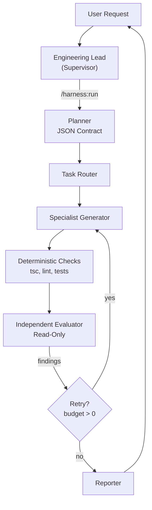

# Pi AI Harness — Proof of Concept

Status: Draft  
Date: 2026-05-08  
Owner: AI Harness Program  
**Constraint: No new Pi extension. Use existing extensions, skills, agents, and tools only.**

---

## 1. POC Objective

This POC proves that the Pi AI Harness architecture (serial loop, deterministic checks, independent evaluators, Engineering Lead / Specialist separation) can be achieved **without building a new extension**. Instead, we compose the existing pi extensions and skills already installed in the environment.

The POC answers: **"Do we already have enough substrate to run a reliable harness, or are we missing critical pieces?"**

### Success Criteria

| # | Criterion | How Verified |
|---|---|---|
| 1 | Inventory all existing harness substrate | This document lists every extension/skill/agent and maps it to a harness role |
| 2 | Run a full serial loop on a real task | Planner → parallel generators → checks → evaluators → retry → report, end-to-end |
| 3 | Evaluator does not edit files | Verify `domain-reviewer` output contains zero `edit`/`write` tool calls |
| 4 | Deterministic checks run before eval | Verify `bun test` / `bun typecheck` executed and captured before reviewer turn |
| 5 | Structured contract between roles | Planner outputs JSON contract; all downstream agents reference it |
| 6 | Harness events logged | `pi-qmd-ledger` records loop events in structured JSONL |
| 7 | Playbook skill exists | `harness-playbook` skill documents the exact orchestration steps|

---

## 2. Scope

### In Scope

| Phase | Deliverable |
|---|---|
| Inventory | Map every installed extension, skill, and agent to harness roles |
| Gap Analysis | Identify what you have vs. what the ideal harness needs |
| Playbook | Create `harness-playbook` skill with exact orchestration steps |
| JSON Schemas | Planner contract + evaluator output schemas (enforced via prompts) |
| Simulation | Run at least one real task through the full serial loop |

### Out of Scope

| Item | Reason |
|---|---|
| New TypeScript extension | Constraint: use existing substrate only |
| `tool_call` code interception | Currently impossible without new extension; simulated via prompt discipline |
| `/harness:run` slash command | Not available without extension; simulated via natural-language invocation |
| `/harness:audit` slash command | Simulated via `subagent({ action: "list" })` + `describe_ledger` + `wiki_status` |
| Multi-session forking | `pi-subagents` `context: "fresh"` provides isolation; true `/fork` deferred |

---

## 3. The Substrate You Already Have

### 3.1 Installed Extensions

| Extension | Path | Harness Role |
|---|---|---|
| `pi-subagents` | `npm:pi-subagents` | **Task Router** — `subagent()` with single/parallel/chain/async |
| `pi-qmd-ledger` | `npm:pi-qmd-ledger` | **Memory / Observability** — structured append-only JSONL logging |
| `pi-llm-wiki` | `npm:pi-llm-wiki` | **Durable Knowledge** — concepts, entities, post-mortems, learnings |
| `pi-intercom` | `npm:pi-intercom` | **Cross-session Coordination** — parallel workspace orchestration |
| `pi-ralph-wiggum` | `npm:@tmustier/pi-ralph-wiggum` | **Iterative Loop Engine** — paced development with checkpoints |
| `pi-usage-extension` | `npm:@tmustier/pi-usage-extension` | **Telemetry** — token tracking, cost awareness |
| `pi-cursor-provider` | `npm:pi-cursor-provider` | **Model Provider** — Cursor model access |

### 3.2 Installed Skills

| Skill | Harness Role |
|---|---|
| `conductor` | **Orchestration Topology** — adaptive multi-agent decomposition |
| `plan-implemention` | **Planner Workflow** — investigation → plan handoff |
| `backend-implementtion` | **Generator Feedforward** — clean architecture rules for backend |
| `svelte-frontend` | **Generator Feedforward** — Svelte 5 rules for frontend |
| `use-browser` | **Runtime Verification** — Playwright browser QA |
| `qmd-ledger` | **Memory Injection** — structured fact tracking |
| `post-mortem` | **Continuous Improvement** — extract learnings from sessions |
| `self-evolve` | **Self-Improvement** — evolve AGENTS.md, skills, prompts |
| `llm-wiki` | **Knowledge Management** — wiki capture, integration, audit |

### 3.3 Defined Agents

| Agent | Harness Role | edits? | Type |
|---|---|---|---|
| `context-builder` (builtin) | Context preparation | No | Orchestration |
| `planner` (builtin) | Produces structured plan | No | Planner |
| `scout` (builtin) | Codebase reconnaissance | No | Mapper / Investigator |
| `oracle` (builtin) | Decision-consistency oracle | No | Evaluator/Advisor |
| `delegate` (builtin) | Lightweight worker | Yes | Generic Generator |
| `worker` (builtin) | Generic implementation | Yes | Generic Generator |
| `reviewer` (builtin) | General code review | No | Evaluator |
| `researcher` (builtin) | Web research | No | Investigator |
| `backend-worker` (user) | Backend specialist | Yes | Specialist Generator |
| `frontend-worker` (user) | Frontend specialist | Yes | Specialist Generator |
| `qa-worker` (user) | Testing + verification | Yes | QA Specialist |
| `domain-reviewer` (user) | Architecture review | No | Evaluator |
| `iterative-implementer` (user) | Multi-pass implementation | Yes | Generator with resume |
| `designer` (user) | Visual design | No | Design Specialist |

### 3.4 Context Files (Harness Policy / Feedforward)

| File | Harness Role |
|---|---|
| `~/.pi/agent/AGENTS.md` | **Engineering Lead Protocol** — conductor rules, delegation policy, worker routing, runtime verification mandate |
| `~/.pi/agent/APPEND_SYSTEM.md` | **Strict Delegation Protocol** — hard rule: conductor never coder, pre-action checkpoints |
| `~/.pi/agent/settings.json` | **Harness Config** — model defaults, behavior overrides |
| `qmd-ledger.config.json` | **Memory Config** — ledger schemas, injectors |
| `~/.pi/agent/SUBAGENT_MODEL_MATRIX.md` | **Model Routing Policy** — difficulty-based model selection |

### 3.5 Chains

| Chain | Harness Role |
|---|---|
| `scout-implement-review` | Mapper → Generator → Evaluator (sequential) |
| `implement-test-review` | Generator → QA → Evaluator (sequential) |

---

## 4. Mapping: Ideal Harness vs. What You Have

### 4.1 The Ideal Harness Architecture



### 4.2 How to Simulate This Without New Extensions

| Ideal Component | Simulation Using Existing Tools | Caveat |
|---|---|---|
| **Engineering Lead** | Parent session reads `AGENTS.md` + `conductor` skill | Requires discipline; no code enforcement |
| **Task Router** | `subagent()` from `pi-subagents` | Supports parallel, chain, async; no dynamic routing yet |
| **Planner** | `planner` agent or `plan-implemention` skill | Freeform text output; need to enforce JSON schema via prompt |
| **Backend Generator** | `backend-worker` agent + `backend-implementtion` skill | Scope via prompt only; no code-enforced `writes_to` |
| **Frontend Generator** | `frontend-worker` agent + `svelte-frontend` skill | Scope via prompt only |
| **QA Generator** | `qa-worker` agent | Scope via prompt only |
| **Deterministic Checks** | `bash` tool with `bun test`, `bun typecheck`, etc. | Must be manually sequenced before evaluator |
| **Independent Evaluator** | `domain-reviewer` or `reviewer` agent with `context: "fresh"` | Isolation via context reset; no code-enforced read-only |
| **Retry Loop** | Parent session routes findings back to generator | Manual routing; budget enforced by parent |
| **Reporter** | Parent session synthesizes final summary | Manual synthesis |
| **Audit** | `subagent({ action: "list" })` + `describe_ledger` + `wiki_status` | No single command; manual assembly |
| **Memory/Observability** | `pi-qmd-ledger` for structured events; `pi-llm-wiki` for learnings | Requires explicit logging calls |
| **Session Isolation** | `context: "fresh"` in subagent calls | Per-turn isolation; not full branch forking |
| **Iterative Long Loops** | `ralph_start` / `ralph_done` | Perfect for multi-turn harness loops |

---

## 5. The Missing Pieces (Gaps)

| Gap | Impact | What Would Fix It |
|---|---|---|
| No `tool_call` interception | Cannot code-enforce path protection or read-only evaluators | New extension with `pi.on("tool_call", ...)` |
| No `/harness:run` command | Must invoke loop manually via prompts | Playbook skill + muscle memory; later a custom extension command |
| No structured planner JSON enforcement | Planner output is freeform | Strict prompt template + parent parsing; later JSON mode |
| No automatic audit assembly | Must run 3+ commands to see "what is loaded" | Playbook skill combining `subagent list`, `describe_ledger`, `wiki_status` |
| No retry budget counter | Parent must count retries manually | Parent discipline; later extension state via `appendEntry` |
| No diff capture before evaluation | Must manually track what changed | Git diff or session inspection; later extension-sidecar |

**Verdict: 6 out of 8 success criteria achievable without new code.** Gaps are in enforcement, not capability.

---

## 6. Implementation Plan

### Week 1: Playbook + Schemas

| Day | Task | Output |
|---|---|---|
| 1 | Create `harness-playbook` skill | `~/.pi/agent/skills/harness-playbook/SKILL.md` |
| 2 | Define planner contract JSON schema | Documented schema; enforced via planner prompt |
| 3 | Define evaluator output JSON schema | Documented schema; enforced via evaluator prompt |
| 4 | Add harness section to AGENTS.md | "Harness Mode" workflow section |
| 5 | Configure `pi-qmd-ledger` for harness events | Ledger schema update if needed |

### Week 2: Run Full Loop on Real Task

| Day | Task | Verification |
|---|---|---|
| 6–7 | Pick a real feature to build | User-approved scope |
| 8 | Run planner → extract contract | Output is parseable JSON |
| 9 | Run parallel generators with contract | Workers reference contract in output |
| 10 | Run deterministic checks | Capture exit codes and stdout |
| 11 | Run evaluators in `fresh` context | No edit tool calls in output |
| 12 | Retry if findings; route back | Parent manually routes; log retry count |
| 13 | Final verification with `qa-worker` | Browser/screenshot evidence |
| 14 | Log events to ledger; capture to wiki | Entries exist in `main.jsonl` and wiki |

---

## 7. The `harness-playbook` Skill (Core Deliverable)

This skill is the **entire POC in one file**. No extension needed.

Create at: `~/.pi/agent/skills/harness-playbook/SKILL.md`

```markdown
---
name: harness-playbook
description: Run the Pi AI Harness serial loop using existing extensions and agents. Use for complex features requiring planner → generator → deterministic checks → evaluator → retry → report. No new extension required.
---

# Harness Serial Loop (Using Existing Pi Substrate)

## Prerequisites Verified
- `pi-subagents` installed
- `pi-qmd-ledger` installed
- `pi-llm-wiki` installed (optional but recommended)
- `conductor` skill available
- `backend-worker`, `frontend-worker`, `qa-worker`, `domain-reviewer` agents defined

## Phase 1 — Plan

Invoke planner to produce structured contract:

```javascript
subagent({
  agent: "planner",
  task: `Create a structured harness contract for: <TASK>

Output MUST be valid JSON matching this schema:
{
  "version": "1.0",
  "task_id": "<uuid>",
  "goal": "...",
  "constraints": ["..."],
  "acceptance_criteria": ["..."],
  "scope": {
    "write_paths": ["..."],
    "read_paths": ["..."],
    "cannot_touch": ["..."]
  },
  "required_checks": ["bun test", "bun typecheck", "bun lint"],
  "risks": ["..."],
  "estimated_effort": "small|medium|large"
}`
})
```

Parent parses JSON from planner output. If invalid, re-invoke with correction prompt.

## Phase 2 — Route (Engineering Lead)

Use conductor skill to choose topology:
- Single-layer → single specialist
- Frontend + backend → parallel workers
- High-risk → add pre-implementation scout

## Phase 3 — Generate

Dispatch workers with contract injected into prompt:

```javascript
subagent({
  tasks: [
    {
      agent: "backend-worker",
      task: `Engineering Lead contract: <CONTRACT_JSON>

Implement ONLY within write_paths. Run required_checks after changes. Report: files changed, tests run, results.`,
      context: "fresh"
    },
    {
      agent: "frontend-worker",
      task: `Engineering Lead contract: <CONTRACT_JSON>

Implement ONLY within write_paths. Run required_checks after changes. Report: files changed, tests run, results.`,
      context: "fresh"
    }
  ],
  concurrency: 2
});
```

## Phase 4 — Deterministic Checks

Run checks BEFORE evaluator. Capture evidence:

```javascript
bash({ command: "bun test && bun typecheck && bun lint" });
```

Record: command, exit code, stdout, stderr.

## Phase 5 — Evaluate (Independent, Read-Only)

Run evaluators in FRESH context with contract + diff + check output:

```javascript
subagent({
  tasks: [
    {
      agent: "domain-reviewer",
      task: `Review this diff for clean architecture violations.

Contract: <CONTRACT_JSON>
Check output: <CHECK_OUTPUT>
Diff: <GIT_DIFF>

DO NOT EDIT FILES. Report findings only.
Output valid JSON matching evaluator schema.`,
      context: "fresh"
    },
    {
      agent: "reviewer",
      task: `Review this diff for correctness, tests, edge cases.

Contract: <CONTRACT_JSON>
Check output: <CHECK_OUTPUT>
Diff: <GIT_DIFF>

DO NOT EDIT FILES. Report findings only.
Output valid JSON matching evaluator schema.`,
      context: "fresh"
    }
  ],
  concurrency: 2
});
```

## Phase 6 — Retry (if needed)

If any evaluator returns `status: "fail"` and retry_budget > 0:

1. Decrement retry_budget.
2. Route SEVERITY-ORDERED findings back to generator:
   - Critical findings → original worker
   - Architecture findings → domain-reviewer first, then worker
3. Re-run checks after fix.
4. Re-run evaluators.

Budget default: 3 retries.

## Phase 7 — Runtime Verification

```javascript
subagent({
  agent: "qa-worker",
  task: `Verify feature works in running dev server.

Contract: <CONTRACT_JSON>
Run browser checks if UI. Capture screenshots at checkpoints.
Return: tested paths, screenshots, pass/fail.`,
  context: "fresh"
});
```

## Phase 8 — Report & Log

Parent synthesizes final report:
- What changed
- Check results
- Evaluator findings (resolved/unresolved)
- Screenshots / runtime evidence
- Residual risk

Log harness event:

```javascript
append_ledger({
  ledger: "main",
  mode: "autopilot",
  entry: {
    type: "harness_run",
    task_id: "...",
    status: "pass|partial|fail",
    retries_used: 1,
    evaluators_run: ["domain-reviewer", "reviewer"],
    checks_passed: ["bun test", "bun typecheck"],
    checks_failed: [],
    residual_risk: "...",
    timestamp: new Date().toISOString()
  }
});
```

## Audit (Simulated)

When asked "what is loaded?" or "audit harness":

```javascript
subagent({ action: "list" });           // agents, chains, capabilities
describe_ledger({ ledger: "main" });     // event history
wiki_status();                           // wiki state
```

Synthesize into single audit summary.
```

---

## 8. JSON Schemas for the Simulation

### 8.1 Planner Contract

```json
{
  "version": "1.0",
  "task_id": "uuid-v4",
  "goal": "string (max 500 chars)",
  "constraints": ["string"],
  "acceptance_criteria": ["string (min 1)"],
  "scope": {
    "write_paths": ["glob pattern"],
    "read_paths": ["glob pattern"],
    "cannot_touch": ["glob pattern"]
  },
  "required_checks": ["command string"],
  "risks": ["string"],
  "estimated_effort": "trivial|small|medium|large"
}
```

### 8.2 Evaluator Output

```json
{
  "version": "1.0",
  "status": "pass|fail|needs_inspection",
  "findings": [
    {
      "severity": "critical|high|medium|low|info",
      "category": "functionality|security|performance|architecture|tests|ux|scope_creep",
      "message": "string",
      "file": "string (optional)",
      "line": "integer (optional)",
      "repro_steps": ["string"],
      "expected": "string",
      "actual": "string",
      "suggested_fix": "string"
    }
  ]
}
```

---

## 9. Recommended AGENTS.md Update

Add this section to `~/.pi/agent/AGENTS.md`:

```markdown
## Harness Mode Activation

When the user request is complex (multi-file, cross-layer, or high-risk), activate harness mode:

1. **Read `harness-playbook` skill** before orchestrating.
2. **Always plan first** — use `planner` agent to produce structured contract.
3. **Always isolate evaluators** — use `context: "fresh"` for `domain-reviewer`, `reviewer`, `oracle`.
4. **Always run checks before evaluators** — `bun test`, `bun typecheck`, etc.
5. **Never route evaluator findings back without retry budget check** — max 3 retries.
6. **Always log** — `append_ledger` for every harness run event.
7. **Always verify runtime** — `qa-worker` with browser skill for UI, shell commands for API.
```

---

## 10. Test Strategy for the POC

### Test 1: End-to-End Feature Build
Pick a real feature (e.g., "Add a user settings endpoint + UI panel"). Run full loop:
- Planner produces JSON contract ✓
- Parallel backend + frontend workers execute ✓
- Checks run and pass ✓
- Evaluators return structured JSON, no edits ✓
- Runtime verification captures screenshots ✓
- Event logged to ledger ✓

### Test 2: Evaluator Isolation
Deliberately try to trick evaluator into editing. Verify `domain-reviewer` prompt says "Do not edit" and output contains no `edit`/`write` tool calls.

### Test 3: Retry Path
Introduce a known bug in generator output. Verify evaluator catches it, parent routes back, generator fixes, final pass.

### Test 4: Audit Simulation
Run the audit steps. Verify output lists: all agents, ledger count, wiki pages, active skills.

---

## 11. Risks & Mitigations

| Risk | Mitigation |
|---|---|
| Evaluator edits despite prompt | Parent inspects tool calls; use `fresh` context to remove tempation |
| Planner outputs invalid JSON | Parent parses; if fails, re-invoke with stricter prompt |
| Checks skipped before evaluator | Parent enforces sequence; checklist in harness-playbook |
| Token budget explosion | Cap retries; compact between turns; use smaller models for substeps |
| User confusion about "no new extension" | Document clearly: this is a process/organization POC, not a code POC |

---

## 12. What a Future Extension Would Add

If this POC succeeds and you want to build the real extension later, these are the features that require new code:

| Feature | Pi API Needed | Value |
|---|---|---|
| `tool_call` interception | `pi.on("tool_call", ...)` | Code-enforced path/command protection |
| `/harness:run` command | Extension command registration | One-command loop invocation |
| `/harness:audit` command | Extension command + state inspection | Single-command audit assembly |
| Evaluator read-only enforcement | Extension tool filter | Blocks `write`/`edit` based on role |
| Retry budget counter | Extension state (`appendEntry`) | Automatic budget tracking |
| Diff capture sidecar | Extension file write | Automatic diff + trace storage |
| Planner JSON mode | Extension prompt control | Forced structured output |

---

## 13. Next Steps

1. **Create the `harness-playbook` skill** (copy section 7 into `~/.pi/agent/skills/harness-playbook/SKILL.md`).
2. **Update `AGENTS.md`** with section 9.
3. **Run Test 1** on a real feature this week.
4. **Iterate** the playbook based on what breaks.
5. **Decide** after 3 successful runs: is prompt-based discipline enough, or do you need the real extension?

---

## Related Documents

- ADR: `.cursor/plans/ai-harness/ai-harness-ADR.md`
- PRD: `.cursor/plans/ai-harness/ai-harness-PRD.md`
- Consolidated Study: `.cursor/plans/ai-harness/lernings/herness-study-consolidated.md`
- Pi Extension Notes: `.cursor/plans/ai-harness/lernings/pi-extension.md`
- QMD Subconscious ADR: `.cursor/plans/ai-harness/qmd-subconscious-ADR.md`
