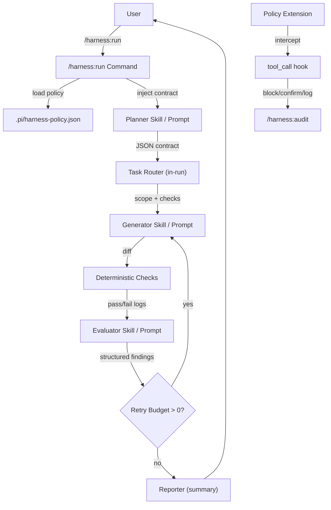

# Pi AI Harness — Proof of Concept

Status: Draft  
Date: 2026-05-08  
Owner: AI Harness Program

---

## 1. POC Objective

This POC proves that a **package-first harness** can improve Pi coding-agent reliability without changing Pi core. The chosen slice covers the three foundational phases from the PRD:

1. **Phase 1 — Documentation and templates** (immediate value, no runtime risk)
2. **Phase 2 — Safety and audit** (path/command guardrails + `/harness:audit`)
3. **Phase 3 — Minimal serial loop** (`/harness:run` with planner → generator → deterministic checks → evaluator → retry)

### Why this slice?

- It exercises every major Pi extension API (`tool_call`, `before_agent_start`, custom commands, `appendEntry`, session trees).
- It produces user-visible value on day one (audit + policy).
- It validates the core architectural bet: **deterministic checks before inferential judgment, independent evaluators, serial loops before DAGs**.
- It keeps scope narrow enough for a single implementer to complete in 2–3 weeks.

### POC Success Criteria

| # | Criterion | How Verified |
|---|---|---|
| 1 | Installable Pi package with manifest | `npm install` / `pi` package loader recognizes extensions, skills, prompts |
| 2 | Path/command guardrails block dangerous operations | Extension intercepts `write`/`edit` to `.env`, `rm -rf`, `git push --force` |
| 3 | `/harness:audit` lists loaded context, extensions, tools, skills, policy | Run command; inspect output |
| 4 | `/harness:policy` inspects active rules | Run command; inspect output |
| 5 | `/harness:run` executes serial loop end-to-end | Run command; verify planner → generator → checks → evaluator → report flow |
| 6 | Evaluator returns structured JSON, does NOT edit files | Inspect evaluator output; confirm no file mutations |
| 7 | Retry path works: evaluator findings route back to generator | Inject failing code; verify loop retries and fixes |
| 8 | Raw traces preserved for diagnosis | Inspect session entries or sidecar files |

---

## 2. Scope

### In Scope

| Phase | Deliverable |
|---|---|
| Phase 1 | Starter skill templates (planner, generator, evaluator), prompt templates, policy schema doc |
| Phase 2 | Extension with `tool_call` interception, path/command block/confirm, `/harness:audit`, `/harness:policy` |
| Phase 3 | `/harness:run` command driving planner → generator → checks → evaluator → reporter (serial, single generator) |

### Out of Scope (Deferred)

| Item | Deferred To |
|---|---|
| Multi-generator parallelism | Phase 3+ (measure serial bottleneck first) |
| Dynamic task routing / DAG engine | Phase 3+ (proven need only) |
| Multi-session orchestration with `/fork` | Phase 3+ (single-session loop first) |
| QMD Subconscious integration | Phase 4 (memory package) |
| Failure-learning extraction pipeline | Phase 4 |
| Security evaluator agent | Phase 3+ (basic evaluator only) |
| Hosted/ SaaS orchestration | Permanent non-goal |

---

## 3. Architecture

### High-Level Flow



### Component Definitions

| Component | Role | Pi Surface |
|---|---|---|
| **Engineering Lead** | User-facing coordinator (internal: supervisor/orchestrator) | `/harness:run` command |  
| **Planner** | Produces structured contract: goal, constraints, acceptance criteria, scope, risks | `skills/planner/SKILL.md` + prompt template |
| **Generator** | Scoped implementer; makes one small diff within declared paths | `skills/generator/SKILL.md` + prompt template |
| **Deterministic Checks** | `tsc`, lint, tests, build, schema validation run BEFORE evaluator | Extension `bash` tool interception or command wrapper |
| **Evaluator** | Read-only judge; receives contract, diff, check output; returns structured findings | `skills/evaluator/SKILL.md` + prompt template; must NOT call `write`/`edit` |
| **Reporter** | Final summary + residual risk | Inline in `/harness:run` command logic |
| **Policy Extension** | `tool_call` interception for path/command guardrails + structured logging | `src/extensions/policy.ts` |
| **Audit Command** | Inspect loaded harness state | `src/commands/audit.ts` |

---

## 4. Implementation Plan

### Milestone 1 — Phase 1: Templates & Schemas (Week 1)

| Day | Task | Output |
|---|---|---|
| 1–2 | Scaffold Pi package (`package.json`, `tsconfig.json`, build script) | `package.json` with `pi` manifest |
| 2–3 | Define policy schema JSON + example | `schemas/harness-policy.schema.json`, `.pi/harness-policy.json` example |
| 3–4 | Write planner skill + prompt template | `skills/planner/SKILL.md`, `prompts/planner.md` |
| 4–5 | Write generator skill + prompt template | `skills/generator/SKILL.md`, `prompts/generator.md` |
| 5 | Write evaluator skill + prompt template | `skills/evaluator/SKILL.md`, `prompts/evaluator.md` |

### Milestone 2 — Phase 2: Safety & Audit (Week 2)

| Day | Task | Output |
|---|---|---|
| 6–7 | Implement policy extension with `tool_call` interception | `src/extensions/policy.ts` |
| 7–8 | Implement path protection engine | Policy engine: block/confirm/allow logic |
| 8–9 | Implement command protection engine | Dangerous command block/confirm list |
| 9–10 | Implement `/harness:audit` command | `src/commands/audit.ts` |
| 10 | Implement `/harness:policy` command | `src/commands/policy.ts` |

### Milestone 3 — Phase 3: Serial Loop (Week 2–3)

| Day | Task | Output |
|---|---|---|
| 11–12 | Implement `/harness:run` command scaffold | `src/commands/run.ts` |
| 12–13 | Planner invocation + contract parsing | Extract JSON contract from planner output |
| 13–14 | Generator invocation + diff capture | Run generator; capture changed files |
| 14–15 | Deterministic checks runner | Execute configured checks; capture stdout/stderr/exit codes |
| 15–16 | Evaluator invocation + structured output parsing | Parse evaluator JSON; severity sort |
| 16–17 | Retry loop + budget logic | Route findings to generator; decrement budget |
| 17–18 | Reporter + final summary | Short structured report with residual risk |
| 18–19 | End-to-end testing + bug fixes | All 8 success criteria pass |
| 19–21 | Polish: README, install instructions, package publish prep | README.md, INSTALL.md |

---

## 5. Key Technical Decisions

### 5.1 Package Name & Structure

```json
// package.json
{
  "name": "@local/pi-harness-poc",
  "version": "0.1.0",
  "keywords": ["pi-package"],
  "pi": {
    "extensions": ["./dist/extensions"],
    "skills": ["./skills"],
    "prompts": ["./prompts"]
  }
}
```

### 5.2 Policy Schema (`.pi/harness-policy.json`)

```json
{
  "$schema": "./node_modules/@local/pi-harness-poc/schemas/harness-policy.schema.json",
  "version": "1.0",
  "path_protection": {
    "block": [
      ".env*",
      ".ssh/**",
      ".aws/**",
      ".git/**",
      "node_modules/**",
      "**/secrets/**"
    ],
    "confirm": [
      "*.lock",
      "package-lock.json",
      "yarn.lock",
      "pnpm-lock.yaml"
    ]
  },
  "command_protection": {
    "block": [
      { "pattern": "rm\\s+-rf\\s+/", "reason": "destructive system delete" },
      { "pattern": "git\\s+push\\s+.*--force", "reason": "force push" },
      { "pattern": "chmod\\s+777", "reason": "overly permissive" }
    ],
    "confirm": [
      { "pattern": "rm\\s+-rf", "reason": "recursive delete" },
      { "pattern": "git\\s+push", "reason": "remote mutation" },
      { "pattern": "npm\\s+publish", "reason": "publication" }
    ]
  },
  "scope_protection": {
    "projects": {
      "my-monorepo": {
        "backend": ["apps/api/**"],
        "frontend": ["apps/web/**"]
      }
    }
  },
  "logging": {
    "blocked_attempts": true,
    "confirmations": true,
    "sidecar_path": ".pi/harness-log.jsonl"
  }
}
```

### 5.3 Planner Contract Schema

```json
{
  "$schema": "http://json-schema.org/draft-07/schema#",
  "title": "HarnessPlannerContract",
  "type": "object",
  "required": ["version", "goal", "acceptance_criteria", "scope"],
  "properties": {
    "version": { "type": "string", "const": "1.0" },
    "task_id": { "type": "string" },
    "goal": { "type": "string", "maxLength": 500 },
    "constraints": {
      "type": "array",
      "items": { "type": "string" }
    },
    "acceptance_criteria": {
      "type": "array",
      "items": { "type": "string" },
      "minItems": 1
    },
    "scope": {
      "type": "object",
      "required": ["write_paths", "read_paths"],
      "properties": {
        "write_paths": { "type": "array", "items": { "type": "string" } },
        "read_paths": { "type": "array", "items": { "type": "string" } },
        "cannot_touch": { "type": "array", "items": { "type": "string" } }
      }
    },
    "required_checks": {
      "type": "array",
      "items": { "type": "string" }
    },
    "risks": {
      "type": "array",
      "items": { "type": "string" }
    },
    "estimated_effort": {
      "type": "string",
      "enum": ["trivial", "small", "medium", "large"]
    }
  }
}
```

### 5.4 Evaluator Output Schema

```json
{
  "$schema": "http://json-schema.org/draft-07/schema#",
  "title": "HarnessEvaluatorOutput",
  "type": "object",
  "required": ["version", "status"],
  "properties": {
    "version": { "type": "string", "const": "1.0" },
    "status": {
      "type": "string",
      "enum": ["pass", "fail", "needs_inspection"]
    },
    "checks_run": {
      "type": "array",
      "items": {
        "type": "object",
        "properties": {
          "command": { "type": "string" },
          "exit_code": { "type": "integer" },
          "passed": { "type": "boolean" }
        }
      }
    },
    "findings": {
      "type": "array",
      "items": {
        "type": "object",
        "required": ["severity", "message"],
        "properties": {
          "severity": {
            "type": "string",
            "enum": ["critical", "high", "medium", "low", "info"]
          },
          "category": {
            "type": "string",
            "enum": ["functionality", "security", "performance", "architecture", "tests", "ux", "scope_creep"]
          },
          "message": { "type": "string" },
          "file": { "type": "string" },
          "line": { "type": "integer" },
          "repro_steps": {
            "type": "array",
            "items": { "type": "string" }
          },
          "expected": { "type": "string" },
          "actual": { "type": "string" },
          "suggested_fix": { "type": "string" }
        }
      }
    },
    "meta": {
      "type": "object",
      "properties": {
        "evaluator_model": { "type": "string" },
        "evaluator_tokens_used": { "type": "integer" },
        "time_ms": { "type": "integer" }
      }
    }
  }
}
```

### 5.5 Evaluator Rules (Enforced by Policy Extension)

The evaluator skill MUST NOT call `write`, `edit`, `bash` with destructive commands, or any file-mutating tool. The policy extension enforces this by:

1. Detecting evaluator role via prompt template metadata or session state.
2. Blocking all `write`/`edit` calls from evaluator context.
3. Returning structured error if evaluator attempts mutation.

---

## 6. Concrete File Inventory

### Package Root

| File | Purpose |
|---|---|
| `package.json` | Pi package manifest with `pi` key |
| `tsconfig.json` | TypeScript config for extension build |
| `README.md` | Install, configure, usage docs |
| `INSTALL.md` | Step-by-step install for new projects |

### Extensions

| File | Purpose |
|---|---|
| `src/extensions/policy.ts` | Core `tool_call` interceptor; path + command protection |
| `src/extensions/audit.ts` | Collects harness state for audit command |
| `src/extensions/run.ts` | Orchestration state manager for `/harness:run` |

### Commands

| File | Purpose |
|---|---|
| `src/commands/audit.ts` | `/harness:audit` — list context, extensions, tools, skills, policy, session state |
| `src/commands/policy.ts` | `/harness:policy` — inspect active rules |
| `src/commands/run.ts` | `/harness:run <request>` — drive serial loop |

### Skills

| File | Purpose |
|---|---|
| `skills/planner/SKILL.md` | Produce structured contract from user request |
| `skills/generator/SKILL.md` | Make small diff within declared scope |
| `skills/evaluator/SKILL.md` | Read-only review against contract + check output |
| `skills/reporter/SKILL.md` | Summarize loop result + residual risk (lightweight) |

### Prompts

| File | Purpose |
|---|---|
| `prompts/planner.md` | Feedforward prompt: contract structure, anti-patterns |
| `prompts/generator.md` | Feedforward prompt: scope adherence, check discipline |
| `prompts/evaluator.md` | Feedforward prompt: structured output schema, no-mutation rule |

### Schemas & Examples

| File | Purpose |
|---|---|
| `schemas/harness-policy.schema.json` | JSON Schema for `.pi/harness-policy.json` |
| `schemas/planner-contract.schema.json` | JSON Schema for planner output |
| `schemas/evaluator-output.schema.json` | JSON Schema for evaluator output |
| `.pi/harness-policy.example.json` | Working example policy for new adopters |

### Build Output

| File | Purpose |
|---|---|
| `dist/extensions/*.js` | Compiled extension entry points |
| `dist/commands/*.js` | Compiled command entry points |

---

## 7. Test Strategy

### Manual Verification

| # | Test | Steps | Expected |
|---|---|---|---|
| 1 | Install package | `npm install @local/pi-harness-poc` in test repo | Package loads; `pi` recognizes extensions/skills |
| 2 | Block write to `.env` | Ask agent to `write .env FOO=bar` | Blocked; structured log entry created |
| 3 | Confirm `rm -rf` | Ask agent to `bash rm -rf dist/` | Confirmation prompt; log entry on decision |
| 4 | Audit command | Run `/harness:audit` | Lists active extensions, skills, policy, context files |
| 5 | Policy inspect | Run `/harness:policy` | Pretty-prints active path + command rules |
| 6 | Run loop — happy path | `/harness:run "Add a hello world function"` | Planner → generator → checks → evaluator → pass report |
| 7 | Run loop — failure + retry | `/harness:run "Add a function that fails tests"` | Generator creates code; checks fail; evaluator reports; retry fixes; final pass |
| 8 | Evaluator isolation | Verify evaluator skill cannot call `write`/`edit` | Policy extension blocks; error returned |

### Automated Checks

- `tsc --noEmit` on extension source
- Unit tests for policy engine (path matching, command regex)
- JSON schema validation for planner + evaluator outputs
- Integration test: simulated `tool_call` events against policy extension

---

## 8. Risks & Mitigations

| Risk | Severity | Mitigation |
|---|---|---|
| Pi extension API changes | Medium | Pin to documented API surface; minimize exotic hooks; follow pi.dev docs |
| Evaluator still mutates code | High | Policy extension **enforces** read-only for evaluator context; not just prompt text |
| Token budget explosion in loop | Medium | Cap retry at 3; summarize diff before evaluator; compact session between turns |
| Checks are too slow / noisy | Medium | Configurable check list; skip-inject mode; per-project override |
| Policy false-positive blocks productive work | Medium | `confirm` mode (not just `block`) for moderate-risk ops; per-project override file |
| User confusion about `harness:*` commands | Low | Clear README; audit command shows exactly what is loaded |
| Multi-agent team skepticism | Low | Demo on real feature; measure before/after defect rate |

---

## 9. Success Metrics

| Metric | Target | Measurement |
|---|---|---|
| Install-to-audit time | < 5 minutes | Stopwatch from `npm install` to first `/harness:audit` |
| Blocked dangerous ops with logs | ≥ 1 demo per category | Manual test cases |
| Serial loop completes end-to-end | 100% on 5 test tasks | Run 5 diverse tasks; all reach reporter |
| Evaluator never edits code | 100% | Automated policy test |
| Retry path fixes issue | ≥ 60% on injected bugs | Inject 5 known bugs; measure fix rate within retry budget |
| Raw trace grep-able | Yes | Verify `.pi/harness-log.jsonl` or session entries contain tool inputs + block reasons |

---

## 10. Next Steps After POC

If POC succeeds, the program proceeds through remaining PRD phases:

### Phase 3+ (Expanded Loop)
- Multi-generator support (backend + frontend in one run, disjoint scopes)
- Session forking for evaluator isolation (`/fork` + branch-per-role)
- Architect evaluator skill
- Security evaluator skill
- Release readiness skill

### Phase 4 (Memory & Learning)
- Integrate with QMD Subconscious for durable retrieval
- Failure-learning extraction: detect repeated failures → propose harness learnings
- Auto-skill-gotcha injection

### Phase 5 (Optimization)
- A/B harness controls
- Remove noisy checks that don't improve outcomes
- Optional cheaper models for planner / deterministic substeps

### Packaging Evolution
- Publish `@local/pi-harness-poc` → `@pi-harness/starter` on npm
- Split into focused packages: `pi-harness-policy`, `pi-harness-loop`, `pi-harness-audit`
- Starter template repo: `pi-harness-starter-template`

---

## Related Documents

- ADR: `.cursor/plans/ai-harness/ai-harness-ADR.md`
- PRD: `.cursor/plans/ai-harness/ai-harness-PRD.md`
- Consolidated Study: `.cursor/plans/ai-harness/lernings/herness-study-consolidated.md`
- Pi Extension Notes: `.cursor/plans/ai-harness/lernings/pi-extension.md`
- QMD Subconscious ADR: `.cursor/plans/ai-harness/qmd-subconscious-ADR.md`
- QMD Subconscious PRD: `.cursor/plans/ai-harness/qmd-subconscious-PRD.md`
