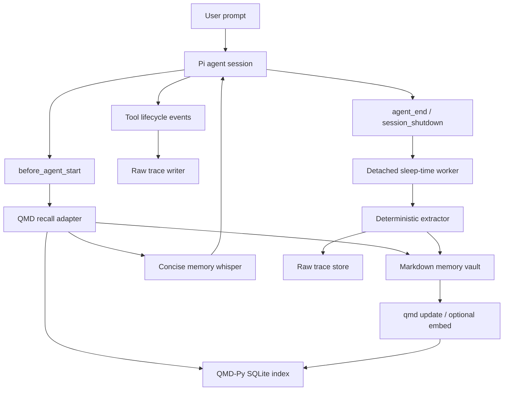

# ADR: QMD Subconscious for Pi

Status: Proposed

Date: 2026-05-08

## Context

We want a Subconscious-style memory layer for Pi that preserves project knowledge, user preferences, pending work, and harness learnings across coding sessions. The reference implementation, `letta-ai/claude-subconscious`, is a Claude Code plugin that uses four Claude Code hooks, sends transcripts to a background Letta agent, and injects concise memory guidance before later prompts.

Pi is not Claude Code. Pi already has a TypeScript extension API with lifecycle events, session JSONL storage, tree/branch sessions, compaction events, tool interception, custom commands, model-callable tools, custom messages, `appendEntry` state, `pi.exec`, JSON mode, RPC mode, and package distribution. A faithful reproduction should therefore use Pi-native extension surfaces rather than shell-hook stdout hacks.

The desired memory substrate is QMD-Py, the PyPI `qmd` package. QMD-Py is an on-device Markdown search engine with BM25 search, optional hybrid semantic query and reranking, virtual document URIs, doc-id lookup, path/context metadata, SQLite-backed indexes, JSON output, and an MCP server. This makes it a good local-first retrieval layer for Markdown memory without requiring hosted Letta memory.

## Decision

Build `qmd-subconscious` as a Pi package whose primary artifact is a TypeScript Pi extension backed by QMD-Py.

Responsibilities are split as follows:

| Layer | Responsibility |
| --- | --- |
| Pi TypeScript extension | Own Pi lifecycle integration, session capture, injection, commands, optional model-callable tools, UI notifications, and adapter orchestration. |
| QMD-Py adapter | Wrap the `qmd` CLI for collection setup, context metadata, BM25 search, optional hybrid query, document lookup, status, and update. |
| Markdown memory vault | Store durable, inspectable, user-editable memory documents with YAML frontmatter. |
| Raw trace store | Store append-only session and turn traces for diagnosis and deterministic extraction. |
| Sleep-time worker | Convert traces into structured memory after turns and shutdown without blocking Pi. |

Use Markdown memory files and raw JSONL traces as the source of truth. Use QMD as the retrieval and ranking index over those files, not as the primary data store.

## Claude Subconscious Mapping

Claude Subconscious uses four Claude Code hooks. QMD Subconscious should preserve the behavior but map it to Pi's current APIs:

| Claude Subconscious hook | Claude behavior | Pi implementation |
| --- | --- | --- |
| `SessionStart` | Initialize session/conversation state and notify background agent. | `session_start` initializes config, state directories, QMD collections, current session file, checkpoints, and branch metadata. |
| `UserPromptSubmit` | Fetch memory before the prompt and inject guidance. | `before_agent_start` is the primary automatic recall point. It reads `event.prompt`, `event.systemPromptOptions.cwd`, selected tools, context files, and loaded skills, then returns a custom message when retrieval is useful. |
| `PreToolUse` | Check for mid-workflow memory updates before tools. | `tool_call` observes and can block risky tools. `context` or `pi.sendMessage(..., { deliverAs: "steer" | "nextTurn" })` may add mid-workflow guidance when memory changes. |
| `Stop` | Send transcript to a detached background worker. | `agent_end` writes turn traces and starts or queues extraction. `session_shutdown` flushes buffers and starts a detached worker for unprocessed traces. |

Pi-specific events extend the design:

- `input` can intercept `/memory` command-like raw input only when a registered command is not enough.
- `tool_result`, `tool_execution_start`, `tool_execution_update`, and `tool_execution_end` provide high-fidelity tool telemetry.
- `session_before_switch`, `session_before_fork`, `session_before_compact`, `session_compact`, `session_before_tree`, and `session_tree` allow branch-aware memory and trace checkpoints later.
- `before_provider_request` is reserved for debugging provider payload serialization, not for MVP memory injection.

## Architecture



### Integration Rules

- The Pi extension is loaded from `.pi/extensions`, `~/.pi/agent/extensions`, or a Pi package manifest.
- The extension uses `pi.registerCommand()` for user commands and `pi.registerTool()` for optional model-callable memory tools.
- Extension-private state that should survive reloads uses `pi.appendEntry("qmd-subconscious", data)` or durable files under the configured state directories.
- User-visible or model-visible memory injection uses Pi custom messages returned from `before_agent_start` or sent via `pi.sendMessage()`.
- Session facts are read from `ctx.sessionManager.getSessionFile()`, `getEntries()`, `getBranch()`, and `getLeafId()` where needed.
- Shell access to QMD uses `pi.exec(qmdCommand, args, { timeout })`; QMD failures degrade to capture-only behavior.

## Memory Model

Use one Markdown document per durable memory or small memory cluster. Every memory file has YAML frontmatter and a concise body.

```markdown
---
kind: project_context
scope: project
status: active
confidence: 0.82
recall_recency: 0.74
project_root: /path/to/repo
source_session: 2026-05-07T12-30-00Z
source_entry: a1b2c3d4
updated_at: 2026-05-07T12:34:56Z
---

The desktop app is a SvelteKit composition boundary. Frontend code should import browser-safe domain contracts from `domain/shared`.
```

Memory kinds adapt Claude Subconscious's eight blocks and add Pi-specific harness memory:

| Kind | Purpose | Default scope | Injection behavior |
| --- | --- | --- | --- |
| `core_directives` | Stable rules for the memory layer and extraction process. | global | Rarely injected; mainly used by worker and formatter. |
| `guidance` | Active guidance intended for near-term turns. | project/global | Inject when directly relevant or high priority. |
| `project_context` | Architecture, stack, repo boundaries, gotchas. | project | Inject when prompt, cwd, files, or tools match. |
| `user_preferences` | Communication, coding style, workflow preferences. | global | Inject sparingly and only when actionable. |
| `session_patterns` | Recurring behaviors, time-based habits, workflow rhythms. | global/project | Low priority with aggressive decay. |
| `pending_items` | Unfinished tasks, unresolved errors, follow-ups. | project | High priority at session start and related prompts. |
| `self_improvement` | Notes for improving extraction, ranking, and whisper quality. | global | Worker-only by default. |
| `tool_guidelines` | How to use Pi tools, QMD commands, repo scripts, and local workflows. | global/project | Inject when tool choice is likely. |
| `harness_learnings` | Repeated Pi/agent failures, guardrails, verification learnings. | project/global | Inject before related implementation or tool use. |
| `raw_traces` | Raw session/turn traces, command outputs, errors, and pointers. | project | Not injected by default; searchable for diagnosis. |

## Storage Layout

Generated memory is private by default and should not be committed unless the user explicitly opts into team-shared memory.

```text
~/.pi/agent/qmd-subconscious/
  config.jsonc
  logs/
  global-memory/
    core_directives/
    user_preferences/
    session_patterns/
    self_improvement/
    tool_guidelines/
  state.json

<project>/.pi/qmd-subconscious/
  config.jsonc
  memory/
    guidance/
    project_context/
    pending_items/
    harness_learnings/
    tool_guidelines/
  traces/
    sessions/
    turns/
    outputs/
  checkpoints/
  state.json
```

Default QMD collections:

| Collection | Path | Search mode |
| --- | --- | --- |
| `qmd-subconscious-global` | `~/.pi/agent/qmd-subconscious/global-memory` | BM25 by default, hybrid when embeddings are configured. |
| `qmd-subconscious-project-<hash>` | `<project>/.pi/qmd-subconscious/memory` | BM25 by default, hybrid when embeddings are configured. |
| `qmd-subconscious-traces-<hash>` | `<project>/.pi/qmd-subconscious/traces` | Optional and disabled by default for MVP. |

## QMD-Py Strategy

MVP uses the QMD-Py CLI through `pi.exec`.

Required commands:

- `qmd status` to detect installation and index health.
- `qmd add <name> <path> --pattern "**/*.md"` to create collections.
- `qmd context add <name> <path-prefix> <description>` to label memory roots and kinds.
- `qmd update <name>` after memory changes.
- `qmd search <query> -c <collection> -n <count> --format json` for default BM25 retrieval.
- `qmd query <query> -c <collection> -n <count> --format json` only when embeddings/hybrid mode are configured.
- `qmd get <docid-or-qmd-uri>` for full document lookup.

`qmd embed` is not required for MVP. It is enabled only when the user configures hybrid retrieval or installs QMD extras that support embeddings.

If QMD is missing, slow, or returns an error, the extension must continue in capture-only mode and report the issue through `/memory debug`.

## Event Strategy

### `session_start`

- Resolve `ctx.cwd`, current session file, session id, branch leaf id, and project hash.
- Load project and global config.
- Create state, memory, trace, log, and checkpoint directories.
- Run a bounded `qmd status` check.
- Ensure configured collections exist when QMD is available.
- Reconstruct extension state from durable state files and `qmd-subconscious` custom entries.

### `before_agent_start`

- Build a retrieval query from `event.prompt`, `event.systemPromptOptions.cwd`, selected tools, tool snippets, context files, skills, current session name, recent trace metadata, and active pending items.
- Query project and global QMD collections with BM25 by default.
- Rank by QMD score, kind priority, scope match, recency, confidence, status, and same-turn/session injection history.
- Return a Pi custom message only when the selected memory is relevant and under budget.
- Keep the message advisory and subordinate to the user's current prompt.

### `context`

- Enforce final token/character budgets.
- Remove duplicate `qmd-subconscious` custom messages on the same turn.
- Optionally inject non-persistent turn context in later versions if persistent custom messages prove noisy.

### `tool_call`

- Observe tool name, tool call id, and normalized input.
- Record tool intent for traces.
- For configured danger rules, use retrieved `harness_learnings` or static policy to ask for confirmation or block.
- Never block solely because QMD retrieval failed.

### `tool_result`

- Capture tool result metadata, error state, truncation state, and short exact failure snippets.
- Store large outputs under `traces/outputs/` and reference their paths.
- Preserve numbers, command names, file paths, and exact errors needed for future diagnosis.

### `agent_end`

- Persist a turn trace from `event.messages`, the active branch, tool metadata, and changed/read file evidence when available.
- Record a checkpoint for the last processed session entry id.
- Start or enqueue the deterministic worker without blocking the active UI.

### `session_shutdown`

- Flush trace buffers.
- Save extension state.
- Start a detached worker for pending traces on `quit`, `reload`, `new`, `resume`, or `fork`.
- Never delay shutdown for QMD indexing or model extraction.

### Branch and Compaction Events

MVP records only active-branch traces. Later versions may use:

- `session_before_compact` and `session_compact` to preserve pre-compaction facts and avoid duplicate extraction.
- `session_before_tree` and `session_tree` to summarize abandoned branches.
- `session_before_switch` and `session_before_fork` to checkpoint work before session replacement.

## Sleep-Time Extraction

The worker processes raw traces outside the agent loop. It is safe to kill and rerun.

Pipeline:

1. Load unprocessed trace segments from the checkpoint.
2. Extract deterministic candidates for explicit preferences, pending items, failed commands, project rules from loaded context files, edited/read paths, and user corrections.
3. Deduplicate against existing Markdown memories using stable source ids, normalized text hashes, and QMD search when available.
4. Create or patch memory documents.
5. Mark stale memories with `status: decayed` or lower `recall_recency`; do not hard-delete automatically.
6. Run `qmd update` for changed collections when QMD is available.
7. Write checkpoint, created/updated memory ids, and worker logs.

Model-assisted extraction is future scope. If enabled later, it must be explicit, privacy-aware, and allowed to read only traces and configured memory roots.

## Retrieval and Injection Policy

Memory should behave like a whisper, not a second system prompt.

| Mode | Max injected chars | Behavior |
| --- | ---: | --- |
| `off` | 0 | Disable capture and injection. |
| `capture` | 0 | Capture traces and run worker; no model injection. |
| `whisper` | 1,500 | Inject top relevant facts, guidance, and pending items. |
| `full` | 6,000 | Include selected block summaries and diff-style changes. |
| `debug` | 10,000 | Include scores, source paths, doc ids, and skipped reasons. |

Claude Subconscious uses diffs to save tokens. QMD Subconscious keeps the principle but adapts it:

- `whisper` mode injects selected facts, not whole blocks.
- `full` mode compares the current selected-memory snapshot with `state.lastInjectedMemoryHash` and includes added/removed facts.
- `debug` mode includes source file paths, doc ids, QMD command names, scores, and diff hunks.

## Commands and Tools

Register Pi commands:

| Command | Purpose |
| --- | --- |
| `/memory search <query>` | Search project and global QMD memory and show ranked hits. |
| `/memory remember <kind> <text>` | Create an explicit Markdown memory, update QMD, and report path/doc id. |
| `/memory forget <query>` | Mark matching memories as `status: decayed` or `status: suppressed`. |
| `/memory pending` | Show active project pending items. |
| `/memory sync` | Run deterministic extraction and QMD update immediately. |
| `/memory debug` | Show config, paths, collection status, last recall, checkpoints, and QMD errors. |

Register optional model-callable tools:

| Tool | Purpose |
| --- | --- |
| `qmd_memory_search` | Retrieve ranked memory for the current task. |
| `qmd_memory_get` | Fetch a full memory document by doc id, path, or QMD URI. |
| `qmd_memory_write` | Add or patch explicit memory when policy permits. |

Default automatic recall should not require the model to call these tools. Tools exist for explicit repair, deep recall, and self-service.

## Security and Privacy

- Store memory and traces locally by default.
- Do not send raw traces or memory to a remote provider unless model extraction is explicitly enabled.
- Exclude `.env`, private keys, token files, secrets, credentials, binary files, generated folders, dependency folders, and configured deny globs.
- Respect gitignore-like exclusions where practical.
- Scope worker writes to `.pi/qmd-subconscious` and `~/.pi/agent/qmd-subconscious`.
- Keep write-capable model tools disabled or policy-gated by default.
- Redact debug output and never print full sensitive traces by default.

## Consequences

### Positive

- Pi-native events avoid Claude-specific stdout and `/dev/tty` hacks.
- Local-first Markdown keeps memory inspectable, editable, diffable, and recoverable.
- QMD-Py gives lightweight BM25 retrieval in MVP and optional hybrid retrieval later.
- Raw traces support harness engineering, failure diagnosis, and future evaluator loops.
- The same memory vault can support Pi interactive, JSON, RPC, and other MCP clients.

### Negative

- QMD-Py adds a Python 3.11+ dependency to a TypeScript extension.
- CLI calls may be too slow for pre-prompt recall without caching and tight timeouts.
- Deterministic extraction is safer but less semantically rich than a background Letta-style agent.
- Memory quality depends on careful ranking, decay, dedupe, and user correction flows.
- Pi API changes may require package maintenance.

## Alternatives Considered

### Direct Letta Port

Use Letta Code SDK exactly like Claude Subconscious.

Rejected because the goal is QMD-Py, local-first storage, and Pi-native integration. Letta remains useful as a behavioral reference for background processing, memory blocks, and concise whispers.

### Single `MEMORY.md`

Keep all memory in one file and append summaries.

Rejected because it recreates context stuffing, becomes hard to query, and cannot support scoped retrieval, provenance, decay, or dedupe.

### QMD MCP Only

Run QMD as an MCP server and ask the coding agent to search memory manually.

Rejected as the default because subconscious recall should be automatic. MCP/tool access remains useful as an escape hatch.

### QMD SQLite as Source of Truth

Store all memory only in QMD's SQLite database.

Rejected because Markdown is easier to review, edit, back up, diff, and repair.

### Long-Running Python Daemon in MVP

Keep QMD loaded behind a persistent Python service for low latency.

Rejected for MVP because CLI integration is simpler and easier to package. A daemon can be added if measured CLI latency misses the recall budget.

## Implementation Phases

1. **Extension skeleton:** Load config, register commands, create directories, log `session_start`, and expose `/memory debug`.
2. **QMD adapter:** Implement bounded CLI wrappers for `status`, `add`, `context add`, `update`, `search`, `query`, and `get`.
3. **Explicit memory:** Implement `/memory remember`, `/memory search`, and project/global collection updates.
4. **Automatic whisper:** Retrieve in `before_agent_start`, rank, budget, dedupe, and return a custom message.
5. **Trace capture:** Record prompts, assistant messages, tool calls/results, failures, and output pointers.
6. **Sleep worker:** Deterministically extract preferences, pending items, failed commands, and project rules, then update QMD.
7. **Safety and correction:** Add `/memory forget`, redaction, retention cleanup, and command/tool policy gates.
8. **Optional intelligence:** Add model-assisted extraction, branch-aware memory, hybrid embeddings, and MCP exposure.

## Open Questions

- Should team-shared memory be an opt-in export/import flow, or a checked-in `.pi/qmd-subconscious/memory` convention?
- Should model-assisted extraction use Pi's active model, a separate configured provider, or local-only models?
- Should raw traces ever be indexed by default, or only searched by explicit debug commands?
- How should detached workers behave on Windows and Termux where process detachment differs?

## Related documents

- Program-level harness architecture and product scope: `.cursor/plans/ai-harness/ai-harness-ADR.md`, `.cursor/plans/ai-harness/ai-harness-PRD.md`
- Consolidated harness research: `.cursor/plans/ai-harness/lernings/herness-study-consolidated.md`, `.cursor/plans/ai-harness/lernings/pi-extension.md`

## References

- Claude Subconscious repository: https://github.com/letta-ai/claude-subconscious
- Pi coding agent repository: https://github.com/earendil-works/pi/tree/main/packages/coding-agent
- Pi extensions documentation: https://pi.dev/docs/latest/extensions
- Pi session format documentation: https://pi.dev/docs/latest/session-format
- Pi JSON event stream mode: https://pi.dev/docs/latest/json
- Pi RPC mode: https://pi.dev/docs/latest/rpc
- QMD-Py package: https://pypi.org/project/qmd/
- Local notes: `.cursor/plans/ai-harness/lernings/memory-Subconscious.md`
- Local notes: `.cursor/plans/ai-harness/lernings/agent-memory.md`
- Local notes: `.cursor/plans/ai-harness/lernings/agent-harness-engneering.md`
- Local notes: `.cursor/plans/ai-harness/lernings/meta-harness.md`
