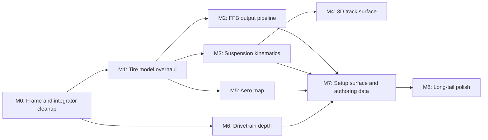

# Racing Sim Top-Tier Roadmap

## Where we are

Foundation is already in place: Pacejka MF 5.6 with dfz load sensitivity, relaxation length, sprung/unsprung lateral transfer with roll-stiffness share, longitudinal transfer, axle aero downforce, Karnopp stick-slip clutch with sub-stepped drivetrain, Salisbury LSD, anti-dive/squat, ARB elastic transfer, camber thrust, pneumatic + mechanical trail + scrub Mz, ABS / TC / ESC / CBC, tire & brake thermal, low-speed wheel-lock. See [`packages/ui/src/lib/racing/engine/RacingEngine.ts`](packages/ui/src/lib/racing/engine/RacingEngine.ts) and [`packages/ui/src/lib/racing/engine/physics/`](packages/ui/src/lib/racing/engine/physics).

What's missing is the next tier of fidelity that AC / AMS2 / rFactor 2 layer on top of the same skeleton.

## Sequencing principle

For each milestone the relative payoff is `perceived_feel_gain / engineering_cost` after counting ordering dependencies. Foundation work goes first to avoid building on inconsistent frames; tire work goes immediately after because every other system feeds it; FFB ships next so players can feel the new tire; then the structural layers (suspension kinematics, 3D track, aero map); then drivetrain depth; then the authoring/setup surface that lets the model be tuned.

## Roadmap



---

## M0 — Frame and integrator cleanup (foundation, smallest)

Files: [`RacingEngine.ts`](packages/ui/src/lib/racing/engine/RacingEngine.ts), [`physics/index.ts`](packages/ui/src/lib/racing/engine/physics/index.ts).

The existing code carries several "safety clamps" and sign-flips that exist because the SAE wheel frame, the chassis frame, and the automotive telemetry frame are not consistently the same convention end-to-end. Examples:

- `LATERAL_ACCEL_CLAMP_MS2 = 2.5g` and `clamp(this.accelLongG, -2, 2)` in `runWheelPass` exist to suppress spikes from injected velocity changes.
- `STANDSTILL_FY_FLOOR_MPS = 0.2` is a Fy fade still standing in for low-speed stability.
- `classifyEsc` flips `yawRateRad` because telemetry uses one convention and the helper expects another (`-this.yawRateRad`).
- `sideslipRad` is computed with an explicit `Math.sign(-localVel.z || 1)` correction.
- Chassis integration is plain explicit Euler with `Math.exp(-0.18 * dt)` angular damping and `Math.exp(-0.02 * dt)` linear damping that mask integrator drift.

Tasks:

- Pick one canonical SAE frame (chassis-forward = +X, right = +Y, up = +Z internally) and one telemetry frame (automotive: yaw rate +ve = right turn). Convert at the boundary, not inside helpers.
- Remove the `accelLat` / `accelLong` clamps once the source is consistent.
- Replace explicit Euler chassis integration with semi-implicit Euler (velocity first, then position with new velocity) and remove the velocity-damping fudge factors.
- Optional: bump fixed step from 240 Hz to 360 Hz and verify cost; the substepped drivetrain already tolerates this.
- Add a single `frame.test.ts` that pins sign conventions across `kappa`, `alphaRad`, `Mz`, `yawRateRad`, `sideslipRad` so future regressions surface immediately.

Acceptance: `bun test` green with no clamp constants remaining for legitimate physics; sustained-corner integration drift over 10 s within 0.1 % of analytic circular motion.

---

## M1 — Tire model overhaul (biggest single perceived-feel win)

Files: [`physics/pacejka.ts`](packages/ui/src/lib/racing/engine/physics/pacejka.ts), [`physics/tire-thermal.ts`](packages/ui/src/lib/racing/engine/physics/tire-thermal.ts), [`physics/camber.ts`](packages/ui/src/lib/racing/engine/physics/camber.ts), new [`physics/tire-pressure.ts`](packages/ui/src/lib/racing/engine/physics/tire-pressure.ts), new [`physics/tire-vertical.ts`](packages/ui/src/lib/racing/engine/physics/tire-vertical.ts), [`RacingEngine.ts`](packages/ui/src/lib/racing/engine/RacingEngine.ts), [`types.ts`](packages/ui/src/lib/racing/types.ts).

### M1.A SAE 1996 normalized combined slip

Replace the cosine-weighted form in `evaluatePacejka56Combined()`:

```ts
Fx = Fx0(kappa) * cos(rCx1 * atan(rBx1 * tan(alpha)));
Fy = Fy0(alpha) * cos(rCy1 * atan(rBy1 * kappa));
```

with the normalized vector form:

```ts
const kn = kappa / kappaPeak;
const an = Math.tan(alphaRad) / alphaPeak;
const sigma = Math.hypot(kn, an);
const fCombined = magicFormula(sigma, B, C, D, E);
const fx = (kn / Math.max(sigma, EPS)) * fCombined;
const fy = (an / Math.max(sigma, EPS)) * fCombined;
```

This is the friction-circle saturation top sims use; current cosine form over-allocates force in transitions. `kappaPeak` and `alphaPeak` are already computed in `Pacejka56Result` for diagnostics — promote them to first-class.

### M1.B Camber inside MF

Move `computeCamberThrust` into [`pacejka.ts`](packages/ui/src/lib/racing/engine/physics/pacejka.ts) by adding standard MF camber terms `pHy3`, `pKy3`, `pVy3`, `pVy4` to `Pacejka56AxleParams`. Drop the linear `gain * camberRad * fz` add-on. Real tires lose lateral peak in proportion to `γ²` past optimum and shift the slip curve laterally — neither is captured today.

### M1.C Tire vertical stiffness and damping

Add a per-axle vertical spring/damper in series with the suspension spring. The suspension raycast in `runWheelPass` must split travel between suspension compression and tire deflection. Default `kTire ≈ 200 N/mm`, `cTire ≈ 200 Ns/m` for a sport tire.

This is the single change that lets kerbs feel impulsive and is a hard prerequisite for M3 (multi-knee dampers feel meaningless without it) and M4 (3D bumps).

### M1.D Tire pressure model

Add `tirePressureKpa` to setup and pressure-temp coupling: `pressure_dynamic = pressure_cold + (T_carcass - T_ambient) * coeff`. Pressure scales `Fz0` (contact patch length), vertical stiffness, and `pKy1` (cornering stiffness). Carcass temp = slow-moving average of contact-patch temp.

### M1.E Multi-zone tire temperature

Replace single `tempC` with `tempInner / tempMiddle / tempOuter` in [`tire-thermal.ts`](packages/ui/src/lib/racing/engine/physics/tire-thermal.ts). Heat input distributes across strips by camber and slip distribution. `tireTempMu` becomes the average of three strip mu values weighted by Fz distribution. Drives the "you cooked your outer edge" behaviour AC/AMS2 reward.

### M1.F Tire wear and flat-spotting (deferred)

Flag for last sub-phase. Not required for the perceived-feel jump.

Acceptance:

- Combined-slip MF passes `Fx² + Fy² ≤ (mu·Fz)²` strictly and equals `Fx0` / `Fy0` at pure slip.
- Camber +2° produces measurable lateral peak shift in unit test.
- Kerb impulse test: instantaneous Fz spike on a 30 mm bump is within 20 % of `kTire · 0.03 m`.
- Pressure 26 vs 32 psi changes mid-corner Fy peak by a measurable amount.
- Inner-strip temp diverges from outer-strip temp under sustained negative camber.

---

## M2 — Force feedback output pipeline

Files: [`RacingEngine.ts`](packages/ui/src/lib/racing/engine/RacingEngine.ts), [`engine/input.ts`](packages/ui/src/lib/racing/engine/input.ts), new [`engine/ffb.ts`](packages/ui/src/lib/racing/engine/ffb.ts), new browser adapter `apps/desktop-app/src/lib/racing/ffb-output.ts`.

The aligning feedback channel exists (`steeringAlignFeedback`) but only feeds keyboard self-centering. M1 makes the front-axle aligning torque physically meaningful — this milestone gives owners of a wheel the immediate payoff.

Tasks:

- Build `computeRackForceN({ frontMz, frontFy, rackInertia, rackDamping, dt })` that combines summed front Mz with a velocity-damped + tire-Fy-driven term to produce the steering-rack reaction torque a real driver feels.
- Add KPI / SAI to `VehiclePhysicsPreset` and `computeAligningMoment`. Geometric self-centering and weight-jacking are independent of caster trail.
- Add a power-steering assist curve `assist(rackForceN, speedKmh)` so the rack force the driver feels is post-assist.
- Expose the rack force as a new emitter event `'ffbRackForce'` (Hz-rate, Nm), with a max-clip and per-device gain configured in route layer.
- Wire a Direct Input / Gamepad API constant-force adapter behind a feature flag in the desktop app composition layer (do NOT pull device APIs into `packages/ui`).

Acceptance: a wheel hooked up reports physically meaningful Mz changes when crossing tire peak, when going over a kerb (M1.C), and when releasing throttle in a corner.

---

## M3 — Suspension kinematics (multi-link feel)

Files: new [`physics/suspension-kinematics.ts`](packages/ui/src/lib/racing/engine/physics/suspension-kinematics.ts), new [`physics/damper-curve.ts`](packages/ui/src/lib/racing/engine/physics/damper-curve.ts), [`RacingEngine.ts`](packages/ui/src/lib/racing/engine/RacingEngine.ts), [`types.ts`](packages/ui/src/lib/racing/types.ts).

Today suspension is single-DOF per wheel: linear spring, single bump and single rebound coefficient, anti-dive percent as a flat coefficient, camber gain as a flat coefficient. AC/AMS2/rF2 ship per-wheel tables.

Tasks:

- **Multi-knee damper curves**: replace `cBumpFront / cReboundFront` etc. with `damperCurve(velocity, { lsBump, hsBump, lsRebound, hsRebound, kneeLowSpeed })`. Default to current values in the linear region so existing tunings don't regress.
- **Bump steer / roll steer table**: per-axle `toeOffset(travel)` lookup; static toe is the table evaluated at zero travel. Comes from authoring data per car.
- **Camber vs travel table** replaces flat `camberGain`.
- **Roll center height** per axle, height changes with travel; jacking force = `Fy_axle * tan(rcAngle)` applied as a vertical chassis force.
- **Caster vs travel table** so caster-induced camber tracks suspension state.
- **Bump stop progressivity**: replace linear past-gap with a polynomial / power-law curve.
- Heave/3rd spring as an optional additional DOF gated by preset (relevant for GT/F1).

Acceptance: setting bump-steer to non-zero produces measurable yaw response at constant steering input over a vertical bump (M1.C + M4); LSB/HSB transition shows the expected damper-force kink in `bun test`.

---

## M4 — 3D track surface

Files: [`engine/tracks/surface-lookup.ts`](packages/ui/src/lib/racing/engine/tracks/surface-lookup.ts), new [`engine/tracks/elevation.ts`](packages/ui/src/lib/racing/engine/tracks/elevation.ts), new [`engine/tracks/kerb-geometry.ts`](packages/ui/src/lib/racing/engine/tracks/kerb-geometry.ts), [`RacingEngine.ts`](packages/ui/src/lib/racing/engine/RacingEngine.ts), [`packages/domain/src/shared/racing/track-types.ts`](packages/domain/src/shared/racing/track-types.ts).

Today the per-wheel raycast in `runWheelPass` is `t = (0 - worldAttach.y) / downDir.y` against the y=0 plane. There is no track elevation, no road undulation, and no 3D kerbs. Surface zones are mu-only.

Tasks:

- Add `trackPreset.elevation` as a heightmap or sampled mesh. The wheel raycast queries `groundY(x, z)` instead of `y = 0`.
- Add `trackPreset.kerbs` as 3D geometry; the raycast tests against kerbs first, then ground.
- Add `trackPreset.bumps` micro-displacement (per-meter Perlin) that perturbs `groundY` by ±5 mm. M1.C makes those perturbations into Fz spikes you feel.
- Add `trackTemperatureC` and a slow-moving rubber-line buildup map driven by lap traffic; modifies surface mu locally.
- Wet model deferred (would also require water spray particles to feel right).

Acceptance: a kerb hit produces a load spike, an off-line excursion produces measurably worse mu over a hot session, the spawn raycast picks up a sloped start.

---

## M5 — Aero map

Files: [`physics/aero.ts`](packages/ui/src/lib/racing/engine/physics/aero.ts), [`types.ts`](packages/ui/src/lib/racing/types.ts), `RacingEngine.runAero` / `runWheelPass` aero integration.

Today `clAreaFront` and `clAreaRear` are scalars and `cdA` is a single coefficient with a yaw-drag multiplier.

Tasks:

- Replace scalars with 2D table lookups `clFront(rideHeightFront, rideHeightRear)`, `clRear(rideHeightFront, rideHeightRear)`, `cd(rideHeightFront, rideHeightRear, yawDeg)`.
- Add centre-of-pressure computation that shifts with pitch; this is what produces splitter stall.
- Yaw-dependent downforce split (a yawed car loses rear before front in most road-going aero packages, opposite for bluff-body GT3s).
- Slipstream / wake field for multi-car (deferred to M8 because there's no AI yet).

Acceptance: ride-height table swept in unit test produces correct aero-balance shift; pitch into a corner reduces front downforce when splitter rises.

---

## M6 — Drivetrain depth

Files: [`physics/drivetrain.ts`](packages/ui/src/lib/racing/engine/physics/drivetrain.ts), [`physics/engine-curve.ts`](packages/ui/src/lib/racing/engine/physics/engine-curve.ts), new [`physics/turbo.ts`](packages/ui/src/lib/racing/engine/physics/turbo.ts), [`RacingEngine.ts`](packages/ui/src/lib/racing/engine/RacingEngine.ts).

Tasks:

- **Turbo / boost pressure model**: spool inertia, wastegate, boost vs RPM curve. `engineTorqueAt(rpm)` becomes `engineTorqueAt(rpm, boostBar)`.
- **Engine maps**: multiple torque curves per car selectable via a `mixtureMap` or `ignitionMap` index.
- **Synchros / shift refusal**: gear-up can fail above redline-equivalent wheel speed; add `shiftDelaySec`.
- **Driveshaft compliance windup**: model rear half-shaft as a torsional spring/damper between diff output and wheel, relevant for live-axle drift cars.
- **Engine braking curve refinement**: replace constant-coefficient drag with `dragNm(rpm, throttle)` from authoring data.
- Active diff / e-diff (deferred).

Acceptance: turbo lag visible in `bun test` torque trace; mixture-map swap changes top-speed by a calibrated amount.

---

## M7 — Setup surface and authoring data

Files: [`types.ts`](packages/ui/src/lib/racing/types.ts), [`packages/domain/src/shared/racing/setup-types.ts`](packages/domain/src/shared/racing/setup-types.ts), `apps/desktop-app/src/routes/racing/...`, new authoring JSON under `apps/desktop-app/src/data/racing/`.

The current [`SetupValues`](packages/ui/src/lib/racing/types.ts) only exposes toes, caster, ackermann, motion ratios, bump-stop gap and rate. Top sims live and die by their setup screen.

Tasks:

- Expand `SetupValues` to include: spring rate (per axle), damper LSB / HSB / LSR / HSR (per axle), diff preload / power ramp / coast ramp, tire pressure (per corner), camber (per corner), brake bias, ride height (per axle), fuel load (kg), gear ratio (per gear).
- Add a setup UI surface in [`apps/desktop-app`](apps/desktop-app) that round-trips through the existing engine config path.
- Add per-car `.tir`-style tire datasets, aero maps (M5), engine maps (M6), suspension kinematic tables (M3) as JSON authoring data; load from `domain/shared` validators.
- Wire setup persistence to existing Surreal infrastructure via `domain/application` use cases.

Acceptance: a single car has a complete authored dataset (tire, aero, engine, kinematics) and a setup screen that adjusts all of it without engine restart.

---

## M8 — Long-tail polish

- Tire wear and flat-spotting (M1.F).
- Wet weather / standing water / hydroplaning.
- Slipstream / wake (after AI/multi-car exists).
- Gyroscopic torque from spinning wheels at high speed.
- Per-car FFB tuning presets shipping with the car definitions.
- Telemetry export (MoTeC/IBT-compatible).

## Verification across milestones

- `bun test packages/ui/src/lib/racing/engine` after each phase, must stay green.
- Per-milestone integration test additions in `RacingEngine.test.ts` covering the new behaviour.
- Per-milestone manual play-test against the four reference sims comparing the lane the milestone targeted (tire feel, kerb hit, aero balance, etc.).
- Each milestone shipped behind a feature flag where reasonable so it can ship incrementally without regressing existing presets.

## Scope note

Each milestone is comparable in cost to the original 7-phase rework. M0 is a 1–2 week foundation cleanup. M1, M3, M4, M7 are 3–4 weeks each. M2, M5, M6 are 2–3 weeks each. M8 is open-ended. Order matters — M1 unlocks M2/M5; M1.C unlocks M3 and M4; M3+M5+M6 unlock the authoring data needed in M7.