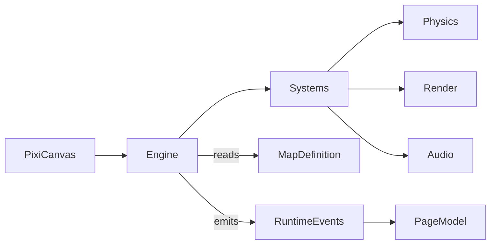

# Title

Pixi.js Platformer Engine And Shared Domain Plan

## Goal

Establish the rendering runtime, the engine surface, and the browser-safe shared domain types that every other plan in this experiment depends on. The engine must stay framework-free, consume only shared domain types, and expose a small, deterministic interface so the desktop app, the editor, and tests can all drive it the same way. Shared types must remain browser-safe so both the runtime UI and the map editor can render directly from the same source of truth.

## Scope

- Standardize on `Pixi.js` v8 as the renderer with `@pixi/sound` for audio and `@pixi/tilemap` for batched tile rendering.
- Define a thin `PlatformerEngine` surface in `packages/ui/src/lib/platformer/engine/` that the desktop app and the editor both consume.
- Define ECS-lite primitives (`Entity`, `Component`, `System`) and platformer physics primitives (`AABB`, `BroadPhase`, `TileGrid`) inside the engine module.
- Define browser-safe shared domain types under `packages/domain/src/shared/platformer/`.
- Pin a fixed-step game loop separate from Pixi's render ticker so deterministic tests are possible.

Out of scope for this step:

- Player controller, enemy AI, and HUD behavior. Those belong in `02-game-runtime.md`.
- Editor-specific tools and UI. Those belong in `03-map-editor.md`.
- SurrealDB persistence and use cases. Those belong in `04-persistence-and-services.md`.
- Route composition and page models. Those belong in `05-route-integration.md`.

## Architecture

- `packages/domain/src/shared/platformer`
  - Owns `TileKind`, `EntityKind`, `EntitySpawn`, `MapDefinition`, `LevelDefinition`, `WorldDefinition`, `MapMetadata`, `PowerUpKind`, `PlayerProfile`, and validation helpers.
  - Stays browser-safe so the renderer, the editor, and Surreal mappers can all import the same types.
  - Must not import Pixi, SurrealDB, SvelteKit, or AI SDK.
- `packages/ui/src/lib/platformer/engine`
  - Owns `PlatformerEngine`, ECS-lite primitives, physics primitives, and the fixed-step game loop.
  - Depends only on Pixi v8 packages and shared domain types via the local UI types mirror in `packages/ui/src/lib/platformer/types.ts`.
  - Must not depend on `packages/domain` directly. Domain types satisfy the local UI types structurally at the app boundary, mirroring the chat UI rule in `packages/ui/AGENTS.md`.
- `packages/ui/src/lib/platformer/types.ts`
  - Mirrors the shared platformer types as local UI types so `packages/ui` does not import `packages/domain`.
- `apps/desktop-app`
  - Consumes the engine and types only through `ui/source` and `domain/shared`. It must never construct Pixi objects directly in route files.

## Implementation Plan

1. Create the new shared platformer subdomain in `packages/domain/src/shared/platformer`.
   - Add `README.md` describing the boundary and browser-safe rule.
   - Add `index.ts` exports for tile, entity, map, level, world, and metadata types.
2. Define the tile vocabulary.
   - `TileKind`:
     - `empty`
     - `ground`
     - `brick`
     - `question`
     - `hardBlock`
     - `pipeTop`
     - `pipeBody`
     - `flagPole`
     - `flagBase`
     - `coinTile`
     - `hazard`
   - Each tile has static metadata: `solid`, `breakable`, `bumpable`, `oneWay`, `hazardous`.
3. Define the entity vocabulary.
   - `EntityKind`:
     - `player`
     - `walkerEnemy`
     - `shellEnemy`
     - `flyingEnemy`
     - `fireBar`
     - `bulletShooter`
     - `coin`
     - `mushroom`
     - `flower`
     - `star`
     - `oneUp`
     - `platformMoving`
     - `spring`
   - `EntitySpawn`:
     - `kind: EntityKind`
     - `tile: { col, row }`
     - `params?: Record<string, number | string | boolean>` for editor-tunable values such as patrol distance or item drop.
4. Define the map shape.
   - `MapDefinition`:
     - `id: string`
     - `version: number`
     - `size: { cols: number; rows: number }`
     - `tileSize: number`
     - `scrollMode: 'horizontal' | 'free'`
     - `spawn: { col: number; row: number }`
     - `goal: { col: number; row: number; kind: 'flag' | 'door' | 'edgeExit' }`
     - `tiles: TileKind[][]` ordered `[row][col]`
     - `entities: EntitySpawn[]`
     - `background: string` reference to a bundled background id
     - `music: string` reference to a bundled track id
   - `MapMetadata`:
     - `title: string`
     - `author: string`
     - `createdAt: string` ISO
     - `updatedAt: string` ISO
     - `source: 'builtin' | 'user'`
     - `inheritsFromBuiltInId?: string`
5. Define level and world grouping.
   - `LevelDefinition`:
     - `id: string`
     - `label: string` for HUD display, for example `1-1`
     - `map: MapDefinition`
   - `WorldDefinition`:
     - `id: string`
     - `label: string`
     - `levels: LevelDefinition[]`
6. Define `PlayerProfile` and `PowerUpKind`.
   - `PowerUpKind`:
     - `none`
     - `grow`
     - `fire`
     - `star`
   - `PlayerProfile`:
     - `lives: number`
     - `score: number`
     - `coins: number`
     - `power: PowerUpKind`
     - `checkpoint?: { worldId: string; levelId: string }`
7. Add validation helpers in `packages/domain/src/shared/platformer/validation.ts`.
   - `validateMapDefinition(map: MapDefinition): MapValidationResult`
   - Rules:
     - `tiles` matches `size.cols` and `size.rows`
     - `spawn` is inside bounds and not on a solid tile
     - `goal` is inside bounds
     - all `entities` reference in-bounds tiles
     - at most one `player` spawn (the spawn point is the player; `EntityKind.player` should not appear in `entities`)
   - Return shape:
     - `MapValidationResult { ok: boolean; errors: MapValidationIssue[]; warnings: MapValidationIssue[] }`
     - `MapValidationIssue { code: string; message: string; cell?: { col: number; row: number } }`
8. Mirror shared platformer types in `packages/ui/src/lib/platformer/types.ts`.
   - Re-declare the structural shape used by engine and editor so `packages/ui` stays free of `packages/domain` imports.
   - Document the structural-typing rule next to the file.
9. Define the engine surface in `packages/ui/src/lib/platformer/engine/PlatformerEngine.ts`.
   - Constructor takes a config:
     - `mode: 'play' | 'preview'`
     - `assetBundleId: string`
     - `fixedStepHz: number` default `60`
   - Methods:
     - `mount(canvas: HTMLCanvasElement | HTMLDivElement): Promise<void>`
     - `loadMap(map: MapDefinition): void`
     - `setInput(input: InputState): void`
     - `start(): void`
     - `stop(): void`
     - `dispose(): void`
   - Events through a typed `EventTarget` or small emitter:
     - `score`
     - `coin`
     - `lifeLost`
     - `goalReached`
     - `powerUp`
     - `hazardHit`
     - `runFinished`
   - The engine owns the Pixi `Application`, the `@pixi/tilemap` layer, the `@pixi/sound` instance, the ECS world, and the fixed-step accumulator.
10. Define ECS-lite primitives inside the engine module.
    - `Entity` is an opaque numeric id.
    - `Component` is a plain data record stored in typed component pools keyed by entity id.
    - `System` exposes `update(world: EngineWorld, dt: number): void`.
    - `EngineWorld` exposes:
      - `createEntity(): Entity`
      - `addComponent<T>(entity: Entity, kind: ComponentKind, data: T): void`
      - `getComponent<T>(entity: Entity, kind: ComponentKind): T | undefined`
      - `removeEntity(entity: Entity): void`
      - `query(kinds: ComponentKind[]): Iterable<Entity>`
11. Define platformer physics primitives.
    - `AABB { x: number; y: number; width: number; height: number }`
    - `TileGrid` builds from `MapDefinition.tiles` and answers:
      - `tileAt(col, row): TileKind`
      - `solidAt(col, row): boolean`
      - `oneWayAt(col, row): boolean`
      - `bumpableAt(col, row): boolean`
      - `forEachOverlap(box: AABB, fn): void`
    - `BroadPhase` partitions dynamic entity AABBs by tile column for cheap horizontal-strip queries.
    - Resolution rules:
      - axis-separated sweep: resolve X then Y
      - one-way platforms only collide when descending and the previous bottom was above the platform top
      - bumpable tiles trigger a bump event when a head-on Y collision happens while moving up
12. Pin the fixed-step game loop separate from Pixi's render ticker.
    - The engine accumulates real-time `dt` from Pixi's ticker.
    - It calls systems in order at a fixed step (default `1/60s`).
    - Render runs every Pixi tick using interpolated positions for smoothness.
    - Tests can drive the loop directly by calling `tickFixed(dt)` without Pixi.
13. Render layers.
    - `background` Pixi Container.
    - `tiles` `@pixi/tilemap` layer built once per `loadMap` call.
    - `entities` Pixi Container with one `Sprite` per renderable component.
    - `hud` Pixi Container reserved for the runtime overlay used by `02-game-runtime.md`.
14. Asset loading.
    - `AssetBundle` definition lives in the engine module and references textures, audio, and bitmap fonts by id.
    - Initial bundle is the `default` bundle bundled with the experiment.
    - The engine resolves bundle ids through `Pixi.Assets` so the editor and runtime share one cache.

## Tests

- Pure shared-type tests in `packages/domain/src/shared/platformer/`.
  - `validateMapDefinition` covers:
    - in-bounds spawn
    - bounds mismatch
    - missing goal
    - solid spawn rejection
    - duplicate `player` entity rejection
- Pure engine tests in `packages/ui/src/lib/platformer/engine/`.
  - `TileGrid` queries: solid, one-way, bumpable, edge cells.
  - `AABB` resolution against a tile grid:
    - corner clip
    - ceiling stop
    - one-way platform descent vs. ascent
    - hazard overlap event
  - `EngineWorld` ECS:
    - component add and remove
    - query intersection
    - entity removal frees component slots
  - Fixed-step loop:
    - `tickFixed(dt)` called N times advances state deterministically
    - oversized `dt` clamps to a max step count to avoid spiral-of-death
- Use `bun:test`, no Pixi mocks beyond a thin `MockPixiTicker` for fixed-step tests.

## Acceptance Criteria

- `packages/domain/src/shared/platformer` exports stable browser-safe types that the editor and the runtime can both consume.
- `PlatformerEngine` exposes a small, framework-free surface and runs a deterministic fixed-step loop.
- `packages/ui` does not import `packages/domain`. The engine consumes shared structural types via the local mirror.
- The engine renders maps through Pixi v8 with `@pixi/tilemap` for tiles and `@pixi/sound` for audio.
- `validateMapDefinition` covers spawn, goal, bounds, and entity placement rules.

## Dependencies

- Planned package adoption:
  - `pixi.js` v8
  - `@pixi/tilemap`
  - `@pixi/sound`
- New shared platformer exports from `packages/domain/src/shared/index.ts`.
- New engine exports from `packages/ui/src/lib/index.ts`.
- Reference docs the implementation should align with:
  - [Pixi.js v8 Guide](https://pixijs.com/8.x/guides)
  - [Pixi.js v8 API](https://pixijs.download/release/docs/index.html)
  - [`@pixi/tilemap`](https://github.com/pixijs/tilemap)
  - [`@pixi/sound`](https://pixijs.io/sound/)

## Risks / Notes

- Real physics engines such as Matter.js feel wrong for a tight platformer. Custom AABB-vs-tilegrid collision with axis-separated sweep is the standard pattern and is what this plan adopts.
- The fixed-step loop must stay separate from Pixi's render ticker so tests stay deterministic and so slow frames don't break gameplay.
- Keep the engine surface small. Resist adding tool-specific or editor-specific methods here. Editor concerns belong in `03-map-editor.md`.
- The local UI types mirror exists for a real reason: `packages/ui` cannot depend on `packages/domain` per `packages/ui/AGENTS.md`. Keep both shapes structurally compatible.

## Implementation status (repository)

- Shared types and `validateMapDefinition`: `packages/domain/src/shared/platformer/*` with tests.
- Engine / ECS-lite / physics / fixed step: `packages/ui/src/lib/platformer/engine/*` (see `PlatformerEngine.ts`, `world.ts`, `tile-grid.ts`, `fixed-step-loop.ts`, `physics.ts`).
- Renderer: `packages/ui/src/lib/platformer/engine/pixi-renderer.ts` uses **Pixi v8** and **`@pixi/tilemap` `CompositeTilemap`** for the static tile layer (placeholder textures generated from the shape bundle). **`@pixi/sound` is not yet integrated**; `audio-bus.ts` still defaults to a null implementation for tests.
- Tile grid patching helpers (no Pixi): `packages/ui/src/lib/platformer/engine/tile-layer-ops.ts` + `tile-layer-ops.test.ts`.
