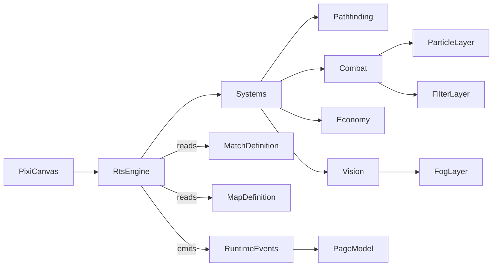

# Title

Isometric RTS Engine, Altitude Model, And Shared Domain Plan

## Goal

Establish the rendering runtime, the isometric projection, the first-class altitude model, the engine surface, and the browser-safe shared domain types that every other plan in this experiment depends on. The engine must consume only shared domain types, expose a small deterministic interface so the desktop app and tests can drive it the same way, and stay framework-free so RTS systems, AI directors, and route composition can each layer on top without leaking concerns.

## Scope

- Standardize on Pixi.js v8 as the renderer plus `@pixi/tilemap` for batched tile rendering, `@pixi/sound` for audio, `@pixi/particle-emitter` for VFX, and `@pixi/filters` for high-impact screen-space effects.
- Define a 2:1 diamond isometric projection with discrete altitude.
- Define a thin `RtsEngine` surface in `packages/ui/src/lib/rts/engine/` that the desktop app consumes through `ui/source`.
- Define ECS-lite primitives (`Entity`, `Component`, `System`) and a fixed-step simulation loop independent of Pixi's render ticker.
- Define browser-safe shared domain types under `packages/domain/src/shared/rts/`.
- Define the layered render container model that downstream plans bind to.

Out of scope for this step:

- Selection, commands, pathfinding, combat, economy, fog of war, and minimap. Those belong in `02-rts-runtime-and-systems.md`.
- Particles, filters, BGM, SFX, and screen feedback. Those belong in `03-visual-and-audio-juice.md`.
- AI behavior. That belongs in `04-ai-opponent.md`.
- SurrealDB persistence and route composition. Those belong in `05-persistence-and-route-integration.md`.

## Architecture

- `packages/domain/src/shared/rts`
  - Owns `IsoCoord`, `TilePos`, `AltitudeLevel`, `AltitudeMap`, `TerrainKind`, `ResourceKind`, `UnitKind`, `BuildingKind`, `TechKind`, `Faction`, `ResourceNode`, `MapDefinition`, `MatchDefinition`, `MatchResult`, and validation helpers.
  - Stays browser-safe so the renderer, the AI, the editor (future), and Surreal mappers can all import the same types.
  - Must not import Pixi, SurrealDB, SvelteKit, or AI SDK.
- `packages/ui/src/lib/rts/engine`
  - Owns `RtsEngine`, `IsoProjection`, the fixed-step loop, and ECS-lite primitives.
  - Depends only on Pixi v8 packages and shared structural types via the local UI types mirror in `packages/ui/src/lib/rts/types.ts`.
  - Must not depend on `packages/domain` directly. Domain types satisfy the local UI types structurally at the app boundary, mirroring the chat UI rule in `packages/ui/AGENTS.md`.
- `packages/ui/src/lib/rts/types.ts`
  - Mirrors the shared rts types as local UI types so `packages/ui` does not import `packages/domain`.
- `apps/desktop-app`
  - Consumes the engine and types only through `ui/source` and `domain/shared`. Never constructs Pixi objects directly in route files.

## Implementation Plan

1. Create the new shared rts subdomain in `packages/domain/src/shared/rts`.
   - Add `README.md` describing the boundary and browser-safe rule.
   - Add `index.ts` exports for terrain, resource, unit, building, tech, faction, map, match, and result types.
2. Define isometric primitives.
   - `TilePos { col: number; row: number }`
   - `IsoCoord { x: number; y: number }` is screen-space pixel coordinates after projection.
   - `AltitudeLevel` is an integer in `0..maxAltitude`.
   - `AltitudeMap { levels: AltitudeLevel[][] }` indexed `[row][col]`.
3. Define terrain and resource vocabularies.
   - `TerrainKind`:
     - `grass`
     - `dirt`
     - `rock`
     - `water`
     - `shallow`
     - `cliff`
   - Each terrain has static metadata: `walkable`, `buildable`, `swimmable`, `blocksVision`, `blocksProjectiles`.
   - `ResourceKind`:
     - `mineral`
     - `gas`
   - `ResourceNode`:
     - `id: string`
     - `kind: ResourceKind`
     - `tile: TilePos`
     - `amount: number`
     - `regenPerMin?: number`
4. Define unit, building, and tech vocabularies.
   - `UnitKind`:
     - `worker`
     - `rifleman`
     - `rocket`
     - `scout`
   - `BuildingKind`:
     - `hq`
     - `barracks`
     - `factory`
     - `refinery`
     - `depot`
     - `turret`
   - `TechKind`:
     - `armorT1`
     - `armorT2`
     - `weaponT1`
     - `weaponT2`
     - `sightRange`
   - Each `UnitKind` and `BuildingKind` carries static stats (cost, build time, supply, hp, sight) defined in `packages/domain/src/shared/rts/stats.ts`.
5. Define `Faction`.
   - `Faction { id: string; label: string; color: string; isPlayer: boolean; isAi: boolean; aiDifficulty?: 'easy' | 'normal' | 'hard' }`
6. Define `MapDefinition`.
   - `id: string`
   - `version: number`
   - `size: { cols: number; rows: number }`
   - `tileSize: { width: number; height: number }` defaulting to `{ width: 64, height: 32 }`
   - `maxAltitude: number`
   - `terrain: TerrainKind[][]`
   - `altitude: AltitudeMap`
   - `resources: ResourceNode[]`
   - `spawns: { factionId: string; tile: TilePos }[]`
   - `metadata: { title: string; author: string; createdAt: string; updatedAt: string; source: 'builtin' | 'user' }`
7. Define `MatchDefinition` and `MatchResult`.
   - `MatchDefinition`:
     - `id: string`
     - `mapId: string`
     - `factions: Faction[]`
     - `rules: { startingResources: { mineral: number; gas: number }; populationCap: number; fogOfWar: boolean; aiDifficulty: 'easy' | 'normal' | 'hard'; rngSeed: number }`
   - `MatchResult`:
     - `matchId: string`
     - `mapId: string`
     - `winner: string | 'draw'` (faction id)
     - `durationMs: number`
     - `factions: Faction[]`
     - `finishedAt: string` ISO
8. Add validation helpers in `packages/domain/src/shared/rts/validation.ts`.
   - `validateMapDefinition(map: MapDefinition): MapValidationResult`
   - Rules:
     - `terrain` and `altitude.levels` match `size.cols` and `size.rows`
     - `altitude.levels` values are in `0..maxAltitude`
     - cliff cells must have an altitude delta with at least one neighbor
     - all `spawns[].tile` are inside bounds and on a `walkable` non-cliff tile
     - all `resources[].tile` are inside bounds and on a non-`water` tile
     - at most one spawn per faction id
   - Return shape:
     - `MapValidationResult { ok: boolean; errors: MapValidationIssue[]; warnings: MapValidationIssue[] }`
     - `MapValidationIssue { code: string; message: string; cell?: TilePos }`
9. Mirror shared rts types in `packages/ui/src/lib/rts/types.ts`.
   - Re-declare the structural shape used by engine and HUD components so `packages/ui` stays free of `packages/domain` imports.
   - Document the structural-typing rule next to the file.
10. Define the isometric projection helpers in `packages/ui/src/lib/rts/engine/iso.ts`.
    - `IsoProjection` constructor takes `tileSize: { width: number; height: number }` and `altPxPerLevel: number` (default `tileSize.height / 2`).
    - Methods:
      - `tileToScreen(col: number, row: number, alt: number): IsoCoord`
        - `x = (col - row) * (tileSize.width / 2)`
        - `y = (col + row) * (tileSize.height / 2) - alt * altPxPerLevel`
      - `screenToTile(x: number, y: number): TilePos`
        - planar inverse using `tileSize`; altitude is resolved by callers via the terrain altitude map
      - `depthZ(col: number, row: number, alt: number): number`
        - `(col + row) * baseDepth + alt * altDepth + spriteFootprintBias`
      - `tileFootprintPolygon(col: number, row: number, alt: number): IsoCoord[]`
        - returns the four diamond corners for hover, selection, and pointer hit-testing
    - Constants documented in the file:
      - `baseDepth = 1`
      - `altDepth = 0.5`
      - `spriteFootprintBias` is set per render layer (units, buildings, projectiles)
11. Define the engine surface in `packages/ui/src/lib/rts/engine/RtsEngine.ts`.
    - Constructor takes a config:
      - `mode: 'play' | 'preview'`
      - `assetBundleId: string`
      - `fixedStepHz: number` default `30` (RTS sims often run slower than action games to keep AI cheap and replays small)
    - Methods:
      - `mount(canvas: HTMLCanvasElement | HTMLDivElement): Promise<void>`
      - `loadMatch(match: MatchDefinition, map: MapDefinition): void`
      - `setInput(input: InputState): void`
      - `start(): void`
      - `stop(): void`
      - `dispose(): void`
      - `tickFixed(stepMs: number): void` for tests
    - Events through a typed emitter:
      - `unitSelected`
      - `commandIssued`
      - `unitDamaged`
      - `unitKilled`
      - `buildingPlaced`
      - `buildingDamaged`
      - `buildingDestroyed`
      - `resourceChanged`
      - `techStarted`
      - `techCompleted`
      - `visionChanged`
      - `matchEnded`
12. Define ECS-lite primitives inside the engine module.
    - `Entity` is an opaque numeric id.
    - `Component` is a plain data record stored in typed component pools keyed by entity id.
    - `System` exposes `update(world: EngineWorld, dt: number): void`.
    - `EngineWorld` exposes:
      - `createEntity(): Entity`
      - `addComponent<T>(entity, kind, data): void`
      - `getComponent<T>(entity, kind): T | undefined`
      - `removeEntity(entity): void`
      - `query(kinds: ComponentKind[]): Iterable<Entity>`
      - `factionOf(entity): string | undefined`
13. Pin the fixed-step simulation loop separate from Pixi's render ticker.
    - The engine accumulates real-time `dt` from Pixi's ticker.
    - It calls registered systems in order at a fixed step (default `1/30s`).
    - Render runs every Pixi tick using interpolated entity positions for smoothness.
    - Tests can drive the loop directly by calling `tickFixed(stepMs)` without Pixi.
14. Render layers.
    - The engine creates and exposes a strict z-order of containers on the Pixi `Application.stage`:
      - `terrain` (built once per `loadMatch` via `@pixi/tilemap`)
      - `terrainDecals` (resource patch glints, footstep dust persistence)
      - `selectionFloor` (rings, attack-move targets, rally lines)
      - `buildings`
      - `units`
      - `projectiles`
      - `particles`
      - `lights` (additive; consumed by filters in plan 03)
      - `fogOfWar` (consumed by filters in plan 03)
      - `selectionOverlay` (top-level rings, health bars, build placement preview)
      - `hud`
    - Per-entity sprites set their `zIndex` via `IsoProjection.depthZ` so slope ordering stays correct.
15. Asset loading.
    - `AssetBundle` definition lives in the engine module and references textures, audio, and bitmap fonts by id.
    - Initial bundle is the `default` rts bundle bundled with the experiment.
    - The engine resolves bundle ids through `Pixi.Assets` so future map editor and runtime share one cache.
16. Camera and input scaffolding.
    - `Camera` exposed by the engine as a thin wrapper over the stage transform with:
      - `pan(dx, dy)`, `zoom(factor, anchorScreen)`, `setBounds(minX, minY, maxX, maxY)`, `screenToWorld(p)`, `worldToScreen(p)`.
    - `InputState` is the normalized input struct produced by the page model and pushed into the engine via `setInput`. Concrete commands and selection live in `02-rts-runtime-and-systems.md`.

## Tests

- Pure shared-type tests in `packages/domain/src/shared/rts/`.
  - `validateMapDefinition` covers:
    - terrain and altitude size mismatch
    - altitude out of `0..maxAltitude`
    - cliff without delta
    - spawn on water or cliff
    - duplicate spawn for a faction id
- Pure engine tests in `packages/ui/src/lib/rts/engine/`.
  - `IsoProjection`:
    - `tileToScreen` and `screenToTile` round-trip at altitude `0`
    - `tileToScreen` shifts up by `altPxPerLevel` per altitude unit
    - `depthZ` orders correctly across diagonal and vertical neighbors
    - `tileFootprintPolygon` returns four corners centered on the projected tile
  - `EngineWorld` ECS:
    - component add and remove
    - query intersection
    - entity removal frees component slots
    - `factionOf` reflects ownership
  - Fixed-step loop:
    - `tickFixed(stepMs)` advances state deterministically
    - oversized `dt` clamps to a max step count to avoid spiral-of-death
    - render interpolation does not advance simulation state
- Use `bun:test`, no Pixi mocks beyond a thin `MockPixiTicker` for fixed-step tests.

## Acceptance Criteria

- `packages/domain/src/shared/rts` exports stable browser-safe types covering map, match, terrain, altitude, resources, units, buildings, tech, factions, and results.
- `IsoProjection` implements 2:1 diamond projection with first-class altitude offset and a deterministic depth function.
- `RtsEngine` exposes a small framework-free surface, runs a deterministic fixed-step loop, and provides the layered render containers downstream plans bind to.
- `packages/ui` does not import `packages/domain`. The engine consumes shared structural types via the local mirror.
- `validateMapDefinition` covers terrain, altitude, cliff, spawn, and resource placement rules.

## Dependencies

- Planned package adoption:
  - `pixi.js` v8
  - `@pixi/tilemap`
  - `@pixi/sound`
  - `@pixi/particle-emitter`
  - `@pixi/filters`
- New shared rts exports from `packages/domain/src/shared/index.ts`.
- New engine exports from `packages/ui/src/lib/index.ts`.
- Reference docs:
  - [Pixi.js v8 Guide](https://pixijs.com/8.x/guides)
  - [`@pixi/tilemap`](https://github.com/pixijs/tilemap)
  - [`@pixi/sound`](https://pixijs.io/sound/)
  - [`@pixi/particle-emitter`](https://github.com/pixijs-userland/particle-emitter)
  - [`@pixi/filters`](https://github.com/pixijs/filters)

## Risks / Notes

- Slope draw order is the most common iso bug. Using a deterministic `depthZ` function with `altDepth` plus per-layer `spriteFootprintBias` is the standard fix.
- The fixed-step loop must stay separate from Pixi's render ticker so AI determinism, replay capability, and tests stay sound.
- Keep the engine surface small. Resist adding RTS-specific commands or HUD methods here. Those belong in plans 02 and 03.
- The local UI types mirror exists for a real reason: `packages/ui` cannot depend on `packages/domain` per `packages/ui/AGENTS.md`. Keep both shapes structurally compatible.
