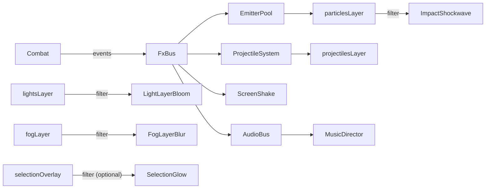

# Title

RTS Visual And Audio Juice: Particles, Projectiles, Filters, Screen Feedback, BGM, And SFX Plan

## Goal

Layer visual and audio feedback on top of the engine and runtime systems. Particles and projectiles ride on every shot, impact, and death. Screen-space `@pixi/filters` are reserved for high-impact moments only: hard impacts, dynamic lights, and the fog of war. Audio runs through `@pixi/sound` with a positional SFX bus and a BGM bus that crossfades on match start and end. All juice respects strict performance budgets so a busy battle stays smooth.

## IP And Content Guardrail

- The juice layer inherits the IP guardrail from `02-rts-runtime-and-systems.md`. Every audio cue must come from CC0 or clearly licensed sources. Every particle spritesheet must be original or licensed.
- Do not match the timbre, melody, or stinger of any well-known RTS soundtrack. Generic textures only.

## Scope

- Particle presets via `@pixi/particle-emitter` for muzzle flashes, bullet impacts, rocket impacts, dust, deaths, smoke, harvest sparks, and repair sparks. Pooled and budget-capped.
- Projectile types: `bullet` (fast linear), `rocket` (parabolic with smoke trail), `tracer` (linear with fade-out).
- Screen-space `@pixi/filters` reserved for: hard impact shockwaves, additive lights, and soft fog of war. Layer-scoped, time-bounded, budget-capped.
- Camera screen-shake on rocket impacts and building destruction.
- Hit-flash tint on damaged units.
- Selection feedback: rings under selected units; optional `GlowFilter` on rings under "high juice" mode.
- Audio: SFX bus with positional volume; BGM bus with crossfade.
- Performance guardrails: filter budget, particle budget, automatic "low juice" mode under frame-time pressure.

Out of scope for this step:

- Engine surface, ECS, projection. Those belong in `01-engine-isometric-and-domain.md`.
- Selection, combat, vision computation. Those belong in `02-rts-runtime-and-systems.md`.
- AI behavior. That belongs in `04-ai-opponent.md`.
- Persistence and route composition. That belongs in `05-persistence-and-route-integration.md`.

## Architecture

- `packages/ui/src/lib/rts/engine/fx`
  - Owns particle pools, emitter presets, and the `FxBus` that systems push events into.
  - Owns projectile sprites and trail emitters.
  - Owns the screen-shake state.
- `packages/ui/src/lib/rts/engine/filters`
  - Owns the screen-space filter wrappers: `ImpactShockwave`, `LightLayerBloom`, `FogLayerBlur`, optional `SelectionGlow`, `HitFlash`.
  - Owns the `FilterBudget` enforcer.
- `packages/ui/src/lib/rts/engine/audio`
  - Owns `AudioBus` (a thin wrapper over `@pixi/sound`) and the asset bundle definitions.
  - Owns `MusicDirector` for crossfade behavior.
- `packages/ui/src/lib/rts/runtime`
  - HUD components react to runtime events but never drive the engine; juice is engine-resident.

## Implementation Plan

1. Define the `FxBus` interface.
   - `FxBus.emit(event: FxEvent): void`
   - `FxEvent` discriminated union:
     - `MuzzleFlash { worldX, worldY, angle }`
     - `BulletImpact { worldX, worldY, surface }`
     - `RocketImpact { worldX, worldY, radius }`
     - `Dust { worldX, worldY, intensity }`
     - `UnitDeath { worldX, worldY, unitKind }`
     - `BuildingDamageSmoke { worldX, worldY, severity }`
     - `HarvestSpark { worldX, worldY, resourceKind }`
     - `RepairSpark { worldX, worldY }`
     - `ProjectileLaunched { entity, kind, fromWorld, toWorld }`
     - `ProjectileImpact { kind, atWorld, targetEntity?: Entity }`
     - `LightFlash { worldX, worldY, color, radiusPx, durationMs }`
     - `ScreenShakeImpulse { magnitude, durationMs }`
     - `HitFlash { entity, durationMs }`
   - The combat, economy, construction, and production systems in `02-rts-runtime-and-systems.md` push events into the bus. The juice layer never reaches into those systems.
2. Implement particle pools and presets.
   - `EmitterPool`:
     - per preset id, allocate up to `preset.maxConcurrent` `Emitter` instances
     - on emit, pick an idle emitter or recycle the oldest active one
     - all emitters share a single `particles` `Container` from the engine's render layer list
   - Presets in `packages/ui/src/lib/rts/engine/fx/presets/`:
     - `muzzleFlash.json` short cone burst, additive blend, ~80ms
     - `bulletImpact.json` small spark + dust puff, ~120ms
     - `rocketImpact.json` flame core + ring of debris, ~350ms
     - `dust.json` low-opacity puff used by movement and rocket trails
     - `unitDeath.json` confetti-of-pieces, ~600ms
     - `buildingDamageSmoke.json` continuous smoke gated by health bracket
     - `harvestSpark.json` colored sparks (gold for mineral, green for gas)
     - `repairSpark.json` short bright sparks
   - Loaded once per `RtsEngine.mount` from the bundle resolved by `Pixi.Assets`.
3. Implement projectiles.
   - `ProjectileSystem` (engine-resident, registered after combat in plan 02) owns projectile entities with components:
     - `Projectile { kind: 'bullet' | 'rocket' | 'tracer'; speed: number; spawn: { x, y }; target: { x, y } | Entity; arc: 'direct' | 'parabolic'; durationMs: number; elapsedMs: number; ownerFaction: string; damage: number; impactRadius: number }`
   - On spawn, also push:
     - `MuzzleFlash` and `ProjectileLaunched` events
     - for `rocket`, attach a `dust` trail emitter that follows the projectile
   - On impact (target reached, occlusion hit per plan 02 occlusion rules, or `elapsedMs > durationMs`):
     - apply damage to the target entity if any (combat already handles damage rolls; the projectile carries the resolved damage value)
     - push `ProjectileImpact`
     - for `rocket`, push `RocketImpact`, `ScreenShakeImpulse { magnitude: 0.6, durationMs: 250 }`, and `LightFlash { color: 0xffaa44, radiusPx: 64, durationMs: 250 }`
     - for `bullet`, push `BulletImpact`
4. Implement screen-space filters.
   - `ImpactShockwave`:
     - wraps Pixi's `ShockwaveFilter`
     - applied to the `particles` container only, not the whole stage
     - time-bounded: the filter lifetime is the longest currently active impact's `durationMs`; the filter is removed when no impacts remain
     - parameter animation: center moves to the impact world position projected to screen; `time` advances per frame
   - `LightLayerBloom`:
     - wraps Pixi's `BloomFilter`
     - applied to the `lights` container only
     - the lights container holds short-lived additive sprites pushed by `LightFlash` events plus persistent emitters for refinery glow and turret idle indicators
     - lights fade out over their `durationMs`; the bloom filter is always-on for the lights layer (cheap because the container is small)
   - `FogLayerBlur`:
     - wraps Pixi's `BlurFilter`
     - applied to the `fogOfWar` container only
     - the fog container draws a `RenderTexture` updated incrementally from the vision grid emitted by `02-rts-runtime-and-systems.md`
     - per-cell mapping:
       - `unexplored = 0xff` opaque dark
       - `explored = 0x80` mid darkness
       - `visible = 0x00` clear
     - the blur filter softens edges so transitions look natural
     - update region uses the `visionChanged` dirty-bounds payload
   - `SelectionGlow` (optional, "high juice" only):
     - wraps `GlowFilter` applied to `selectionOverlay` container
     - skipped automatically under "low juice" mode
   - `HitFlash`:
     - per-entity transient `ColorMatrixFilter` applied directly to the unit sprite for one render frame, then removed
     - entities never carry persistent filters
   - All filters are layer-scoped (set on a Container's `filters` array), not per-entity, to keep batching healthy.
5. Implement screen-shake.
   - `ScreenShakeState` accumulates impulses with magnitude and duration.
   - The render system applies a per-frame offset to the camera transform sampled from a deterministic noise function seeded by `MatchDefinition.rules.rngSeed` plus elapsed frame.
   - Multiple impulses sum with decay: `offset = sum(impulse_i * easeOutCubic(remaining_i))`.
6. Implement audio.
   - `AudioBus`:
     - `playSfx(id: string, opts?: { worldX?, worldY?, volume?, pitch? })`
       - volume scales by camera distance to `(worldX, worldY)` and screen-edge attenuation (units off-screen play softer)
       - falls back to non-positional play when `worldX/worldY` are omitted
     - `setSfxVolume(v: number)` global SFX bus volume
     - all SFX shares a `Sound.context` for ducking
   - `MusicDirector`:
     - `playMusic(trackId: string)` swaps the current track with a configurable crossfade (default `1500ms`)
     - `setMusicVolume(v: number)`
     - `duck(durationMs)` lowers music for stingers (victory, defeat, tech complete)
   - SFX ids:
     - `select`, `move`, `attack`, `bulletFire`, `bulletImpact`, `rocketFire`, `rocketImpact`
     - `unitReady`, `buildingPlaced`, `buildingComplete`, `buildingDestroyed`
     - `lowMineral`, `lowGas`, `popCap`, `techStarted`, `techComplete`
     - `victory`, `defeat`
   - BGM tracks:
     - `bgm.peace.intro`, `bgm.peace.loop`, `bgm.battle.intro`, `bgm.battle.loop`, `bgm.victory.stinger`, `bgm.defeat.stinger`
   - The runtime decides "peace" vs. "battle" track based on simple heuristics (any owned entity in combat in the last 5 seconds = battle).
7. Implement event-to-juice mapping.
   - `JuiceMappingSystem` listens to engine events from plan 02 and pushes the right `FxBus` events and `AudioBus` calls:
     - `unitDamaged` -> `HitFlash` + an `attackImpact` SFX picked from the projectile kind
     - `unitKilled` -> `UnitDeath` + `unitDeath` SFX
     - `buildingDamaged` (when health bracket falls) -> `BuildingDamageSmoke` of escalating severity
     - `buildingDestroyed` -> `RocketImpact`-style burst + `buildingDestroyed` SFX + `ScreenShakeImpulse`
     - `projectileImpact` of `rocket` -> `RocketImpact` + `ScreenShakeImpulse` + `LightFlash`
     - `techCompleted` -> `techComplete` SFX + brief `MusicDirector.duck`
     - `matchEnded` -> stop combat music; play `victory` or `defeat` SFX; play victory or defeat BGM
   - Selection events from plan 02 -> `select` SFX (rate-limited to once per `200ms`).
8. Implement performance budgets and `LowJuiceMode`.
   - `FilterBudget`:
     - at most two screen-space filters active at once across `particles`, `lights`, `fogOfWar`
     - `selectionGlow` is the first to be skipped if exceeded
   - `ParticleBudget`:
     - global cap of `N` simultaneously-alive particles (default `2000`)
     - per-preset cap (default `200`)
     - oldest particles are dropped first
   - `LowJuiceMode`:
     - measured via a moving average of frame time
     - when `frameMs > 24` for `1s`, switch to `low`:
       - drop `selectionGlow`
       - reduce per-emitter cap by `50%`
       - skip `RocketImpact` shockwave (still spawn the particle preset and SFX)
     - when `frameMs < 14` for `5s`, switch back to `high`
   - The mode is observable via an engine event so the HUD can show a small indicator.
9. Define render layer ownership of filters.
   - `terrain`: no filters
   - `terrainDecals`: no filters
   - `selectionFloor`: no filters
   - `buildings`: no persistent filters (transient `HitFlash` only)
   - `units`: no persistent filters (transient `HitFlash` only)
   - `projectiles`: no filters
   - `particles`: `ImpactShockwave` (transient)
   - `lights`: `LightLayerBloom` (always-on)
   - `fogOfWar`: `FogLayerBlur` (always-on; cheap because incremental updates and a small `RenderTexture`)
   - `selectionOverlay`: `SelectionGlow` (optional; "high juice" only)
   - `hud`: no filters
10. Asset budget guidance.
    - All SFX as 44.1 kHz mono OGG. Music as 44.1 kHz stereo OGG.
    - Particle textures as small (32x32 or smaller) PNGs in a single atlas.
    - Light flash sprite as a single radial gradient PNG reused across colors via tint.
    - Document this in the bundle README so future asset additions stay consistent.

## Tests

- Pure tests under `packages/ui/src/lib/rts/engine/fx/` and `packages/ui/src/lib/rts/engine/filters/`.
- `FxBus`:
  - emitting a `RocketImpact` enqueues the right downstream events on the same step (`ProjectileImpact`, `ScreenShakeImpulse`, `LightFlash`)
  - rate-limiting on `select` SFX collapses bursts to one play per window
- `EmitterPool`:
  - reuses an idle emitter when available
  - recycles the oldest active emitter when at capacity
  - per-preset cap is enforced
  - global cap drops the oldest particles first (particle count assertions)
- `ProjectileSystem`:
  - `bullet` projectile reaches its target tile in the expected number of steps for a known speed
  - `rocket` impacts on the target tile and triggers the rocket-impact event chain
  - `tracer` fades out and despawns after its `durationMs`
- `FilterBudget`:
  - adding a third filter beyond the budget is rejected and `selectionGlow` is skipped
- `LowJuiceMode`:
  - a synthetic frame-time stream that exceeds `24ms` for `1s` flips the mode
  - returning under `14ms` for `5s` flips it back
- `FogLayerBlur` integration with vision events:
  - given a `visionChanged` payload with a small dirty rect, the fog texture only updates that rect (assert via spy on the update region)
- `MusicDirector`:
  - `playMusic` crossfades over the configured duration
  - `duck` lowers volume and restores it after the duration
- `JuiceMappingSystem`:
  - given an `unitKilled` event, the right SFX and particle preset fire
  - given a `buildingDamaged` event in a new health bracket, smoke severity escalates exactly once

## Acceptance Criteria

- Particle presets cover muzzle flashes, bullet impacts, rocket impacts, dust, deaths, smoke, harvest, and repair, all pooled and budget-capped.
- Projectiles spawn with the right particles and trigger the right impact effects.
- `@pixi/filters` are applied only to `particles`, `lights`, `fogOfWar`, and optionally `selectionOverlay`. They are layer-scoped, time-bounded, and budget-capped.
- Camera screen-shake responds to rocket impacts and building destruction with a deterministic noise model.
- Hit-flash applies for one frame and cleans up.
- `@pixi/sound` powers a positional SFX bus and a BGM bus with crossfade.
- `LowJuiceMode` activates under sustained frame-time pressure and reverts when load drops.
- All juice is driven by engine events from plan 02; no juice code reaches into combat or vision systems.

## Dependencies

- `01-engine-isometric-and-domain.md` provides the layered render containers and the engine event surface.
- `02-rts-runtime-and-systems.md` emits the gameplay events the juice layer reacts to.
- Bundle assets:
  - particle texture atlas
  - SFX OGG files
  - BGM OGG files
- Reference docs:
  - [`@pixi/particle-emitter`](https://github.com/pixijs-userland/particle-emitter)
  - [`@pixi/filters`](https://github.com/pixijs/filters)
  - [`@pixi/sound`](https://pixijs.io/sound/)

## Risks / Notes

- Filters that wrap the entire stage devastate batching and frame time. The plan applies filters only to small dedicated containers.
- `BloomFilter` and `ShockwaveFilter` look great but compound badly. The `FilterBudget` and `LowJuiceMode` exist precisely to cap them under load.
- Audio crossfades can click if sample rates differ. Standardize on 44.1 kHz across SFX and music.
- Determinism: screen-shake noise must be seeded by `MatchDefinition.rules.rngSeed` so replays look identical.
- Positional volume can be jarring when zoomed out. Clamp the minimum volume so distant fights are still audible enough for player awareness.
