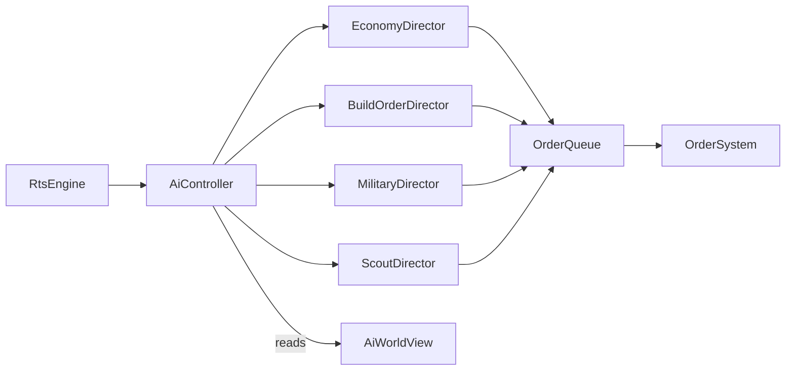

# Title

Deterministic Scripted AI Opponent Plan

## Goal

Add a single-player AI opponent that drives an RTS faction through the same engine, the same `OrderQueue`, and the same fixed-step loop the player uses. The AI must be deterministic given the match seed and difficulty so replays and tests stay reproducible. It must compose recognizable RTS behaviors (worker management, build orders, scouting, attack waves) without becoming an unbounded behavior framework in this experiment.

## Scope

- A single `AiController` per AI faction.
- Four small directors that issue orders into the same `OrderQueue` players use:
  - `EconomyDirector`
  - `BuildOrderDirector`
  - `MilitaryDirector`
  - `ScoutDirector`
- Three difficulty levels: `easy`, `normal`, `hard`.
- A small set of pre-authored build orders selectable by difficulty.
- Deterministic decision-making with a single seeded RNG owned by the controller.
- A fixed decision cadence decoupled from the engine's per-step systems.

Out of scope for this step:

- Player-vs-player networking. Single-player AI only.
- Reinforcement learning or any non-scripted approach.
- Adaptive difficulty or rubber-banding.
- Custom AI scripting by the user.

## Architecture

- `packages/ui/src/lib/rts/engine/ai`
  - Owns `AiController`, the four directors, the seeded RNG, and the build-order definitions.
  - Depends only on engine primitives, engine events, and shared domain types via the local UI types mirror.
  - Issues orders by pushing into the same `OrderQueue` component used by player units.
  - Reads world state through read-only views (`AiWorldView`) so it cannot mutate component data outside of order issuance.
- `packages/ui/src/lib/rts/engine/ai/build-orders`
  - JSON-defined build orders consumed by `BuildOrderDirector`.
- `packages/domain/src/shared/rts`
  - Already exports `MatchDefinition.rules.aiDifficulty` and `MatchDefinition.rules.rngSeed` from `01-engine-isometric-and-domain.md`. No new shared types are required for the AI itself.

## Implementation Plan

1. Define `AiWorldView`.
   - Read-only view over the `EngineWorld` exposing only what the AI needs:
     - `iterateOwned(faction): Iterable<Entity>` for each component subset (`Worker`, `Combat`, `Building`, `Production`, `Health`)
     - `iterateVisible(faction): Iterable<Entity>` filtered by the faction's vision grid
     - `resourceTotals(faction): { mineral: number; gas: number; supply: number; supplyCap: number }`
     - `tileInfo(tile): { walkable, buildable, altitude, hasResource, terrain }`
     - `findClosestNode(from, kind): Entity | undefined`
     - `findOpenBuildSpot(near, footprint, kind): TilePos | undefined`
   - The view must not allow mutation; orders go through `AiController.issueOrder` which appends to `OrderQueue`.
2. Define `AiController`.
   - Constructed per AI faction with:
     - `factionId: string`
     - `difficulty: 'easy' | 'normal' | 'hard'`
     - `rng: SeededRng` derived from `match.rules.rngSeed` and `factionId`
     - `directors: { economy, buildOrder, military, scout }`
   - Lifecycle:
     - `onMatchStart(view: AiWorldView): void`
     - `tickFixed(view: AiWorldView, simNowMs: number): void`
     - `onMatchEnd(view: AiWorldView, result): void`
   - Decision cadence:
     - directors run on a 500 ms interval rather than every fixed step
     - cadence is anchored to `simNowMs % 500` so replays stay deterministic
3. Implement `SeededRng`.
   - 32-bit xorshift or PCG variant.
   - Methods:
     - `int(min, max)`
     - `pick<T>(arr: readonly T[]): T`
     - `chance(p: number): boolean`
   - Per-controller instance seeded with `hash(rngSeed, factionId)` so two AI factions in the same match draw independent streams.
4. Implement `EconomyDirector`.
   - Inputs:
     - current worker count per resource node
     - resource totals
     - supply totals
   - Behaviors:
     - target worker count per node defaulting to `2` (mineral) and `3` (gas), tunable per difficulty
     - reassign idle workers to the closest under-served node
     - if `supply >= supplyCap - 2`, queue a `depot` build at the closest open buildable tile near the HQ
     - if no `refinery` exists on a `gas` node and resources allow, queue a `refinery` build
   - Difficulty knobs:
     - `easy`: target counts `1` and `2`, depot reaction at `cap - 1`, no early refinery
     - `normal`: defaults
     - `hard`: target counts `2` and `4`, depot reaction at `cap - 3`, refinery placed within first 60s
5. Implement `BuildOrderDirector`.
   - Loads a build order from `packages/ui/src/lib/rts/engine/ai/build-orders/`:
     - `easy.rifle-economy.json`
     - `normal.rifle-rocket.json`
     - `hard.rocket-timing.json`
   - Build order schema:
     - ordered list of `BuildStep` entries:
       - `BuildBuilding { kind: BuildingKind; condition?: GateExpr }`
       - `TrainUnit { kind: UnitKind; count: number; condition?: GateExpr }`
       - `Research { tech: TechKind; condition?: GateExpr }`
     - `GateExpr` is one of:
       - `at(simSec: number)`
       - `whenSupply(>=: number)`
       - `whenResource({ mineral?: number; gas?: number })`
       - `whenBuildingExists({ kind, count })`
   - Director selects steps in order; a step is "considered" only when all earlier steps with no `condition` have completed and its own gate (if any) is open.
   - Issues build, train, and research orders to the appropriate buildings or workers.
6. Implement `MilitaryDirector`.
   - Maintains squads:
     - assigns idle combat units to a `defense` squad while `armyValue < threshold`
     - moves units to an `attack` squad once `armyValue >= attackThreshold`
   - `armyValue`:
     - `sum(unit.cost.mineral + unit.cost.gas * 1.5)` over alive owned combat units
   - Orders:
     - `defense` squad rallies to a tile near the HQ
     - `attack` squad executes `AttackMove` toward the last known enemy base position from `ScoutDirector`
     - retreat trigger: if `liveValue / startValue < retreatRatio`, switch the squad to `Move` toward HQ and reset to `defense`
   - Difficulty knobs:
     - `easy`: `attackThreshold` is high, `retreatRatio = 0.5`, no harassment, ignores altitude
     - `normal`: medium thresholds, prefers high ground for `rocket` units
     - `hard`: low `attackThreshold`, focuses on weakest visible enemy unit, exploits altitude bonus when issuing position orders
7. Implement `ScoutDirector`.
   - At a fixed game-time per difficulty, send a `scout` unit (or a worker if no scout exists yet) to walk a circular route around the map.
   - Record the tile of the first observed enemy `hq` as `enemyBaseTile`.
   - Re-scout periodically:
     - `easy`: never
     - `normal`: every 60s
     - `hard`: every 30s
   - `MilitaryDirector` reads `enemyBaseTile` for attack targets; defaults to the map center when no enemy base is known.
8. Implement difficulty profiles.
   - A single `DifficultyProfile` record per level with knobs:
     - `economy`: target worker counts, depot reaction threshold, refinery timing
     - `military`: `attackThreshold`, `retreatRatio`, harass enabled
     - `scout`: first scout time, re-scout interval
     - `buildOrderId`: which JSON to load
     - `usesAltitude`: boolean
   - Profiles in `packages/ui/src/lib/rts/engine/ai/profiles.ts`.
9. Wire `AiController` into the engine.
   - `RtsEngine.loadMatch` instantiates one `AiController` per `Faction.isAi === true`.
   - The controller is registered as a `System` that runs at the end of each fixed step but only invokes directors when the cadence opens.
   - Orders issued by the controller flow through the same `OrderSystem` from `02-rts-runtime-and-systems.md`. The AI never bypasses normal command resolution.
10. Define logging and telemetry hooks.
    - `AiController` exposes a debug stream (engine event `aiDecision { factionId, director, action, payload }`).
    - The HUD has no requirement to render this in the first cut, but the Playwright tests in `05-persistence-and-route-integration.md` can assert on the stream for build-order verification.

## Tests

- Pure tests using `bun:test` and `tickFixed(stepMs)` from the engine.
- `SeededRng`:
  - same seed and call sequence produces identical outputs
  - two factions with the same base seed but different `factionId` produce distinct streams
- `EconomyDirector`:
  - assigns idle workers to the closest under-served node
  - queues a depot when `supply >= supplyCap - 2`
  - queues a refinery on `hard` within the first 60s when gas exists
- `BuildOrderDirector`:
  - executes steps in declared order
  - respects `at`, `whenSupply`, `whenResource`, `whenBuildingExists` gates
  - skips a `Research` step if the prerequisite building does not exist (treated as gate failure)
- `MilitaryDirector`:
  - moves units between `defense` and `attack` squads at the right `armyValue`
  - issues `AttackMove` to the recorded `enemyBaseTile`
  - retreats when `liveValue / startValue < retreatRatio`
  - on `hard`, prefers higher altitude tiles within the path's neighborhood when issuing position orders
- `ScoutDirector`:
  - sends a scout at the difficulty-specific time
  - records the first observed enemy HQ tile
  - re-scouts at the configured cadence
- Determinism:
  - given the same map, seed, and difficulty, two runs produce the same first 60 seconds of issued orders (assert on the `aiDecision` stream)
- Profile loading:
  - difficulty profiles load the right build-order JSON and apply the right knobs

## Acceptance Criteria

- A single `AiController` per AI faction issues orders through the same `OrderQueue` players use.
- Four directors (economy, build order, military, scout) each have explicit responsibilities and difficulty knobs.
- Build orders are JSON-defined and gated by simulation time, supply, resources, and building existence.
- All randomness flows through a per-controller `SeededRng` derived from the match seed and faction id.
- The AI runs on a fixed 500ms decision cadence anchored to simulation time.
- Difficulty levels (`easy`, `normal`, `hard`) measurably change behavior on the same map and seed.

## Dependencies

- `01-engine-isometric-and-domain.md` provides `MatchDefinition.rules.aiDifficulty`, `rngSeed`, the engine surface, and shared domain types.
- `02-rts-runtime-and-systems.md` provides `OrderQueue`, `OrderSystem`, `Production`, `Tech`, `Vision`, and worker behavior.
- `03-visual-and-audio-juice.md` is unaffected by AI presence; juice fires from gameplay events regardless of who issued the order.

## Risks / Notes

- Scripted AI is intentionally narrow. Resist adding behavior trees or utility AI in this experiment.
- The 500ms cadence balances responsiveness with cost. Faster cadence is reserved for future work after profiling.
- Build orders can deadlock if a step's gate never opens (for example, requiring gas without a refinery). Validate build-order JSON at load time and fail loudly.
- AI must not bypass normal order resolution. If a player rule changes (cost, supply, build placement), the AI inherits the change for free.
- Visibility-restricted views are critical. Reading the full enemy state would make the AI cheat and break the design intent.
