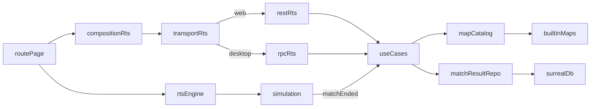

# Title

RTS Persistence, Application Services, Transport Adapters, And Route Integration Plan

## Goal

Define the persistence model, the application use cases, the thin transport adapters, and the desktop app routes that turn the engine, the runtime, the juice, and the AI into a playable experiment. Built-in skirmish maps load from backend-owned JSON; match results live in SurrealDB. The application layer merges built-in maps into one resolved catalog mirroring the chat and platformer patterns. Page models keep the desktop app thin.

## Scope

- Add a new rts subdomain in `packages/domain` that complements the shared types from `01-engine-isometric-and-domain.md`.
- Keep use cases, ports, and `MapCatalogService` in `packages/domain/src/application/rts`.
- Keep SurrealDB repositories for `rts_match_result` in `packages/domain/src/infrastructure/database/rts`.
- Keep backend-owned built-in skirmish map JSON in `packages/domain/src/infrastructure/rts/builtins`.
- Keep HTTP routes and Electrobun RPC handlers thin in `apps/desktop-app`.
- Surface one merged `ResolvedRtsMap[]` to the controller layer.
- Add the desktop route `apps/desktop-app/src/routes/experiments/rts/` with page model and composition.
- Add Playwright e2e tests under `apps/desktop-app/e2e/rts/`.

Out of scope for this step:

- Engine internals. Those belong in `01-engine-isometric-and-domain.md`.
- Runtime systems. Those belong in `02-rts-runtime-and-systems.md`.
- Visual and audio juice. That belongs in `03-visual-and-audio-juice.md`.
- AI behavior. That belongs in `04-ai-opponent.md`.
- A user map editor. The schema reserves a `rts_user_map` table for forward compatibility but the first cut does not implement it.

## Architecture

- `packages/domain/src/shared/rts`
  - Already owns `MapDefinition`, `MatchDefinition`, `MatchResult`, `Faction`, and validation helpers from `01-engine-isometric-and-domain.md`.
  - Add `ResolvedRtsMap` and `ListMatchResultsFilter` here for browser-safe service-facing DTOs.
- `packages/domain/src/application/rts`
  - Owns ports, use cases, and `MapCatalogService`.
  - Depends only on shared types and abstract ports.
- `packages/domain/src/infrastructure/database/rts`
  - Owns Surreal repository for `rts_match_result`. Owns mappers and id normalization local to repository code, following the todo reference pattern.
- `packages/domain/src/infrastructure/rts/builtins`
  - Owns raw JSON built-in skirmish maps and a loader that converts them into shared types.
- `apps/desktop-app/src/lib/adapters/rts`
  - Owns transport interfaces and runtime adapters mirroring `src/lib/adapters/chat` and `src/lib/adapters/platformer`.
- `apps/desktop-app/src/routes/api/rts`
  - Owns thin REST handlers that delegate to application services.
- `apps/desktop-app/src/routes/experiments/rts`
  - Owns the page shell, page model, and composition.

## Implementation Plan

1. Add the new rts-style subdomain folders.
   - `packages/domain/src/application/rts/`
     - `index.ts`
     - `ports.ts`
     - `MapCatalogService.ts`
     - `use-cases/`
       - `list-maps.ts`
       - `load-map.ts`
       - `start-match.ts`
       - `record-match-result.ts`
       - `list-match-results.ts`
   - `packages/domain/src/infrastructure/database/rts/`
     - `index.ts`
     - `SurrealMatchResultRepository.ts`
     - `mappers.ts`
   - `packages/domain/src/infrastructure/rts/builtins/`
     - `index.ts`
     - `loader.ts`
     - `tiny-skirmish.json`
     - `cliffside.json`
     - `dual-ramps.json`
   - Export new rts surfaces through `domain/shared`, `domain/application`, and `domain/infrastructure`.
2. Add shared service-facing DTOs in `packages/domain/src/shared/rts/`.
   - `ResolvedRtsMap`:
     - `id: string`
     - `metadata: { title: string; author: string; createdAt: string; updatedAt: string; source: 'builtin' | 'user' }`
     - `definition: MapDefinition`
     - `source: 'builtin' | 'user'`
     - `builtInId?: string`
     - `isEditable: boolean`
   - `ListMatchResultsFilter`:
     - `mapId?: string`
     - `winner?: string`
     - `since?: string` ISO
     - `until?: string` ISO
     - `limit?: number`
3. Define agent-style persistence rules.
   - Built-in skirmish maps are never stored in the DB.
   - The DB stores match results only in the first cut.
   - The schema reserves `rts_user_map` for forward compatibility but no use case writes to it in this experiment.
4. Define repository and service ports in `packages/domain/src/application/rts/ports.ts`.
   - `IRtsMapSource`:
     - `listMaps(): Promise<MapDefinition[]>`
     - `findMap(id: string): Promise<MapDefinition | undefined>`
   - `IMatchResultRepository`:
     - `record(result: MatchResult): Promise<MatchResultRecord>`
     - `list(filter?: ListMatchResultsFilter): Promise<MatchResultRecord[]>`
     - `findById(id: string): Promise<MatchResultRecord | undefined>`
   - `IMapValidator`:
     - `validate(map: MapDefinition): MapValidationResult`
5. Add `MapCatalogService` in the application layer.
   - Loads built-in maps via `IRtsMapSource`.
   - Resolves each into `ResolvedRtsMap`:
     - built-in entries get `source: 'builtin'`, `isEditable: false`, `builtInId` set
   - Order: declared order from the loader.
   - Provides:
     - `listResolved(): Promise<ResolvedRtsMap[]>` for the UI catalog
     - `loadResolved(id: string): Promise<ResolvedRtsMap | undefined>` for the runtime
6. Add explicit application use cases.
   - `ListMaps` returns `ResolvedRtsMap[]`.
   - `LoadMap` returns a single `ResolvedRtsMap` for the runtime.
   - `StartMatch` accepts:
     - `{ mapId, factions, rules }`
     - returns a `MatchDefinition` with a generated `id` and a derived `rngSeed` (from a server-time hash if not provided)
     - validates the requested factions against the map's `spawns`
   - `RecordMatchResult` accepts `MatchResult`, persists, returns the updated `MatchResultRecord`.
   - `ListMatchResults` accepts `ListMatchResultsFilter` and returns matching records.
7. Define record shapes in `packages/domain/src/infrastructure/database/rts/`.
   - `MatchResultRecord`:
     - `id: string`
     - `matchId: string`
     - `mapId: string`
     - `winner: string | 'draw'`
     - `durationMs: number`
     - `factions: { id: string; label: string; isPlayer: boolean; isAi: boolean; aiDifficulty?: 'easy' | 'normal' | 'hard' }[]`
     - `finishedAt: string`
   - Mappers normalize Surreal record ids to and from strings inside the repository.
8. Implement the Surreal repository.
   - `SurrealMatchResultRepository`:
     - persists in `rts_match_result` table
     - all timestamps stored as ISO strings
     - `list` supports the four filter dimensions in `ListMatchResultsFilter` and a default `limit` of `50`
     - `findById` returns the single record or `undefined`
   - Reuse the existing database client conventions from `packages/domain/src/infrastructure/database`.
9. Implement the built-in map loader.
   - `BuiltInMapSource` reads `*.json` map files from `packages/domain/src/infrastructure/rts/builtins/`.
   - Validates each map with `validateMapDefinition` at load time and throws on invalid bundled data.
   - Bundled maps are IP-safe per `02-rts-runtime-and-systems.md` (generic terrain, generic resource and unit names, original layouts).
   - First-cut bundle:
     - `tiny-skirmish` 32x32, two spawns, flat altitude, two mineral patches per side, used by e2e tests
     - `cliffside` 64x64, two spawns at different altitudes, mineral and gas
     - `dual-ramps` 64x64, four spawns (only two used in the first cut), demonstrates ramp pathing
10. Add transport interfaces in `apps/desktop-app/src/lib/adapters/rts/`.
    - `RtsTransport.ts`:
      - `listMaps(): Promise<ResolvedRtsMap[]>`
      - `loadMap(id: string): Promise<ResolvedRtsMap | undefined>`
      - `startMatch(input): Promise<MatchDefinition>`
      - `recordMatchResult(result: MatchResult): Promise<MatchResultRecord>`
      - `listMatchResults(filter?: ListMatchResultsFilter): Promise<MatchResultRecord[]>`
    - `web-rts-transport.ts`:
      - fetch adapter against `/api/rts/**`
    - `desktop-rts-transport.ts`:
      - Electrobun RPC adapter
    - `create-rts-transport.ts`:
      - runtime mode resolver mirroring `create-chat-transport.ts` and `create-platformer-transport.ts`
11. Add REST routes in `apps/desktop-app/src/routes/api/rts/`.
    - `GET /api/rts/maps` calls `ListMaps`.
    - `GET /api/rts/maps/[mapId]` calls `LoadMap`.
    - `POST /api/rts/matches` calls `StartMatch`.
    - `POST /api/rts/results` calls `RecordMatchResult`.
    - `GET /api/rts/results` calls `ListMatchResults` with query params parsed into `ListMatchResultsFilter`.
    - All handlers stay thin: parse body, delegate to use case, return JSON.
12. Extend the Electrobun RPC schema with the same operations so `dev:app` works without a server.
    - Match the same input and output shapes.
    - The desktop transport mirrors the web transport exactly so the page model stays transport-agnostic.
13. Add the experiment entry point and routes.
    - Add an RTS card on `apps/desktop-app/src/routes/+page.svelte` with a single Play link.
    - `apps/desktop-app/src/routes/experiments/rts/+page.svelte`:
      - layout-only
      - states:
        - match setup screen (`<MatchSetup>` from `ui/source`): map select, faction color, AI difficulty
        - in-match view: Pixi mount node, `<RtsHud>`, `<Minimap>`, `<CommandCard>`, `<ResourceBar>`, `<TechTreePanel>`
        - post-match: result panel with score and "play again"
      - wraps content with `<Tooltip.Provider>` from `ui/source` per `apps/desktop-app/AGENTS.md`
14. Implement the page model in `rts-page.svelte.ts`.
    - State:
      - `phase: 'setup' | 'loading' | 'inMatch' | 'postMatch'`
      - `catalog: ResolvedRtsMap[]`
      - `selectedMapId: string | null`
      - `playerFaction: Faction`
      - `aiDifficulty: 'easy' | 'normal' | 'hard'`
      - `match: MatchDefinition | null`
      - `engine: RtsEngine | null`
      - `hud: RtsHudModel`
      - `minimap: MinimapModel`
      - `result: MatchResult | null`
    - Lifecycle:
      - `bootstrap()` calls `transport.listMaps()` and seeds the catalog
      - `startMatch()`:
        - calls `transport.startMatch({ mapId, factions, rules })`
        - calls `transport.loadMap(selectedMapId)` for the `MapDefinition`
        - constructs the `RtsEngine` from `ui/source`
        - calls `engine.loadMatch(match, map)` and `engine.start()`
      - engine event bindings: `unitSelected`, `commandIssued`, `resourceChanged`, `visionChanged`, `techCompleted`, `unitKilled`, `buildingDestroyed`, `matchEnded`
      - `matchEnded` calls `transport.recordMatchResult(result)` and switches phase to `postMatch`
      - `playAgain()` resets to `setup`
      - `dispose()` stops and disposes the engine on route teardown
15. Compose the page in `rts-page.composition.ts`.
    - Build the transport via `create-rts-transport.ts`.
    - Instantiate `RtsPageModel` with the transport.
    - Return the model for the `+page.svelte` to bind.
16. Cover the desktop bundle.
    - Confirm `electrobun.config.ts` includes the new route assets via the existing static copy step.
    - The route must work under `dev:web`, `dev:app`, and packaged desktop builds.

## Tests

- Shared and application tests use `bun:test` and stay framework-free.
- Application-layer tests for `MapCatalogService` use:
  - in-memory fakes for `IRtsMapSource` (JSON-backed, allowed by the testing rule)
  - Cover:
    - returns built-in maps in declared order
    - sets `source: 'builtin'`, `isEditable: false`, and `builtInId` on every entry
    - `loadResolved` returns `undefined` for unknown ids
- Use-case tests follow the `TodoService` pattern in `packages/domain/src/application/todo/todo-service.test.ts`.
  - In-memory fakes for ports where the test focuses on application logic.
  - Cover:
    - `ListMaps` returns the catalog
    - `LoadMap` returns the right entry by id
    - `StartMatch` rejects when faction count exceeds the map's spawn count
    - `StartMatch` derives a deterministic `rngSeed` when none is provided
    - `RecordMatchResult` persists and returns the new record
    - `ListMatchResults` honors `mapId`, `winner`, `since`, `until`, and `limit`
- Repository tests follow the real-instance pattern in [SurrealTodoRepository.test.ts](/Users/walker/Documents/Dev/AI Maker Lab/ai-maker-lab/packages/domain/src/infrastructure/database/SurrealTodoRepository.test.ts).
  - `createDbConnection({ host: 'mem://', ... })` per test, unique namespace and database per test.
  - Cover:
    - record, list, and findById flow
    - filter behavior on `mapId`, `winner`, `since`, `until`, `limit`
    - id normalization rules
- Transport adapter tests stay thin.
  - Verify HTTP and RPC handlers delegate to application services.
  - Verify the catalog transport returns `ResolvedRtsMap[]` and never leaks raw Surreal record ids.
- Page model tests in `apps/desktop-app/src/routes/experiments/rts/`.
  - Use in-memory transport fakes that satisfy `RtsTransport`.
  - Cover:
    - `bootstrap()` populates the catalog and lands on the `setup` phase
    - `startMatch()` transitions through `loading` to `inMatch`
    - `matchEnded` posts a result and transitions to `postMatch`
    - `playAgain()` returns to `setup` and disposes the engine
- E2E tests in `apps/desktop-app/e2e/rts/`.
  - Use the existing `patchEmptyTableErrors` helper from `apps/desktop-app/e2e/helpers.ts` per the chat e2e pattern.
  - `rts.e2e.ts`:
    - load the experiments index, click Play
    - select `tiny-skirmish` and `easy` difficulty
    - start the match
    - select all units with `Ctrl+A` (or a faction-specific hotkey)
    - issue an attack-move toward the enemy spawn
    - assert that resources tick, that combat triggers (`unitDamaged` event surfaced via the page model), and that `matchEnded` fires within the test timeout
    - assert that a `MatchResultRecord` was posted (intercept the `POST /api/rts/results`)
  - Gate any live-network tests behind environment flags following the chat test pattern.

## Acceptance Criteria

- The plan keeps shared, application, infrastructure, and app-adapter responsibilities cleanly separated.
- The catalog is explicitly modeled as backend JSON built-in maps merged by an application service into `ResolvedRtsMap[]`.
- Match results are persisted in real `mem://` SurrealDB in repository tests.
- Application merge behavior is tested with in-memory fakes only at the JSON-backed boundary.
- Web and desktop handlers stay thin and return the unified `ResolvedRtsMap` shape.
- The desktop route renders setup, in-match, and post-match phases without route reloads.
- E2E tests cover the runtime flow end-to-end against `mem://` SurrealDB on the `tiny-skirmish` map.

## Verification

- `bun run dev:web`
- `bun run dev:app`
- `bun run dev:app:hmr`
- `bun run check:desktop-app`
- `bun run build:desktop-app`
- `bun run test:e2e`
- `bun run test:e2e:rts` (new script that filters Playwright to `e2e/rts/`)

## Dependencies

- `01-engine-isometric-and-domain.md` defines `MapDefinition`, `MatchDefinition`, `MatchResult`, `Faction`, and validation helpers.
- `02-rts-runtime-and-systems.md` defines the runtime events the page model surfaces and the order resolution layer.
- `03-visual-and-audio-juice.md` defines the juice that fires from runtime events; the page model neither drives nor configures it beyond mode toggles.
- `04-ai-opponent.md` defines the AI opponent the page model selects via difficulty.
- SurrealDB access reuses the existing database client conventions from `packages/domain/src/infrastructure/database`.
- Web transport aligns with the existing chat and platformer REST conventions.

## Risks / Notes

- Letting the built-in JSON shape leak across the transport boundary would be a regression. Only `ResolvedRtsMap` should cross the controller boundary.
- The Pixi `Application` must dispose on route teardown or the canvas leaks GPU resources between navigations.
- The page model must not import Pixi directly. Engine instantiation lives behind the `RtsEngine` surface from `ui/source`.
- Result records can grow over time. Consider a rolling cap (for example `1000` records) in a follow-up if storage becomes a concern.
- The `tiny-skirmish` map is the testing surface. Keep it small and deterministic so e2e runs stay fast and reliable.
