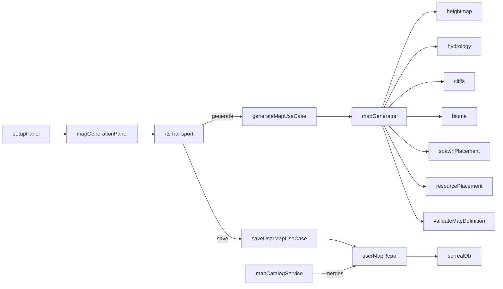

# Title

Procedural Map Generation, Tweak Surface, And User Map Persistence Plan

## Goal

Generate seeded `MapDefinition`s deterministically from a small parameter set so players can spin up novel skirmish maps that the engine, AI, and persistence layers from plans 01-05 can consume unchanged. The same generator powers the "Generated" tab on the match setup screen, supports a small set of post-generation tweaks (regenerate, swap spawns, rescale resources, flip symmetry), and exposes an explicit "Save to Library" action that writes to SurrealDB through the previously reserved `rts_user_map` table.

## Scope

- A pure, framework-free `MapGenerator` in `packages/domain/src/application/rts/generation/`.
- `MapGenerationParams` and archetype/symmetry vocabulary in `packages/domain/src/shared/rts/generation/`.
- A small offscreen 2D `MapPreviewRenderer` in `packages/ui/src/lib/rts/runtime/` (no Pixi, no engine startup).
- Tweak operations expressed as parameter mutations re-fed through the generator.
- Activation of the reserved `rts_user_map` table with `IUserMapRepository`, use cases, REST/RPC routes, and `MapCatalogService` merge.
- Match setup integration: `Built-in | Generated | Saved` tabs in the existing `<MatchSetup>` component.

Out of scope for this step:

- A full paint/edit editor. Use experiment 000's editor (`docs/experiment/000/03-map-editor.md`) as the reference if a hand-edit tool ever lands here.
- Multiplayer map exchange.
- Runtime mid-match map mutation.

## Architecture

- `packages/domain/src/shared/rts/generation/`
  - Owns `MapGenerationParams`, `MapArchetype`, `SymmetryMode`, `ResourceDensity`, `AltitudeRoughness`.
  - Stays browser-safe. No Pixi, no SurrealDB, no AI SDK.
- `packages/domain/src/shared/rts/rng.ts`
  - Owns `SeededRng`. Lifted from the AI plan so the generator and `AiController` share one implementation.
- `packages/domain/src/application/rts/generation/`
  - Owns `MapGenerator` (pure), `pipeline/` (heightmap, hydrology, cliffs, biome, spawns, resources), and `tweaks.ts` (parameter mutators).
  - Depends only on shared types, the validator, and `SeededRng`.
- `packages/domain/src/infrastructure/database/rts/`
  - Adds `SurrealUserMapRepository.ts` and a mapper for `rts_user_map`.
- `packages/domain/src/application/rts/`
  - Adds use cases `GenerateMap`, `SaveUserMap`, `ListUserMaps`, `LoadUserMap`, `DeleteUserMap`.
  - Extends `MapCatalogService.listResolved()` to merge user maps after built-ins.
- `apps/desktop-app/src/routes/api/rts/maps/` and the Electrobun RPC schema
  - Add `generate` and the user-map CRUD endpoints. Handlers stay thin.
- `apps/desktop-app/src/lib/adapters/rts/`
  - Extend `RtsTransport` with the new operations; both `web-rts-transport.ts` and `desktop-rts-transport.ts` mirror the surface.
- `packages/ui/src/lib/rts/runtime/`
  - Adds `MapGenerationPanel.svelte` (layout-only) plus `map-generation-panel.svelte.ts` (model holding params, tweak history, preview map, save state).
  - Adds `MapPreviewRenderer.ts` (2D canvas, paints terrain by altitude band + resources + spawn markers; no Pixi, no engine).
- `apps/desktop-app/src/routes/experiments/rts/rts-page.svelte.ts`
  - Extended with `setupTab: 'builtin' | 'generated' | 'saved'` and `generatedDraft: { params: MapGenerationParams; map: MapDefinition } | null`.

## Implementation Plan

1. Define `MapGenerationParams` in `packages/domain/src/shared/rts/generation/params.ts`.
   - `seed: number`
   - `archetype: MapArchetype`
   - `size: { cols: number; rows: number }`
   - `maxAltitude: number`
   - `factionCount: number`
   - `symmetry: SymmetryMode`
   - `resourceDensity: ResourceDensity` (`'sparse' | 'normal' | 'rich'`)
   - `altitudeRoughness: AltitudeRoughness` (`'flat' | 'rolling' | 'rugged'`)
   - `waterAmount: number` in `0..1`
   - `ramps: number` per altitude transition
   - `version: number` to allow forward-compatible re-generation
2. Define archetypes in `packages/domain/src/shared/rts/generation/archetypes.ts`.
   - `open-field`: low altitude variance, no water, even resource spread.
   - `cliffs-and-ramps`: high altitude variance, generous ramps, mineral lines on plateaus.
   - `island-shores`: water boundary, central landmass, gas pads on islets.
   - Each archetype is a record of default knob bias only; behavior lives in the pipeline.
3. Define symmetry modes in `packages/domain/src/shared/rts/generation/symmetry.ts`.
   - `mirrorH`, `mirrorV`, `rotational180`, `none` (only allowed when `factionCount === 1`).
   - Provide a pure `mirrorTile(tile, mode, size): TilePos` helper used by the spawn and resource passes.
4. Lift `SeededRng` to `packages/domain/src/shared/rts/rng.ts`.
   - 32-bit xorshift or PCG variant. Methods: `int(min, max)`, `float()`, `pick<T>(arr)`, `chance(p)`, `fork(label: string): SeededRng`.
   - `fork` derives a child stream by hashing `(parentSeed, label)` so independent pipeline passes do not entangle.
   - Document that `04-ai-opponent.md` should re-import from this shared location.
5. Implement the deterministic pipeline in `packages/domain/src/application/rts/generation/pipeline/`.
   - `heightmap.ts`
     - fBm value noise quantized into `0..maxAltitude`.
     - Octave count and persistence are derived from `altitudeRoughness`.
     - Returns `AltitudeMap` indexed `[row][col]`.
   - `hydrology.ts`
     - Maps the bottom altitude band to `water`, the next band to `shallow`, scaled by `waterAmount`.
     - Returns a `TerrainKind[][]` water mask layered into terrain by `biome.ts`.
   - `cliffs.ts`
     - Emits `cliff` on the lower side of any altitude delta with neighbor.
     - Demotes a `ramps`-many seeded subset of cliff cells back to walkable per altitude transition to guarantee passability between plateaus.
   - `biome.ts`
     - Bands altitude into `grass` (low), `dirt` (mid), `rock` (high). Water cells from `hydrology.ts` win over biome.
   - `spawns.ts`
     - Picks one large flat plateau as the seed spawn.
     - Mirrors per `symmetry` to derive the remaining spawns.
     - Rejects seeds whose mirrored spawns collide, share a cliff edge, or sit on `water`.
   - `resources.ts`
     - Places mineral lines and a single gas pad near each spawn.
     - Mirrors with `symmetry`.
     - Scales total `amount` by `resourceDensity`.
6. `MapGenerator.generate(params): GenerateResult` in `packages/domain/src/application/rts/generation/MapGenerator.ts`.
   - Pipeline order: `altitude -> hydrology -> cliffs -> biome -> spawns -> resources -> finalize`.
   - `finalize` builds the `MapDefinition`:
     - `metadata.source = 'generated'` (this widens the union from `'builtin' | 'user'` defined in plan 01).
     - `metadata.title` defaults to `${archetype}-${size.cols}x${size.rows}-${seed}`.
     - `metadata.author = 'generator'`.
     - `metadata.createdAt` and `metadata.updatedAt` are injected at the use-case boundary, not inside the generator, to keep the generator referentially transparent.
   - Run `validateMapDefinition`. On failure, fork the RNG with the label `'retry-N'`, bump the working seed, and retry up to `8` times. After exhausting retries, throw a typed `MapGenerationFailed { params, lastIssues }`.
   - Return `GenerateResult { map, params }` where `params` is the canonicalized input with the final accepted seed.
7. Define tweak operations in `packages/domain/src/application/rts/generation/tweaks.ts`.
   - Each tweak is a pure `(params: MapGenerationParams) => MapGenerationParams`.
   - `reseed(): MapGenerationParams` swaps `seed` for the next value from a wrapper RNG.
   - `swapSpawnPair(): MapGenerationParams` flips a deterministic `spawnOrderSalt` field used by `spawns.ts` to choose which mirrored spawn is faction `0` vs faction `1`.
   - `scaleResources(factor)` adjusts `resourceDensity` (clamped to the enum) and a continuous `resourceAmountMultiplier`.
   - `cycleArchetype()` advances `archetype` to the next enum entry.
   - `flipSymmetry()` toggles `symmetry` between the configured pair (`mirrorH <-> mirrorV` or `none` when `factionCount === 1`).
   - `setSize(cols, rows)` clamps to the archetype's minimum size guard and updates `size`.
   - All tweaks re-call `MapGenerator.generate`. The current draft is never mutated in place; the panel replaces its draft with the new `GenerateResult`.
8. Activate `rts_user_map`.
   - `UserMapRecord`:
     - `id: string`
     - `ownerId?: string` (reserved, single-user app for now)
     - `definition: MapDefinition`
     - `params: MapGenerationParams`
     - `metadata: { title: string; author: string; createdAt: string; updatedAt: string }`
   - `IUserMapRepository`:
     - `save(record: Omit<UserMapRecord, 'id' | 'metadata'> & { metadata: Omit<UserMapRecord['metadata'], 'createdAt' | 'updatedAt'> }): Promise<UserMapRecord>`
     - `list(): Promise<UserMapRecord[]>`
     - `findById(id: string): Promise<UserMapRecord | undefined>`
     - `remove(id: string): Promise<void>`
   - `SurrealUserMapRepository` mirrors id normalization rules from `SurrealMatchResultRepository` defined in plan 05.
9. Add use cases under `packages/domain/src/application/rts/use-cases/`.
   - `generate-map.ts` -> `GenerateMap(params): Promise<GenerateResult>` (no persistence).
   - `save-user-map.ts` -> `SaveUserMap({ map, params, title, author }): Promise<UserMapRecord>` injects `createdAt` / `updatedAt`.
   - `list-user-maps.ts` -> `ListUserMaps(): Promise<UserMapRecord[]>`.
   - `load-user-map.ts` -> `LoadUserMap(id): Promise<UserMapRecord | undefined>`.
   - `delete-user-map.ts` -> `DeleteUserMap(id): Promise<void>`.
   - Extend `MapCatalogService.listResolved()` to append user maps after built-ins:
     - `source: 'user'`
     - `isEditable: false` (no editor in this plan; only delete is supported)
     - `builtInId` is omitted for user maps
10. Extend `RtsTransport` in `apps/desktop-app/src/lib/adapters/rts/RtsTransport.ts`.
    - `generateMap(params: MapGenerationParams): Promise<GenerateResult>`
    - `saveUserMap(input: { map: MapDefinition; params: MapGenerationParams; title: string; author: string }): Promise<UserMapRecord>`
    - `listUserMaps(): Promise<UserMapRecord[]>`
    - `loadUserMap(id: string): Promise<UserMapRecord | undefined>`
    - `deleteUserMap(id: string): Promise<void>`
    - Both `web-rts-transport.ts` and `desktop-rts-transport.ts` mirror the surface; the page model stays transport-agnostic per plan 05.
11. Add REST routes under `apps/desktop-app/src/routes/api/rts/maps/`.
    - `POST /api/rts/maps/generate` -> `GenerateMap`
    - `POST /api/rts/maps/user` -> `SaveUserMap`
    - `GET /api/rts/maps/user` -> `ListUserMaps`
    - `GET /api/rts/maps/user/[id]` -> `LoadUserMap`
    - `DELETE /api/rts/maps/user/[id]` -> `DeleteUserMap`
    - Mirror the same operations on the Electrobun RPC schema so `dev:app` works without a server.
12. Build the UI surface.
    - `MapPreviewRenderer.ts`
      - Pure 2D canvas painter. Inputs: `MapDefinition`, target `HTMLCanvasElement`, optional `pixelsPerTile`.
      - Paints altitude shading first, terrain hue (water/shallow/grass/dirt/rock/cliff) second, resource dots third, spawn flags last.
      - No Pixi, no engine, no gameplay systems.
    - `map-generation-panel.svelte.ts`
      - State:
        - `params: MapGenerationParams`
        - `draft: GenerateResult | null`
        - `isGenerating: boolean`
        - `tweakHistory: MapGenerationParams[]`
        - `saveDialog: { open: boolean; title: string; author: string }`
      - Methods:
        - `generate()` calls `transport.generateMap(params)`.
        - `applyTweak(name)` runs the named tweak, then `generate()`.
        - `save()` calls `transport.saveUserMap(...)` and emits a `userMapSaved` event so the page model can refresh the catalog.
    - `MapGenerationPanel.svelte`
      - Layout-only.
      - Parameter controls (archetype select, size sliders, faction count, symmetry select, resource density, roughness, water).
      - Preview canvas bound to `MapPreviewRenderer`.
      - Tweak buttons (Reseed, Swap Spawns, Cycle Archetype, Flip Symmetry, Resource Density +/-).
      - "Save to Library" opens a dialog (`shadcn-svelte` primitives via `ui/source`) collecting title and author.
    - `rts-page.svelte.ts`
      - Adds `setupTab: 'builtin' | 'generated' | 'saved'`.
      - Adds `generatedDraft: GenerateResult | null` mirrored from the panel.
      - When `startMatch()` is invoked from the `generated` tab, it bypasses `transport.loadMap` and feeds `generatedDraft.map` to `engine.loadMatch`.
      - `userMapSaved` triggers a `bootstrap()` refresh so the new map appears in the `saved` tab without a page reload.
13. Determinism rules.
    - `MapGenerator.generate(params)` is referentially transparent over `params` (excluding the `createdAt` / `updatedAt` injection that happens above the generator).
    - All RNG flows through one `SeededRng` instance derived from `params.seed`. Pipeline passes use `rng.fork(label)` for independence.
    - The pipeline never reads wall-clock time, never calls `Math.random()`, and never reads from process env.

## Tests

- Generator determinism (`packages/domain/src/application/rts/generation/MapGenerator.test.ts`):
  - Same `params` produces a byte-identical `MapDefinition` (deep-equal on `terrain`, `altitude`, `resources`, `spawns`, `metadata` excluding `createdAt` / `updatedAt`).
- Generator validity:
  - 100 randomized seeds across all archetypes and symmetries pass `validateMapDefinition` without hitting the retry cap.
- Symmetry:
  - `mirrorH` produces terrain, altitude, resources, and spawns symmetric across the vertical axis.
  - `rotational180` produces a 180-degree rotation of terrain and spawns.
- Failure path:
  - Forcing impossible constraints (`factionCount > 4` on a `16x16` `cliffs-and-ramps` map) throws `MapGenerationFailed` after the retry cap.
- Tweaks (`packages/domain/src/application/rts/generation/tweaks.test.ts`):
  - `reseed` changes the map but leaves all other params untouched.
  - `swapSpawnPair` swaps the two spawn `tile` values and keeps the map valid.
  - `scaleResources(2)` doubles resource `amount` totals and stays inside `validateMapDefinition` resource rules.
  - `flipSymmetry` toggles between configured pair and rejects `none` when `factionCount > 1`.
- `SurrealUserMapRepository` against `mem://` (`packages/domain/src/infrastructure/database/rts/SurrealUserMapRepository.test.ts`):
  - `save`, `list`, `findById`, `remove` round-trip.
  - Id normalization mirrors `SurrealMatchResultRepository` rules.
- `MapCatalogService` (`packages/domain/src/application/rts/MapCatalogService.test.ts` extension):
  - Built-ins precede user maps in `listResolved()`.
  - User maps carry `source: 'user'` and `isEditable: false`.
- Page model (`apps/desktop-app/src/routes/experiments/rts/rts-page.svelte.test.ts` extension):
  - Switching `setupTab` to `'generated'` initializes the panel.
  - `startMatch` from the `generated` tab uses the current `generatedDraft.map` and does not call `transport.loadMap`.
  - `userMapSaved` triggers a catalog refresh.
- E2E (`apps/desktop-app/e2e/rts/map-generation.e2e.ts`):
  - Open setup, switch to the Generated tab, click Generate.
  - Click Save, fill the dialog, confirm.
  - Switch to the Saved tab and assert the new map appears.
  - Start the match and assert the engine mounts.
  - Use `patchEmptyTableErrors` from `apps/desktop-app/e2e/helpers.ts` per the e2e helper convention.

## Acceptance Criteria

- Same `MapGenerationParams` always yield the same `MapDefinition` modulo `createdAt` / `updatedAt`.
- The generator never emits a map that fails `validateMapDefinition`. The retry-and-throw discipline guarantees this at the use-case boundary.
- Tweaks are pure parameter mutations. No in-place map editing exists in this plan.
- User maps appear in the catalog after built-ins with `source: 'user'`.
- Saving a generated map is opt-in. Ephemeral generation requires no DB writes.
- The setup screen exposes Built-in, Generated, and Saved tabs without changing the existing built-in flow from plan 05.
- `packages/ui` does not import `packages/domain`. Generator types reach the UI through the local UI types mirror per plan 01's rule.

## Verification

- `bun run dev:web`
- `bun run dev:app`
- `bun run dev:app:hmr`
- `bun run check:desktop-app`
- `bun run build:desktop-app`
- `bun run test:e2e`
- `bun run test:e2e:rts`

## Dependencies

- Plan 01 widens `MapDefinition.metadata.source` to `'builtin' | 'user' | 'generated'` and mirrors the new generation types into `packages/ui/src/lib/rts/types.ts`.
- Plan 04 re-imports `SeededRng` from the new shared location at `packages/domain/src/shared/rts/rng.ts`.
- Plan 05 keeps the `rts_user_map` reservation; this plan implements the repository, use cases, REST routes, and Electrobun RPC handlers.
- `MapCatalogService`, `RtsTransport`, and the page model defined in plan 05 are extended, not replaced.

## Risks / Notes

- Symmetry plus altitude can deadlock spawn placement on small maps. The retry cap and a per-archetype "minimum size" guard handle this; document the guards in `archetypes.ts` so balance changes do not require code edits.
- The 2D preview must stay shading-only. Replicating gameplay systems in the preview would create a second source of truth for terrain rules and is the most likely future bug.
- User-map storage is unbounded. Cap the catalog (for example `200` records) in a follow-up if storage grows uncomfortable.
- The shared `SeededRng` move is a cross-cutting refactor of plan 04. Land it in the same PR so the AI does not regress to a duplicate RNG.
- Generator versioning matters once the pipeline changes. Bump `MapGenerationParams.version` whenever any pipeline pass changes its output for the same inputs, and store the version on `UserMapRecord.params` so future loads can re-validate or re-generate.
