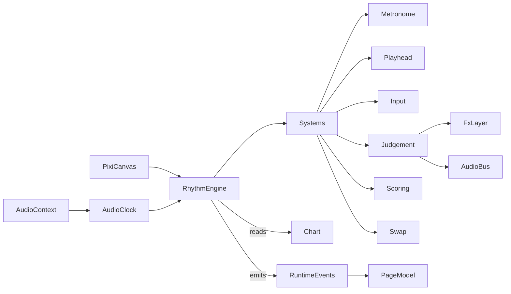

# Title

Rhythm Engine, AudioClock, And Shared Drum Domain Plan

## Goal

Establish the rendering runtime, the sample-accurate audio timing core, the engine surface, and the browser-safe shared domain types that every other plan in this experiment depends on. The engine must consume only shared domain types, expose a small deterministic interface so the desktop app and tests can drive it the same way, and stay framework-free so the notation pipeline, the rhythm runtime systems, the stage content, and route composition can each layer on top without leaking concerns.

## Scope

- Standardize on Pixi.js v8 as the renderer plus `@pixi/sound` for audio playback. Reserve `@pixi/filters` for hit-flash bloom only; no tilemap, particles, or heavy filters required for v1.
- Define a single sample-accurate `AudioClock` based on `AudioContext.currentTime` as the only source of "now" inside the engine.
- Define a thin `RhythmEngine` surface in `packages/ui/src/lib/rhythm/engine/` that the desktop app consumes through `ui/source`.
- Define ECS-lite primitives (`Entity`, `Component`, `System`) and a fixed-step simulation loop driven by the `AudioClock`, independent of Pixi's render ticker.
- Define browser-safe shared domain types under `packages/domain/src/shared/rhythm/`.
- Define the layered render container model that downstream plans bind to.

Out of scope for this step:

- The MusicXML/OSMD-to-texture pipeline and `MeasureCardRenderer`. Those belong in `02-notation-and-cards.md`.
- Metronome, playhead, input, judgement, scoring, swap, calibration, and adaptive difficulty systems. Those belong in `03-rhythm-runtime-and-input.md`.
- Stage and level content authoring, the `FillGenerator`, and the unlock model. Those belong in `04-stages-and-content.md`.
- SurrealDB persistence and route composition. Those belong in `05-persistence-and-route-integration.md`.

## Architecture

- `packages/domain/src/shared/rhythm`
  - Owns `Bpm`, `TimeSignature`, `Subdivision`, `Voice`, `BeatPosition`, `NoteGlyph`, `RestGlyph`, `NoteEvent`, `MeasureCard`, `Chart`, `SwapRule`, `JudgementWindow`, `JudgementKind`, `StarThresholds`, and validation helpers.
  - Stays browser-safe so the renderer, the runtime systems, the content authors, and Surreal mappers can all import the same types.
  - Must not import Pixi, SurrealDB, SvelteKit, or AI SDK.
- `packages/ui/src/lib/rhythm/engine`
  - Owns `RhythmEngine`, `AudioClock`, the fixed-step loop, and ECS-lite primitives.
  - Depends only on Pixi v8 packages, `@pixi/sound`, and shared structural types via the local UI types mirror in `packages/ui/src/lib/rhythm/types.ts`.
  - Must not depend on `packages/domain` directly. Domain types satisfy the local UI types structurally at the app boundary, mirroring the chat UI rule in `packages/ui/AGENTS.md`.
- `packages/ui/src/lib/rhythm/types.ts`
  - Mirrors the shared rhythm types as local UI types so `packages/ui` does not import `packages/domain`.
- `apps/desktop-app`
  - Consumes the engine and types only through `ui/source` and `domain/shared`. Never constructs Pixi objects or `AudioContext` directly in route files.

## Implementation Plan

1. Create the new shared rhythm subdomain in `packages/domain/src/shared/rhythm`.
   - Add `README.md` describing the boundary and browser-safe rule.
   - Add `index.ts` exports for time, voice, glyph, note, measure, chart, swap, judgement, and validation types.
2. Define time and metric primitives.
   - `Bpm` is a positive integer in `30..240`.
   - `TimeSignature { numerator: number; denominator: number }` fixed to `{ numerator: 4, denominator: 4 }` in v1; the type stays open for future stages.
   - `Subdivision`:
     - `quarter`
     - `eighth`
     - `sixteenth`
     - `triplet8` (eighth-note triplet)
   - `BeatPosition { num: number; den: number }` is a rational position inside a single bar in `[0, numerator)`. Helpers:
     - `beatToMs(pos: BeatPosition, bpm: Bpm, sig: TimeSignature): number`
     - `compareBeat(a: BeatPosition, b: BeatPosition): -1 | 0 | 1`
     - `addBeat(a: BeatPosition, b: BeatPosition): BeatPosition` (numeric reduction via `gcd`)
3. Define voice and glyph vocabularies.
   - `Voice`:
     - `hand` (single-input mode, used by Stage 1)
     - `snare`
     - `kick`
     - `hatRide` (hi-hat or ride, treated as one input slot)
   - `Dynamics`:
     - `normal`
     - `ghost` (Stage 3.3)
     - `accent` (reserved)
   - `NoteGlyph { kind: 'note'; subdivision: Subdivision; dynamics: Dynamics; beamId?: string }`
     - `beamId` lets adjacent eighths or sixteenths share a beam in the rendered notation.
   - `RestGlyph { kind: 'rest'; subdivision: Subdivision }`
4. Define `NoteEvent` and `MeasureCard`.
   - `NoteEvent { id: string; voice: Voice; beat: BeatPosition; glyph: NoteGlyph | RestGlyph }`
   - `MeasureCard { slot: 0 | 1 | 2 | 3; events: NoteEvent[] }`
     - The four card zones each represent one beat of a 4/4 bar; the events are positioned within `beat in [slot, slot + 1)`.
5. Define `Chart`, `SwapRule`, `JudgementWindow`, and `StarThresholds`.
   - `Chart`:
     - `id: string`
     - `title: string`
     - `bpm: Bpm`
     - `timeSignature: TimeSignature`
     - `subdivisionGrid: Subdivision` (the finest grid the chart commits to; informs OSMD beaming hints)
     - `voicesUsed: Voice[]`
     - `measures: MeasureCard[]` (length must be a multiple of 4 — one bar = 4 cards)
     - `swaps?: SwapRule[]`
   - `SwapRule`:
     - `afterBar: number` (1-indexed; the swap commits at the end of this bar)
     - `slot: 0 | 1 | 2 | 3`
     - `replacement: MeasureCard`
     - `animation: 'hand' | 'fade'`
   - `JudgementWindow`:
     - `perfectMs: number` (default `50`, per spec)
     - `goodMs: number` (default `100`, per spec)
   - `JudgementKind`:
     - `perfect`
     - `good`
     - `miss`
   - `StarThresholds { one: number; two: number; three: number }` accuracy percentages, default `{ one: 0.70, two: 0.85, three: 0.95 }`.
6. Add validation helpers in `packages/domain/src/shared/rhythm/validation.ts`.
   - `validateChart(chart: Chart): ChartValidationResult`
   - Rules:
     - `bpm` is in `30..240`
     - `timeSignature` is `{ 4, 4 }` in v1; reject other values with a `time-signature-unsupported` code
     - `measures.length % 4 === 0`
     - every `MeasureCard.slot` matches its position within the bar (`index % 4`)
     - every `NoteEvent.beat` lies in `[slot, slot + 1)` and reduces to a multiple of the chart's `subdivisionGrid`
     - per-slot per-voice events are strictly ordered by `beat`
     - all `voicesUsed` actually appear in `measures`
     - `swaps[].afterBar` is in `1..(measures.length / 4)` and `swaps[].slot` is in `0..3`
     - `swaps[].replacement.slot` matches `swap.slot`
   - Return shape:
     - `ChartValidationResult { ok: boolean; errors: ChartValidationIssue[]; warnings: ChartValidationIssue[] }`
     - `ChartValidationIssue { code: string; message: string; barIndex?: number; slot?: number; eventId?: string }`
7. Mirror shared rhythm types in `packages/ui/src/lib/rhythm/types.ts`.
   - Re-declare the structural shape used by the engine, the renderer, and HUD components so `packages/ui` stays free of `packages/domain` imports.
   - Document the structural-typing rule next to the file.
8. Define the `AudioClock` in `packages/ui/src/lib/rhythm/engine/AudioClock.ts`.
   - Constructor takes:
     - `audioContext: AudioContext`
     - `bpm: Bpm`
     - `timeSignature: TimeSignature`
     - `audioOffsetMs: number` (default `0`; populated by the calibration tool in plan 03)
   - Methods:
     - `start(atContextTimeSec?: number): void` snaps `t0 = audioContext.currentTime` (or the provided value) and begins.
     - `stop(): void`
     - `nowMs(): number` returns `(audioContext.currentTime - t0) * 1000 + audioOffsetMs`.
     - `currentBeat(): BeatPosition` derived from `nowMs()` and `bpm`.
     - `currentBar(): number` 0-indexed.
     - `slotProgress(): { slot: 0 | 1 | 2 | 3; t: number }` where `t` is the normalized 0..1 sweep across that slot, used by the playhead renderer.
     - `setBpm(bpm: Bpm): void` rebases `t0` so existing `currentBeat()` returns the same value, then continues at the new tempo.
     - `setOffsetMs(offsetMs: number): void`
     - `scheduleAt(beatAbs: { bar: number; beat: BeatPosition }): { contextTimeSec: number }` returns the absolute `AudioContext` time for a given bar and beat, suitable for `@pixi/sound` `play({ start: ... })` and `OscillatorNode.start()`.
   - Determinism:
     - Tests inject a `MockAudioContext` exposing `currentTime` as a writable number; no real audio runs in unit tests.
     - All time-based logic anywhere in the engine must read from `AudioClock.nowMs()` (or `currentBeat`/`currentBar`); never from `Date.now`, `performance.now`, `event.timeStamp`, or `requestAnimationFrame`.
9. Define the engine surface in `packages/ui/src/lib/rhythm/engine/RhythmEngine.ts`.
   - Constructor takes a config:
     - `mode: 'play' | 'preview'`
     - `assetBundleId: string`
     - `audioContextFactory?: () => AudioContext` (tests inject `MockAudioContext`)
     - `audioOffsetMs?: number`
   - Methods:
     - `mount(canvas: HTMLCanvasElement | HTMLDivElement): Promise<void>`
     - `loadChart(chart: Chart): void` validates with `validateChart` and throws on invalid input.
     - `setBpmOverride(bpm: Bpm): void` for adaptive difficulty.
     - `setInputBindings(bindings: InputBindings): void`
     - `start(): void`
     - `stop(): void`
     - `dispose(): void`
     - `tickFixed(stepMs: number): void` for tests; advances the `MockAudioContext.currentTime` and runs systems.
   - Events through a typed emitter:
     - `barComplete { barIndex: number }`
     - `noteHit { eventId: string; voice: Voice; judgement: JudgementKind; deltaMs: number; bar: number; slot: number }`
     - `noteMiss { eventId: string; voice: Voice; bar: number; slot: number; reason: 'late' | 'early' | 'restPlayed' | 'unplayed' }`
     - `swapApplied { afterBar: number; slot: number; animation: 'hand' | 'fade' }`
     - `chartComplete { perfects: number; goods: number; misses: number; maxCombo: number; accuracy: number; score: number }`
10. Define ECS-lite primitives inside the engine module.
    - `Entity` is an opaque numeric id.
    - `Component` is a plain data record stored in typed component pools keyed by entity id.
    - `System` exposes `update(world: EngineWorld, dt: number, clock: AudioClock): void`.
    - `EngineWorld` exposes:
      - `createEntity(): Entity`
      - `addComponent<T>(entity, kind, data): void`
      - `getComponent<T>(entity, kind): T | undefined`
      - `removeEntity(entity): void`
      - `query(kinds: ComponentKind[]): Iterable<Entity>`
    - Initial component kinds reserved for plan 03:
      - `CardSlot`, `Playhead`, `MetronomeTick`, `JudgementOverlay`, `Score`, `Combo`.
11. Pin the fixed-step simulation loop to the `AudioClock`.
    - The engine accumulates real-time `dt` from Pixi's ticker but advances simulation by reading `AudioClock.nowMs()`.
    - Systems run at a fixed step (default `1/60s`) using a max-step clamp of `8` per frame to avoid spiral-of-death after tab backgrounding.
    - Render runs every Pixi tick; visual lerping reads `slotProgress()` directly so the playhead never drifts from audio.
    - Tests can drive the loop deterministically by calling `tickFixed(stepMs)` without Pixi.
12. Render layers.
    - The engine creates and exposes a strict z-order of containers on the Pixi `Application.stage`:
      - `bgLayer` (wooden desk texture, vignette)
      - `cardLayer` (the four `MeasureCard` sprites for the active bar)
      - `playheadLayer` (single vertical sweep line)
      - `fxLayer` (hit-flash glows, miss crosses, broken-stick burst, swap-hand sprite)
      - `hudLayer` (metronome indicator, BPM readout, score, combo, accuracy bar — owned visually by Svelte components in plan 05 but mounted inside the same Pixi stage when running in `'play'` mode for clean stacking)
    - All transient FX nodes own a `dieAtMs: number` from `AudioClock.nowMs()` so cleanup is sample-accurate.
13. Asset loading.
    - `AssetBundle` definition lives in the engine module and references textures, audio, and bitmap fonts by id.
    - Initial bundle is the `default` rhythm bundle bundled with the experiment, containing:
      - `bg/wooden-desk.png`
      - `glyphs/hand.png` (the swap-hand overlay)
      - `glyphs/metronome-pendulum.png`
      - `sfx/click-hi.wav`, `sfx/click-lo.wav` (metronome)
      - `sfx/snare.wav`, `sfx/kick.wav`, `sfx/hat.wav`, `sfx/stick-on-table.wav`
      - `sfx/broken-stick.wav` (miss feedback)
      - `bgm/practice-room.ogg` (looping low-volume ambience; optional, off by default)
    - The engine resolves bundle ids through `Pixi.Assets` and `@pixi/sound`'s `Sound.from` so the runtime systems and the route share one cache.
    - All audio is CC0 or original; see IP guardrails in plan 04.
14. Input binding scaffolding.
    - `InputBindings` is the normalized binding map produced by the page model and pushed into the engine via `setInputBindings`.
    - `InputBindings { hand?: KeyBinding[]; snare?: KeyBinding[]; kick?: KeyBinding[]; hatRide?: KeyBinding[]; ghostSnare?: KeyBinding[] }` where `KeyBinding = { code: string }` (KeyboardEvent `code`, e.g., `'KeyJ'`).
    - The actual `InputSystem` and timestamping live in plan 03.

## Tests

- Pure shared-type tests in `packages/domain/src/shared/rhythm/`.
  - `validateChart` covers:
    - `bpm` out of range
    - non-4/4 time signature rejection
    - `measures.length % 4 !== 0`
    - mismatched `slot` index
    - `NoteEvent.beat` outside the slot's range
    - non-grid-aligned `beat` values
    - duplicate-time events on the same voice in the same slot
    - `swaps[].afterBar` out of range
    - `swaps[].replacement.slot` mismatch
  - `BeatPosition` helpers:
    - `beatToMs` round-trips against `addBeat` at multiple BPMs and subdivisions
    - `compareBeat` orders eighths, sixteenths, and triplets correctly
- Pure engine tests in `packages/ui/src/lib/rhythm/engine/`.
  - `AudioClock`:
    - `nowMs` advances linearly with `audioContext.currentTime`
    - `currentBeat` matches `beatToMs` inverse at multiple BPMs
    - `setBpm` preserves `currentBeat` continuity across the change
    - `setOffsetMs` shifts `nowMs` without changing `t0`
    - `scheduleAt` returns the correct absolute `AudioContext` time for arbitrary `(bar, beat)`
  - `EngineWorld` ECS:
    - component add and remove
    - query intersection
    - entity removal frees component slots
  - Fixed-step loop:
    - `tickFixed(stepMs)` advances state deterministically and emits `barComplete` on bar boundaries
    - oversized `dt` clamps to a max step count
    - render interpolation does not advance simulation state
- Use `bun:test` with a `MockAudioContext` (writable `currentTime`, no real audio nodes). No real Pixi `Application` required; mount tests run in plan 05's e2e layer.

## Acceptance Criteria

- `packages/domain/src/shared/rhythm` exports stable browser-safe types covering time, voice, glyph, note, measure, chart, swap, judgement, and validation.
- `AudioClock` is the single source of "now" inside the engine and is testable without a real `AudioContext`.
- `RhythmEngine` exposes a small framework-free surface, runs a deterministic fixed-step loop driven by the `AudioClock`, and provides the layered render containers downstream plans bind to.
- `packages/ui` does not import `packages/domain`. The engine consumes shared structural types via the local mirror.
- `validateChart` covers BPM, time signature, bar-length, slot alignment, grid alignment, ordering, and swap rules.

## Dependencies

- Planned package adoption:
  - `pixi.js` v8
  - `@pixi/sound`
  - `@pixi/filters` (reserved for hit-flash bloom only)
- New shared rhythm exports from `packages/domain/src/shared/index.ts`.
- New engine exports from `packages/ui/src/lib/index.ts`.
- Reference docs:
  - [Pixi.js v8 Guide](https://pixijs.com/8.x/guides)
  - [`@pixi/sound`](https://pixijs.io/sound/)
  - [Web Audio API: AudioContext.currentTime](https://developer.mozilla.org/en-US/docs/Web/API/BaseAudioContext/currentTime)

## Risks / Notes

- Audio drift is the #1 killer of rhythm games. Reading `AudioContext.currentTime` (not `performance.now` or `requestAnimationFrame`) is non-negotiable; the entire engine surface is shaped to enforce that rule.
- The fixed-step loop must read its time from the `AudioClock`, not from accumulated `dt`. Otherwise pause/resume, tab backgrounding, and BPM changes will silently desync visuals from audio.
- Keep the engine surface small. Resist adding judgement, scoring, or notation methods here. Those belong in plans 02 and 03.
- The local UI types mirror exists for a real reason: `packages/ui` cannot depend on `packages/domain` per `packages/ui/AGENTS.md`. Keep both shapes structurally compatible.
- IP guardrails (no real song titles, artists, or licensed soundfonts) apply across all five plans; the bundled SFX are CC0 or original.
