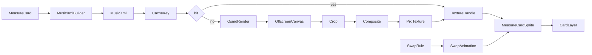

# Title

OpenSheetMusicDisplay To Pixi Texture Pipeline And MeasureCard Rendering Plan

## Goal

Define the rendering pipeline that turns a `MeasureCard` (one beat of a 4/4 bar) into a crisp Pixi sprite showing standard drum-kit notation, with deterministic caching, swap animation, and judgement overlay support. This is the visually defining and technically riskiest piece of the experiment, so it lives in its own plan with explicit voice-to-glyph mapping rules and a strict cache key.

## Scope

- Add `opensheetmusicdisplay` (OSMD) as a `packages/ui` dependency.
- Define a `MusicXmlBuilder` that converts a `MeasureCard` into a one-measure MusicXML fragment in the drum-kit clef.
- Define a `MeasureCardRenderer` that renders the MusicXML through OSMD into an offscreen canvas and uploads the result as a Pixi texture.
- Define a `MeasureCardSprite` composite that owns the background, the notation texture, the slot label, the hit-glow overlay, and the miss-cross overlay.
- Define the swap animation in both `'hand'` and `'fade'` modes.
- Define the texture cache and its invalidation rules.
- Define a small fallback sprite atlas for non-notation glyphs (metronome pendulum and the swap-hand overlay).

Out of scope for this step:

- The `AudioClock`, `RhythmEngine` surface, ECS-lite primitives, and shared domain types. Those belong in `01-engine-and-domain.md`.
- The systems that decide when to apply hit-glow, miss-cross, or swap. Those belong in `03-rhythm-runtime-and-input.md`.
- Stage and level content. That belongs in `04-stages-and-content.md`.
- Persistence and route integration. That belongs in `05-persistence-and-route-integration.md`.

## Architecture

- `packages/ui/src/lib/rhythm/notation`
  - Owns `MusicXmlBuilder`, `MeasureCardRenderer`, `MeasureCardSprite`, and the texture cache.
  - Depends only on Pixi v8, `opensheetmusicdisplay`, and the local UI types mirror in `packages/ui/src/lib/rhythm/types.ts`.
  - Must not import `packages/domain` directly, per the UI package rule.
- `packages/ui/src/lib/rhythm/glyphs`
  - Owns the small hand-drawn sprite atlas used for non-notation art (metronome pendulum, swap-hand overlay, broken-stick burst).
  - Glyphs are SVGs source-of-truth, exported to a single PNG atlas at build time.
- The rendering pipeline is fully synchronous from the engine's point of view: rendering happens during `loadChart` and on-demand right before a `SwapRule` fires, never inside the per-frame render tick.

## Implementation Plan

1. Add the OSMD dependency.
   - Add `opensheetmusicdisplay` to `packages/ui/package.json`.
   - Verify it tree-shakes acceptably; if not, lazy-load it the first time `MeasureCardRenderer.render` is called and gate behind a `notationReady` promise on the engine.
   - Document the version pin and SSR behavior (OSMD uses `document` and `canvas`, so it must only initialize in the browser; the renderer module guards with `typeof document !== 'undefined'` and throws a clear error in SSR).
2. Define `MusicXmlBuilder` in `packages/ui/src/lib/rhythm/notation/MusicXmlBuilder.ts`.
   - Input: `MeasureCard`, `Voice[]` (the `voicesUsed` from the chart), `TimeSignature`, and a `subdivisionGrid` for beaming hints.
   - Output: a MusicXML string for a single measure in 4/4 with one part using the `percussion` clef.
   - Voice-to-staff-position rules (single 5-line percussion staff):
     - `kick` → head below the staff (`<unpitched><display-step>F</display-step><display-octave>4</display-octave></unpitched>`), notehead `normal`, stem down
     - `snare` → head on the middle line (`C5`), notehead `normal`, stem up
     - `hatRide` → head above the staff (`G5`), notehead `x`, stem up
     - `hand` → single-line staff (override `<staff-details><staff-lines>1</staff-lines></staff-details>`), head on the line, notehead `normal`, stem up
     - `dynamics: 'ghost'` → notehead wrapped in parentheses via `<notehead parentheses="yes">normal</notehead>`
     - `dynamics: 'accent'` → adds `<articulations><accent/></articulations>` (reserved)
   - Subdivision-to-MusicXML duration mapping (with `<divisions>24</divisions>` so triplets stay integer):
     - `quarter` → `duration=24`, `<type>quarter</type>`
     - `eighth` → `duration=12`, `<type>eighth</type>`
     - `sixteenth` → `duration=6`, `<type>16th</type>`
     - `triplet8` → `duration=8`, `<type>eighth</type>` plus `<time-modification><actual-notes>3</actual-notes><normal-notes>2</normal-notes></time-modification>` and `<notations><tuplet type="start|stop"/></notations>` on the boundary notes
   - Beaming:
     - Adjacent eighths sharing a `beamId` get `<beam number="1">begin|continue|end</beam>` accordingly.
     - Adjacent sixteenths sharing a `beamId` get two beam levels (`<beam number="1">` and `<beam number="2">`).
     - Triplets within the same `beamId` are bracketed via the tuplet `<bracket>yes</bracket>` attribute.
   - Rests:
     - Emit `<note><rest/>...</note>` with the matching `<type>` and duration; never assign a voice to rests.
   - Single-card layout:
     - The builder emits exactly one `<measure number="1">`. The card represents one beat slot of a 4/4 bar visually, but OSMD needs a complete measure for sensible rendering, so the builder pads the unused beats with appropriately-typed rests and asks the renderer to crop to the slot's horizontal range during texture upload (see step 5).
   - Determinism:
     - The builder produces byte-identical MusicXML for a given `(MeasureCard, voicesUsed, timeSignature, subdivisionGrid)` tuple. The cache in step 6 depends on this.
3. Define rendering targets and sizing.
   - Card visual size: `cardWidthPx = 280`, `cardHeightPx = 200` at 1x DPR.
   - Render at `2x DPR` to an offscreen `<canvas>` sized `560x400`.
   - Padding: `12px` inside the card border; the OSMD render area is `cardWidthPx - 24` wide, `cardHeightPx - 36` tall (leaving room for the slot label).
4. Define `MeasureCardRenderer` in `packages/ui/src/lib/rhythm/notation/MeasureCardRenderer.ts`.
   - Constructor takes:
     - `cache: MeasureCardTextureCache`
     - `theme: 'classroom-light' | 'classroom-dark'` (default `'classroom-light'`: white card, black ink)
   - Method: `render(card: MeasureCard, ctx: RenderContext): Promise<MeasureCardTextureHandle>`
     - `RenderContext { voicesUsed: Voice[]; timeSignature: TimeSignature; subdivisionGrid: Subdivision }`
     - Steps:
       1. Build the MusicXML via `MusicXmlBuilder.build(card, ctx)`.
       2. Compute the cache key (step 6); short-circuit on hit.
       3. Create a detached `
` with a `<canvas>` and instantiate `OpenSheetMusicDisplay` with `{ drawingParameters: 'compacttight', backend: 'canvas', drawTitle: false, drawSubtitle: false, drawComposer: false, drawCredits: false, drawPartNames: false, drawMeasureNumbers: false }`.
       4. Call `osmd.load(xml)` then `osmd.render()`.
       5. Crop the rendered canvas to the slot's horizontal range (the slot index times one-quarter of the rendered measure width, plus a one-eighth-measure left bleed for stems/beams from the previous slot).
       6. Composite onto a card-sized `<canvas>` with the white background, thick black border (`3px`), rounded corners (`8px`), and slot label (`"1"`/`"2"`/`"3"`/`"4"` in a small monospace font, top-left).
       7. Upload via `PIXI.Texture.from(canvas)` and store the texture in the cache.
       8. Return a `MeasureCardTextureHandle { texture, key, dispose() }`.
   - Errors:
     - OSMD load failures throw a structured `MeasureCardRenderError` with the offending MusicXML attached for debugging.
     - SSR usage throws `MeasureCardRenderError('SSR_UNSUPPORTED')`.
   - Performance budgets:
     - Steady-state render budget: under `8ms` per card on a mid-tier laptop. Initial OSMD `import()` and instantiation are amortized over the first chart load; subsequent renders reuse a pooled OSMD instance per renderer.
5. Define the texture cache `MeasureCardTextureCache` in `packages/ui/src/lib/rhythm/notation/cache.ts`.
   - Cache key:
     - `hash(musicXml + theme + cardWidthPx + cardHeightPx + dpr)` using a fast non-crypto hash (`fnv1a` or `cyrb53`).
     - Including the canonicalized MusicXML in the key makes the cache content-addressed and immune to logically-equal-but-textually-different `MeasureCard` instances.
   - Storage:
     - LRU keyed by hash; default capacity `256` entries (the four active cards plus all swap targets and historical bars; well within 64 MB GPU at `560x400` RGBA).
   - Eviction:
     - On eviction, the cache calls `texture.destroy(true)` to free GPU memory.
   - Lifecycle:
     - `clear()` is called on `RhythmEngine.dispose()`.
     - `prewarm(cards: MeasureCard[], ctx)` is called by the engine during `loadChart` to render every measure (and every `SwapRule.replacement`) up-front. This eliminates jank on swap and on bar boundaries.
6. Define `MeasureCardSprite` in `packages/ui/src/lib/rhythm/notation/MeasureCardSprite.ts`.
   - Anatomy (Pixi `Container`):
     - `background` — `Graphics` rectangle drawn once with the desk-card style; never destroyed.
     - `notationSprite` — `Sprite` whose `texture` is set from a `MeasureCardTextureHandle`; texture swaps in place.
     - `hitGlow` — `Graphics` rounded rectangle painted in the slot color (`perfect` = `#3fbf6c`, `good` = `#f1c84a`); fades from `alpha 0.85` to `0` over `180ms`.
     - `missCross` — `Sprite` from the glyphs atlas (`miss-cross.png`); fades from `alpha 1.0` to `0` over `220ms` and tints the background red briefly.
     - `slotLabel` — `BitmapText` showing `'1' | '2' | '3' | '4'` in the top-left corner.
   - Methods:
     - `setTexture(handle: MeasureCardTextureHandle): void`
     - `flashHit(kind: 'perfect' | 'good', clock: AudioClock): void` — schedules the fade using `clock.nowMs()` so timing is sample-accurate.
     - `flashMiss(clock: AudioClock): void`
     - `dispose(): void`
   - Owns no state related to the chart; the engine's systems push texture handles and judgement events into the sprite.
7. Define the swap animation in `packages/ui/src/lib/rhythm/notation/SwapAnimation.ts`.
   - `'hand'` mode:
     - A `swap-hand` sprite from the glyphs atlas slides in from the top-right of the target `MeasureCardSprite` over `300ms`.
     - The `notationSprite.texture` cross-fades to the new handle over `200ms` while the hand covers the card.
     - The hand slides out over `200ms`; total animation `~500ms`.
     - The animation strictly straddles a bar boundary so the player never sees a swap mid-beat. The system in plan 03 schedules the swap to commit on the bar boundary; the animation begins in the last `500ms` of the previous bar so the new texture is in place by beat 1.
   - `'fade'` mode:
     - Cross-fade only, `200ms`, no hand sprite.
   - Both modes emit `swapApplied` through the engine's event bus once the new texture is fully visible.
   - The animation reads its timeline from `AudioClock.nowMs()`, not `requestAnimationFrame` deltas, so a tab backgrounding does not desync the swap.
8. Define the small glyph atlas in `packages/ui/src/lib/rhythm/glyphs/`.
   - Source SVGs:
     - `metronome-pendulum.svg`
     - `metronome-base.svg`
     - `swap-hand.svg`
     - `miss-cross.svg`
     - `broken-stick.svg`
   - Build step: a small `bun run build:rhythm-glyphs` script bundles the SVGs into `glyphs.png` and `glyphs.json` (Pixi spritesheet format) under `packages/ui/static/rhythm/`.
   - The atlas is resolved by id through `Pixi.Assets`.
   - All glyphs are original artwork or CC0; no licensed font glyphs.
9. Theme tokens.
   - `'classroom-light'` (default v1):
     - card background `#FFFFFF`, border `#1A1A1A`, ink `#000000`, slot label `#666666`, hit glow `#3FBF6C` / `#F1C84A`, miss tint `#D14B4B`
     - desk background `static/rhythm/wooden-desk.png`
   - `'classroom-dark'` (reserved):
     - card background `#1A1A1A`, ink `#F5F5F5`, etc.
   - Theme is a simple object passed to the renderer; OSMD's `EngravingRules` is configured to match (stem color, notehead color, etc.).
10. Wire-up to the engine.
    - On `RhythmEngine.loadChart(chart)`:
      - Construct one `MeasureCardSprite` per slot (four total) and add them to `cardLayer`.
      - Call `cache.prewarm(allCardsAndSwapReplacements, ctx)`.
      - Set initial textures for the first bar's four cards.
    - On the bar-boundary tick from the systems in plan 03:
      - Set textures for the next bar's four cards.
      - Run any pending `SwapAnimation` for the current bar transition.

## Tests

- Pure unit tests in `packages/ui/src/lib/rhythm/notation/` using `bun:test` with a JSDOM-backed `<canvas>` shim where needed.
- `MusicXmlBuilder`:
  - Single-voice quarter-only card produces the expected MusicXML structure.
  - Eighths sharing a `beamId` get correct `begin/continue/end` beam tags.
  - Sixteenths sharing a `beamId` get two beam levels.
  - Triplets emit `<time-modification>` and tuplet `start`/`stop` brackets.
  - `kick` head sits below the staff; `snare` on the middle line; `hatRide` above the staff with `x` notehead; `hand` mode emits the single-line staff override.
  - Ghost dynamics emit parentheses notehead.
  - Rests render with the correct `<type>` per subdivision.
  - Builder output is byte-identical for the same input.
- `MeasureCardTextureCache`:
  - Cache hits return the same `Texture` instance.
  - Cache misses produce distinct entries.
  - LRU eviction calls `texture.destroy(true)`.
  - `clear()` destroys all textures.
- `MeasureCardSprite`:
  - `flashHit('perfect', clock)` schedules the fade with `dieAtMs = clock.nowMs() + 180`.
  - `flashHit('good', clock)` uses the yellow tint.
  - `flashMiss(clock)` schedules a miss-cross fade and red background tint.
  - `setTexture` swaps the `notationSprite.texture` without recreating the sprite.
- `SwapAnimation`:
  - `'hand'` mode produces the expected timeline (hand-in `300ms`, cross-fade `200ms`, hand-out `200ms`) when driven by a `MockAudioContext`.
  - `'fade'` mode produces a simple `200ms` cross-fade.
  - Both modes emit `swapApplied` exactly once.
  - The animation timeline is reproducible across `tickFixed` step sizes.
- OSMD integration smoke test (kept behind a `RHYTHM_OSMD_SMOKE=1` env flag because it requires a real DOM):
  - Render a Stage 1.1 four-quarter card and assert the resulting canvas is non-blank by sampling pixels at expected positions.

## Acceptance Criteria

- A `MeasureCard` deterministically produces the same MusicXML and the same cached Pixi texture every time, regardless of object identity.
- The four card sprites render crisply at common DPRs (`1.0`, `1.5`, `2.0`, `3.0`) without the notation appearing fuzzy.
- The `'hand'` swap animation never reveals the new texture before the bar boundary; the `'fade'` swap completes within `200ms`.
- OSMD is only loaded in the browser; SSR-safe error is thrown otherwise.
- The texture cache caps at `256` entries and frees GPU memory on eviction and disposal.

## Dependencies

- New runtime dependency: `opensheetmusicdisplay`.
- Reuses the engine surface, ECS-lite primitives, and shared rhythm types from `01-engine-and-domain.md`.
- Reference docs:
  - [OpenSheetMusicDisplay](https://github.com/opensheetmusicdisplay/opensheetmusicdisplay)
  - [MusicXML Drum Notation](https://www.w3.org/2021/06/musicxml40/tutorial/percussion/)
  - [Pixi.js Textures](https://pixijs.com/8.x/guides/components/textures)

## Risks / Notes

- OSMD bundle size is non-trivial. Lazy-loading the OSMD module the first time `render` is called keeps the initial route payload small.
- OSMD's exact rendered widths can shift between versions; the cropping math is parameterized so a version bump is a one-config-file change rather than a rewrite.
- Cropping a one-measure render to a single beat is a deliberate v1 simplification: it lets us reuse OSMD's measure-aware beaming without authoring per-beat XML. If beam edges look wrong at slot boundaries, plan 04 documents an escape hatch (render four whole-bar textures and pick by slot) and the cache supports either strategy without API changes.
- The texture cache must run `texture.destroy(true)` on eviction; otherwise GPU memory grows monotonically.
- Notehead and beam color must come from the theme tokens, not OSMD defaults, or dark-mode renders will look wrong.
