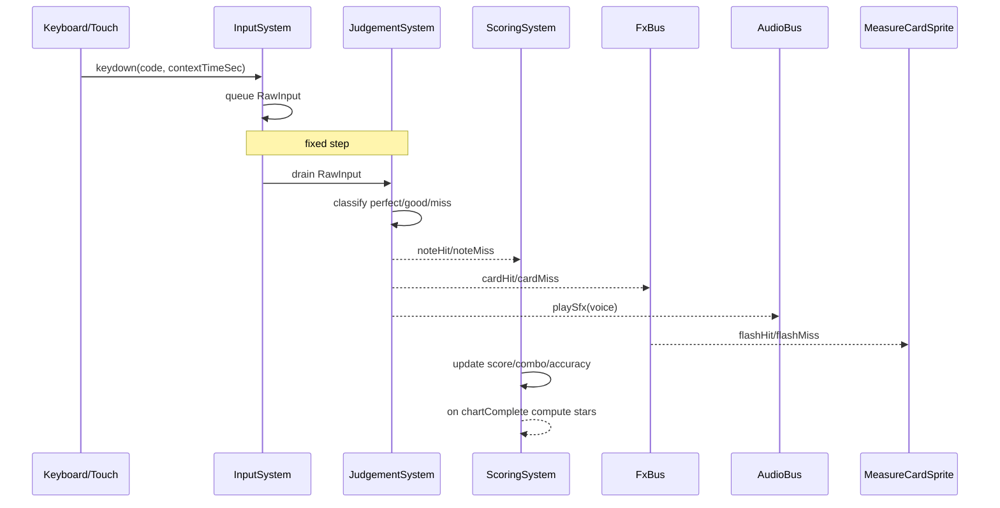

# Title

Rhythm Runtime, Input, Judgement, Scoring, Swap, Calibration, And Adaptive Difficulty Plan

## Goal

Define the runtime systems layered on top of the engine and notation pipeline that make the game playable: a metronome that ticks in audio time, a playhead that sweeps the four cards, an input system that timestamps keypresses against `AudioContext.currentTime`, a judgement system that classifies hits and misses with sample-accurate windows, a scoring system that emits the star rating, a swap system that mutates the chart on bar boundaries, a calibration tool that measures and stores the player's audio offset, and an adaptive-difficulty hook that slows BPM after repeated failures.

## Scope

- Define `MetronomeSystem`, `PlayheadSystem`, `InputSystem`, `JudgementSystem`, `ScoringSystem`, and `SwapSystem` as ECS-lite systems registered on the `RhythmEngine`.
- Define an `AudioBus` that wraps `@pixi/sound` for metronome clicks, drum SFX, and the broken-stick miss feedback, plus optional looping BGM.
- Define multi-input voice coordination so Stage 2+ levels work the same way Stage 1 does, just with three voices instead of one.
- Define the `CalibrationTool` mini-loop and where its output (`audioOffsetMs`) is read.
- Define `AdaptiveDifficulty` and its trigger conditions.
- Define an `FxBus` that the systems use to drive `MeasureCardSprite` overlays without coupling.

Out of scope for this step:

- The `AudioClock`, `RhythmEngine` surface, ECS-lite primitives, and shared domain types. Those belong in `01-engine-and-domain.md`.
- The notation pipeline. That belongs in `02-notation-and-cards.md`.
- Stage and level content, the `FillGenerator`, and unlock logic. Those belong in `04-stages-and-content.md`.
- SurrealDB persistence, REST/RPC, and route composition. Those belong in `05-persistence-and-route-integration.md`. The calibration tool's output is persisted by the page model in plan 05; the tool itself only emits the value.

## Architecture

- `packages/ui/src/lib/rhythm/systems`
  - Owns the six systems (`metronome`, `playhead`, `input`, `judgement`, `scoring`, `swap`) plus shared `AudioBus`, `FxBus`, and `CalibrationTool`.
  - Each system is a small class implementing the `System` interface from `01-engine-and-domain.md`: `update(world, dt, clock): void`.
  - Depends only on Pixi, `@pixi/sound`, the engine module, the notation module, and the local UI types mirror.
- The engine registers systems in a fixed order during `loadChart`:
  1. `InputSystem` (drains the input queue captured during the previous frame)
  2. `JudgementSystem` (classifies the drained inputs; also fires unplayed-note misses past the late window)
  3. `SwapSystem` (commits scheduled swaps on the bar boundary)
  4. `ScoringSystem` (consumes judgement events into score, combo, accuracy)
  5. `MetronomeSystem` (emits ticks for HUD and audio click)
  6. `PlayheadSystem` (updates the visual sweep position)
- `FxBus` is event-driven: judgement and swap systems emit; the renderer listens. This keeps systems decoupled from `MeasureCardSprite`.

## Implementation Plan

1. Define `AudioBus` in `packages/ui/src/lib/rhythm/systems/AudioBus.ts`.
   - Wraps `@pixi/sound`.
   - Methods:
     - `loadBundle(bundle: AssetBundle): Promise<void>`
     - `playSfx(id: SfxId, opts?: { volume?: number; pan?: number; atContextTimeSec?: number }): void`
     - `playMetronome(strong: boolean, atContextTimeSec: number): void` (uses `click-hi` for strong, `click-lo` for weak; scheduled via `@pixi/sound`'s `start` parameter)
     - `playBgm(id: BgmId, opts?: { volume?: number; loop?: boolean }): void`
     - `stopBgm(id: BgmId): void`
     - `setMasterVolume(v: 0..1): void`, `setSfxVolume(v: 0..1): void`, `setBgmVolume(v: 0..1): void`
   - `SfxId`: `'snare' | 'kick' | 'hat' | 'stick-on-table' | 'broken-stick' | 'click-hi' | 'click-lo'`.
   - `BgmId`: `'practice-room'`.
   - The bus reads `AudioClock.scheduleAt` to schedule SFX in audio time, never via `setTimeout`.
2. Define `FxBus` in `packages/ui/src/lib/rhythm/systems/FxBus.ts`.
   - Events:
     - `cardHit { slot: 0..3; kind: 'perfect' | 'good' }`
     - `cardMiss { slot: 0..3 }`
     - `swapBegin { slot: 0..3; animation: 'hand' | 'fade' }`
     - `swapCommit { slot: 0..3 }`
     - `metronomeTick { strong: boolean; bar: number; beat: number }`
     - `comboBroken { previousCombo: number }`
   - The renderer (the four `MeasureCardSprite`s and the metronome HUD overlay) subscribes once and reacts.
3. Define `MetronomeSystem`.
   - Tracks the next quarter-note tick using `AudioClock.scheduleAt`.
   - On every fixed step:
     - While `nextTickContextTimeSec <= clock.audioContext.currentTime + lookaheadSec` (default `lookaheadSec = 0.1`):
       - Schedule `audioBus.playMetronome(strong, nextTickContextTimeSec)` where `strong = (beat === 0)`.
       - Emit `fxBus.metronomeTick`.
       - Advance `nextTickContextTimeSec` by `60 / bpm`.
   - Tick scheduling uses a small look-ahead so audio playback is sample-accurate even with frame-rate jitter.
4. Define `PlayheadSystem`.
   - Reads `AudioClock.slotProgress()` once per frame.
   - Updates the `playheadLayer`'s vertical line to `x = slotX(slot) + slotWidth * t`.
   - Emits no events; purely visual.
   - On bar boundary (the frame where `slotProgress().slot` wraps from `3` back to `0`):
     - Calls `engine.advanceBar()` which:
       1. Loads the next four `MeasureCard`s into the four `MeasureCardSprite`s (textures already prewarmed by the cache from plan 02).
       2. Notifies `SwapSystem` so any pending swap commits its texture state.
       3. Emits `barComplete` on the engine event bus.
5. Define `InputSystem`.
   - Captures keyboard `keydown` events on the engine's mount node and pushes `RawInput` records into a queue:
     - `RawInput { code: string; contextTimeSec: number; voice: Voice | 'unknown'; modifier: 'normal' | 'ghost' }`
     - `contextTimeSec` is sampled from `engine.audioContext.currentTime` at the moment the listener fires; this is the most accurate timestamp available (`event.timeStamp` is intentionally ignored, per the engine's timing rule).
   - Touch handlers map on-screen drum-pad regions to the same voices and produce identical `RawInput` records.
   - Bindings come from `RhythmEngine.setInputBindings`. Default bindings:
     - `KeyJ` → `hatRide` (or `hand` when chart `voicesUsed === ['hand']`)
     - `KeyF` → `snare`
     - `Space` → `kick`
     - `KeyD` → `snare` with `modifier: 'ghost'` (Stage 3.3)
   - On each fixed step, the queue is drained and handed to `JudgementSystem`. Inputs that arrive between two fixed steps are still timestamped accurately because the timestamp is captured in the event listener, not when drained.
   - Auto-repeat suppression: a held key generates exactly one `RawInput` per physical press; `keyup` arms the next.
6. Define `JudgementSystem`.
   - For each drained `RawInput`:
     - Convert `contextTimeSec` to `nowMs` via `(contextTimeSec - audioClock.t0Sec) * 1000 + audioOffsetMs`.
     - If `input.voice === 'unknown'`, drop it silently.
     - Find the closest `NoteEvent` in the active chart that:
       - matches `input.voice` (and `dynamics === 'ghost'` if `input.modifier === 'ghost'`; else `dynamics !== 'ghost'`)
       - has not already been consumed
       - falls within the late window (`abs(eventMs - inputNowMs) <= goodMs`)
     - If the closest event is a `RestGlyph`, classify as `miss` with `reason: 'restPlayed'` and play `broken-stick` SFX.
     - Else compute `deltaMs = inputNowMs - eventMs`:
       - `abs(deltaMs) <= perfectMs` → `perfect`
       - `abs(deltaMs) <= goodMs` → `good`
       - else → `miss` with `reason: deltaMs < 0 ? 'early' : 'late'`
     - Mark the matched `NoteEvent` consumed.
     - Emit `noteHit` (or `noteMiss`) on the engine event bus and the matching `cardHit`/`cardMiss` on `FxBus`.
     - On hit, also call `audioBus.playSfx(voiceToSfx(voice))` immediately (no scheduling — the player just played it).
   - Past-window sweep:
     - Every fixed step, scan unconsumed `NoteEvent`s whose `eventMs + goodMs < nowMs` and classify them as `miss` with `reason: 'unplayed'`.
   - Multi-input coordination:
     - The above loop runs per voice independently because `RawInput.voice` partitions the search; pressing `Space` (kick) never matches a snare event.
     - Events on different voices at identical beats (e.g., kick + hat both on beat 1) are matched independently against their respective inputs and never collide.
   - Determinism:
     - All randomness is excluded from this system. With deterministic `RawInput` and a deterministic `AudioClock`, judgement output is fully reproducible — required for unit tests.
7. Define `ScoringSystem`.
   - Subscribes to `noteHit` and `noteMiss`.
   - Maintains in-memory state:
     - `score: number` (perfect=`100`, good=`50`, miss=`0`)
     - `combo: number`, `maxCombo: number` (broken on miss)
     - `perfects: number`, `goods: number`, `misses: number`, `totalNotes: number`
   - `accuracy` is computed lazily as `(perfects + 0.5 * goods) / totalNotes`.
   - On `chartComplete` (emitted by the engine when the final bar's last note is past its late window):
     - Compute `stars` from `accuracy` against the chart's `StarThresholds` (defaults `0.70 / 0.85 / 0.95`):
       - `accuracy >= three` → `3`
       - `accuracy >= two` → `2`
       - `accuracy >= one` → `1`
       - else → `0`
     - Emit `chartComplete` on the engine event bus with `{ score, accuracy, stars, perfects, goods, misses, maxCombo }`.
   - Combo break also emits `comboBroken` on `FxBus` so the HUD can flash.
8. Define `SwapSystem`.
   - On `loadChart`, builds a schedule from `chart.swaps` keyed by `afterBar`.
   - On every fixed step:
     - For each pending swap whose `(currentBar + 1) === afterBar + 1` and we are within the last `500ms` of `currentBar`:
       - Emit `swapBegin` on `FxBus` (the renderer in plan 02 starts the hand-slide or fade animation).
     - On bar boundary (notified by `PlayheadSystem.advanceBar`):
       - For each swap with `afterBar === currentBar`:
         - Mutate the active chart's `measures[(afterBar) * 4 + slot]` to the swap's `replacement` (in a copy-on-write clone of the chart so the original is preserved for analytics).
         - Emit `swapApplied` on the engine event bus.
         - Emit `swapCommit` on `FxBus`.
   - Pre-warm:
     - On `loadChart`, the system also asks the cache to render every `swap.replacement` so the first swap does not stall the renderer.
9. Define `CalibrationTool` in `packages/ui/src/lib/rhythm/systems/CalibrationTool.ts`.
   - Standalone class, not a system; the page model in plan 05 mounts it as a modal.
   - Purpose: measure the player's signed audio offset (positive means "player taps late relative to the click") and emit it.
   - Flow:
     - Plays a metronome click track at `90 BPM` for `12` beats (4 lead-in + 8 measured).
     - Captures `keypress` `contextTimeSec` for each measured beat.
     - Computes `deltaMs = inputNowMs - expectedClickNowMs` per beat; trims the largest absolute outlier; takes the mean.
     - Emits `calibrationComplete { offsetMs: number; samples: number[]; trimmedSampleCount: number }`.
   - Reuses `AudioClock` and `AudioBus` so the measurement is on the same timing path as the game.
   - Re-runnable; the page model decides when to write the result to persistence.
10. Define `AdaptiveDifficulty` in `packages/ui/src/lib/rhythm/systems/AdaptiveDifficulty.ts`.
    - Standalone helper, not a system; subscribed to `chartComplete` by the page model.
    - State (per session, in-memory):
      - `failuresByLevel: Map<LevelId, number>`
      - "failure" is defined as `stars === 0`.
    - Method: `onChartComplete(levelId, result): { suggestSlowDown: boolean; suggestedBpmFactor: number }`
      - On the third failure of the same level in the same session, suggests `suggestedBpmFactor = 0.85` (slow to 85% per spec).
      - Re-suggests on every subsequent failure until the player accepts.
    - The page model presents the prompt; if accepted, calls `engine.setBpmOverride(originalBpm * 0.85)` and resets the chart.
11. Voice → SFX mapping.
    - `kick` → `'kick'`
    - `snare` (normal) → `'snare'`
    - `snare` (ghost) → `'snare'` at `volume: 0.4`
    - `hatRide` → `'hat'`
    - `hand` → `'stick-on-table'`
12. HUD wiring (visuals owned by Svelte components in plan 05).
    - `MetronomeIndicator` subscribes to `metronomeTick` and animates a pendulum.
    - `ScoreHud` reads `score`, `combo`, `accuracy` from the page model (which mirrors `ScoringSystem` state via `engine.events.scoringChanged`).
    - `BpmReadout` shows the current BPM, including any adaptive override (visually marked).

## Tests

- Pure unit tests in `packages/ui/src/lib/rhythm/systems/` using `bun:test` and the `MockAudioContext` from `01-engine-and-domain.md`.
- `JudgementSystem`:
  - Boundary table — at the exact `±50ms`, `±51ms`, `±100ms`, `±101ms` deltas, verify `perfect`, `good`, `miss` classifications respectively.
  - Hit during a `RestGlyph` produces `miss` with `reason: 'restPlayed'`.
  - Unplayed note past `+goodMs` produces `miss` with `reason: 'unplayed'`.
  - Multi-input coordination: simultaneous `Space` (kick) and `KeyF` (snare) on a beat with both kick and snare events both score `perfect`.
  - Ghost-snare input matches only ghost-dynamic events; normal-snare input ignores them and vice versa.
  - Two consecutive inputs against a single event consume it once and then miss the second.
- `ScoringSystem`:
  - 100% perfects yields `accuracy === 1.0` and `stars === 3`.
  - Star thresholds at `0.70 / 0.85 / 0.95` (defaults) — verify the boundary cases produce `1`, `2`, `3` respectively.
  - Combo resets on miss; `maxCombo` retains the highest streak.
- `SwapSystem`:
  - A swap with `afterBar === 1` does not commit before bar 2 starts.
  - The replacement card is in place on the first frame of bar 2.
  - `'hand'` mode emits `swapBegin` no later than `500ms` before the bar boundary.
  - `'fade'` mode emits `swapBegin` no later than `200ms` before the bar boundary.
- `MetronomeSystem`:
  - Schedules ticks at exact `60 / bpm` intervals.
  - The first tick of every bar is `strong: true`.
- `PlayheadSystem`:
  - `slotProgress` advances linearly within a slot at constant BPM.
  - Bar boundary fires `barComplete` exactly once per loop.
- `CalibrationTool`:
  - With simulated inputs at consistent `+30ms` offsets, returns `offsetMs ≈ 30` after trimming.
  - Outlier trimming removes the single most-extreme sample.
- `AdaptiveDifficulty`:
  - First two `stars === 0` results: no suggestion.
  - Third such result: `suggestSlowDown === true` with `suggestedBpmFactor === 0.85`.
- `AudioBus`:
  - `playMetronome(strong, t)` invokes `@pixi/sound`'s `play` with `start` set to the converted offset (verify against a fake `Sound`).
- Use `bun:test` only; no real audio nodes anywhere in unit tests.

## Acceptance Criteria

- Judgement is sample-accurate: `JudgementSystem` consumes timestamps captured from `AudioContext.currentTime`, not `Date.now`, `performance.now`, `event.timeStamp`, or frame deltas.
- Multi-voice play (Stage 2+) works using the same systems as single-voice play; no Stage-specific code paths.
- The `'hand'` swap animation begins before the bar boundary so the new card is in place when beat 1 of the next bar arrives.
- The `CalibrationTool` produces a stable, signed `offsetMs` and the engine applies it through `AudioClock.setOffsetMs`.
- `AdaptiveDifficulty` triggers exactly once per third failure and the page model can act on the suggestion without coupling to the engine internals.

## Dependencies

- Engine surface, `AudioClock`, ECS-lite primitives, and shared rhythm types from `01-engine-and-domain.md`.
- `MeasureCardSprite` and the texture pipeline from `02-notation-and-cards.md`.
- `@pixi/sound` for SFX, BGM, and metronome scheduling.
- Reference docs:
  - [Web Audio API: Scheduling Audio with JavaScript](https://web.dev/articles/audio-scheduling)
  - [`@pixi/sound`](https://pixijs.io/sound/)
  - [Web Audio API: AudioContext.currentTime](https://developer.mozilla.org/en-US/docs/Web/API/BaseAudioContext/currentTime)

## Risks / Notes

- Bluetooth headphones can introduce hundreds of milliseconds of audio latency. The calibration tool is mandatory, not optional, and the page model in plan 05 will surface it on first run.
- Look-ahead scheduling (`100ms` default) is the standard Web Audio pattern for sub-frame accuracy. Lowering it improves responsiveness but risks underruns; raising it improves robustness but delays the first beat after `start()`.
- The fixed step order is deliberate: input drains before judgement before swap before scoring. Reordering will cause same-frame swap+input edge cases to misbehave.
- Auto-repeat suppression must use `keydown`/`keyup` (not the deprecated `event.repeat`) so it works under all platforms and IMEs.
- Touch latency on mobile browsers can exceed `40ms`; the calibration tool covers this transparently.
