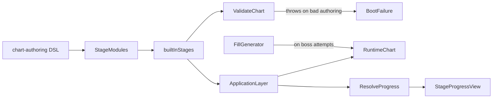

# Title

Stages, Levels, Chart Authoring, FillGenerator, And Unlock Model Plan

## Goal

Define the educational content for "Drum Rhythm Challenge" — four stages of progressive musical concepts (basics, basic rock, hip-hop and funk, advanced subdivisions), each with three teaching levels and one boss level. Define a small TypeScript chart-authoring DSL that produces validated `Chart` instances, a deterministic `FillGenerator` for boss levels, and the linear unlock model. All content is backend-owned JSON loaded by the application layer in plan 05; this plan defines the shape, the catalog, and the authoring tooling.

## Scope

- Define `BuiltInStage` and `BuiltInLevel` content shapes.
- Define a TypeScript chart-authoring DSL (`measure(slot).quarter(voice).rest()...`) that produces validated `Chart`s.
- Author the four stages and sixteen levels (4 per stage, including a boss).
- Define the `FillGenerator` for the rock and hip-hop boss levels.
- Define the linear unlock model and the `StageProgressView` projection.
- Define IP guardrails for stage and level naming.

Out of scope for this step:

- Engine, AudioClock, ECS-lite primitives, and shared domain types. Those belong in `01-engine-and-domain.md`.
- Notation pipeline. Belongs in `02-notation-and-cards.md`.
- Runtime systems. Belong in `03-rhythm-runtime-and-input.md`.
- SurrealDB tables, REST/RPC, and route composition. Belong in `05-persistence-and-route-integration.md`.

## Architecture

- `packages/domain/src/shared/rhythm/content`
  - Owns `BuiltInStage`, `BuiltInLevel`, `LevelLearningGoal`, `StageProgressView`, and `LevelProgressView` types. Browser-safe.
  - Stays free of any authoring helpers; those live in the infrastructure side because they touch authoring conveniences and seeds.
- `packages/domain/src/infrastructure/rhythm/builtins`
  - Owns the chart-authoring DSL (`measure`, `quarter`, `eighth`, etc.) plus the `FillGenerator` and the four stage JSON modules.
  - At build time, the TS modules are evaluated to produce concrete `BuiltInStage` values, which are then validated and exported as a frozen catalog.
- `apps/desktop-app/src/server/rhythm/content`
  - Owns nothing semantic; it is just the directory the application layer in plan 05 reads from.

## Implementation Plan

1. Define content shapes in `packages/domain/src/shared/rhythm/content`.
   - `LevelLearningGoal`:
     - `concept: 'quarter' | 'rest' | 'eighth' | 'sixteenth' | 'triplet8' | 'kickSnare' | 'eighthHat' | 'displacedKick' | 'sixteenthIntro' | 'boomBap' | 'ghostNotes' | 'shuffle' | 'halfTime' | 'mixed' | 'fillGenerator' | 'swap'`
     - `summary: string` (one sentence shown on level select)
     - `tips: string[]` (shown in the modal before play)
   - `BuiltInLevel`:
     - `id: string` e.g. `'stage-1-1'`
     - `stageId: string` e.g. `'stage-1-basics'`
     - `title: string` (no copyrighted song titles; see IP guardrails)
     - `bpm: Bpm`
     - `voicesUsed: Voice[]`
     - `chart: Chart`
     - `learningGoal: LevelLearningGoal`
     - `swaps?: SwapRule[]`
     - `fillRules?: FillGeneratorConfig` (boss levels only)
     - `kind: 'teaching' | 'challenge' | 'boss'`
     - `starThresholds?: StarThresholds` (overrides defaults; bosses use stricter `0.75 / 0.88 / 0.97`)
   - `BuiltInStage`:
     - `id: string` e.g. `'stage-1-basics'`
     - `title: string`
     - `theme: 'basics' | 'rock' | 'hip-hop' | 'advanced'`
     - `summary: string`
     - `levels: BuiltInLevel[]` (length 4: 3 teaching levels + 1 challenge or boss)
   - `StageProgressView` (composed by application layer in plan 05):
     - `stageId: string`
     - `levels: LevelProgressView[]`
     - `unlocked: boolean`
   - `LevelProgressView`:
     - `levelId: string`
     - `bestStars: 0 | 1 | 2 | 3`
     - `bestAccuracy: number`
     - `bestScore: number`
     - `attempts: number`
     - `unlocked: boolean`
2. Define the chart-authoring DSL in `packages/domain/src/infrastructure/rhythm/builtins/dsl.ts`.
   - The DSL is a small, type-safe builder that emits a validated `Chart`.
   - Top-level:
     - `chart({ id, title, bpm, voicesUsed, subdivisionGrid, swaps?, starThresholds? }, builder: (b: BarBuilder) => void): Chart`
     - The builder pushes bars; each bar contains four `MeasureCard`s (one per beat slot).
   - `BarBuilder`:
     - `bar(builder: (slot: SlotBuilders) => void): void`
     - `SlotBuilders { s1: SlotBuilder; s2: SlotBuilder; s3: SlotBuilder; s4: SlotBuilder }`
   - `SlotBuilder` (one slot = one beat):
     - `quarter(voice: Voice, opts?: { dynamics?: Dynamics }): SlotBuilder`
     - `rest(): SlotBuilder` (one quarter rest fills the slot)
     - `eighths(...voices: (Voice | 'rest')[]): SlotBuilder` (must be exactly 2 entries; `'rest'` produces an eighth rest)
     - `sixteenths(...voices: (Voice | 'rest')[]): SlotBuilder` (must be exactly 4 entries)
     - `triplets8(...voices: (Voice | 'rest')[]): SlotBuilder` (must be exactly 3 entries)
     - `combo(builder: (c: ComboSlotBuilder) => void): SlotBuilder` for multi-voice patterns within a single slot (e.g., kick on the down-beat plus a hi-hat 8th-pair on top)
   - `ComboSlotBuilder`:
     - `at(beatFraction: BeatPosition, voice: Voice, glyph: NoteGlyph | RestGlyph): ComboSlotBuilder`
     - Used for the rare cases the linear DSL cannot express compactly.
   - The DSL automatically:
     - assigns unique `NoteEvent.id`s of the form `'b{barIndex}-s{slot}-{seq}'`
     - groups same-subdivision adjacent notes into one `beamId` per slot per voice
     - validates the produced `Chart` via `validateChart` and throws on error with a precise location
   - Tests pin the DSL output for representative levels so future refactors cannot silently change content.
3. Define the `FillGenerator` in `packages/domain/src/infrastructure/rhythm/builtins/FillGenerator.ts`.
   - Purpose: produce a fresh-but-fair last-bar drum fill for the rock and hip-hop boss levels, deterministic given a seed.
   - `FillGeneratorConfig`:
     - `palette: 'rock' | 'hip-hop'`
     - `seed: number` (the page model passes a per-attempt seed; tests use `1` for reproducibility)
     - `replaceBarIndex: number` (which bar of the chart to replace; typically the last)
   - `FillGenerator.generate(config): { measures: MeasureCard[] }` returns four `MeasureCard`s (one bar) that are all `voicesUsed`-compatible with the boss chart.
   - Implementation:
     - `SeededRng` (shared with future RTS plans; reuse `packages/domain/src/shared/rng.ts` if it already exists, otherwise add it) using a small mulberry32 implementation.
     - Curated fill libraries:
       - `rock`: 8 hand-authored 1-bar fills using `kick`, `snare`, `hatRide` mixing eighths and sixteenths.
       - `hip-hop`: 8 hand-authored 1-bar fills using `kick`, `snare` (incl. ghost), `hatRide` mixing sixteenths and rests.
     - The generator picks one fill via the seed, optionally rotates the order of two interior beats (also seeded) for additional variety, and returns the result.
   - Determinism:
     - For a given `(palette, seed, replaceBarIndex)` the output is byte-identical.
     - Tests cover seed `1` against a recorded snapshot.
4. Author Stage 1 — Basics (`packages/domain/src/infrastructure/rhythm/builtins/stage-1-basics.ts`).
   - `voicesUsed: ['hand']` for all levels (single-input mode per the spec).
   - Levels:
     - `stage-1-1` "Steady Pulse" — 4 bars, every slot is `hand` quarter. `bpm: 70`.
     - `stage-1-2` "Mind the Gap" — 4 bars, pattern `quarter / quarter / rest / quarter`. `bpm: 70`.
     - `stage-1-3` "Eight Is Enough" — 4 bars, every slot is `eighths(hand, hand)`. `bpm: 80`.
     - `stage-1-4` "Card Shuffle" (challenge level) — 8 bars, every slot is `hand` quarter, with two `SwapRule`s scheduled `afterBar: 2` and `afterBar: 4`. Each swap replaces slot `3` (the third beat) with a `quarter rest`, animation `'hand'`. After bar 6, the chart restores via a third swap setting slot `3` back to `hand` quarter. `bpm: 80`.
5. Author Stage 2 — Basic Rock (`stage-2-rock.ts`).
   - `voicesUsed: ['kick', 'snare', 'hatRide']`.
   - Levels:
     - `stage-2-1` "Anthem Beat" — 8 bars, kick on slot 1 and slot 3, snare on slot 2 and slot 4. `bpm: 90`.
     - `stage-2-2` "Eighth Pulse" — 8 bars, the same kick/snare pattern with `eighths(hatRide, hatRide)` in every slot. `bpm: 95`.
     - `stage-2-3` "Pushed Two" — 8 bars, kick on slot 1 and on the "and" of slot 2 (eighth offset), snare still on slots 2 and 4, `eighths(hatRide, hatRide)` throughout. `bpm: 95`.
     - `stage-2-4` "Boss: Last Bar Free" (boss) — 8 bars total. The first 7 bars are the `stage-2-2` pattern. The 8th bar is replaced at runtime by a `FillGenerator({ palette: 'rock', seed, replaceBarIndex: 7 })` fill, scheduled as a single `SwapRule` per slot of bar 8 with animation `'fade'`. `bpm: 100`. `starThresholds: { one: 0.75, two: 0.88, three: 0.97 }`.
6. Author Stage 3 — Hip-Hop & Funk (`stage-3-hip-hop.ts`).
   - `voicesUsed: ['kick', 'snare', 'hatRide']` plus ghost dynamics for snare.
   - Levels:
     - `stage-3-1` "Sixteenth Lab" — 8 bars, every slot is `sixteenths(hatRide, hatRide, hatRide, hatRide)`, kick on slot 1, snare on slot 3. `bpm: 80`.
     - `stage-3-2` "Boom-Bap" — 8 bars, kick on slot 1, snare on slot 3, kick again on the "and" of slot 3 (eighth offset), `eighths(hatRide, hatRide)` throughout. `bpm: 85`.
     - `stage-3-3` "Whisper Snare" — 8 bars, `boom-bap` base with extra ghost snares on selected sixteenth positions. Tests the `KeyD` ghost-snare binding. `bpm: 80`.
     - `stage-3-4` "Boss: Sixteenth Storm" (boss) — 8 bars. First 7 bars alternate between dense `sixteenths` clusters (kick + ghost snare + hat) and bars heavy with `rest()` slots, forcing the player to lock onto syncopation. Bar 8 is replaced by `FillGenerator({ palette: 'hip-hop', seed, replaceBarIndex: 7 })`. `bpm: 90`. Strict star thresholds.
7. Author Stage 4 — Advanced Subdivisions (`stage-4-advanced.ts`).
   - `voicesUsed: ['kick', 'snare', 'hatRide']`.
   - Levels:
     - `stage-4-1` "Triplet Walk" — 8 bars, every slot is `triplets8(hatRide, hatRide, hatRide)`, kick on slot 1, snare on slot 3. `bpm: 70`. Introduces `subdivision: 'triplet8'`.
     - `stage-4-2` "Shuffle" — 8 bars, every slot is `triplets8(hatRide, 'rest', hatRide)` plus standard kick/snare. `bpm: 75`.
     - `stage-4-3` "Half-Time" — 8 bars, kick on slot 1, snare on slot 3 only, `eighths(hatRide, hatRide)` throughout, slow groove feel. `bpm: 75`.
     - `stage-4-4` "Ultimate Sight-Read" — 16 bars; bars 1–4 are quarters, bars 5–8 are eighths, bars 9–12 are sixteenths, bars 13–16 are triplets. After every 4 bars a `SwapRule` shuffles two slots of the next bar to test sight-reading. `bpm: 90`. `starThresholds: { one: 0.75, two: 0.88, three: 0.97 }`.
8. Define the catalog index in `packages/domain/src/infrastructure/rhythm/builtins/index.ts`.
   - Exports `builtInStages: BuiltInStage[]` in canonical order: stage 1, 2, 3, 4.
   - Each stage's `levels` is in `1.1, 1.2, 1.3, 1.4` order.
   - On import, every `Chart` is validated via `validateChart` and the module throws with a precise error location on any failure. This catches authoring mistakes at boot.
9. Define the unlock model.
   - Linear, simple, predictable:
     - `stage-1-1` is always unlocked.
     - For `stage-N-K` (where `K > 1`), unlocked when `stage-N-(K-1).bestStars >= 1`.
     - `stage-(N+1)-1` is unlocked when the boss `stage-N-4.bestStars >= 1`.
   - Resolution helpers in `packages/domain/src/application/rhythm/progression.ts`:
     - `resolveProgress(stages, levelProgressById): StageProgressView[]`
     - Pure function. Tested with table-driven cases.
   - The page model in plan 05 calls `resolveProgress` whenever level progress changes.
10. Define IP guardrails for content.
    - No real song titles, artist names, album names, or band names anywhere in level titles, summaries, or tips.
    - "Anthem Beat", "Boom-Bap", "Shuffle", and "Half-Time" are generic musical terms, not titles.
    - Tip text refers to musical concepts only ("alternate sticking", "internal pulse", "anticipated kick"), never to specific recordings or artists.
    - All bundled SFX in plan 01 are CC0 or original; this plan re-asserts the rule for completeness.
11. Authoring conventions.
    - One TS module per stage, all DSL-driven.
    - Adding a new stage requires:
      1. Add a new `stage-N-*.ts` module that exports a `BuiltInStage`.
      2. Append it to the catalog index.
      3. Add a snapshot test against its DSL output.
    - Removing a stage is non-trivial because progress records reference `stageId`/`levelId`; plan 05 documents migration.

## Tests

- Pure unit tests in `packages/domain/src/infrastructure/rhythm/builtins/` using `bun:test`.
- DSL:
  - `quarter`, `rest`, `eighths`, `sixteenths`, `triplets8`, and `combo` produce expected `NoteEvent`s with correct beats, voices, and beam ids.
  - The DSL throws when `eighths` receives anything other than 2 args, `sixteenths` not 4, `triplets8` not 3.
  - The DSL throws when an authored slot's events would fall outside `[slot, slot + 1)`.
  - The DSL invokes `validateChart` and surfaces validation errors with the offending bar/slot/event id.
- Stage authoring snapshots:
  - Stage 1 "Steady Pulse" — snapshot the produced `Chart` JSON (frozen golden file).
  - Stage 2 "Anthem Beat" — snapshot.
  - Stage 3 "Boom-Bap" — snapshot.
  - Stage 4 "Triplet Walk" — snapshot.
  - The snapshots prevent silent content drift across DSL refactors.
- `FillGenerator`:
  - `generate({ palette: 'rock', seed: 1, replaceBarIndex: 7 })` matches a recorded snapshot.
  - `generate({ palette: 'hip-hop', seed: 1, replaceBarIndex: 7 })` matches a recorded snapshot.
  - Different seeds produce different fills (fuzz across 100 seeds and assert variety > 50% of the palette).
  - Generated fills `voicesUsed`-respect the boss chart and pass `validateChart` when injected.
- Progression:
  - `resolveProgress` table-driven cases:
    - empty progress → only `stage-1-1` unlocked
    - `stage-1-1.bestStars === 1` → `stage-1-2` unlocked, rest still locked
    - `stage-1-4.bestStars === 1` → `stage-2-1` unlocked
    - linear chain through all four stages
- Catalog import smoke:
  - Importing the catalog from a fresh process succeeds (no `validateChart` failures on shipped content).

## Acceptance Criteria

- The four stages are authored entirely through the DSL; no hand-rolled `NoteEvent` literals in stage modules.
- Every shipped `BuiltInLevel` passes `validateChart` at module import time.
- The `FillGenerator` is deterministic per `(palette, seed, replaceBarIndex)` and never produces an invalid chart.
- Snapshot tests pin the DSL output for the four representative levels.
- Linear unlock progression is computed by a pure function with full test coverage.
- No content names or tips reference real songs, artists, or franchises.

## Dependencies

- Shared rhythm types from `01-engine-and-domain.md` (`Chart`, `MeasureCard`, `NoteEvent`, `SwapRule`, `Voice`, `Subdivision`, `Bpm`, `StarThresholds`, `validateChart`).
- The `'hand'` and `'fade'` swap modes from `02-notation-and-cards.md` and the runtime semantics from `03-rhythm-runtime-and-input.md`.
- A `SeededRng` helper (`mulberry32`); add as a small shared utility under `packages/domain/src/shared/rng.ts` if not already present.
- Application layer in `05-persistence-and-route-integration.md` for `resolveProgress` consumption.

## Risks / Notes

- The single-staff `'hand'` voice in Stage 1 is a deliberately gentle introduction; misalignment between the `'hand'`-mode staff override and the multi-voice staff in Stages 2+ is a real risk for the renderer in plan 02. The voice-to-glyph rules are the contract between the two plans.
- Boss levels intentionally use `'fade'` for the swapped final bar to avoid the hand sprite occluding cards while the player is still parsing them. The `'hand'` animation is reserved for teaching levels where the swap *itself* is the lesson.
- Stage 4 Sight-Read swaps require the cache pre-warm in plan 02 to render every potential replacement up-front; otherwise the first sight-read swap would stall.
- Snapshot tests are valuable here; rhythm content is easy to break by accident in DSL refactors and the snapshots make those changes loud.
- Difficulty curve is conservative on purpose. The spec calls out adaptive difficulty (plan 03) for players who hit a wall, so the authored content can stay challenging without alienating beginners.
