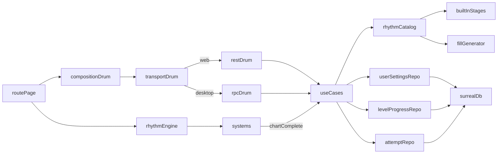

# Title

Rhythm Persistence, Application Services, Transport Adapters, And Route Integration Plan

## Goal

Define the persistence model, the application use cases, the thin transport adapters, and the desktop app route that turn the engine, the notation pipeline, the runtime systems, and the stage content into a playable experiment. Built-in stages and levels load from backend-owned TypeScript modules; user settings (including the calibration offset), per-level progress, and per-attempt results live in SurrealDB. The application layer composes a single `StageProgressView[]` for the UI mirroring the chat, platformer, and RTS patterns. Page models keep the desktop app thin.

## Scope

- Add a new rhythm subdomain in `packages/domain` that complements the shared types from `01-engine-and-domain.md` and the content from `04-stages-and-content.md`.
- Keep use cases, ports, and `RhythmCatalogService` in `packages/domain/src/application/rhythm`.
- Keep SurrealDB repositories for `rhythm_user_settings`, `rhythm_level_progress`, and `rhythm_attempt` in `packages/domain/src/infrastructure/database/rhythm`.
- Keep HTTP routes and Electrobun RPC handlers thin in `apps/desktop-app`.
- Surface `StageProgressView[]` and a single `BuiltInLevel` shape to the controller layer.
- Add the desktop route `apps/desktop-app/src/routes/experiments/drum/` with page model and composition.
- Add Playwright e2e tests under `apps/desktop-app/e2e/drum/`.

Out of scope for this step:

- Engine internals. Belong in `01-engine-and-domain.md`.
- Notation pipeline. Belongs in `02-notation-and-cards.md`.
- Runtime systems and the calibration tool implementation. Belong in `03-rhythm-runtime-and-input.md`.
- Stage content and the chart-authoring DSL. Belong in `04-stages-and-content.md`.
- A custom beat maker, endless mode, and MIDI input. Documented as Future Expansion only.

## Architecture

- `packages/domain/src/shared/rhythm`
  - Already owns `Chart`, `MeasureCard`, `NoteEvent`, `SwapRule`, `Voice`, `Subdivision`, `Bpm`, `JudgementWindow`, `JudgementKind`, `StarThresholds`, and validation helpers from `01-engine-and-domain.md`.
  - Already owns `BuiltInStage`, `BuiltInLevel`, `LevelLearningGoal`, `StageProgressView`, and `LevelProgressView` from `04-stages-and-content.md`.
  - Add `LevelAttemptInput`, `LevelAttemptRecord`, `UserSettings`, and `ListAttemptsFilter` here as browser-safe service-facing DTOs.
- `packages/domain/src/application/rhythm`
  - Owns ports, use cases, `RhythmCatalogService`, and `progression.resolveProgress`.
  - Depends only on shared types, the built-in catalog, and abstract ports.
- `packages/domain/src/infrastructure/database/rhythm`
  - Owns Surreal repositories for `rhythm_user_settings`, `rhythm_level_progress`, and `rhythm_attempt`. Owns mappers and id normalization local to repository code, following the todo reference pattern.
- `apps/desktop-app/src/lib/adapters/rhythm`
  - Owns transport interfaces and runtime adapters mirroring `src/lib/adapters/chat`, `src/lib/adapters/platformer`, and `src/lib/adapters/rts`.
- `apps/desktop-app/src/routes/api/rhythm`
  - Owns thin REST handlers that delegate to application services.
- `apps/desktop-app/src/routes/experiments/drum`
  - Owns the page shell, page model, and composition.

## Implementation Plan

1. Add the new rhythm-style subdomain folders.
   - `packages/domain/src/application/rhythm/`
     - `index.ts`
     - `ports.ts`
     - `RhythmCatalogService.ts`
     - `progression.ts` (`resolveProgress` from `04-stages-and-content.md`)
     - `use-cases/`
       - `list-stages.ts`
       - `load-level.ts`
       - `record-attempt.ts`
       - `list-attempts.ts`
       - `get-user-settings.ts`
       - `update-user-settings.ts`
       - `get-level-progress.ts`
   - `packages/domain/src/infrastructure/database/rhythm/`
     - `index.ts`
     - `SurrealUserSettingsRepository.ts`
     - `SurrealLevelProgressRepository.ts`
     - `SurrealAttemptRepository.ts`
     - `mappers.ts`
   - `packages/domain/src/infrastructure/rhythm/builtins/`
     - Already established in `04-stages-and-content.md`.
   - Export new rhythm surfaces through `domain/shared`, `domain/application`, and `domain/infrastructure`.
2. Add shared service-facing DTOs in `packages/domain/src/shared/rhythm/`.
   - `UserSettings`:
     - `id: string` (single-row id `'me'` in v1; reserves the shape for multi-user later)
     - `audioOffsetMs: number` (signed; produced by `CalibrationTool` in plan 03)
     - `masterVolume: number` (`0..1`)
     - `sfxVolume: number` (`0..1`)
     - `bgmVolume: number` (`0..1`)
     - `inputBindings?: InputBindings` (mirrors plan 01's binding shape; `undefined` means "use defaults")
     - `updatedAt: string` ISO
   - `LevelAttemptInput`:
     - `stageId: string`
     - `levelId: string`
     - `bpmOverride?: Bpm` (set when adaptive difficulty kicked in)
     - `score: number`
     - `accuracy: number`
     - `stars: 0 | 1 | 2 | 3`
     - `perfects: number`
     - `goods: number`
     - `misses: number`
     - `maxCombo: number`
     - `seed?: number` (for boss attempts that used `FillGenerator`)
     - `playedAt: string` ISO
   - `LevelAttemptRecord`:
     - `id: string`
     - `stageId: string`
     - `levelId: string`
     - `bpmOverride?: Bpm`
     - `score: number`
     - `accuracy: number`
     - `stars: 0 | 1 | 2 | 3`
     - `perfects: number`
     - `goods: number`
     - `misses: number`
     - `maxCombo: number`
     - `seed?: number`
     - `playedAt: string`
   - `LevelProgressRecord`:
     - `id: string` (matches `${stageId}::${levelId}`)
     - `stageId: string`
     - `levelId: string`
     - `bestStars: 0 | 1 | 2 | 3`
     - `bestAccuracy: number`
     - `bestScore: number`
     - `attempts: number`
     - `lastPlayedAt: string`
   - `ListAttemptsFilter`:
     - `stageId?: string`
     - `levelId?: string`
     - `since?: string` ISO
     - `until?: string` ISO
     - `minStars?: 0 | 1 | 2 | 3`
     - `limit?: number`
3. Define agent-style persistence rules.
   - Built-in stages and levels are never stored in the DB; they ship as TypeScript modules per `04-stages-and-content.md`.
   - The DB stores three things only:
     - `rhythm_user_settings` (single row in v1)
     - `rhythm_level_progress` (one row per `(stageId, levelId)`, upserted)
     - `rhythm_attempt` (append-only)
   - The schema reserves `rhythm_custom_chart` for forward compatibility (custom beat maker, future) but no use case writes to it in this experiment.
4. Define repository and service ports in `packages/domain/src/application/rhythm/ports.ts`.
   - `IBuiltInStageSource`:
     - `listStages(): Promise<BuiltInStage[]>`
     - `findLevel(stageId: string, levelId: string): Promise<BuiltInLevel | undefined>`
   - `IUserSettingsRepository`:
     - `get(): Promise<UserSettings>` (returns defaults if no row exists)
     - `update(patch: Partial<UserSettings>): Promise<UserSettings>`
   - `ILevelProgressRepository`:
     - `list(): Promise<LevelProgressRecord[]>`
     - `findById(id: string): Promise<LevelProgressRecord | undefined>`
     - `upsertFromAttempt(attempt: LevelAttemptInput): Promise<LevelProgressRecord>` (best-of merge)
   - `IAttemptRepository`:
     - `record(attempt: LevelAttemptInput): Promise<LevelAttemptRecord>`
     - `list(filter?: ListAttemptsFilter): Promise<LevelAttemptRecord[]>`
     - `findById(id: string): Promise<LevelAttemptRecord | undefined>`
   - `IFillGenerator`:
     - `generate(config: FillGeneratorConfig): { measures: MeasureCard[] }`
     - Allows tests to stub the generator while keeping the real one in infrastructure.
5. Add `RhythmCatalogService` in the application layer.
   - Loads built-in stages via `IBuiltInStageSource` (declared catalog order from `04-stages-and-content.md`).
   - Resolves with `resolveProgress(stages, progressById)` to produce `StageProgressView[]`.
   - Provides:
     - `listStagesWithProgress(): Promise<StageProgressView[]>` for the UI catalog
     - `loadLevelChart(stageId, levelId, opts?: { seed?: number; bpmOverride?: Bpm }): Promise<{ level: BuiltInLevel; chart: Chart }>` for the runtime
       - For boss levels, calls `IFillGenerator.generate` and patches the returned `chart.measures` per `level.fillRules`.
       - When `bpmOverride` is provided (adaptive difficulty), returns the chart with that BPM.
6. Add explicit application use cases.
   - `ListStages` returns `StageProgressView[]`.
   - `LoadLevel` returns `{ level, chart }` for the runtime.
   - `RecordAttempt` accepts `LevelAttemptInput`:
     - persists the attempt
     - upserts level progress (best-of: if `attempt.stars > existing.bestStars`, or equal stars and higher score, replace)
     - returns `{ attempt: LevelAttemptRecord; progress: LevelProgressRecord }`
   - `ListAttempts` returns matching `LevelAttemptRecord[]` per the filter.
   - `GetUserSettings` returns the current `UserSettings` (with defaults if absent).
   - `UpdateUserSettings` accepts a partial patch and returns the updated `UserSettings`.
   - `GetLevelProgress` returns a single `LevelProgressView` for the given `(stageId, levelId)` (or `undefined`).
7. Define record shapes in `packages/domain/src/infrastructure/database/rhythm/`.
   - Mirror the shared DTOs.
   - Mappers normalize Surreal record ids to and from strings inside the repository (e.g. `rhythm_attempt:abc123` ↔ `'abc123'`), following the existing todo and chat repository conventions.
8. Implement the Surreal repositories.
   - `SurrealUserSettingsRepository`:
     - persists in `rhythm_user_settings` table
     - upserts on the well-known id `'me'`
     - default values when no row exists: `{ audioOffsetMs: 0, masterVolume: 0.8, sfxVolume: 1.0, bgmVolume: 0.0, inputBindings: undefined }`
   - `SurrealLevelProgressRepository`:
     - persists in `rhythm_level_progress`, id `${stageId}::${levelId}`
     - `upsertFromAttempt` reads the existing row (if any), merges best-of, increments `attempts`, sets `lastPlayedAt`
   - `SurrealAttemptRepository`:
     - persists in `rhythm_attempt`, append-only
     - `list` supports the six filter dimensions in `ListAttemptsFilter` and a default `limit` of `50`
     - `findById` returns the single record or `undefined`
   - All repositories reuse the existing database client conventions from `packages/domain/src/infrastructure/database` and the `patchEmptyTableErrors` helper for tests.
9. Implement the built-in stage source.
   - `BuiltInStageSource` simply re-exports the frozen catalog from `packages/domain/src/infrastructure/rhythm/builtins/index.ts` per the contract in `04-stages-and-content.md`.
   - Bundled stages and levels are IP-safe per `04-stages-and-content.md`.
10. Add transport interfaces in `apps/desktop-app/src/lib/adapters/rhythm/`.
    - `RhythmTransport.ts`:
      - `listStages(): Promise<StageProgressView[]>`
      - `loadLevel(stageId: string, levelId: string, opts?: { seed?: number; bpmOverride?: Bpm }): Promise<{ level: BuiltInLevel; chart: Chart }>`
      - `recordAttempt(attempt: LevelAttemptInput): Promise<{ attempt: LevelAttemptRecord; progress: LevelProgressRecord }>`
      - `listAttempts(filter?: ListAttemptsFilter): Promise<LevelAttemptRecord[]>`
      - `getUserSettings(): Promise<UserSettings>`
      - `updateUserSettings(patch: Partial<UserSettings>): Promise<UserSettings>`
      - `getLevelProgress(stageId: string, levelId: string): Promise<LevelProgressView | undefined>`
    - `web-rhythm-transport.ts`:
      - fetch adapter against `/api/rhythm/**`
    - `desktop-rhythm-transport.ts`:
      - Electrobun RPC adapter
    - `create-rhythm-transport.ts`:
      - runtime mode resolver mirroring `create-chat-transport.ts`, `create-platformer-transport.ts`, and `create-rts-transport.ts`
11. Add REST routes in `apps/desktop-app/src/routes/api/rhythm/`.
    - `GET /api/rhythm/stages` calls `ListStages`.
    - `GET /api/rhythm/stages/[stageId]/levels/[levelId]` calls `LoadLevel`. Query params `seed` and `bpmOverride` are optional.
    - `POST /api/rhythm/attempts` calls `RecordAttempt`.
    - `GET /api/rhythm/attempts` calls `ListAttempts` with query params parsed into `ListAttemptsFilter`.
    - `GET /api/rhythm/settings` calls `GetUserSettings`.
    - `PATCH /api/rhythm/settings` calls `UpdateUserSettings`.
    - `GET /api/rhythm/progress/[stageId]/[levelId]` calls `GetLevelProgress`.
    - All handlers stay thin: parse body/params, delegate to use case, return JSON.
12. Extend the Electrobun RPC schema with the same operations so `dev:app` works without a server.
    - Match the same input and output shapes.
    - The desktop transport mirrors the web transport exactly so the page model stays transport-agnostic.
13. Add the experiment entry point and routes.
    - Add a "Drum Rhythm Challenge" card on `apps/desktop-app/src/routes/+page.svelte` with a single Play link.
    - `apps/desktop-app/src/routes/experiments/drum/+page.svelte`:
      - layout-only
      - states (driven by `phase` on the page model):
        - `firstRun`: shows the `<CalibrationModal>` (mandatory on first run; skippable thereafter from `<SettingsPanel>`)
        - `stageSelect`: shows `<StageSelect>` (the four stages with per-level star ratings) and a `<SettingsPanel>` button
        - `levelIntro`: shows `<LevelIntroModal>` with the `learningGoal.summary`, `tips`, BPM, and a Play button
        - `inLevel`: Pixi mount node, `<MetronomeIndicator>`, `<PlayheadOverlay>` (read-only — the engine renders the actual playhead; this is just for HUD framing), `<ScoreHud>`, `<BpmReadout>`
        - `postLevel`: result panel with stars, accuracy %, score, max combo, "Retry" and "Next Level" buttons
        - `adaptivePrompt`: a small modal that surfaces after the third failure, offering to slow BPM to 85%
      - wraps content with `<Tooltip.Provider>` from `ui/source` per `apps/desktop-app/AGENTS.md`
14. Implement the page model in `drum-page.svelte.ts`.
    - State:
      - `phase: 'firstRun' | 'stageSelect' | 'levelIntro' | 'inLevel' | 'postLevel' | 'adaptivePrompt'`
      - `catalog: StageProgressView[]`
      - `selectedStageId: string | null`
      - `selectedLevelId: string | null`
      - `currentLevel: BuiltInLevel | null`
      - `currentChart: Chart | null`
      - `engine: RhythmEngine | null`
      - `settings: UserSettings`
      - `lastResult: { stars: number; accuracy: number; score: number; maxCombo: number; perfects: number; goods: number; misses: number } | null`
      - `failuresThisSession: Map<string, number>` (managed by `AdaptiveDifficulty`)
      - `bpmOverride: Bpm | null`
    - Lifecycle:
      - `bootstrap()`:
        - calls `transport.getUserSettings()`; if there is no row in the DB (`updatedAt` is the default sentinel), set `phase = 'firstRun'`; otherwise `'stageSelect'`
        - calls `transport.listStages()` and seeds the catalog
      - `runCalibration()`:
        - mounts the `CalibrationTool` from plan 03 in a modal
        - on `calibrationComplete`, calls `transport.updateUserSettings({ audioOffsetMs })` and transitions to `'stageSelect'`
      - `selectLevel(stageId, levelId)`:
        - transitions to `'levelIntro'`
      - `startLevel()`:
        - calls `transport.loadLevel(selectedStageId, selectedLevelId, { seed, bpmOverride })`
        - constructs the `RhythmEngine` from `ui/source`
        - calls `engine.mount(canvas)`, `engine.setInputBindings(settings.inputBindings ?? defaults)`, `engine.loadChart(chart)`, `engine.start()`
        - transitions to `'inLevel'`
      - engine event bindings: `noteHit`, `noteMiss`, `swapApplied`, `barComplete`, `chartComplete`
        - `chartComplete` → `onChartComplete`:
          - calls `transport.recordAttempt({ ... })`
          - updates the catalog from the returned progress
          - calls `adaptiveDifficulty.onChartComplete(levelId, result)`; if `suggestSlowDown` and `bpmOverride` is `null`, sets `phase = 'adaptivePrompt'` instead of `'postLevel'`
          - otherwise sets `phase = 'postLevel'`
      - `acceptAdaptiveSlowDown()` sets `bpmOverride = currentLevel.bpm * 0.85` and re-enters `startLevel()`.
      - `retryLevel()` re-enters `startLevel()` with the same `bpmOverride`.
      - `nextLevel()` advances to the next unlocked level or returns to `'stageSelect'`.
      - `dispose()` stops and disposes the engine on route teardown.
    - The page model never imports Pixi, OSMD, or `@pixi/sound`. All engine wiring goes through the engine surface.
15. Compose the page in `drum-page.composition.ts`.
    - Build the transport via `create-rhythm-transport.ts`.
    - Build `AdaptiveDifficulty` from `ui/source`.
    - Instantiate `DrumPageModel` with the transport and `AdaptiveDifficulty`.
    - Return the model for the `+page.svelte` to bind.
16. Reusable UI components in `packages/ui/src/lib/rhythm/components/` (per `packages/ui/AGENTS.md`).
    - `<StageSelect>` (props: `stages: StageProgressView[]`; emits `select(stageId, levelId)`)
    - `<LevelIntroModal>` (props: `level: BuiltInLevel`; emits `play`, `cancel`)
    - `<MetronomeIndicator>` (subscribes to `metronomeTick` via the engine event bus)
    - `<ScoreHud>` (props: live `score`, `combo`, `accuracy`)
    - `<BpmReadout>` (props: `bpm`, `bpmOverride`)
    - `<CalibrationModal>` (composes the `CalibrationTool`; emits `complete(offsetMs)`, `cancel`)
    - `<SettingsPanel>` (props: `settings: UserSettings`; emits `update(patch)`, `runCalibration`)
    - `<ResultPanel>` (props: `result`; emits `retry`, `next`, `backToSelect`)
    - `<AdaptivePrompt>` (props: `level`; emits `accept`, `decline`)
    - All components are pure presentational and never import `packages/domain`.
17. Cover the desktop bundle.
    - Confirm `electrobun.config.ts` includes the new route assets via the existing static copy step.
    - Confirm the OSMD bundle (large) is acceptable in the desktop bundle; if not, mark it as an in-route lazy import in plan 02 follow-up.
    - The route must work under `dev:web`, `dev:app`, and packaged desktop builds.

## Tests

- Shared and application tests use `bun:test` and stay framework-free.
- Application-layer tests for `RhythmCatalogService`:
  - in-memory fakes for `IBuiltInStageSource` and `IFillGenerator`
  - Cover:
    - returns built-in stages in declared order
    - `listStagesWithProgress` projects progress into `StageProgressView` correctly
    - `loadLevelChart` patches in `FillGenerator` output for boss levels per `fillRules`
    - `loadLevelChart` honors `bpmOverride`
- Use-case tests follow the `TodoService` pattern.
  - In-memory fakes for ports.
  - Cover:
    - `ListStages` returns the catalog with progress merged
    - `LoadLevel` returns chart and level (boss path uses fill-generator stub deterministically)
    - `RecordAttempt` persists the attempt, upserts best-of progress, and returns both
    - `RecordAttempt` does NOT downgrade existing progress (lower stars on a later attempt leave best stars unchanged)
    - `ListAttempts` honors `stageId`, `levelId`, `since`, `until`, `minStars`, `limit`
    - `GetUserSettings` returns defaults when no row exists
    - `UpdateUserSettings` patches and persists; verify `audioOffsetMs` round-trips signed
    - `GetLevelProgress` returns the right view by id
- Repository tests follow the real-instance pattern in [SurrealTodoRepository.test.ts](/Users/walker/Documents/Dev/AI Maker Lab/ai-maker-lab/packages/domain/src/infrastructure/database/SurrealTodoRepository.test.ts).
  - `createDbConnection({ host: 'mem://', ... })` per test, unique namespace and database per test.
  - Cover:
    - `SurrealUserSettingsRepository`: get returns defaults; update upserts; subsequent get returns the updated row.
    - `SurrealLevelProgressRepository`: `upsertFromAttempt` best-of merge across multiple attempts; `attempts` increments; `lastPlayedAt` tracks the most recent; `findById` returns the row.
    - `SurrealAttemptRepository`: record and findById round-trip; `list` honors all filter dimensions; default limit of 50; ordering by `playedAt` descending.
    - id normalization rules across all three repos.
- Transport adapter tests stay thin.
  - Verify HTTP and RPC handlers delegate to application services.
  - Verify the catalog transport returns `StageProgressView[]` and never leaks raw Surreal record ids.
- Page model tests in `apps/desktop-app/src/routes/experiments/drum/`.
  - Use in-memory transport fakes that satisfy `RhythmTransport`.
  - Cover:
    - `bootstrap()` lands on `'firstRun'` when settings are absent and `'stageSelect'` otherwise
    - `runCalibration()` persists `audioOffsetMs` and transitions to `'stageSelect'`
    - `selectLevel` then `startLevel` transitions through `'levelIntro'` → `'inLevel'`
    - `chartComplete` records the attempt and transitions to `'postLevel'`
    - third zero-star result transitions to `'adaptivePrompt'` instead of `'postLevel'`
    - `acceptAdaptiveSlowDown()` re-enters `startLevel` with `bpmOverride` set
    - `dispose()` returns to `'stageSelect'` and disposes the engine
- E2E tests in `apps/desktop-app/e2e/drum/`.
  - Use the existing `patchEmptyTableErrors` helper from `apps/desktop-app/e2e/helpers.ts`.
  - Use a `MockAudioContext` injected into the engine via the route composition's test mode so simulated keypresses align with simulated audio time.
  - `drum-calibration.e2e.ts`:
    - load `/experiments/drum`
    - assert the `<CalibrationModal>` appears
    - simulate calibration tap inputs at consistent offsets
    - assert the modal closes and `audioOffsetMs` is persisted (intercept `PATCH /api/rhythm/settings`)
  - `drum-stage-1-1.e2e.ts`:
    - skip calibration (assume settings already present in `mem://` DB)
    - select Stage 1, Level 1.1 (Steady Pulse)
    - simulate four perfect taps per bar across four bars on the `hand` voice
    - assert `chartComplete` lands on `'postLevel'` with `stars === 3`
    - intercept `POST /api/rhythm/attempts` and assert the body
    - assert the catalog reflects the new `bestStars` after navigating back
  - `drum-stage-2-2-multi-input.e2e.ts`:
    - select Stage 2, Level 2.2 (Eighth Pulse)
    - simulate kick + snare + hat input pattern for 8 bars
    - assert `chartComplete` with `stars >= 2`
    - assert no `noteMiss` events fired with `reason: 'restPlayed'`
  - `drum-swap.e2e.ts`:
    - select Stage 1, Level 1.4 (Card Shuffle)
    - drive eight bars; on the bar after the first swap, intentionally hit during the rest slot
    - assert at least one `noteMiss` with `reason: 'restPlayed'`
  - Gate any live-network tests behind environment flags following the chat test pattern.

## Acceptance Criteria

- The plan keeps shared, application, infrastructure, and app-adapter responsibilities cleanly separated.
- The catalog is explicitly modeled as backend-owned built-in stages merged by an application service into `StageProgressView[]`.
- User settings, per-level progress, and per-attempt records are persisted in real `mem://` SurrealDB in repository tests.
- Application merge behavior is tested with in-memory fakes only at the JSON-backed boundary.
- Web and desktop handlers stay thin and return the unified DTO shapes.
- The desktop route renders calibration, stage select, level intro, in-level, post-level, and adaptive-prompt phases without route reloads.
- E2E tests cover calibration, a Stage 1 perfect run, a Stage 2 multi-input run, and the Stage 1 swap mechanic against `mem://` SurrealDB.

## Verification

- `bun run dev:web`
- `bun run dev:app`
- `bun run dev:app:hmr`
- `bun run check:desktop-app`
- `bun run build:desktop-app`
- `bun run test:e2e`
- `bun run test:e2e:drum` (new script that filters Playwright to `e2e/drum/`)

## Dependencies

- `01-engine-and-domain.md` defines `Chart`, `MeasureCard`, `NoteEvent`, `SwapRule`, `Voice`, `Subdivision`, `Bpm`, `JudgementWindow`, `JudgementKind`, `StarThresholds`, `validateChart`, `RhythmEngine`, and `AudioClock`.
- `02-notation-and-cards.md` defines the OSMD-to-Pixi-texture pipeline. The page model never touches it directly.
- `03-rhythm-runtime-and-input.md` defines the runtime systems and the `CalibrationTool` and `AdaptiveDifficulty` helpers the page model consumes.
- `04-stages-and-content.md` defines the built-in stages, levels, the chart-authoring DSL, and the `FillGenerator`.
- SurrealDB access reuses the existing database client conventions from `packages/domain/src/infrastructure/database`.
- Web transport aligns with the existing chat, platformer, and RTS REST conventions.

## Risks / Notes

- Letting raw Surreal record ids leak across the transport boundary would be a regression. Only the shared DTOs (`StageProgressView`, `LevelAttemptRecord`, `LevelProgressRecord`, `UserSettings`) should cross the controller boundary.
- The Pixi `Application` and `AudioContext` must dispose on route teardown or both leak GPU and audio resources between navigations.
- The page model must not import Pixi, OSMD, or `@pixi/sound` directly. Engine instantiation lives behind the `RhythmEngine` surface from `ui/source`.
- The OSMD bundle is heavy. Lazy-importing OSMD inside the renderer (per plan 02) keeps the route's initial payload small. If bundle size still exceeds budget, plan 02 documents an SSR-safe lazy path.
- Calibration data is the only setting required for the game to feel correct. Surfacing `<CalibrationModal>` mandatorily on first run is a usability call out in the spec; the page model enforces it via `phase === 'firstRun'`.
- Attempt records are append-only and can grow over time. Consider a rolling cap (for example `5000` records) in a follow-up if storage becomes a concern. Best-of progress is upserted, so the catalog query stays cheap regardless.
- Future Expansion (per spec): Endless Mode, Custom Beat Maker, MIDI input via WebMIDI. The schema reserves `rhythm_custom_chart` for custom maps; MIDI would extend `InputBindings` with a `midi: { note: number; channel?: number }[]` variant. None are implemented in v1.
