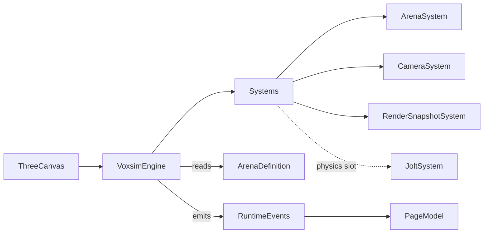

# Title

Voxel World, Three.js Renderer, And Shared Voxsim Domain Plan

## Goal

Establish the rendering runtime, the voxel arena model, the engine surface, and the browser-safe shared domain types that every other plan in this experiment depends on. The engine must stay framework-free, consume only shared domain types, and expose a small, deterministic interface so the desktop app, the editor, the training workers, and tests can all drive it the same way. Shared types must remain browser-safe so both the runtime UI and the future arena editor can render directly from the same source of truth.

## Scope

- Standardize on `three` v0.16x as the renderer with instanced cube rendering for voxel chunks; reserve `three-mesh-bvh` for ray queries used by sensors in `03-morphology-joints-and-dna.md`.
- Define a thin `VoxsimEngine` surface in `packages/ui/src/lib/voxsim/engine/` that the desktop app, the editor, and the replay viewer all consume.
- Define ECS-lite primitives (`Entity`, `Component`, `System`) and a fixed-step simulation loop independent of Three's render loop. The fixed-step loop in this plan only ticks domain systems; the physics step contract lives in `02-jolt-physics-boundary.md`.
- Define browser-safe shared domain types under `packages/domain/src/shared/voxsim/`.
- Define the layered scene container model that downstream plans bind to.

Out of scope for this step:

- Physics body creation, joint constraints, motors, and chunk colliders. Those belong in `02-jolt-physics-boundary.md`.
- Body morphology, sensors, and actuators. Those belong in `03-morphology-joints-and-dna.md`.
- Brain inference and policy networks. Those belong in `04-brain-and-policy-runtime.md`.
- Training, evolution, and headless workers. Those belong in `05-training-evolution-and-workers.md`.
- Visualization panels, replay viewer UI, and inspector. Those belong in `06-visualization-and-inspection.md`.
- SurrealDB persistence, transport adapters, routes, and the voxel editor route. Those belong in `07-persistence-and-route-integration.md`.

## Architecture

- `packages/domain/src/shared/voxsim`
  - Owns `VoxelKind`, `Chunk`, `ArenaDefinition`, `ArenaMetadata`, `Vec3`, `Quat`, `Transform`, `AgentSpawn`, `EntityKind`, `EntitySpawn`, validation helpers, and shared service-facing DTOs reserved for `07-persistence-and-route-integration.md`.
  - Stays browser-safe so the renderer, the editor, the replay viewer, and Surreal mappers can all import the same types.
  - Must not import `three`, `jolt-physics`, `@tensorflow/*`, `cytoscape`, SurrealDB, SvelteKit, or AI SDK.
- `packages/ui/src/lib/voxsim/engine`
  - Owns `VoxsimEngine`, ECS-lite primitives, the fixed-step accumulator, the layered scene model, and asset loading.
  - Depends only on `three` and shared structural types via the local UI types mirror in `packages/ui/src/lib/voxsim/types.ts`.
  - Must not depend on `packages/domain` directly. Domain types satisfy the local UI types structurally at the app boundary, mirroring the chat UI rule in `packages/ui/AGENTS.md`.
- `packages/ui/src/lib/voxsim/types.ts`
  - Mirrors the shared voxsim types as local UI types so `packages/ui` does not import `packages/domain`.
- `apps/desktop-app`
  - Consumes the engine and types only through `ui/source` and `domain/shared`. Never constructs `three` objects directly in route files.

## Implementation Plan

1. Create the new shared voxsim subdomain in `packages/domain/src/shared/voxsim`.
   - Add `README.md` describing the boundary, the browser-safe rule, and the cross-plan responsibility split.
   - Add `index.ts` exports for vector, voxel, chunk, arena, entity, and validation types.
2. Define vector and transform primitives.
   - `Vec3 { x: number; y: number; z: number }`
   - `Quat { x: number; y: number; z: number; w: number }`
   - `Transform { position: Vec3; rotation: Quat }`
   - Helpers in `vec.ts`: `addVec3`, `subVec3`, `scaleVec3`, `lengthVec3`, `dotVec3`, `crossVec3`, `identityQuat`, `quatFromAxisAngle`, `applyQuatToVec3`. Pure functions, no Three import.
3. Define the voxel vocabulary.
   - `VoxelKind`:
     - `empty`
     - `solid`
     - `ramp`
     - `hazard`
     - `goal`
     - `food`
     - `water`
     - `spawn`
   - Each voxel has static metadata: `solid`, `walkable`, `lethal`, `consumable`, `interactive`. Defined in `packages/domain/src/shared/voxsim/voxel-metadata.ts`.
4. Define the chunk and arena shape.
   - `Chunk`:
     - `id: string` deterministic id derived from `chunkOrigin`
     - `chunkOrigin: { cx: number; cy: number; cz: number }` chunk-space integer coords
     - `size: { sx: number; sy: number; sz: number }` voxel count along each axis (default `16x16x16`)
     - `voxels: Uint8Array` length `sx * sy * sz`, indexed as `x + sx * (y + sy * z)`, value matches `VoxelKind` ordinal
   - `ArenaDefinition`:
     - `id: string`
     - `version: number`
     - `chunkSize: { sx: number; sy: number; sz: number }` shared by every chunk in the arena
     - `voxelSize: number` world units per voxel (default `1.0`)
     - `bounds: { min: Vec3; max: Vec3 }` in chunk-space coords, inclusive
     - `chunks: Chunk[]` sparse list; missing chunks are treated as fully `empty`
     - `spawns: AgentSpawn[]` agent start poses
     - `entities: EntitySpawn[]` non-agent placements (food piles, hazards beyond static voxels, prop boxes)
     - `gravity: Vec3` defaulting to `{ x: 0, y: -9.81, z: 0 }`
     - `skybox: string` reference to a bundled skybox id
   - `ArenaMetadata`:
     - `title: string`
     - `author: string`
     - `createdAt: string` ISO
     - `updatedAt: string` ISO
     - `source: 'builtin' | 'user'`
     - `inheritsFromBuiltInId?: string`
5. Define agent and entity spawns.
   - `AgentSpawn`:
     - `id: string`
     - `tag: string` human label
     - `pose: Transform`
     - `bodyDnaRef?: string` reserved for `03-morphology-joints-and-dna.md`
     - `brainDnaRef?: string` reserved for `04-brain-and-policy-runtime.md`
   - `EntityKind`:
     - `propBox`
     - `foodPile`
     - `hazardField`
     - `goalMarker`
   - `EntitySpawn`:
     - `id: string`
     - `kind: EntityKind`
     - `pose: Transform`
     - `params?: Record<string, number | string | boolean>` for editor-tunable values
6. Add validation helpers in `packages/domain/src/shared/voxsim/validation.ts`.
   - `validateArenaDefinition(arena: ArenaDefinition): ArenaValidationResult`
   - Rules:
     - `chunks[].size` matches `chunkSize`
     - `chunks[].voxels.length === sx * sy * sz`
     - `chunks[].chunkOrigin` is inside `bounds`
     - no duplicate `chunks[].id`
     - all `spawns[].pose.position` and `entities[].pose.position` are inside the world-space bounding box derived from `bounds * chunkSize * voxelSize`
     - at least one `spawns[]` entry exists
     - all voxel byte values are valid `VoxelKind` ordinals
   - Return shape:
     - `ArenaValidationResult { ok: boolean; errors: ArenaValidationIssue[]; warnings: ArenaValidationIssue[] }`
     - `ArenaValidationIssue { code: string; message: string; chunkId?: string; voxelIndex?: number }`
7. Mirror shared voxsim types in `packages/ui/src/lib/voxsim/types.ts`.
   - Re-declare the structural shape used by engine, editor, and inspector so `packages/ui` stays free of `packages/domain` imports.
   - Document the structural-typing rule next to the file.
8. Define the engine surface in `packages/ui/src/lib/voxsim/engine/VoxsimEngine.ts`.
   - Constructor takes a config:
     - `mode: 'play' | 'preview' | 'editor'`
     - `assetBundleId: string`
     - `fixedStepHz: number` default `60`
     - `pixelRatio?: number`
   - Methods:
     - `mount(canvas: HTMLCanvasElement): Promise<void>`
     - `loadArena(arena: ArenaDefinition): Promise<void>`
     - `setInput(input: InputState): void`
     - `start(): void`
     - `stop(): void`
     - `dispose(): void`
     - `tickFixed(stepMs: number): void` for tests and replay
     - `getRenderSnapshot(): RenderSnapshot` returns the latest interpolated transforms for downstream inspectors
   - Events through a typed emitter:
     - `arenaLoaded`
     - `arenaUnloaded`
     - `agentSpawned`
     - `agentDied`
     - `agentReachedGoal`
     - `entityConsumed`
     - `simStep`
     - `renderFrame`
   - The engine owns the Three `WebGLRenderer`, the `Scene`, the `PerspectiveCamera`, the chunk instanced meshes, the ECS world, the fixed-step accumulator, and a placeholder `IPhysicsSystem` slot satisfied by `02-jolt-physics-boundary.md`.
9. Define ECS-lite primitives inside the engine module.
   - `Entity` is an opaque numeric id.
   - `Component` is a plain data record stored in typed component pools keyed by entity id.
   - `System` exposes `update(world: EngineWorld, dt: number): void`.
   - `EngineWorld` exposes:
     - `createEntity(): Entity`
     - `addComponent<T>(entity: Entity, kind: ComponentKind, data: T): void`
     - `getComponent<T>(entity: Entity, kind: ComponentKind): T | undefined`
     - `removeEntity(entity: Entity): void`
     - `query(kinds: ComponentKind[]): Iterable<Entity>`
     - `tagOf(entity: Entity): string | undefined`
   - Component kinds reserved by this plan: `Transform`, `RenderMesh`, `Camera`, `Light`. Component kinds for physics, morphology, sensors, brains, and replay are reserved by their respective plans.
10. Pin the fixed-step simulation loop separate from Three's render loop.
    - The engine drives the fixed-step accumulator from a `requestAnimationFrame` loop inside `mount`.
    - It calls registered systems in order at a fixed step (default `1/60s`).
    - Render runs every frame using interpolated transforms from `getRenderSnapshot`.
    - Tests can drive the loop directly by calling `tickFixed(stepMs)` without mounting a real canvas. The engine exposes a headless mode that omits `WebGLRenderer` for unit tests and worker contexts.
11. Render layers.
    - The engine creates and exposes a strict z-order on the Three `Scene`:
      - `arena` (instanced cube meshes per `VoxelKind`, built once per `loadArena` call)
      - `agents` (one mesh group per agent body, populated by `03-morphology-joints-and-dna.md`)
      - `entities` (food piles, prop boxes, goal markers)
      - `debug` (joint axes, sensor rays, physics shape outlines used by `02` and `03`)
      - `overlay` (selection rings, screen-locked agent labels)
      - `hud` (DOM-overlay sized container; the engine does not render HTML)
    - Each layer is a Three `Group` exposed via `engine.layers.<name>` so downstream plans add and remove children without traversing the scene root.
12. Voxel rendering strategy.
    - `ChunkMeshBuilder` produces one `InstancedMesh` per `VoxelKind` per chunk for the first cut. Empty voxels are skipped.
    - Instance attributes encode position; per-voxel-kind material defines color, roughness, and metalness.
    - Frustum culling stays at the chunk level, not per voxel, to keep draw counts bounded.
    - Greedy meshing is reserved for a future iteration; see Risks.
13. Asset loading.
    - `AssetBundle` definition lives in the engine module and references textures, skyboxes, and arena material configs by id.
    - Initial bundle is the `default` voxsim bundle bundled with the experiment.
    - The engine resolves bundle ids through a small `AssetRegistry` so the editor and runtime share one cache. The registry is engine-local, not a Three Loader subclass, to keep tests free of network mocks.
14. Camera and input scaffolding.
    - `Camera` exposed by the engine as a thin wrapper over a `PerspectiveCamera` with:
      - `setOrbitTarget(p: Vec3)`, `setDistance(d: number)`, `setAzimuth(a: number)`, `setElevation(e: number)`, `setFov(f: number)`, `screenToWorldRay(p: { x: number; y: number })`.
    - `InputState` is the normalized input struct produced by the page model and pushed into the engine via `setInput`. Concrete editor commands and gameplay bindings live in their respective downstream plans.

## Tests

- Pure shared-type tests in `packages/domain/src/shared/voxsim/`.
  - `validateArenaDefinition` covers:
    - chunk size mismatch
    - duplicate chunk ids
    - voxel byte out of `VoxelKind` range
    - spawn or entity outside the world bounds
    - empty `spawns[]` rejection
- Pure engine tests in `packages/ui/src/lib/voxsim/engine/`.
  - `EngineWorld` ECS:
    - component add and remove
    - query intersection
    - entity removal frees component slots
    - `tagOf` reflects assigned tags
  - Fixed-step loop:
    - `tickFixed(stepMs)` advances state deterministically
    - oversized `dt` clamps to a max step count to avoid spiral-of-death
    - render interpolation does not advance simulation state
  - `ChunkMeshBuilder`:
    - produces one `InstancedMesh` per non-`empty` `VoxelKind` present in the chunk
    - skips fully empty chunks entirely
    - rebuilds when the source `Chunk.voxels` reference changes
- Use `bun:test` with a thin `MockThreeRenderer` for engine mount tests; do not require a real WebGL context.

## Acceptance Criteria

- `packages/domain/src/shared/voxsim` exports stable browser-safe types covering vectors, voxel kinds, chunks, arenas, agent and entity spawns, and validation helpers.
- `VoxsimEngine` exposes a small, framework-free surface and runs a deterministic fixed-step loop independent of Three's render loop.
- The engine exposes the layered scene model (`arena`, `agents`, `entities`, `debug`, `overlay`, `hud`) downstream plans bind to.
- `packages/ui` does not import `packages/domain`. The engine consumes shared structural types via the local mirror.
- The instanced renderer can mount, load a bundled arena, and render in headless tests without a real WebGL context.
- `validateArenaDefinition` covers chunk shape, duplicate ids, voxel range, spawn placement, and bounds rules.

## Dependencies

- Planned package adoption:
  - `three`
  - `three-mesh-bvh` (reserved for sensor ray queries in `03-morphology-joints-and-dna.md`)
- New shared voxsim exports from `packages/domain/src/shared/index.ts`.
- New engine exports from `packages/ui/src/lib/index.ts`.
- Reference docs the implementation should align with:
  - [three.js Manual](https://threejs.org/manual/)
  - [three.js InstancedMesh](https://threejs.org/docs/#api/en/objects/InstancedMesh)
  - [three-mesh-bvh](https://github.com/gkjohnson/three-mesh-bvh)

## Risks / Notes

- Per-voxel rigid bodies are explicitly out of scope here and forbidden in `02-jolt-physics-boundary.md`. The voxel layer is visual and authoring; physics consumes a baked collider derived from chunks.
- `InstancedMesh` is the right first choice; greedy meshing is a known optimization that can be added once arena sizes exceed a few hundred thousand visible voxels. Do not preempt that work in the first cut.
- The fixed-step loop must stay separate from Three's render loop. Coupling them would break determinism for replay, training workers, and tests, which is the central design constraint of this experiment.
- Keep the engine surface small. Resist adding morphology, brain, training, or persistence methods here. Those concerns belong in their dedicated plans.
- The local UI types mirror exists for a real reason: `packages/ui` cannot depend on `packages/domain` per `packages/ui/AGENTS.md`. Keep both shapes structurally compatible.
- Three's `WebGLRenderer` does not exist in Node. The engine's headless mode must construct neither a renderer nor a `Scene` requiring GL textures so tests and training workers can import it cleanly.

## Handoff

- `02-jolt-physics-boundary.md` consumes `Chunk`, `ArenaDefinition`, the `VoxsimEngine` system slot, and the layered `debug` group.
- `03-morphology-joints-and-dna.md` consumes the `agents` layer, ECS primitives, and `Transform` / `Vec3` / `Quat` types.
- `06-visualization-and-inspection.md` consumes `getRenderSnapshot`, the `overlay` layer, and the `simStep` / `renderFrame` events.
- `07-persistence-and-route-integration.md` consumes `ArenaDefinition`, `ArenaMetadata`, validation helpers, and the engine `mount` / `loadArena` / `dispose` lifecycle.
