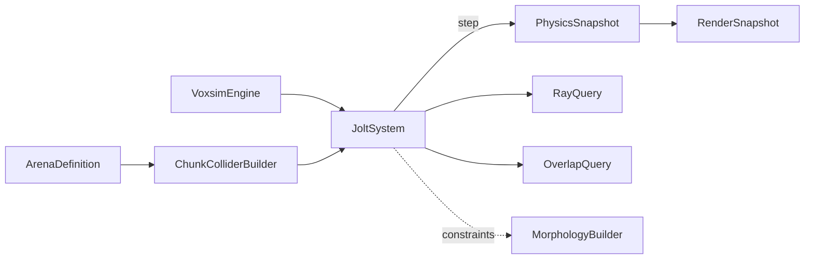

# Title

Jolt Physics Boundary, Chunk Colliders, And Fixed-Step Simulation Plan

## Goal

Add realistic rigid-body physics to the voxsim engine by importing `jolt-physics` directly as a WASM module and exposing a small typed facade (`JoltSystem`) that the rest of the engine, the morphology builder, the sensors, and the training workers consume. Voxel chunks become baked physics colliders. The physics step runs on the engine's fixed-step accumulator and is decoupled from Three's render loop so determinism, replay, and headless training all hold.

## Scope

- Import `jolt-physics` (WASM) explicitly with `locateFile`. Single-precision build. Multithreaded build flagged in Risks.
- Define `JoltSystem`, the only abstraction the rest of the engine uses to talk to Jolt.
- Define the chunk collider strategy: `MeshShape`, `HeightFieldShape`, or compound `BoxShape`, chosen per chunk via a documented decision matrix.
- Run a fixed-step physics tick at 60 Hz. Capture per-step body transforms into a `PhysicsSnapshot` consumed by the renderer for interpolation.
- Provide ray and overlap query primitives used by sensors in `03-morphology-joints-and-dna.md` and the editor pick-and-place flow in `07-persistence-and-route-integration.md`.

Out of scope for this step:

- Voxel arena data, ECS primitives, render layers, and the engine surface. Those belong in `01-voxel-world-and-domain.md`.
- Body morphology, joints between segments, motor wiring, and sensors. Those belong in `03-morphology-joints-and-dna.md`.
- Brain inference, training, replay capture, visualization, and routes. Those belong in `04`, `05`, `06`, and `07`.

## Architecture

- `packages/ui/src/lib/voxsim/engine/physics/JoltSystem.ts`
  - The single public physics facade. Owns the `Jolt` runtime, the `PhysicsSystem`, the `BodyInterface`, the temp allocator, and the job system.
  - Implements `IPhysicsSystem` (declared in `01-voxel-world-and-domain.md`) so the engine wires it via the existing system slot without binding to Jolt types.
- `packages/ui/src/lib/voxsim/engine/physics/jolt-loader.ts`
  - Owns the explicit WASM import flow and `locateFile` resolution. The rest of the codebase imports `JoltSystem`, never the raw `jolt-physics` module.
- `packages/ui/src/lib/voxsim/engine/physics/chunk-collider.ts`
  - Owns `ChunkColliderBuilder` which consumes a `Chunk` plus its `chunkOrigin` and produces a Jolt `Shape` ready to attach to a static body.
- `packages/ui/src/lib/voxsim/engine/physics/types.ts`
  - Local UI mirror of the small physics-facing types: `BodyHandle`, `ConstraintHandle`, `ShapeHandle`, `RayHit`, `OverlapHit`, `MotorTarget`, `PhysicsSnapshot`, `PhysicsLayer`. Plain-data records, no Jolt imports.
- `packages/domain/src/shared/voxsim`
  - No new exports for this plan. Physics handles stay engine-internal so the persistence and transport layers never serialize Jolt state directly. Replays serialize transforms via `PhysicsSnapshot`, which is engine-defined.

## Implementation Plan

1. Add the explicit WASM loader.
   - `jolt-loader.ts`:
     - Imports `jolt-physics` lazily with `await import('jolt-physics')`.
     - Calls the module factory with `{ locateFile: (file) => assetUrl('voxsim/jolt/' + file) }` so the bundled `.wasm` is served from the static asset directory rather than a CDN.
     - Returns a typed `JoltRuntime` exposing only the namespaces the engine actually uses: `Jolt.Vec3`, `Jolt.Quat`, `Jolt.RVec3`, `Jolt.BodyCreationSettings`, `Jolt.PhysicsSystem`, `Jolt.JobSystemThreadPool`, `Jolt.TempAllocatorImpl`, `Jolt.BroadPhaseLayerInterfaceTable`, `Jolt.ObjectVsBroadPhaseLayerFilterTable`, `Jolt.ObjectLayerPairFilterTable`, the `Shape` family used by `chunk-collider.ts`, and the constraint family reserved for `03-morphology-joints-and-dna.md`.
   - The loader caches the runtime per process so repeated `mount` calls do not re-instantiate WASM.
2. Define `IPhysicsSystem`.
   - Declared in `01-voxel-world-and-domain.md` and implemented here.
   - Methods (engine-facing):
     - `init(config: PhysicsConfig): Promise<void>`
     - `loadArenaColliders(arena: ArenaDefinition): void`
     - `unloadArenaColliders(): void`
     - `step(dtMs: number): void`
     - `snapshot(): PhysicsSnapshot`
     - `dispose(): void`
   - Methods (downstream-facing, used by `03-morphology-joints-and-dna.md`):
     - `createBody(spec: BodySpec): BodyHandle`
     - `removeBody(handle: BodyHandle): void`
     - `addConstraint(spec: ConstraintSpec): ConstraintHandle`
     - `removeConstraint(handle: ConstraintHandle): void`
     - `setMotorTarget(handle: ConstraintHandle, target: MotorTarget): void`
     - `getBodyTransform(handle: BodyHandle): Transform`
     - `applyImpulse(handle: BodyHandle, impulse: Vec3, at?: Vec3): void`
     - `castRay(origin: Vec3, direction: Vec3, maxDistance: number, filter?: PhysicsLayerFilter): RayHit | undefined`
     - `queryOverlap(shape: ShapeQuery, filter?: PhysicsLayerFilter): OverlapHit[]`
3. Configure broad-phase and object layers.
   - Two object layers in v1:
     - `static` (arena chunks, props that never move)
     - `dynamic` (agent segments, free entities)
   - Two broad-phase layers mirror the object layers.
   - Layer filter rules:
     - `static` ↔ `dynamic`: collide
     - `static` ↔ `static`: never
     - `dynamic` ↔ `dynamic`: collide (agent self-collision is needed for stable contact between adjacent segments; per-pair filtering for self-collision is reserved for `03-morphology-joints-and-dna.md`)
4. Implement `JoltSystem.init`.
   - Accepts `PhysicsConfig`:
     - `gravity: Vec3` (the engine forwards `arena.gravity`)
     - `numThreads: number` default `1` for the first cut (single-thread WASM build); reserved for `numThreads > 1` once the multithreaded build is shipped
     - `maxBodies: number` default `8192`
     - `maxBodyPairs: number` default `16384`
     - `maxContactConstraints: number` default `8192`
   - Constructs `TempAllocatorImpl(10 * 1024 * 1024)`, the broad-phase layer interface, the object-layer-pair filter, and the `PhysicsSystem`.
   - Sets gravity on the `PhysicsSystem` from `config.gravity`.
5. Define `BodySpec`, `ShapeSpec`, and `ConstraintSpec` (used by plans 03 and 07).
   - `BodySpec`:
     - `kind: 'static' | 'dynamic' | 'kinematic'`
     - `shape: ShapeSpec`
     - `transform: Transform`
     - `mass?: number` only meaningful for `dynamic`
     - `friction?: number` default `0.5`
     - `restitution?: number` default `0.0`
     - `linearDamping?: number` default `0.05`
     - `angularDamping?: number` default `0.05`
     - `userTag?: string` for debug only; never used by physics resolution
   - `ShapeSpec` is a discriminated union:
     - `{ kind: 'box'; halfExtents: Vec3 }`
     - `{ kind: 'sphere'; radius: number }`
     - `{ kind: 'capsule'; halfHeight: number; radius: number }`
     - `{ kind: 'compound'; children: { shape: ShapeSpec; transform: Transform }[] }`
     - `{ kind: 'mesh'; vertices: Float32Array; indices: Uint32Array }` produced by `ChunkColliderBuilder`
     - `{ kind: 'heightField'; samples: Float32Array; columns: number; rows: number; spacingXz: number }` produced by `ChunkColliderBuilder` for terrain-style chunks
   - `ConstraintSpec` is a discriminated union (used in `03-morphology-joints-and-dna.md`):
     - `{ kind: 'fixed'; bodyA; bodyB; transformA; transformB }`
     - `{ kind: 'hinge'; bodyA; bodyB; pivot; axis; minAngle; maxAngle; motor?: MotorParams }`
     - `{ kind: 'slider'; bodyA; bodyB; pivot; axis; minDistance; maxDistance; motor?: MotorParams }`
     - `{ kind: 'swingTwist'; bodyA; bodyB; position; twistAxis; planeAxis; normalHalfConeAngle; planeHalfConeAngle; twistMinAngle; twistMaxAngle; motor?: MotorParams }`
     - `{ kind: 'sixDof'; bodyA; bodyB; position; axisX; axisY; translationLimits; rotationLimits; motors?: SixDofMotors }`
   - `MotorParams { mode: 'off' | 'velocity' | 'position'; maxForce: number; springFrequency?: number; springDamping?: number }`
6. Implement `ChunkColliderBuilder`.
   - Decision matrix (documented in `chunk-collider.ts`):
     - If the chunk's non-empty voxel ratio is `>= 0.5`, build a single `mesh` shape from the surface faces (greedy face culling against neighbors that exist within the same chunk; chunk-edge faces always emitted because cross-chunk neighbor lookup happens at the arena level).
     - If the chunk represents heightfield-style terrain (a per-column max-y derivable in `O(sx * sz)`), build a `heightField` shape and skip the mesh path entirely.
     - Otherwise, emit a `compound` of `box` children, one per non-empty solid voxel, capped at a soft limit (default `1024` boxes per chunk). Above the cap, fall back to `mesh`.
   - The arena-level builder calls `ChunkColliderBuilder` for every chunk and creates one `static` body per chunk anchored at `chunkOrigin * chunkSize * voxelSize`.
   - `loadArenaColliders` keeps a registry of static body handles keyed by chunk id so a future editor can rebuild a single chunk without touching the rest. The first cut rebuilds the entire arena on `loadArena`; per-chunk dirty rebuild is reserved for `07-persistence-and-route-integration.md`'s editor work.
7. Pin the fixed-step physics tick to the engine accumulator.
   - The engine calls `JoltSystem.step(stepMs)` from inside its existing fixed-step accumulator (defined in `01-voxel-world-and-domain.md`). The default `1/60s` step size matches the engine default.
   - Each `step` call runs Jolt's `Update(dt, collisionSteps, tempAllocator, jobSystem)` with `collisionSteps = 1`.
   - The system stores the previous and latest body transforms so `snapshot()` can return both for the renderer to interpolate. The engine's `getRenderSnapshot()` consults this to update Three meshes without advancing physics.
   - Tests can drive `step(stepMs)` directly without mounting Three. This is the same determinism contract the engine commits to.
8. Implement ray and overlap queries.
   - `castRay`:
     - Builds a `Jolt.RRayCast` and runs `NarrowPhaseQuery::CastRay`.
     - Returns the closest hit as `RayHit { bodyHandle: BodyHandle; point: Vec3; normal: Vec3; distance: number; userTag?: string }`.
     - Filtering by `PhysicsLayerFilter { include: ('static' | 'dynamic')[] }`.
   - `queryOverlap`:
     - Supports `box`, `sphere`, and `capsule` `ShapeQuery` variants.
     - Returns all overlapping bodies as `OverlapHit[]`.
   - Both are intended to be cheap; sensors in `03-morphology-joints-and-dna.md` will batch them per-tick.
9. Capture `PhysicsSnapshot` for the renderer.
   - `PhysicsSnapshot { bodies: { handle: BodyHandle; previous: Transform; latest: Transform }[]; stepIndex: number }`.
   - The engine's render path linearly interpolates `previous` and `latest` by the accumulator residual to produce the displayed transform.
   - The snapshot is the only data the renderer ever reads from physics. It must not call into Jolt during render frames.
10. Disposal and lifecycle.
    - `dispose()` removes every body and constraint, frees temp allocators, releases the job system, and drops the `PhysicsSystem` reference.
    - `unloadArenaColliders()` removes only chunk-derived static bodies, leaving agent bodies intact, so an arena swap during a training run can preserve agent state if the trainer requests it (the default trainer in `05-training-evolution-and-workers.md` resets agents on arena swap).
11. Asset bundling.
    - The Jolt `.wasm` file is copied into `apps/desktop-app/static/voxsim/jolt/` by the existing static copy step in `electrobun.config.ts`. The loader resolves it via `views://mainview/voxsim/jolt/jolt-physics.wasm` in packaged builds.
    - The web build serves it from `/voxsim/jolt/jolt-physics.wasm`.
12. Debug rendering hooks.
    - `JoltSystem.getDebugLines()` returns line segments for shape outlines and contact normals. The engine's `debug` layer (defined in `01-voxel-world-and-domain.md`) consumes the lines via a small `LineSegments` mesh.
    - The hook is opt-in and off by default to keep the render path empty when debug visualization is disabled.

## Tests

- Pure tests using `bun:test` and the engine's headless mode.
- `jolt-loader`:
  - cached runtime returns the same instance across calls
  - `locateFile` is invoked with the configured asset prefix
- `JoltSystem`:
  - gravity from `arena.gravity` reaches the underlying `PhysicsSystem`
  - `step(16.6)` advances a single dynamic body under gravity by approximately `0.5 * g * dt^2` over a small number of steps (numerical tolerance noted in the test)
  - `castRay` from above hits a chunk floor at the expected distance and returns the floor's normal
  - `queryOverlap` returns the bodies inside a known overlapping box
  - `dispose()` leaves no leaked Jolt handles (verified by re-init returning fresh handles starting from the lowest available id)
- `ChunkColliderBuilder`:
  - dense chunk produces `mesh` shape with surface-only faces (interior faces culled)
  - heightfield-shaped chunk produces `heightField` shape and skips mesh
  - sparse chunk produces `compound` box shape; chunks above the box cap fall back to `mesh`
  - cross-chunk neighbor faces are always emitted because cross-chunk culling is not implemented in the first cut
- Determinism:
  - given the same arena, gravity, and seed, two engines that run `tickFixed(16.6)` for `N` steps produce identical `snapshot()` transforms
- Snapshot interpolation:
  - render-time interpolation uses snapshot data only and never calls into Jolt

## Acceptance Criteria

- The renderer never imports `jolt-physics` directly. All physics access goes through `JoltSystem`.
- The arena loader rebuilds chunk colliders on `loadArena` and tears them down on `unloadArenaColliders`.
- Physics steps deterministically at the engine's fixed step size.
- Ray and overlap queries are available to sensors and the editor.
- The renderer reads only `PhysicsSnapshot` for transforms and never advances physics during a frame.
- The Jolt `.wasm` ships from local static assets through the existing `electrobun.config.ts` copy step. No CDN dependency.

## Dependencies

- Planned package adoption:
  - `jolt-physics` (single-precision build for v1)
- Local engine surface from `01-voxel-world-and-domain.md`:
  - `IPhysicsSystem` slot
  - `engine.layers.debug`
  - `Transform`, `Vec3`, `Quat` types
- Reference docs the implementation should align with:
  - [JoltPhysics.js README](https://github.com/jrouwe/JoltPhysics.js)
  - [Jolt Constraints](https://jrouwe.github.io/JoltPhysics/)
  - [Jolt Body Creation](https://jrouwe.github.io/JoltPhysics/class_body_creation_settings.html)

## Risks / Notes

- Per-voxel rigid bodies are forbidden. They destroy performance and break the chunk collider design. The decision matrix above is the correct shape selection.
- Soft bodies are deferred to a future plan. Jolt's soft-body APIs are still marked work-in-progress; soft-soft collisions and buoyancy are not implemented and constraints cannot operate on soft bodies. Rigid-body articulation gets locomotion learning much further.
- The single-threaded WASM build is the right starting point. Multithreaded builds require `SharedArrayBuffer`, COOP/COEP headers, and platform-specific packaging. Defer until the simulation is actually CPU-bound.
- Double-precision builds (`Jolt.RVec3`-heavy) are reserved for very large arenas. The first cut uses single-precision. The shared `Vec3` type stays platform-neutral so future migration touches only `JoltSystem`.
- Coupling Jolt directly to Three (for example, via the upstream `three-jolt` addon) would defeat the engine boundary. The addon may appear as an optional debug helper in `06-visualization-and-inspection.md`, never as the primary physics surface.
- Physics determinism is not guaranteed across hardware. The training pipeline in `05-training-evolution-and-workers.md` must therefore rely on per-worker reproducibility, not cross-machine reproducibility, and persist seeds plus episode replays to compensate.

## Handoff

- `03-morphology-joints-and-dna.md` consumes `createBody`, `addConstraint`, `setMotorTarget`, `castRay`, and `queryOverlap`.
- `05-training-evolution-and-workers.md` consumes `JoltSystem` inside Bun/Node workers via the engine's headless mode.
- `06-visualization-and-inspection.md` consumes `getDebugLines` for the inspector's optional physics overlay.
- `07-persistence-and-route-integration.md` consumes `unloadArenaColliders` and the per-chunk dirty rebuild path for the arena editor.
