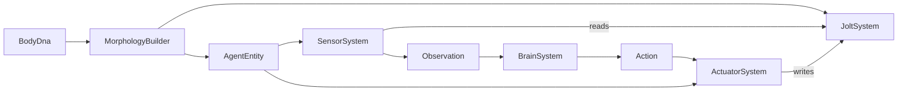

# Title

Morphology, Joints, Motors, Sensors, And Body DNA Plan

## Goal

Define how robots and bio-organisms are built from a `BodyDna` description, attached to the physics engine through joints and motors, and wired up to sensors and actuators that the brain layer can read and drive. Body DNA is browser-safe shared data so the editor, the persistence layer, the trainer, and the replay viewer can all reason about morphologies without touching Jolt or Three.

## Scope

- Define `BodyDna`, `OrganismKind`, `SegmentSpec`, `JointSpec`, `MotorSpec`, `SensorSpec`, `ActuatorMap`, `LineageRef`, and validation helpers as browser-safe shared types.
- Define `MorphologyBuilder` that consumes `BodyDna` and produces an `Agent` ECS entity with Jolt bodies, constraints, motors, and sensor wiring through the `JoltSystem` facade from `02-jolt-physics-boundary.md`.
- Define `SensorSystem` and `ActuatorSystem` as engine systems that read sensor observations into a flat `Float32Array` and drive motor targets from a flat `Float32Array`.
- Provide a small library of starter morphologies (biped, quadruped, snake) used by `05-training-evolution-and-workers.md` and the e2e tests.

Out of scope for this step:

- Physics implementation, chunk colliders, ray and overlap queries. Those belong in `02-jolt-physics-boundary.md`.
- Brain inference, policy networks, action selection. Those belong in `04-brain-and-policy-runtime.md`.
- Training loops, evolution, mutation. Those belong in `05-training-evolution-and-workers.md`.
- Visualization of morphologies and joint readouts. That belongs in `06-visualization-and-inspection.md`.
- Persistence of `BodyDna` records. That belongs in `07-persistence-and-route-integration.md`.

## Architecture

- `packages/domain/src/shared/voxsim/morphology`
  - Browser-safe types only. Owns `BodyDna`, `OrganismKind`, `SegmentSpec`, `JointSpec`, `MotorSpec`, `SensorSpec`, `ActuatorMap`, `LineageRef`, validation helpers.
  - Re-exports through `packages/domain/src/shared/voxsim/index.ts`.
- `packages/ui/src/lib/voxsim/morphology`
  - Owns `MorphologyBuilder`, `SensorSystem`, `ActuatorSystem`, and the starter morphology factory.
  - Depends only on the engine surface from `01-voxel-world-and-domain.md`, the `JoltSystem` facade from `02-jolt-physics-boundary.md`, and the local UI types mirror.
  - Local types mirror lives in `packages/ui/src/lib/voxsim/morphology/types.ts`.
- `apps/desktop-app`
  - Never constructs morphologies directly. Routes consume `MorphologyBuilder` only through `ui/source` and the application layer in `07-persistence-and-route-integration.md`.

## Implementation Plan

1. Add the new shared morphology subdomain.
   - `packages/domain/src/shared/voxsim/morphology/`
     - `index.ts`
     - `body-dna.ts`
     - `joint-spec.ts`
     - `sensor-spec.ts`
     - `actuator-map.ts`
     - `lineage.ts`
     - `validation.ts`
   - Export the surfaces through `packages/domain/src/shared/voxsim/index.ts`.
2. Define `OrganismKind`.
   - `OrganismKind`:
     - `robot`
     - `bioOrganism`
   - Both are rigid-articulated in v1. The kind is a label that downstream visualization (`06-visualization-and-inspection.md`) and persistence (`07-persistence-and-route-integration.md`) can use to filter, but it does not change the physics build path.
3. Define `SegmentSpec`.
   - `SegmentSpec`:
     - `id: string` unique within the body
     - `tag: string` human label, for example `torso`, `leftThigh`, `head`
     - `shape: SegmentShapeSpec` mirrors a small subset of `ShapeSpec` from `02-jolt-physics-boundary.md`:
       - `{ kind: 'box'; halfExtents: Vec3 }`
       - `{ kind: 'sphere'; radius: number }`
       - `{ kind: 'capsule'; halfHeight: number; radius: number }`
     - `mass: number` positive
     - `restPose: Transform` initial pose relative to the body root
     - `friction?: number` default `0.7`
     - `restitution?: number` default `0.0`
     - `colorHint?: string` consumed by the renderer in `01-voxel-world-and-domain.md` via the `agents` layer
     - `selfCollidesWith?: string[]` segment ids this segment is allowed to collide with; default `[]` so internal segments do not jitter against each other
4. Define `JointSpec` and `MotorSpec`.
   - `JointSpec` is a discriminated union mirroring `ConstraintSpec` from `02-jolt-physics-boundary.md` but expressed in body-relative coordinates:
     - `{ kind: 'fixed'; id; parentSegmentId; childSegmentId; transformOnParent; transformOnChild }`
     - `{ kind: 'hinge'; id; parentSegmentId; childSegmentId; pivotOnParent; axisOnParent; minAngle; maxAngle; motor?: MotorSpec }`
     - `{ kind: 'slider'; id; parentSegmentId; childSegmentId; pivotOnParent; axisOnParent; minDistance; maxDistance; motor?: MotorSpec }`
     - `{ kind: 'swingTwist'; id; parentSegmentId; childSegmentId; positionOnParent; twistAxisOnParent; planeAxisOnParent; normalHalfConeAngle; planeHalfConeAngle; twistMinAngle; twistMaxAngle; motor?: MotorSpec }`
     - `{ kind: 'sixDof'; id; parentSegmentId; childSegmentId; positionOnParent; axisXOnParent; axisYOnParent; translationLimits; rotationLimits; motors?: SixDofMotorSpecs }`
   - `MotorSpec`:
     - `mode: 'off' | 'velocity' | 'position'`
     - `maxForce: number`
     - `springFrequency?: number`
     - `springDamping?: number`
     - `actuatorId: string` matches an entry in `ActuatorMap`
   - `SixDofMotorSpecs` carries up to six per-axis `MotorSpec` entries keyed by axis label.
5. Define `SensorSpec`.
   - `SensorSpec` is a discriminated union:
     - `{ kind: 'groundContact'; id; segmentId }` returns `1` when the segment has a contact normal pointing within `cos(thresholdRadians)` of world-up, else `0`
     - `{ kind: 'jointAngle'; id; jointId }` returns the joint's primary angle (twist angle for `swingTwist`, hinge angle for `hinge`, position for `slider`)
     - `{ kind: 'jointAngularVelocity'; id; jointId }`
     - `{ kind: 'imuOrientation'; id; segmentId }` returns the segment's orientation as a `Quat` flattened to 4 floats
     - `{ kind: 'imuAngularVelocity'; id; segmentId }` 3 floats in body-local frame
     - `{ kind: 'bodyVelocity'; id; segmentId }` 3 floats in world frame
     - `{ kind: 'voxelSightShort'; id; segmentId; rayCount: number; halfFovRadians: number; maxDistance: number }` issues a fan of rays via `JoltSystem.castRay` and returns one float per ray (normalized hit distance)
     - `{ kind: 'proximityToFood'; id; segmentId; maxDistance: number }` queries `JoltSystem.queryOverlap` for `food` voxel markers and returns the closest distance, normalized
   - Each sensor declares `outputWidth(): number` so the encoder in `04-brain-and-policy-runtime.md` can sum widths into a fixed input vector.
6. Define `ActuatorMap`.
   - `ActuatorMap`:
     - `actuators: ActuatorEntry[]`
     - `ActuatorEntry`:
       - `id: string` referenced by `MotorSpec.actuatorId`
       - `range: { min: number; max: number }` action-space bounds; the engine clamps to this range before forwarding to the motor
       - `mode: 'targetAngle' | 'targetVelocity' | 'targetForce' | 'boolGate'`
   - The map's order defines the action vector layout. The decoder in `04-brain-and-policy-runtime.md` writes into this order.
7. Define `BodyDna`.
   - `BodyDna`:
     - `id: string`
     - `version: number`
     - `kind: OrganismKind`
     - `rootSegmentId: string`
     - `segments: SegmentSpec[]`
     - `joints: JointSpec[]`
     - `sensors: SensorSpec[]`
     - `actuators: ActuatorMap`
     - `lineage?: LineageRef`
     - `metadata: { name: string; createdAt: string; updatedAt: string; author: string }`
   - `LineageRef`:
     - `parentBodyDnaId?: string`
     - `mutationSummary?: string`
     - `generation?: number`
8. Add validation helpers in `packages/domain/src/shared/voxsim/morphology/validation.ts`.
   - `validateBodyDna(dna: BodyDna): BodyDnaValidationResult`
   - Rules:
     - every `joints[].parentSegmentId` and `joints[].childSegmentId` exists in `segments`
     - the segment graph is a tree rooted at `rootSegmentId` (no cycles, every non-root segment has exactly one parent edge)
     - every `joints[].motor.actuatorId` exists in `actuators.actuators`
     - every `sensors[].segmentId` (or `sensors[].jointId`) references an existing segment or joint
     - all motor `maxForce`, sensor distances, and segment masses are positive finite numbers
     - hinge/swingTwist/sixDof angle limits satisfy `min <= max`
     - the action vector width (`actuators.actuators.length`) matches the count of motor `actuatorId` references
   - Return shape mirrors `ArenaValidationResult` from `01-voxel-world-and-domain.md` for consistency.
9. Mirror morphology types in `packages/ui/src/lib/voxsim/morphology/types.ts`.
   - Re-declare the structural shape used by `MorphologyBuilder`, `SensorSystem`, and `ActuatorSystem` so `packages/ui` stays free of `packages/domain` imports.
10. Implement `MorphologyBuilder`.
    - Constructor takes the `JoltSystem` facade and the engine's `agents` layer reference.
    - `build(dna: BodyDna, rootPose: Transform): AgentHandle`:
      - Walks the segment tree from `rootSegmentId`, producing a Jolt `BodySpec` per segment with absolute world transform = `rootPose * cumulativeRelativePose`.
      - Calls `JoltSystem.createBody` per segment and stores the returned `BodyHandle` keyed by `segmentId`.
      - For each `JointSpec`, translates body-relative `JointSpec` into engine-frame `ConstraintSpec` and calls `JoltSystem.addConstraint`.
      - Configures self-collision filters: by default disable collisions between any two segments connected by a joint and between any two segments not listed in each other's `selfCollidesWith`.
      - Spawns Three meshes for each segment shape under the engine's `agents` layer; meshes are kinematic visual proxies driven by `PhysicsSnapshot`.
      - Returns `AgentHandle { agentEntity: Entity; segmentBodies: Map<string, BodyHandle>; jointConstraints: Map<string, ConstraintHandle>; sensorIds: string[]; actuatorIds: string[]; bodyDnaId: string }`.
    - `dispose(handle: AgentHandle)`: removes constraints, bodies, ECS components, and meshes in that order.
11. Define agent ECS components.
    - `Agent`:
      - `bodyDnaId: string`
      - `brainDnaId?: string` reserved for `04-brain-and-policy-runtime.md`
      - `policyHandle?: PolicyHandle` reserved for `04-brain-and-policy-runtime.md`
      - `observation: Float32Array` allocated once by `MorphologyBuilder` based on summed sensor widths
      - `action: Float32Array` allocated once by `MorphologyBuilder` to `actuators.actuators.length`
      - `alive: boolean`
      - `stepsSinceSpawn: number`
    - `Segments`:
      - `bodies: { id: string; bodyHandle: BodyHandle; meshId: number }[]`
    - `Joints`:
      - `joints: { id: string; constraintHandle: ConstraintHandle; jointSpec: JointSpec }[]`
    - `Sensors`:
      - `sensors: { spec: SensorSpec; offset: number; width: number }[]` precomputed offsets into `observation`
    - `Actuators`:
      - `entries: { actuatorId: string; index: number; range: { min: number; max: number }; mode: ActuatorEntry['mode']; constraintHandle: ConstraintHandle }[]`
12. Implement `SensorSystem`.
    - Runs once per fixed step, before any brain system.
    - Iterates `query(['Agent', 'Sensors'])`.
    - For each sensor, computes the value via the relevant `JoltSystem` query or transform read and writes into the agent's `observation` at the precomputed offset.
    - Sensor reads must be batched. `voxelSightShort` reuses a per-agent direction buffer to avoid per-frame allocations.
    - Updates `Agent.stepsSinceSpawn` after sensor reads so brains see consistent observations.
13. Implement `ActuatorSystem`.
    - Runs once per fixed step, after the brain system from `04-brain-and-policy-runtime.md` writes into `Agent.action`.
    - Iterates `query(['Agent', 'Actuators'])`.
    - For each `ActuatorEntry`, clamps the action value to `range`, translates `mode` into a `MotorTarget`, and calls `JoltSystem.setMotorTarget` on the constraint handle.
    - Tracks per-step energy use as the magnitude of action vector for the reward computation in `05-training-evolution-and-workers.md`.
14. Provide a starter morphology library.
    - `packages/ui/src/lib/voxsim/morphology/library/`
      - `biped.ts` exports `createBipedDna(opts?: { mass?: number; height?: number }): BodyDna`
      - `quadruped.ts` exports `createQuadrupedDna(opts?: ...): BodyDna`
      - `snake.ts` exports `createSnakeDna(opts?: { segments?: number }): BodyDna`
    - The biped uses two hip swing-twists, two knee hinges, two ankle hinges, two shoulder swing-twists, two elbow hinges, one waist hinge, plus IMU on the torso, ground-contact on each foot, joint-angle and joint-velocity sensors on every motorized joint.
    - The quadruped uses four shoulder/hip swing-twists, four knee hinges, IMU on the torso, ground-contact on each foot.
    - The snake uses N hinges along its length with simple sinusoidal-friendly limits.
15. Death and reset.
    - Define `DeathRule` evaluated by `SensorSystem` after sensor reads:
      - `deathFromTilt: { segmentId; toleranceRadians }`
      - `deathFromContact: { segmentId; voxelKinds: VoxelKind[] }` for hazard contact
      - `deathFromTimeout: { maxSteps: number }`
    - On death, the agent is marked `alive = false` and the engine emits `agentDied`. The trainer in `05-training-evolution-and-workers.md` decides whether to respawn or end the episode.

## Tests

- Pure shared-type tests in `packages/domain/src/shared/voxsim/morphology/`.
  - `validateBodyDna` covers:
    - missing parent or child segment id
    - cycle in joint graph
    - dangling motor `actuatorId`
    - sensor referencing a missing joint or segment
    - mismatched action vector width
    - non-positive mass or distance
- Engine tests in `packages/ui/src/lib/voxsim/morphology/`.
  - `MorphologyBuilder.build`:
    - produces one Jolt body per segment with absolute world transforms derived from the segment tree
    - produces one constraint per joint with the right kind
    - allocates `observation` and `action` with the correct widths
    - assigns mesh ids in the `agents` layer for each segment
  - `SensorSystem`:
    - `groundContact` reads `1` while the segment is in contact with a static body and `0` otherwise
    - `jointAngle` matches the engine's joint readout within numerical tolerance after `tickFixed`
    - `voxelSightShort` ray fan respects `halfFovRadians` and `maxDistance`
  - `ActuatorSystem`:
    - clamps actions to `range` before forwarding
    - `targetAngle` mode pushes the joint angle toward the requested target across multiple `tickFixed` steps
    - energy tracking accumulates per step
  - Starter morphologies:
    - `createBipedDna()` passes `validateBodyDna`
    - `createQuadrupedDna()` and `createSnakeDna()` pass `validateBodyDna`
- Use `bun:test` and run physics through the headless `JoltSystem` in single-threaded WASM mode.

## Acceptance Criteria

- `BodyDna` is a stable browser-safe contract that the editor, the trainer, the inspector, and persistence can all consume.
- `MorphologyBuilder` produces a deterministic agent given the same `BodyDna` and root pose, including stable `BodyHandle` and `ConstraintHandle` ordering.
- `SensorSystem` and `ActuatorSystem` form the only bridge between physics state and the brain layer's flat `observation` and `action` vectors.
- A biped, quadruped, and snake morphology each ship as starter DNA and pass validation out of the box.
- The plan introduces no engine knowledge of brains or training; those layers remain plug-in via the `Agent.action` and `Agent.observation` arrays.

## Dependencies

- `01-voxel-world-and-domain.md` provides `Transform`, `Vec3`, `Quat`, the engine surface, ECS primitives, and the `agents` render layer.
- `02-jolt-physics-boundary.md` provides `JoltSystem`, `BodySpec`, `ConstraintSpec`, `MotorTarget`, and ray and overlap queries.
- Future plan `04-brain-and-policy-runtime.md` consumes `Agent.observation`, `Agent.action`, sensor widths, and actuator widths.
- Future plan `07-persistence-and-route-integration.md` persists `BodyDna` records and links them to weight checkpoints.

## Risks / Notes

- Soft bodies stay out of v1. All organisms, including bio-organisms, are rigid-articulated. Soft tissue is on the deferred list called out in `02-jolt-physics-boundary.md`.
- Self-collision filtering is critical. Default-on self-collision causes constant micro-jitter at joints and breaks training. The default is to disable collision between joint-connected segments, with an opt-in `selfCollidesWith` for body parts that need real contact (hands brushing thighs, for example).
- Sensor batching matters. A biped with twelve joints and eight rays per foot can issue dozens of physics queries per step. The `voxelSightShort` implementation reuses direction buffers and per-agent ray result arrays to avoid per-step allocations.
- Action vector width is the contract between this plan and `04-brain-and-policy-runtime.md`. Changes to `ActuatorMap` ordering will silently retarget motors and must be guarded by a version field on `BodyDna`.
- The starter morphologies are intentionally simple. Resist adding hands and fingers in v1; locomotion is the proving ground.

## Handoff

- `04-brain-and-policy-runtime.md` consumes `Agent.observation`, `Agent.action`, `BodyDna.sensors[].outputWidth()`, and `ActuatorMap` to size and decode the network.
- `05-training-evolution-and-workers.md` consumes the starter morphology library, `DeathRule`, energy tracking, and `MorphologyBuilder.dispose` to manage populations.
- `06-visualization-and-inspection.md` consumes `Segments`, `Joints`, and `Sensors` components to render the body schematic and per-sensor live values.
- `07-persistence-and-route-integration.md` persists `BodyDna` and `LineageRef`.
