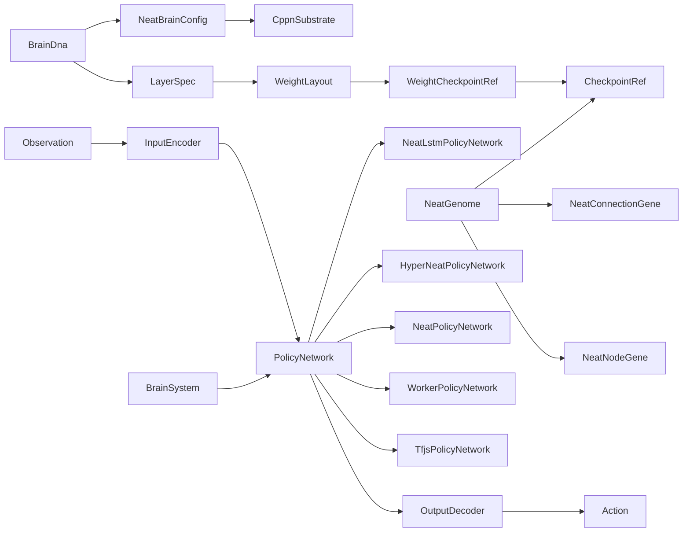

# Title

Brain DNA, Policy Network, And Inference Runtime Plan

## Goal

Define the brain layer that consumes per-agent `observation` vectors and writes per-agent `action` vectors. Brains are described by a browser-safe `BrainDna` so the editor, persistence, lineage, and visualization can reason about them without touching TensorFlow. The runtime keeps multiple interchangeable `PolicyNetwork` implementations: `TfjsPolicyNetwork` for fixed-topology MLP inference in the desktop app, `WorkerPolicyNetwork` for the same MLPs in headless training workers in `05-training-evolution-and-workers.md`, and three NEAT-family implementations (`NeatPolicyNetwork`, `HyperNeatPolicyNetwork`, `NeatLstmPolicyNetwork`) for evolved-topology brains, all behind the same `PolicyNetwork` interface. Inference runs on the engine's fixed-step tick, never per render frame.

## Scope

- Define `BrainDna`, `LayerSpec`, `ActivationKind`, `InputEncoder`, `OutputDecoder`, `WeightLayout`, `WeightCheckpointRef`, `CheckpointRef`, `NeatGenome`, `NeatNodeGene`, `NeatConnectionGene`, `NeatActivationKind`, `CppnActivationKind`, `CppnSubstrate`, `LstmCellState`, `NeatBrainConfig`, validation helpers, all as browser-safe shared types.
- Define the `PolicyNetwork` interface and five implementations:
  - `TfjsPolicyNetwork` using `@tensorflow/tfjs` (CPU/WebGL backend depending on availability) for fixed-topology MLPs
  - `WorkerPolicyNetwork` using `@tensorflow/tfjs-node` inside Bun/Node workers for the same MLPs
  - `NeatPolicyNetwork` (pure-JS graph forward pass) for classic Stanley-Miikkulainen NEAT
  - `HyperNeatPolicyNetwork` for HyperNEAT (CPPN queried over a substrate to produce the phenotype)
  - `NeatLstmPolicyNetwork` for NEAT extended with LSTM memory cell nodes
- Define `BrainSystem` as an engine system that runs after `SensorSystem` and before `ActuatorSystem`.
- Define a deterministic mutation-friendly `WeightLayout` so fixed-topology evolution and partial weight transfer in `05-training-evolution-and-workers.md` are well-defined, and a discriminated `CheckpointRef` so the persistence layer in `07-persistence-and-route-integration.md` can point at either flat-weight checkpoints or NEAT genome rows.

Out of scope for this step:

- Training loops, gradient updates, evolutionary operators, episode aggregation. Those belong in `05-training-evolution-and-workers.md`.
- Sensor and actuator implementations. Those belong in `03-morphology-joints-and-dna.md`.
- Cytoscape brain topology rendering, training charts, neuron activity panel. Those belong in `06-visualization-and-inspection.md`.
- Persistence of `BrainDna` and weight checkpoints. That belongs in `07-persistence-and-route-integration.md`.

## Architecture

- `packages/domain/src/shared/voxsim/brain`
  - Browser-safe types only. Owns `BrainDna`, `LayerSpec`, `ActivationKind`, `InputEncoder`, `OutputDecoder`, `WeightLayout`, `WeightCheckpointRef`, `CheckpointRef`, validation helpers.
  - Subfolder `packages/domain/src/shared/voxsim/brain/neat/` owns NEAT-specific browser-safe types: `NeatGenome`, `NeatNodeGene`, `NeatConnectionGene`, `NeatActivationKind`, `CppnActivationKind`, `CppnSubstrate`, `LstmCellState`, `NeatBrainConfig`, plus `NeatGenomeValidator` rules in `validation.ts`.
  - Re-exports through `packages/domain/src/shared/voxsim/index.ts`.
- `packages/ui/src/lib/voxsim/brain`
  - Owns `PolicyNetwork` interface, `TfjsPolicyNetwork` implementation, `BrainSystem`, encoder/decoder runtime helpers, and the weight serialization utilities used by every fixed-topology implementation.
  - Subfolder `packages/ui/src/lib/voxsim/brain/neat/` owns the browser-side `NeatPolicyNetwork`, `HyperNeatPolicyNetwork`, and `NeatLstmPolicyNetwork` implementations. They are pure-JS forward passes over a `NeatGenome`; no TFJS dependency.
  - The `WorkerPolicyNetwork` implementation that links against `@tensorflow/tfjs-node` lives in `packages/domain/src/infrastructure/voxsim/training/` so the UI package never imports a Node-only dependency. The worker-side NEAT variants live alongside it in `packages/domain/src/infrastructure/voxsim/training/neat/` and are pure-JS too. Every implementation satisfies the same `PolicyNetwork` interface.
  - Local types mirror lives in `packages/ui/src/lib/voxsim/brain/types.ts` (extended for NEAT shapes).
- `apps/desktop-app`
  - Never imports `@tensorflow/*` directly in route files. Routes consume brains via `ui/source` (browser inference) or via the application layer in `07-persistence-and-route-integration.md` (server-side inference).

## Implementation Plan

1. Add the new shared brain subdomain.
   - `packages/domain/src/shared/voxsim/brain/`
     - `index.ts`
     - `brain-dna.ts`
     - `layer-spec.ts`
     - `encoder.ts`
     - `decoder.ts`
     - `weight-layout.ts`
     - `checkpoint-ref.ts`
     - `validation.ts`
     - `neat/`
       - `index.ts`
       - `neat-genome.ts`
       - `neat-activations.ts`
       - `cppn-substrate.ts`
       - `lstm-cell-state.ts`
       - `neat-brain-config.ts`
       - `validation.ts`
   - Export through `packages/domain/src/shared/voxsim/index.ts`.
2. Define `ActivationKind`.
   - `ActivationKind`:
     - `relu`
     - `leakyRelu`
     - `tanh`
     - `sigmoid`
     - `linear`
     - `softplus`
3. Define `LayerSpec`.
   - `LayerSpec` is a discriminated union, narrow on purpose:
     - `{ kind: 'dense'; units: number; activation: ActivationKind; useBias: boolean }`
     - `{ kind: 'layerNorm'; epsilon: number }`
     - `{ kind: 'dropout'; rate: number }` inference-only no-op in v1, reserved for `05-training-evolution-and-workers.md`
     - `{ kind: 'gru'; units: number }` reserved; the v1 `TfjsPolicyNetwork` rejects it with a clear error if `BrainDna.topology` is `mlp`
   - `LayerSpec.kind = 'dense'` is the only required kind for the first cut. The other kinds widen the type without forcing an implementation in v1.
4. Define `InputEncoder` and `OutputDecoder`.
   - `InputEncoder`:
     - `inputs: InputBinding[]`
     - `InputBinding`:
       - `sensorId: string` matches a `SensorSpec.id` in `BodyDna`
       - `width: number` must equal that sensor's `outputWidth()`
       - `normalization: { mean: number; std: number } | { mean: number[]; std: number[] }` per-channel optional vector
       - `clip?: { min: number; max: number }`
     - `totalWidth(): number` sums `width`s
   - `OutputDecoder`:
     - `outputs: OutputBinding[]`
     - `OutputBinding`:
       - `actuatorId: string` matches an `ActuatorEntry.id` in `ActuatorMap`
       - `range: { min: number; max: number }` post-activation scaling target; if it differs from the actuator's range, the decoder rescales
       - `activation: 'tanh' | 'sigmoid' | 'linear'` final mapping into `range`
     - `totalWidth(): number`
   - The encoder/decoder bind brain inputs and outputs to body sensors and actuators by id, not by index. This isolates brain mutation from morphology mutation: a body can grow new sensors without breaking older brains as long as the brain only references sensors that still exist.
5. Define `WeightLayout`.
   - `WeightLayout`:
     - `entries: WeightEntry[]`
     - `WeightEntry`:
       - `name: string` deterministic, for example `dense_0/kernel`, `dense_0/bias`
       - `shape: number[]` row-major
       - `offset: number` index into the flat weight `Float32Array`
       - `length: number`
     - `totalLength(): number`
   - The layout is derived deterministically from `LayerSpec[]`, `InputEncoder.totalWidth()`, and `OutputDecoder.totalWidth()`. Two brains with the same DNA produce identical layouts byte-for-byte.
6. Define `BrainDna`.
   - `BrainDna`:
     - `id: string`
     - `version: number`
     - `topology: 'mlp' | 'recurrentMlp' | 'neat' | 'hyperNeat' | 'neatLstm'`
     - `layers: LayerSpec[]` empty when `topology` is one of the three NEAT variants
     - `inputEncoder: InputEncoder`
     - `outputDecoder: OutputDecoder`
     - `seed: number` used for weight initialization (fixed-topology) and initial-population sampling and innovation-id seeding (NEAT variants) in `05-training-evolution-and-workers.md`
     - `neat?: NeatBrainConfig` required when `topology` is one of the three NEAT variants; forbidden otherwise
     - `lineage?: LineageRef` reuses the type from `03-morphology-joints-and-dna.md`
     - `metadata: { name: string; createdAt: string; updatedAt: string; author: string }`
   - Constraints baked into validation:
     - For fixed topologies (`mlp`, `recurrentMlp`):
       - `layers` must end with a `dense` layer whose `units === outputDecoder.totalWidth()` and `activation === 'linear'` (the per-output activation in `OutputBinding` runs after the final dense layer in the decoder)
       - the first `dense` layer's input width must equal `inputEncoder.totalWidth()`
     - For NEAT variants (`neat`, `hyperNeat`, `neatLstm`):
       - `layers` is empty and `neat` is required
       - `neat.cppnSubstrate` is required when `topology === 'hyperNeat'` and forbidden otherwise
       - `neat.allowRecurrent` defaults to `false` for `neat` and to `true` for `neatLstm`
   - `NeatBrainConfig`:
     - `seed: number` PRNG seed for the initial population sampling (overrides `BrainDna.seed` for NEAT scope)
     - `initialNodeBias: number` initial node bias scale used when sampling new node biases
     - `allowRecurrent: boolean`
     - `cppnSubstrate?: CppnSubstrate` required when `topology === 'hyperNeat'`
7. Add validation helpers in `packages/domain/src/shared/voxsim/brain/validation.ts`.
   - `validateBrainDna(dna: BrainDna): BrainDnaValidationResult`
   - Rules cover the fixed-topology layer-shape constraints above, recurrent-layer feature gating, finite hyperparameters, unique sensor and actuator id references inside encoder and decoder bindings, plus the NEAT-variant constraints from step 6.
   - For NEAT variants, also delegates per-genome validation to `NeatGenomeValidator` (defined in step 8a) when a genome is supplied.
8. Define `WeightCheckpointRef` and the discriminated `CheckpointRef`.
   - `WeightCheckpointRef`:
     - `id: string`
     - `brainDnaId: string`
     - `bytes: number`
     - `score?: number`
     - `generation?: number`
     - `createdAt: string`
   - `CheckpointRef` is the cross-table pointer used by `EpisodeRecord`, `TrainingRunRecord`, and the inspector. It is a discriminated union:
     - `{ kind: 'flat'; ref: WeightCheckpointRef }` — fixed-topology MLP weights, persisted as `voxsim_weight_checkpoint` rows in `07-persistence-and-route-integration.md`
     - `{ kind: 'neatGenome'; genomeId: string; brainDnaId: string; generation: number; bytes: number; score?: number; createdAt: string }` — NEAT/HyperNEAT/NEAT-LSTM genomes, persisted as `voxsim_neat_genome` rows in `07-persistence-and-route-integration.md`
   - All persistence consumers in plan 07 treat `CheckpointRef` as the canonical pointer. Weights and genomes are persisted separately from `BrainDna` per the user requirement.
8a. Define NEAT genome and substrate types in `packages/domain/src/shared/voxsim/brain/neat/`.
   - `NeatActivationKind`: `'relu' | 'tanh' | 'sigmoid' | 'linear' | 'sin' | 'gaussian' | 'step'` — the last three are also valid on CPPN nodes.
   - `CppnActivationKind`: superset of `NeatActivationKind` adding `'abs' | 'cos' | 'gauss2d'`.
   - `NeatNodeGene`:
     - `id: number` global node id, per-genome stable; allocated through the run's `InnovationLedger` (see plan 05)
     - `kind: 'input' | 'bias' | 'output' | 'hidden' | 'lstm'`
     - `activation: NeatActivationKind | CppnActivationKind` (NEAT genomes use `NeatActivationKind`; HyperNEAT CPPN genomes may use the wider `CppnActivationKind`). Ignored when `kind === 'lstm'`.
     - `bias: number` per-node bias, sampled from `NeatBrainConfig.initialNodeBias` at creation
     - `inputBindingId?: string` only on inputs; matches `InputEncoder.inputs[].sensorId` (or, for HyperNEAT CPPNs, the synthetic substrate-coordinate inputs)
     - `outputBindingId?: string` only on outputs; matches `OutputDecoder.outputs[].actuatorId` (or, for HyperNEAT CPPNs, the synthetic weight-output)
   - `NeatConnectionGene`:
     - `innovation: number` global innovation number from the run's ledger
     - `sourceNodeId: number`
     - `targetNodeId: number`
     - `weight: number`
     - `enabled: boolean`
     - `lstmGate?: 'input' | 'output' | 'forget' | 'candidate'` only valid in NEAT-LSTM and only when the target node has `kind === 'lstm'`. Encodes which gate of the target LSTM cell this connection contributes to.
   - `NeatGenome`:
     - `id: string`
     - `nodes: NeatNodeGene[]`
     - `connections: NeatConnectionGene[]`
     - `nextLocalNodeId: number` monotonically increasing local id allocator used during structural mutation when the ledger has not yet been consulted
   - `CppnSubstrate` (HyperNEAT only):
     - `kind: 'grid2d' | 'grid3d'`
     - `inputCoords: Vec3[]` substrate positions for each input neuron of the phenotype (one per `InputEncoder` channel, in encoder order)
     - `hiddenLayers: { coords: Vec3[]; layerLabel: string }[]` substrate positions for each hidden phenotype neuron
     - `outputCoords: Vec3[]` substrate positions for each output neuron of the phenotype (one per `OutputDecoder` channel, in decoder order)
     - `weightThreshold: number` connections whose CPPN-queried magnitude is below this are pruned from the phenotype
     - `bias: { fromCppnOutputIndex: number } | { constant: number }` how phenotype node bias is derived from the CPPN output
   - `LstmCellState` (per-agent runtime, not persisted in `NeatGenome`):
     - `cellState: Float32Array` length `lstmNodeCount`
     - `hiddenState: Float32Array` length `lstmNodeCount`
8b. Add `NeatGenomeValidator` rules in `packages/domain/src/shared/voxsim/brain/neat/validation.ts`.
   - All `connections[].sourceNodeId` and `targetNodeId` reference existing nodes.
   - Input nodes never appear as connection target.
   - Output nodes never appear as connection source (NEAT default; LSTM gates are encoded inside the LSTM node, not as outgoing connections from outputs).
   - If `NeatBrainConfig.allowRecurrent === false`, the connection graph (over enabled connections) is a DAG.
   - Every input node's `inputBindingId` matches a binding in `InputEncoder` (or, for HyperNEAT, matches a synthetic CPPN substrate-coordinate input id).
   - Every output node's `outputBindingId` matches a binding in `OutputDecoder` (or, for HyperNEAT, matches the synthetic CPPN weight-output id).
   - `lstm` nodes are only allowed when `topology === 'neatLstm'`.
   - `lstmGate` on a connection is only allowed when `topology === 'neatLstm'` and the target node has `kind === 'lstm'`.
   - CPPN-only activations (`abs`, `cos`, `gauss2d`) are only allowed when `topology === 'hyperNeat'`.
   - All weights and biases are finite numbers.
9. Mirror brain types in `packages/ui/src/lib/voxsim/brain/types.ts`.
   - Re-declare the structural shape used by `PolicyNetwork`, `BrainSystem`, and the inspector so `packages/ui` stays free of `packages/domain` imports.
10. Define the `PolicyNetwork` interface.
    - `PolicyNetwork`:
      - `init(dna: BrainDna): Promise<void>`
      - `setWeights(weights: Float32Array): void` accepts a `WeightLayout.totalLength()`-sized buffer; only valid for fixed-topology brains
      - `getWeights(): Float32Array` only valid for fixed-topology brains
      - `setGenome(genome: NeatGenome): void` only valid for NEAT-variant brains; rebuilds any cached topo-order or phenotype
      - `getGenome(): NeatGenome` only valid for NEAT-variant brains
      - `act(observation: Float32Array, scratchAction: Float32Array): void` writes into `scratchAction` in place
      - `actBatch(observations: Float32Array, batchSize: number, scratchActions: Float32Array): void` reserved for `05-training-evolution-and-workers.md`'s population evaluation
      - `resetEpisodeState(): void` clears any per-episode runtime state (e.g. `LstmCellState` for `NeatLstmPolicyNetwork`); a no-op for stateless brains
      - `tap(cb: (frame: ActivationFrame) => void): { dispose(): void }` opt-in inspector hook; `ActivationFrame` is a discriminated union with `MlpActivationFrame` (per-layer activations) and `NeatActivationFrame` (per-node activations keyed by `nodeId`, plus per-LSTM-node gate activations and cell state for `neatLstm`). Defined alongside the inspector shared types in `06-visualization-and-inspection.md`.
      - `dispose(): void`
    - All buffers are caller-owned. The interface forbids per-call allocations on the inference path.
    - `setWeights`/`getWeights` and `setGenome`/`getGenome` are mutually exclusive: a fixed-topology implementation throws on `setGenome`, and a NEAT implementation throws on `setWeights`. Callers pick the right method based on `BrainDna.topology`.
11. Implement `TfjsPolicyNetwork`.
    - Lives in `packages/ui/src/lib/voxsim/brain/TfjsPolicyNetwork.ts`.
    - Builds a `tf.Sequential` model from `BrainDna.layers`, sized using `inputEncoder.totalWidth()` and `outputDecoder.totalWidth()`.
    - Backend selection:
      - prefer `webgl` in browser contexts
      - fall back to `cpu`
      - never select `node` (that backend lives in the worker implementation)
    - `setWeights` slices the flat buffer per `WeightLayout` entry into `tf.tensor` instances and assigns them to the model layers.
    - `act` calls `tf.tidy(() => model.predict(input))` with a pre-allocated `tf.Tensor2D([1, inputWidth])` reused across calls. Outputs are written directly into the caller-owned `scratchAction` via `dataSync()`. The decoder's per-output activation and range scaling run as a small JS loop after `dataSync()` so the backend stays generic.
12. Implement `WorkerPolicyNetwork` (referenced here, lives in `05-training-evolution-and-workers.md`).
    - Same `PolicyNetwork` contract, backed by `@tensorflow/tfjs-node`.
    - Imported only inside Bun/Node worker entrypoints. Never reachable from the SvelteKit client bundle.
    - Plan 05 owns the file layout and lifecycle.
13. Implement encoder and decoder runtime helpers.
    - `runEncoder(observation: Float32Array, encoder: InputEncoder, scratchInput: Float32Array): void`
      - Asserts `observation.length === encoder.totalWidth()` in dev builds, no-op assertion in prod
      - Applies per-binding normalization and optional clip
      - Writes into `scratchInput` in place
    - `runDecoder(rawOutput: Float32Array, decoder: OutputDecoder, scratchAction: Float32Array): void`
      - Applies per-binding final activation and range scaling
      - Writes into `scratchAction` in place
    - Both helpers are pure and synchronous so they fit cleanly inside `BrainSystem.update`.
14. Implement `BrainSystem`.
    - Engine system. Order: after `SensorSystem`, before `ActuatorSystem` (the system order contract from `03-morphology-joints-and-dna.md`).
    - For each agent that has both `Agent.observation` and an attached `policyHandle`:
      - run `runEncoder` into a per-agent `scratchInput`
      - call `policy.act(scratchInput, scratchRawAction)`
      - run `runDecoder` into `Agent.action`
    - Agents without an attached policy skip the system entirely; their `Agent.action` stays zero so `ActuatorSystem` issues the actuator's neutral target.
    - The system batches agents that share a `BrainDnaId` and a `PolicyNetwork` instance via `actBatch` when the population in plan 05 evaluates many agents in the same fixed step.
15. Engine integration.
    - `VoxsimEngine` (from `01-voxel-world-and-domain.md`) gains:
      - `attachPolicy(agent: AgentHandle, policy: PolicyNetwork): PolicyHandle`
      - `detachPolicy(agent: AgentHandle): void`
      - `getActiveBrainDnaIds(): string[]` so the inspector and trainer can enumerate
    - The engine never reads weights or genomes directly. Only `PolicyNetwork.setWeights` (fixed-topology) or `PolicyNetwork.setGenome` (NEAT) mutates them.
    - On episode reset, the engine calls `policy.resetEpisodeState()` on every attached policy so `NeatLstmPolicyNetwork` clears its `LstmCellState`.
16. Determinism notes.
    - `TfjsPolicyNetwork` initializes weights from `BrainDna.seed` using a JS-side PRNG, then calls `setWeights` with the resulting buffer instead of relying on the TFJS initializer pipeline. This keeps initialization byte-identical across browsers and worker processes.
    - NEAT-variant implementations are pure JS, so they are byte-deterministic across browsers and worker processes by construction. The trainer in `05-training-evolution-and-workers.md` seeds all PRNGs from `TrainingDna.seed` and `BrainDna.neat.seed` so initial populations and innovation-id assignment are reproducible.
    - The first `act` call after `setWeights`/`setGenome` triggers a model warm-up so `tickFixed` timings stay stable. For NEAT variants, `setGenome` also rebuilds the cached topological order (`neat`, `neatLstm`) or rebuilds the phenotype connection list (`hyperNeat`).
17. Implement `NeatPolicyNetwork`.
    - Lives in `packages/ui/src/lib/voxsim/brain/neat/NeatPolicyNetwork.ts` (mirror in `packages/domain/src/infrastructure/voxsim/training/neat/NeatPolicyNetworkNode.ts` for workers; identical algorithm, separate package boundary).
    - `init(brainDna)` validates `brainDna.topology === 'neat'` and `brainDna.neat` is set; ignores `brainDna.layers`.
    - `setGenome(genome)`:
      - validates the genome with `NeatGenomeValidator`
      - builds an indexed adjacency map keyed by `targetNodeId` so `act` can iterate incoming edges in O(connections)
      - if `allowRecurrent === false`, computes a topological order over enabled connections and caches it; throws if the graph is cyclic
      - if `allowRecurrent === true`, caches the node list in input → bias → hidden → output buckets; `act` runs a fixed number of relaxation iterations (`relaxationIterations` from `NeatBrainConfig`, default 1) using a previous-tick activation buffer
      - allocates a per-instance `Float32Array` for node activations sized by node count; reused across `act` calls (no per-call allocations)
    - `getGenome()` returns the active genome (immutable from the caller's perspective; the trainer always passes a fresh genome to `setGenome`).
    - `act(observation, scratchAction)`:
      - runs `runEncoder` into a per-instance `scratchInput`
      - writes encoder values into the input-node activation slots by `inputBindingId`
      - traverses the cached topo-order (DAG) or runs the relaxation loop (recurrent), applying each node's activation function to the sum of weighted incoming activations plus bias
      - reads output-node activations into a temp output buffer and runs `runDecoder` into `scratchAction`
    - `setWeights`/`getWeights` throw with a clear "use setGenome on NEAT brains" message.
    - `resetEpisodeState()` zeroes the recurrent activation buffer; no-op for DAG mode.
    - `tap(cb)` enables per-tick `NeatActivationFrame` emission with `nodeId → activation` and (for NEAT-LSTM) gate activations and cell state.
18. Implement `HyperNeatPolicyNetwork`.
    - Lives in `packages/ui/src/lib/voxsim/brain/neat/HyperNeatPolicyNetwork.ts` (mirror in `packages/domain/src/infrastructure/voxsim/training/neat/HyperNeatPolicyNetworkNode.ts`).
    - `init(brainDna)` validates `topology === 'hyperNeat'` and `brainDna.neat.cppnSubstrate` is set.
    - `setGenome(cppnGenome)`:
      - stores the CPPN genome (which is itself a `NeatGenome` over the synthetic substrate-coordinate inputs and the synthetic weight-output)
      - rebuilds the phenotype: iterates every `(sourceCoord, targetCoord)` pair across substrate layers (`inputCoords` → `hiddenLayers[0]` → … → `outputCoords`), runs the CPPN forward (using an internal `NeatPolicyNetwork`-like forward pass) on the concatenated coordinates, and produces a phenotype edge with `weight = cppnOutput[0]` if `|weight| >= weightThreshold`
      - the resulting phenotype is stored as a flat list of `{ sourcePhenotypeNodeId, targetPhenotypeNodeId, weight }` plus a per-phenotype-node bias derived from `CppnSubstrate.bias`
      - phenotype rebuild on every `setGenome` is intentional; CPPN identity changes between calls
    - `act(observation, scratchAction)`:
      - runs `runEncoder` into a per-instance `scratchInput`, writes into phenotype input nodes by encoder order matching `inputCoords`
      - propagates through phenotype connections in a fixed forward order (input → hidden layers in substrate order → output) using a fixed activation (default `tanh`) on every phenotype node
      - reads phenotype output activations and runs `runDecoder`
    - O(phenotype connections) per `act`. Phenotype rebuild is O(substrate-coord-pairs × CPPN size) and only fires on `setGenome`.
    - `setWeights`/`getWeights` throw.
    - `tap(cb)` reports CPPN activations and (optionally) per-phenotype-node activations; the inspector view in `06-visualization-and-inspection.md` chooses what to render.
19. Implement `NeatLstmPolicyNetwork`.
    - Lives in `packages/ui/src/lib/voxsim/brain/neat/NeatLstmPolicyNetwork.ts` (mirror in `packages/domain/src/infrastructure/voxsim/training/neat/NeatLstmPolicyNetworkNode.ts`).
    - Behaves like `NeatPolicyNetwork` but with extra handling for `kind === 'lstm'` nodes:
      - on `setGenome`, allocates per-instance `LstmCellState` sized by `lstmNodeCount` (count of nodes with `kind === 'lstm'`)
      - in `act`, when traversing into an LSTM node, sums incoming connections by their `lstmGate` field into four pre-activation buffers (`input`, `forget`, `output`, `candidate`); then applies `sigmoid` to `input`, `forget`, `output`, `tanh` to `candidate`; then updates `cellState[i] = forget * cellState[i] + input * candidate` and `hiddenState[i] = output * tanh(cellState[i])`; the LSTM node's exposed activation (used by downstream connections) is `hiddenState[i]`
      - connections targeting an LSTM node without `lstmGate` set are treated as `candidate` gate contributions (validation rejects this in strict mode; the runtime accepts it permissively for backward compatibility within the same plan)
    - `resetEpisodeState()` zeroes both `cellState` and `hiddenState` buffers; the trainer calls this at episode start when `TrainingDna.neat.lstm.resetCellStateOnEpisodeStart` is true.
    - `setWeights`/`getWeights` throw.
    - `tap(cb)` emits `NeatActivationFrame` with the four gate activations and the cell state for every LSTM node.

## Tests

- Pure shared-type tests in `packages/domain/src/shared/voxsim/brain/`.
  - `validateBrainDna`:
    - rejects an `mlp` whose final layer width does not match `outputDecoder.totalWidth()`
    - rejects a recurrent layer when `topology = 'mlp'`
    - rejects encoder bindings with non-finite normalization
    - rejects duplicate sensor or actuator id references
  - `WeightLayout`:
    - layout for the same `BrainDna` is byte-identical across runs
    - `totalLength` matches the sum of layer parameter counts
- Pure encoder/decoder tests:
  - `runEncoder` applies per-channel normalization correctly
  - `runDecoder` `tanh` and `sigmoid` map into the requested range correctly
  - encoder rejects an `observation` of the wrong width in dev builds
- `TfjsPolicyNetwork` tests in `packages/ui/src/lib/voxsim/brain/`:
  - `init` builds a model with the expected input/output widths
  - `setWeights` followed by `getWeights` returns a buffer equal to the input
  - `act` is deterministic for the same `BrainDna`, weights, and observation across two fresh policy instances
  - `actBatch` matches a per-row `act` loop
  - reuse of caller-owned `scratchAction` does not allocate new arrays per call (verified via a small allocation counter wrapper around `Float32Array` constructor in tests)
- `BrainSystem` tests:
  - skips agents without an attached policy
  - writes into `Agent.action` for attached agents only
  - groups same-DNA agents into a single `actBatch` call when more than one share a policy
- `NeatGenomeValidator` tests in `packages/domain/src/shared/voxsim/brain/neat/`:
  - rejects connections with unknown source or target node ids
  - rejects connections targeting an input node
  - rejects connections sourced from an output node
  - rejects a cyclic graph when `allowRecurrent === false` and accepts the same graph when `allowRecurrent === true`
  - rejects an `inputBindingId` not present in `InputEncoder`
  - rejects an `outputBindingId` not present in `OutputDecoder`
  - rejects `lstm` nodes when `topology !== 'neatLstm'`
  - rejects `lstmGate` connections when `topology !== 'neatLstm'` or when the target is not an LSTM node
  - rejects CPPN-only activations (`abs`, `cos`, `gauss2d`) when `topology !== 'hyperNeat'`
  - rejects non-finite weights or biases
- `NeatPolicyNetwork` tests in `packages/ui/src/lib/voxsim/brain/neat/`:
  - `init` rejects a brain whose `topology !== 'neat'`
  - `setGenome` followed by `getGenome` returns a structurally equal genome
  - `act` is deterministic across two fresh policy instances initialized with the same genome and observation, in both DAG and recurrent modes
  - cached topo-order is rebuilt on `setGenome` (a new genome with a different graph produces a different output)
  - `setWeights` throws with the documented message
  - allocation-free `act` (verified via the same allocation-counter wrapper used for the MLP tests)
- `HyperNeatPolicyNetwork` tests:
  - phenotype rebuild is deterministic for the same CPPN genome and substrate
  - phenotype connections below `weightThreshold` are pruned
  - changing the substrate (`weightThreshold`, `inputCoords`, `outputCoords`) but not the CPPN produces a different phenotype
  - `act` matches a reference computation over the materialized phenotype
- `NeatLstmPolicyNetwork` tests:
  - `setGenome` allocates `LstmCellState` matching the LSTM node count
  - `resetEpisodeState` zeroes `cellState` and `hiddenState`
  - LSTM gate math matches a reference scalar implementation for a hand-built single-LSTM-node genome over a 4-step input sequence
  - connections targeting an LSTM node without `lstmGate` (in permissive mode) are interpreted as `candidate` contributions

## Acceptance Criteria

- `BrainDna` is a stable browser-safe contract that fully describes a network's layers (fixed-topology) or NEAT configuration, encoder, decoder, and seed.
- `PolicyNetwork` is the single interface used by every brain implementation: browser MLP inference, worker MLP training, and all three NEAT variants in browser and worker.
- `WeightLayout` is deterministic and identical across browser and worker implementations for fixed-topology brains so weights are portable. NEAT genomes are byte-deterministic by construction (pure JS, seeded PRNG).
- `CheckpointRef` is the single discriminated pointer used by `EpisodeRecord`, `TrainingRunRecord`, and the inspector. Plan 07's persistence layer follows this discriminator.
- The brain layer never allocates per-step on the inference path. All buffers are caller-owned and per-instance scratch buffers are reused across `act` calls (including for NEAT activation buffers and `LstmCellState`).
- The engine wires `BrainSystem` between `SensorSystem` and `ActuatorSystem` and exposes `attachPolicy`, `detachPolicy`, and per-episode `resetEpisodeState` lifecycle hooks.
- `TfjsPolicyNetwork` is the only browser fixed-topology implementation. `NeatPolicyNetwork`, `HyperNeatPolicyNetwork`, and `NeatLstmPolicyNetwork` are the three NEAT-variant browser implementations. The Node worker variants of all five live in `packages/domain/src/infrastructure/voxsim/training/` and are owned by `05-training-evolution-and-workers.md`.

## Dependencies

- `01-voxel-world-and-domain.md` provides `VoxsimEngine`, ECS primitives, and the system order contract.
- `03-morphology-joints-and-dna.md` provides `Agent.observation`, `Agent.action`, `SensorSpec.outputWidth()`, and `ActuatorMap`.
- Planned package adoption:
  - `@tensorflow/tfjs` for browser inference
  - `@tensorflow/tfjs-node` for worker training (consumed by `05-training-evolution-and-workers.md`)
- Reference docs the implementation should align with:
  - [TensorFlow.js API](https://js.tensorflow.org/api/latest/)
  - [TensorFlow.js Node](https://github.com/tensorflow/tfjs/tree/master/tfjs-node)

## Risks / Notes

- Training never runs on the render thread. The browser implementation is for inference and small interactive experiments only. Heavy training is delegated to `05-training-evolution-and-workers.md` workers.
- Per-step allocations would dominate the budget for large populations. The interface is allocation-free on the hot path and tests verify that.
- TFJS weight initialization is not byte-deterministic across backends. Using a JS-side PRNG seeded from `BrainDna.seed` and then `setWeights` is the standard fix and the only way to get the same starting weights in the browser and the Node worker.
- Recurrent topologies are reserved. Plan 05 may activate them once locomotion works on MLPs. Adding them prematurely risks training instability and bigger weight blobs.
- The encoder and decoder bind by id, not index. This deliberately costs a tiny lookup per agent in exchange for tolerating morphology mutations that add or reorder sensors. Without this, body and brain mutation must always happen together.
- Weights and DNA are persisted independently. A brain can have many checkpoints over its training history, and a checkpoint is meaningless without its DNA. The persistence plan enforces this in `07-persistence-and-route-integration.md`. The same independence applies to NEAT genomes: a `NeatGenome` row references its `BrainDna` and is meaningless without it.
- NEAT inference cost grows with connection count, not parameter count. Very deep or densely connected genomes need the cached topo-order to stay cheap; the implementation caches once per `setGenome` and never per-tick.
- HyperNEAT phenotype rebuild on every `setGenome` is intentional. Memoizing across genomes would be wrong because CPPN identity changes; substrate-only changes (in plan 05's `cppn.phenotypeRebuildEachGeneration` flag) trigger rebuilds explicitly.
- NEAT-LSTM gate encoding via per-connection `lstmGate` keeps the genome a single graph rather than a dual-genome design (gates as separate sub-genomes). This trades a small amount of validation complexity for a much simpler crossover and persistence story.
- NEAT runs do not use `WeightLayout` or `WeightCheckpointRef` at all. Plan 07 adds dedicated `voxsim_neat_genome` rows and the `CheckpointRef` discriminator routes consumers to the right table.

## Handoff

- `05-training-evolution-and-workers.md` consumes `PolicyNetwork`, `WeightLayout`, `BrainDna`, the `WorkerPolicyNetwork` implementation slot, the three NEAT `PolicyNetwork` implementations, `NeatGenome`, `NeatBrainConfig`, `CppnSubstrate`, and `NeatGenomeValidator`. It owns the trainer, the `InnovationLedger`, and the `SpeciesRegistry`.
- `06-visualization-and-inspection.md` consumes `BrainDna.layers`, `WeightLayout`, `BrainDna.neat`, `NeatGenome`, raw layer activations and `NeatActivationFrame` (exposed via the opt-in `PolicyNetwork.tap()` extension reserved by this plan), and the encoder/decoder bindings to label nodes and edges. It also adds the `CppnSubstrateView` and `LstmCellView`.
- `07-persistence-and-route-integration.md` persists `BrainDna` records, `WeightCheckpointRef` rows for fixed-topology brains, and `voxsim_neat_genome` / `voxsim_neat_species` / `voxsim_neat_innovation_log` rows for NEAT variants. All consumers point at checkpoints via the `CheckpointRef` discriminated union defined here.
