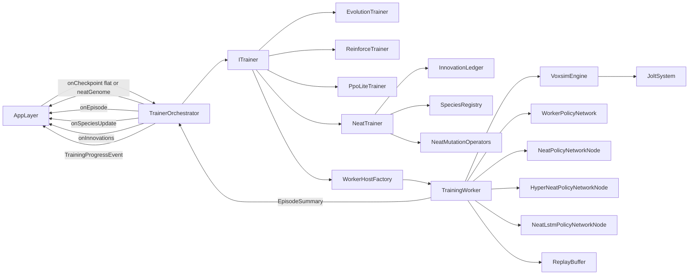

# Title

Training, Evolution, And Headless Worker Pipeline Plan

## Goal

Define the training pipeline that turns `BodyDna` plus `BrainDna` plus `TrainingDna` plus an `ArenaDefinition` into trained weight checkpoints, NEAT genomes, recorded episodes, and lineage. Training runs entirely off the render thread inside Bun/Node workers so the desktop app stays responsive during multi-hour runs. The pipeline supports fixed-topology neuroevolution as a first-cut algorithm, a small policy-gradient algorithm (`reinforce`) and `ppoLite` as alternates, and three NEAT-family algorithms (`neat`, `hyperNeat`, `neatLstm`) that evolve topology together with weights. Replays are captured per episode and stored by reference for the inspector and the replay viewer in `06-visualization-and-inspection.md`.

## Scope

- Define `TrainingDna`, `RewardSpec`, `Curriculum`, `MutationRates`, `OptimizerSpec`, `EpisodeOutcome`, `EpisodeSummary`, `TrainingRunStatus`, `TrainingProgressEvent`, `NeatTrainingConfig`, `NeatMutationRates`, `NeatStructuralMutationSpec`, validation helpers as browser-safe shared types.
- Define `ITrainer` and four implementations:
  - `EvolutionTrainer` (CMA-style and simple Gaussian-mutation variants over a fixed-topology MLP)
  - `ReinforceTrainer` (vanilla policy gradient)
  - `PpoLiteTrainer` (clipped surrogate, single-actor, no GAE in v1)
  - `NeatTrainer` (single trainer that covers all three NEAT variants `neat`, `hyperNeat`, `neatLstm`, parameterized by `TrainingDna.algorithm`)
- Define `InnovationLedger` and `SpeciesRegistry` as the supporting NEAT primitives.
- Define `WorkerPolicyNetwork` (deferred from `04-brain-and-policy-runtime.md`) using `@tensorflow/tfjs-node`.
- Define `TrainingWorker` that runs an isolated `VoxsimEngine` plus `JoltSystem` plus `MorphologyBuilder` plus a `PolicyNetwork` (either `WorkerPolicyNetwork` for fixed-topology brains or one of the three pure-JS NEAT variants) inside a Bun worker.
- Define `ReplayBuffer` capture format used by `06-visualization-and-inspection.md`'s replay viewer.
- Provide a `TrainerOrchestrator` that schedules workers, aggregates results, and emits `TrainingProgressEvent`s the application layer in `07-persistence-and-route-integration.md` consumes.

Out of scope for this step:

- Inference plumbing inside the engine. That belongs in `04-brain-and-policy-runtime.md`.
- Cytoscape, tfjs-vis, neuron activity rendering, replay player UI. Those belong in `06-visualization-and-inspection.md`.
- SurrealDB schema, REST routes, RPC adapters, and the lab/training dashboard route. Those belong in `07-persistence-and-route-integration.md`.

## Architecture

- `packages/domain/src/shared/voxsim/training`
  - Browser-safe types only. Owns `TrainingDna`, `RewardSpec`, `Curriculum`, `MutationRates`, `OptimizerSpec`, `EpisodeOutcome`, `EpisodeSummary`, `TrainingRunStatus`, `TrainingProgressEvent`, `ReplayChunkRef`, `NeatTrainingConfig`, `NeatMutationRates`, `NeatStructuralMutationSpec`, validation helpers.
- `packages/domain/src/application/voxsim/training`
  - Owns `ITrainer`, `EvolutionTrainer`, `ReinforceTrainer`, `PpoLiteTrainer`, `NeatTrainer`, `InnovationLedger`, `SpeciesRegistry`, `NeatMutationOperators`, `TrainerOrchestrator`, scoring helpers, and curriculum advancement logic.
  - Pure TypeScript. No `tfjs-node` import here. NEAT inference runs inside the worker via the pure-JS NEAT policy networks; the trainer itself only manipulates `NeatGenome` values (mutation, crossover, speciation), which is allocation-light and deterministic.
- `packages/domain/src/infrastructure/voxsim/training`
  - Owns `WorkerPolicyNetwork`, the worker-side mirrors of `NeatPolicyNetwork`, `HyperNeatPolicyNetwork`, `NeatLstmPolicyNetwork`, the `TrainingWorker` entrypoint, and the worker-side wiring of the engine in headless mode.
  - The only place in the repo that imports `@tensorflow/tfjs-node`.
  - Owns the `WorkerHostFactory` used by `TrainerOrchestrator` so application code stays free of `worker_threads` imports.
- `packages/ui/src/lib/voxsim/training`
  - Owns small browser-side helpers: `TrainingClient` (subscribes to progress events), `ReplayBuffer` reader. Inference helpers were defined in `04-brain-and-policy-runtime.md`.
- `apps/desktop-app`
  - Hosts the training worker spawn. The composition layer in `07-persistence-and-route-integration.md` injects the `WorkerHostFactory` into the application use cases.

## Implementation Plan

1. Add the new shared training subdomain.
   - `packages/domain/src/shared/voxsim/training/`
     - `index.ts`
     - `training-dna.ts`
     - `reward-spec.ts`
     - `curriculum.ts`
     - `mutation.ts`
     - `optimizer.ts`
     - `episode.ts`
     - `progress.ts`
     - `replay.ts`
     - `validation.ts`
     - `neat/`
       - `index.ts`
       - `neat-training-config.ts`
       - `neat-mutation-rates.ts`
       - `neat-structural-mutation.ts`
   - Export through `packages/domain/src/shared/voxsim/index.ts`.
2. Define `RewardSpec`.
   - `RewardSpec`:
     - `weights: { forwardVelocity?: number; uprightness?: number; energyPenalty?: number; goalProgress?: number; survivalTime?: number; foodEaten?: number; fallPenalty?: number }`
     - `forwardAxis: Vec3` world-space direction the agent should move along (default `{ x: 0, y: 0, z: 1 }`)
     - `uprightAxis: Vec3` segment-local axis expected to align with world-up (default `{ x: 0, y: 1, z: 0 }`)
     - `uprightSegmentTag: string` defaulting to `torso`
     - `terminalBonus?: number` added on `EpisodeOutcome.kind = 'goalReached'`
     - `terminalPenalty?: number` added on `EpisodeOutcome.kind = 'died'`
   - The reward is a per-step scalar plus a terminal scalar. Computation happens in the worker and is summarized into `EpisodeSummary`.
3. Define `Curriculum`.
   - `Curriculum`:
     - `stages: CurriculumStage[]`
     - `CurriculumStage`:
       - `arenaId: string`
       - `successCriterion: { metric: 'meanReward' | 'goalRate' | 'survivalSteps'; threshold: number; window: number }`
       - `maxGenerations?: number` falls back to `TrainingDna.generations`
       - `rewardOverride?: RewardSpec` allows per-stage shaping
   - Stage advancement happens in `TrainerOrchestrator` after each generation: when the rolling window over the metric meets the threshold, the next stage becomes active.
4. Define `MutationRates`, `OptimizerSpec`, and `TrainingDna`.
   - `MutationRates`:
     - `weightMutationStd: number` Gaussian std for evolution
     - `weightMutationProb: number` per-parameter probability
     - `weightCrossoverProb: number` per-parameter swap probability for two-parent crossover
     - `bodyMutationProb?: number` reserved (mutation of `BodyDna` happens in `07-persistence-and-route-integration.md` use cases, not the trainer; the rate stays on `TrainingDna` for record-keeping)
   - `OptimizerSpec` is a discriminated union:
     - `{ kind: 'sgd'; lr: number; momentum?: number }`
     - `{ kind: 'adam'; lr: number; beta1?: number; beta2?: number; epsilon?: number }`
   - `TrainingDna`:
     - `id: string`
     - `version: number`
     - `algorithm: 'evolution' | 'reinforce' | 'ppoLite' | 'neat' | 'hyperNeat' | 'neatLstm'`
     - `populationSize: number` only meaningful for `evolution`; for NEAT variants the population size lives on `neat.populationSize`
     - `eliteFraction: number` evolution; for NEAT variants the elite fraction lives on `neat.survival` and per-species
     - `generations: number` evolution, RL, and NEAT all treat this as the outer loop length
     - `episodesPerCandidate: number` how many episodes are averaged for one candidate's fitness
     - `episodeSteps: number` max steps per episode
     - `mutation: MutationRates` fixed-topology Gaussian mutation; ignored for NEAT variants
     - `optimizer?: OptimizerSpec` only meaningful for gradient methods; forbidden for NEAT variants
     - `neat?: NeatTrainingConfig` required when `algorithm` is `neat`, `hyperNeat`, or `neatLstm`; forbidden otherwise
     - `reward: RewardSpec`
     - `curriculum: Curriculum`
     - `seed: number` master seed; the trainer derives per-individual, per-mutation, and per-innovation PRNG streams from this
     - `maxConcurrentWorkers: number` cap on workers spawned by the orchestrator
     - `lineage?: LineageRef`
     - `metadata: { name: string; createdAt: string; updatedAt: string; author: string }`
4a. Define `NeatTrainingConfig` and `NeatMutationRates`.
   - `NeatTrainingConfig`:
     - `populationSize: number`
     - `eliteFraction: number` per-species elite preservation rate
     - `speciation:`
       - `compatibilityThreshold: number` Stanley-Miikkulainen δ_t
       - `c1ExcessCoeff: number` weight on excess gene count
       - `c2DisjointCoeff: number` weight on disjoint gene count
       - `c3WeightCoeff: number` weight on average matching-gene weight delta
       - `targetSpeciesCount?: number` if set, the registry adjusts `compatibilityThreshold` toward this count each generation
       - `thresholdAdjustStep?: number` step size for the auto-adjust (default `0.3`)
     - `mutation: NeatMutationRates`
     - `crossover:`
       - `interspeciesProb: number` probability that an offspring is produced from parents of different species
       - `disabledGeneInheritsDisabledProb: number` probability that a connection disabled in either parent stays disabled in the offspring
     - `survival:`
       - `stagnationCutoffGenerations: number` species with no fitness improvement for this many generations are culled
       - `minSpeciesSize: number` species smaller than this are merged into the closest neighbor by representative distance
     - `cppn?: { phenotypeRebuildEachGeneration: boolean }` HyperNEAT only; forces phenotype rebuild even if the CPPN genome is unchanged (useful when the substrate is mutated outside the trainer)
     - `lstm?: { resetCellStateOnEpisodeStart: boolean; gateInitWeightStd: number }` NEAT-LSTM only
   - `NeatMutationRates`:
     - `weightPerturbProb: number` per-connection
     - `weightPerturbStd: number` std of the Gaussian perturbation applied per perturbed weight
     - `weightReplaceProb: number` per-connection probability of full replacement (sampled uniformly from `[-initialWeightRange, +initialWeightRange]`)
     - `addConnectionProb: number` per-genome probability per generation of adding a single new connection (between two non-connected nodes that respect `allowRecurrent`)
     - `addNodeProb: number` per-genome probability of splitting a connection by inserting a hidden node
     - `toggleEnabledProb: number` per-connection probability of flipping `enabled`
     - `addLstmNodeProb?: number` only valid for `neatLstm`; per-genome probability of inserting a new LSTM node
     - `initialWeightRange: number` symmetric uniform range used for new weights and replacement
   - `NeatStructuralMutationSpec` (used by the `MutateAgent` use case in plan 07 to manually inject a structural mutation between runs) is a discriminated union: `{ kind: 'addNode'; connectionInnovation: number }`, `{ kind: 'addConnection'; sourceNodeId: number; targetNodeId: number }`, `{ kind: 'toggleEnabled'; connectionInnovation: number }`, `{ kind: 'addLstmNode' }`.
5. Define episode and progress shapes.
   - `EpisodeOutcome`:
     - `kind: 'survived' | 'died' | 'goalReached' | 'timedOut'`
     - `deathCause?: 'tilt' | 'hazard' | 'timeout' | 'manual'`
   - `EpisodeSummary`:
     - `id: string`
     - `runId: string`
     - `agentId: string`
     - `bodyDnaId: string`
     - `brainDnaId: string`
     - `checkpointRef?: CheckpointRef` discriminated pointer from `04-brain-and-policy-runtime.md` (replaces the earlier `weightCheckpointRefId` field; both `flat` and `neatGenome` kinds are supported)
     - `arenaId: string`
     - `generation: number`
     - `candidateIndex: number`
     - `speciesId?: number` only set on NEAT runs
     - `seed: number`
     - `outcome: EpisodeOutcome`
     - `totalReward: number`
     - `meanReward: number`
     - `steps: number`
     - `replayRef?: ReplayChunkRef`
     - `metricBreakdown: { forwardVelocity: number; uprightness: number; energyPenalty: number; goalProgress: number; survivalTime: number; foodEaten: number; fallPenalty: number }`
   - `TrainingRunStatus`:
     - `idle | starting | running | paused | stopping | completed | failed`
   - `TrainingProgressEvent` is a discriminated union:
     - `{ kind: 'runStarted'; runId; status; startedAt }`
     - `{ kind: 'generationStarted'; runId; generation; arenaId }`
     - `{ kind: 'episodeFinished'; runId; episode: EpisodeSummary }`
     - `{ kind: 'generationFinished'; runId; generation; aggregateScore; eliteCheckpointRefs: CheckpointRef[] }` (replaces the earlier `eliteCheckpointRefIds: string[]`; entries can be either `flat` or `neatGenome` per the discriminator)
     - `{ kind: 'curriculumAdvanced'; runId; fromStageIndex; toStageIndex }`
     - `{ kind: 'runFinished'; runId; status; finishedAt; bestCheckpointRef: CheckpointRef }`
     - `{ kind: 'runFailed'; runId; status; reason }`
     - `{ kind: 'speciesUpdated'; runId; generation; species: { id: number; size: number; bestScore: number; meanScore: number; stagnation: number; representativeGenomeId: string }[] }` NEAT only
     - `{ kind: 'innovationsAssigned'; runId; generation; addedConnections: { innovation: number; sourceNodeId: number; targetNodeId: number }[]; addedNodes: { innovation: number; splitConnectionInnovation: number }[] }` NEAT only
6. Define `ReplayChunkRef` and the replay format.
   - `ReplayChunkRef`:
     - `id: string`
     - `episodeId: string`
     - `frames: number`
     - `bytes: number`
   - Replay format (compact, designed for worker → DB → viewer transport):
     - per-frame:
       - `stepIndex: u32`
       - per-segment `Transform` flattened to 7 floats (`px, py, pz, qx, qy, qz, qw`)
       - per-actuator action value (one float each, length = `ActuatorMap.actuators.length`)
       - per-sensor observation values (length = `inputEncoder.totalWidth()`)
     - frames are sampled at a configurable `replaySampleStride` (default `2`, that is every other physics step)
   - Encoded as a single `Uint8Array` per episode using a small header (`bodyDnaId`, `brainDnaId`, `arenaId`, `frameCount`, `segmentCount`, `actionWidth`, `observationWidth`, `sampleStride`) followed by the contiguous frame payload.
   - `ReplayBuffer.write(frame)` appends without per-frame allocation.
7. Add validation helpers in `packages/domain/src/shared/voxsim/training/validation.ts`.
   - `validateTrainingDna(dna: TrainingDna, brain?: BrainDna): TrainingDnaValidationResult`
   - Rules:
     - `populationSize > 0` when `algorithm = 'evolution'`
     - `eliteFraction in (0, 1]` when `algorithm = 'evolution'`
     - `optimizer` is required when `algorithm` is `reinforce` or `ppoLite`; forbidden when `algorithm` is a NEAT variant
     - `generations`, `episodesPerCandidate`, `episodeSteps`, `maxConcurrentWorkers` are positive integers
     - reward weights are finite numbers
     - curriculum has at least one stage
     - all `arenaId`s referenced by the curriculum are valid (callers pass an arena id resolver)
     - When `algorithm` is `neat`, `hyperNeat`, or `neatLstm`:
       - `neat` config is required; all rate fields finite and in `[0, 1]`
       - `neat.populationSize > 0`, `neat.eliteFraction in (0, 1]`
       - `neat.speciation.compatibilityThreshold > 0`
       - `neat.speciation.targetSpeciesCount`, if set, is a positive integer
     - When `algorithm === 'hyperNeat'` and `brain` is supplied, `brain.neat?.cppnSubstrate` must exist
     - When `algorithm === 'neatLstm'`, `neat.mutation.addLstmNodeProb` must be defined and `neat.lstm` must exist
8. Define `ITrainer`.
   - `ITrainer`:
     - `id: string`
     - `kind: 'evolution' | 'reinforce' | 'ppoLite' | 'neat' | 'hyperNeat' | 'neatLstm'`
     - `start(input: TrainerStartInput): Promise<TrainingRunHandle>`
     - `pause(handle: TrainingRunHandle): Promise<void>`
     - `resume(handle: TrainingRunHandle): Promise<void>`
     - `stop(handle: TrainingRunHandle): Promise<void>`
     - `subscribe(handle: TrainingRunHandle, listener: (e: TrainingProgressEvent) => void): Unsubscribe`
   - `TrainerStartInput`:
     - `runId: string`
     - `bodyDna: BodyDna`
     - `brainDna: BrainDna`
     - `trainingDna: TrainingDna`
     - `initialWeights?: Float32Array` only for fixed-topology brains
     - `initialGenomes?: NeatGenome[]` only for NEAT variants; if absent, the trainer samples a minimal initial population
     - `arenaResolver: (arenaId: string) => Promise<ArenaDefinition>`
     - `onCheckpoint: (ref: CheckpointRef, payload: { kind: 'flat'; weights: Float32Array } | { kind: 'neatGenome'; genome: NeatGenome }) => Promise<void>` injected by the application layer in `07-persistence-and-route-integration.md`; the discriminator on `payload.kind` matches `ref.kind`
     - `onEpisode: (summary: EpisodeSummary, replay?: Uint8Array) => Promise<void>` injected by the application layer
     - `onSpeciesUpdate?: (e: Extract<TrainingProgressEvent, { kind: 'speciesUpdated' }>) => Promise<void>` optional NEAT-only persistence hook for species snapshots
     - `onInnovations?: (e: Extract<TrainingProgressEvent, { kind: 'innovationsAssigned' }>) => Promise<void>` optional NEAT-only persistence hook for innovation logs
9. Implement `TrainerOrchestrator`.
   - The single entry point used by the application layer.
   - Selects an `ITrainer` based on `trainingDna.algorithm` (`evolution → EvolutionTrainer`, `reinforce → ReinforceTrainer`, `ppoLite → PpoLiteTrainer`, `neat | hyperNeat | neatLstm → NeatTrainer`).
   - Owns the worker pool: spawns up to `trainingDna.maxConcurrentWorkers` workers per generation (one worker per candidate for evolution and NEAT variants, one worker for the actor in `reinforce` and `ppoLite`).
   - Aggregates per-candidate `EpisodeSummary[]` into a fitness scalar using `metricBreakdown` weighted by `RewardSpec.weights`.
   - Drives curriculum advancement.
   - Emits `TrainingProgressEvent`s on the subscription.
   - Persists checkpoints by calling `onCheckpoint` (using the right `CheckpointRef.kind` per algorithm), episodes by calling `onEpisode`, and (for NEAT runs) species snapshots and innovation logs via `onSpeciesUpdate` and `onInnovations`.
10. Implement `EvolutionTrainer`.
    - Initialization:
      - construct a population of `populationSize` weight buffers seeded from `TrainingDna.seed` with per-individual seed offsets
      - if `initialWeights` is provided, the first individual is exactly that buffer
    - Per generation:
      - dispatch one `TrainingWorker` evaluation per individual (capped by `maxConcurrentWorkers`)
      - aggregate `episodesPerCandidate` summaries per individual into a mean fitness
      - select top `eliteFraction * populationSize` individuals by fitness; persist each via `onCheckpoint`
      - produce next generation:
        - elites pass through unchanged
        - the remainder is filled by Gaussian mutation (`weightMutationStd`, `weightMutationProb`) of randomly chosen elites, with optional two-parent crossover (`weightCrossoverProb`)
      - emit `generationFinished`
    - Curriculum check after each generation; advance stage on success criterion.
    - After `generations` generations or curriculum exhaustion, persist the best individual's checkpoint and emit `runFinished`.
11. Implement `ReinforceTrainer` and `PpoLiteTrainer`.
    - Both run a single actor inside a single worker.
    - The worker collects `episodesPerCandidate` episodes per outer iteration and returns flat trajectories (`observations`, `actions`, `rewards`, `dones`).
    - The trainer process applies the policy gradient or clipped surrogate update using `tfjs-node` (the worker hosts the model; the trainer issues `setWeights`/`getWeights` and runs gradient computation either in-worker or in a dedicated learner worker depending on cost).
    - For v1, the optimizer step happens in the same worker as the actor for simplicity. A learner-actor split is reserved.
    - Each outer iteration ends with a `generationFinished` event (`generation` here is interpreted as `iteration`) and a checkpoint persist.
11a. Implement `InnovationLedger`.
    - Lives in `packages/domain/src/application/voxsim/training/neat/InnovationLedger.ts`.
    - Per-run instance keyed by `runId` so the same structural mutation in the same generation reuses the same innovation number across the population (matches Stanley-Miikkulainen).
    - API:
      - `getOrAssignConnectionInnovation(sourceNodeId: number, targetNodeId: number, generation: number): number`
      - `getOrAssignNodeInnovation(splitConnectionInnovation: number, generation: number): number` returns the new global node id; the trainer uses this to populate `NeatNodeGene.id` for the inserted hidden node
      - `snapshotForGeneration(generation: number): { addedConnections: { innovation; sourceNodeId; targetNodeId }[]; addedNodes: { innovation; splitConnectionInnovation }[] }` used by the orchestrator to emit `innovationsAssigned`
      - `serialize(): InnovationLedgerSnapshot` and `restore(snapshot)` so a paused run resumes with the same innovation map
    - Internal map keyed by `(source, target)` for connections and by `splitConnectionInnovation` for nodes; both are reset only at run boundaries, never per generation.
11b. Implement `SpeciesRegistry`.
    - Lives in `packages/domain/src/application/voxsim/training/neat/SpeciesRegistry.ts`.
    - API:
      - `assign(genome: NeatGenome, fitness: number, generation: number): number` returns `speciesId`; uses the compatibility distance δ = `c1*E/N + c2*D/N + c3*W̄` with the coefficients from `NeatTrainingConfig.speciation`. If no existing representative is within `compatibilityThreshold`, a new species is created with this genome as representative.
      - `representativeFor(speciesId: number): NeatGenome` representative is the random member of the species at the start of the generation
      - `adjustThreshold(currentSpeciesCount: number): void` if `targetSpeciesCount` is set, nudges `compatibilityThreshold` by `±thresholdAdjustStep` toward the target
      - `pruneStagnant(stagnationCutoffGenerations: number): number[]` returns culled species ids; tracks per-species best fitness over time
      - `mergeSmallSpecies(minSpeciesSize: number): void` merges species below `minSpeciesSize` into the closest neighbor by representative compatibility distance
      - `snapshot(): { id; size; bestScore; meanScore; stagnation; representativeGenomeId }[]` used by the orchestrator to emit `speciesUpdated`
11c. Implement `NeatMutationOperators`.
    - Pure functions, no class state; all mutations take `(genome, ledger, prng, rates) => NeatGenome` and return a new genome (cloned to keep the parent immutable for inspector diffs).
    - `mutateWeights(genome, rates, prng)`: per connection, with `weightPerturbProb` adds `Gaussian(0, weightPerturbStd)`; with `weightReplaceProb` resamples uniformly in `[-initialWeightRange, +initialWeightRange]`.
    - `mutateAddConnection(genome, ledger, allowRecurrent, prng, generation)`: picks two non-connected nodes (respecting DAG constraint when `!allowRecurrent`), allocates the connection innovation via the ledger.
    - `mutateAddNode(genome, ledger, prng, generation)`: picks an enabled connection, disables it, inserts a new hidden node (id from `ledger.getOrAssignNodeInnovation(connection.innovation, generation)`), creates two new connections (input → newNode with weight `1`, newNode → output with weight `connection.weight`); registers two new connection innovations.
    - `mutateAddLstmNode(genome, ledger, prng, generation)`: like `mutateAddNode` but the inserted node has `kind: 'lstm'`; the four incoming gate connections are created with `lstmGate` set and weights sampled from `Gaussian(0, lstm.gateInitWeightStd)`.
    - `mutateToggleEnabled(genome, rates, prng)`.
    - `crossover(parentA, parentB, fitnessA, fitnessB, rates, prng)`: aligns connections by `innovation` (matching, disjoint, excess); matching genes inherit randomly; disjoint and excess inherit from the more-fit parent (tie → random); a connection disabled in either parent stays disabled with `disabledGeneInheritsDisabledProb`.
11d. Implement `NeatTrainer` (single class implementing `ITrainer`).
    - Lives in `packages/domain/src/application/voxsim/training/neat/NeatTrainer.ts`.
    - `start(input)`:
      - Constructs an `InnovationLedger` keyed by `runId`.
      - Constructs a `SpeciesRegistry`.
      - Builds the initial population:
        - For `neat` and `neatLstm`: minimal genomes with `inputEncoder.totalWidth()` input nodes (bound by `inputBindingId`) plus one bias node, `outputDecoder.totalWidth()` output nodes (bound by `outputBindingId`), and every input fully connected to every output with weights sampled uniformly in `[-initialWeightRange, +initialWeightRange]`. For `neatLstm`, no LSTM nodes are inserted in the initial population; they appear via `mutateAddLstmNode`.
        - For `hyperNeat`: a minimal CPPN genome over synthetic inputs `(sourceX, sourceY, sourceZ, targetX, targetY, targetZ)` plus a bias, with one output for the queried weight and (if `bias.fromCppnOutputIndex` is used) a second output for the queried bias. The CPPN is itself a minimal NEAT genome under the `CppnActivationKind` superset.
      - Falls back to `initialGenomes` when the caller supplies them (lineage-aware restart).
    - Per generation:
      - Dispatches one worker `evaluate` per genome (capped by `maxConcurrentWorkers`); the worker evaluates `episodesPerCandidate` episodes of `episodeSteps` ticks and returns `EpisodeSummary[]` plus optional replay payloads.
      - Aggregates each genome's `EpisodeSummary[]` into a fitness scalar via the same `RewardSpec.weights` weighting used by the other trainers.
      - Speciates every genome via `SpeciesRegistry.assign`. Emits `speciesUpdated` after speciation.
      - Applies explicit fitness sharing: `adjustedFitness = fitness / speciesSize`.
      - Allocates offspring slots per species proportional to `sum(adjustedFitness)` per species.
      - Reproduces per species:
        - Copies `floor(eliteFraction * speciesSize)` top elites unchanged.
        - Fills remainder by crossover (with intra-species probability `1 - interspeciesProb`, otherwise picks the second parent from another species) followed by mutation (`mutateWeights`, then with their respective probabilities `mutateAddConnection`, `mutateAddNode`, `mutateAddLstmNode`, `mutateToggleEnabled`).
      - Calls `SpeciesRegistry.pruneStagnant` and `SpeciesRegistry.mergeSmallSpecies` after reproduction, then `SpeciesRegistry.adjustThreshold` if `targetSpeciesCount` is set.
      - Persists the best-of-generation genome (and one representative genome per surviving species) via `onCheckpoint` with `CheckpointRef.kind: 'neatGenome'`. Persists species snapshots via `onSpeciesUpdate` and any newly-assigned innovations via `onInnovations` (using `InnovationLedger.snapshotForGeneration`).
      - Emits `generationFinished` with `eliteCheckpointRefs` covering all persisted elites.
    - Phenotype build per variant (delegated to the worker; the trainer process never builds a phenotype itself):
      - `neat`: the worker's `NeatPolicyNetwork.setGenome` directly uses the genome graph.
      - `hyperNeat`: the worker's `HyperNeatPolicyNetwork.setGenome` rebuilds the phenotype connection list by querying the CPPN at every `(sourceCoord, targetCoord)` substrate pair and pruning by `weightThreshold`. When `cppn.phenotypeRebuildEachGeneration === true`, the worker rebuilds even if the CPPN genome is structurally unchanged.
      - `neatLstm`: the worker's `NeatLstmPolicyNetwork.setGenome` allocates the per-agent `LstmCellState`; if `lstm.resetCellStateOnEpisodeStart === true`, the worker calls `policy.resetEpisodeState()` at episode start.
    - `pause`/`resume`/`stop` snapshot the `InnovationLedger` and `SpeciesRegistry` state so resume produces identical innovation ids.
12. Implement `WorkerPolicyNetwork` (deferred from `04-brain-and-policy-runtime.md`).
    - Lives in `packages/domain/src/infrastructure/voxsim/training/WorkerPolicyNetwork.ts`.
    - Builds a `tf.sequential` model using `@tensorflow/tfjs-node`.
    - Implements the same `PolicyNetwork` interface byte-for-byte; tests in `04-brain-and-policy-runtime.md` apply here too via a shared interface conformance suite.
    - The `init` path uses the same JS-side PRNG seeded from `BrainDna.seed` to keep weights byte-identical with the browser implementation.
13. Implement `TrainingWorker`.
    - Lives in `packages/domain/src/infrastructure/voxsim/training/training-worker.ts`.
    - Spawned as a Bun worker via `new Worker(new URL('./training-worker.ts', import.meta.url), { type: 'module' })` from `WorkerHostFactory`.
    - On `init` message (`TrainingWorkerInit`):
      - constructs a headless `VoxsimEngine` (no Three renderer; uses the engine's headless mode from `01-voxel-world-and-domain.md`)
      - constructs a `JoltSystem` instance
      - calls `engine.loadArena(arena)` and the chunk colliders are baked
      - constructs the right `PolicyNetwork` based on `BrainDna.topology`:
        - `mlp`/`recurrentMlp` → `WorkerPolicyNetwork` (TFJS-Node)
        - `neat` → `NeatPolicyNetworkNode` (pure JS)
        - `hyperNeat` → `HyperNeatPolicyNetworkNode`
        - `neatLstm` → `NeatLstmPolicyNetworkNode`
      - calls `MorphologyBuilder.build` per agent
    - On `evaluate` message (`TrainingWorkerEvaluate`):
      - the payload's `policy` field is a discriminated union: `{ kind: 'flat'; weights: Float32Array }` for fixed-topology brains or `{ kind: 'neatGenome'; genome: NeatGenome }` for NEAT variants
      - the worker dispatches to `policyNetwork.setWeights` or `policyNetwork.setGenome` accordingly
      - runs `episodesPerCandidate` episodes of `episodeSteps` ticks each, capturing reward and replay frames; calls `policyNetwork.resetEpisodeState()` at episode start
      - returns `EpisodeSummary[]` and per-episode replay payloads (the replay header gains `policyKind: 'mlp' | 'recurrentMlp' | 'neat' | 'hyperNeat' | 'neatLstm'` so the replay viewer in plan 06 can reconstruct the right inspector)
    - On `dispose` message:
      - tears down the engine, the morphology, and the policy network
    - The worker holds no DB connection; persistence happens in the orchestrator via the injected `onCheckpoint` and `onEpisode` callbacks.
14. Implement `WorkerHostFactory`.
    - `WorkerHostFactory.create(workerScriptUrl: URL): WorkerHost`
    - `WorkerHost`:
      - `init(input: TrainingWorkerInit): Promise<void>`
      - `evaluate(input: TrainingWorkerEvaluate): Promise<TrainingWorkerEvaluateResult>`
      - `dispose(): Promise<void>`
    - The default factory uses `worker_threads` (Node) or `Worker` (Bun); both expose `postMessage` and `MessageEvent` so the wrapper hides the difference.
    - Tests can inject an in-process fake `WorkerHostFactory` that runs the worker code synchronously in the test process.
15. Reward computation.
    - Per-step reward computed by the worker after `SensorSystem` and `ActuatorSystem`:
      - `forwardVelocity`: dot product of root segment velocity and `RewardSpec.forwardAxis`
      - `uprightness`: dot product of `uprightSegmentTag` segment local-up and world-up
      - `energyPenalty`: negative `||action||_2` weighted by `weights.energyPenalty`
      - `goalProgress`: change in negative distance to nearest `goalMarker` entity
      - `survivalTime`: `+1` per step
      - `foodEaten`: `+1` per `entityConsumed` event matching `foodPile`
      - `fallPenalty`: applied on `agentDied` with `deathCause = 'tilt'` or contact with hazard voxels
    - Weighted sum produces the per-step scalar; running totals form `metricBreakdown` and `totalReward` in `EpisodeSummary`.
16. Replay capture.
    - Worker constructs a `ReplayBuffer` per episode sized for `episodeSteps / sampleStride` frames.
    - On every `sampleStride`-th step, it appends segment transforms, action, and observation to the buffer.
    - At episode end, it returns the encoded `Uint8Array` along with the `EpisodeSummary`.
    - Sampling stride is configurable via `TrainingDna.replaySampleStride` (default `2`); a `replaySampleStride: 0` disables replay capture entirely.

## Tests

- Pure shared-type tests in `packages/domain/src/shared/voxsim/training/`.
  - `validateTrainingDna` covers the rules above.
  - Replay encoding round-trips: a synthetic frame stream encodes to `Uint8Array` and decodes to identical frames.
- Application-layer tests in `packages/domain/src/application/voxsim/training/`.
  - Use an in-process fake `WorkerHostFactory` that runs the worker code synchronously and records messages.
  - `EvolutionTrainer`:
    - same seed and same in-fake worker produces identical generation 0 weights byte-for-byte
    - elite selection picks the top `eliteFraction` by fitness
    - mutation respects `weightMutationStd` and `weightMutationProb`
    - crossover honors `weightCrossoverProb`
    - curriculum advances when the success criterion passes inside the rolling window
  - `ReinforceTrainer` and `PpoLiteTrainer`:
    - given a deterministic in-fake worker that returns scripted trajectories, the optimizer update is correct (compared against a reference implementation using small fixed inputs)
    - both emit `generationFinished` per outer iteration and `runFinished` at the end
  - `TrainerOrchestrator`:
    - dispatches at most `maxConcurrentWorkers` evaluations in parallel
    - calls `onCheckpoint` for every elite per generation
    - calls `onEpisode` for every completed episode
    - emits a strict ordering of `runStarted` → `generationStarted` → `episodeFinished*` → `generationFinished` → ... → `runFinished`
- Worker tests in `packages/domain/src/infrastructure/voxsim/training/`.
  - `TrainingWorker`:
    - end-to-end against a tiny `flat-arena` and a 4-segment biped, with `episodeSteps = 30`, returns finite reward and a non-empty replay payload (covers fixed-topology MLP, `neat`, `hyperNeat`, `neatLstm` payload variants)
  - `WorkerPolicyNetwork`:
    - implements the `PolicyNetwork` conformance suite from `04-brain-and-policy-runtime.md`
    - produces `getWeights()` byte-identical to a freshly-initialized `TfjsPolicyNetwork` for the same `BrainDna.seed`
- NEAT-specific tests in `packages/domain/src/application/voxsim/training/neat/`.
  - `InnovationLedger`:
    - assigns the same id for the same `(source, target)` pair within a run and a different id across runs
    - assigns the same node innovation for the same `splitConnectionInnovation` within a run
    - serialize/restore round-trip preserves all assignments
  - `SpeciesRegistry`:
    - two genomes with low compatibility distance share a species; two with high distance do not
    - `adjustThreshold` nudges `compatibilityThreshold` toward `targetSpeciesCount` by `thresholdAdjustStep` per generation
    - `pruneStagnant` returns species that exceeded `stagnationCutoffGenerations` without best-score improvement
    - `mergeSmallSpecies` merges into the closest neighbor by representative compatibility distance
  - `NeatMutationOperators`:
    - `mutateAddNode` splits a connection (disables the original, adds two new connections through a fresh hidden node) and the ledger registers exactly one node innovation
    - `mutateAddConnection` respects DAG when `allowRecurrent === false`
    - `crossover` aligned matching genes inherit randomly; disjoint and excess inherit from the more-fit parent; disabled gene inheritance respects `disabledGeneInheritsDisabledProb`
    - `mutateAddLstmNode` only fires when `algorithm === 'neatLstm'`; gate weights respect `lstm.gateInitWeightStd`
  - `NeatTrainer`:
    - generation 0 minimal genomes are deterministic for a given seed and brain encoder/decoder shape
    - emits `speciesUpdated` and `innovationsAssigned` per generation
    - persists at least the best-of-generation genome via `onCheckpoint` with `CheckpointRef.kind === 'neatGenome'`
    - HyperNEAT phenotype rebuild deterministic for the same CPPN
    - NEAT-LSTM cell state reset clears buffers between episodes when `lstm.resetCellStateOnEpisodeStart === true`
- Use `bun:test`. Worker tests run inside the parent process via the fake host factory; only one smoke test per algorithm family actually spawns a real worker.

## Acceptance Criteria

- Training never runs on the render thread. Browser code only subscribes to `TrainingProgressEvent`s.
- `TrainingDna` is a stable browser-safe contract that fully describes a training run, across all six algorithm variants.
- Genomes (`BodyDna`, `BrainDna`, `TrainingDna`, `NeatGenome`) and learned weights are persisted independently per the user requirement.
- The orchestrator can run `evolution`, `reinforce`, `ppoLite`, `neat`, `hyperNeat`, and `neatLstm` algorithms through one `ITrainer` interface.
- Replays are captured per episode and stored by reference so the inspector can play them back without re-running physics. Replay headers carry `policyKind` so the inspector reconstructs the right view.
- The worker entrypoint is the only code in the repository that imports `@tensorflow/tfjs-node`. The three NEAT-variant policy networks are pure JS in both browser and worker, so NEAT runs do not pull TFJS at all.
- The trainer's progress stream and persistence callbacks form the only contract between the training pipeline and the application layer in `07-persistence-and-route-integration.md`. NEAT runs add `onSpeciesUpdate` and `onInnovations` to that contract, both optional.

## Dependencies

- `01-voxel-world-and-domain.md` provides `VoxsimEngine` headless mode, `ArenaDefinition`, ECS primitives.
- `02-jolt-physics-boundary.md` provides `JoltSystem`.
- `03-morphology-joints-and-dna.md` provides `MorphologyBuilder`, `BodyDna`, sensors, actuators, death rules.
- `04-brain-and-policy-runtime.md` provides `BrainDna`, `WeightLayout`, the `PolicyNetwork` interface, and the JS-side weight initializer.
- Planned package adoption:
  - `@tensorflow/tfjs-node` (worker only)
  - existing Bun runtime; `worker_threads` fallback for Node
- Reference docs the implementation should align with:
  - [TensorFlow.js Node](https://github.com/tensorflow/tfjs/tree/master/tfjs-node)
  - [PPO original paper](https://arxiv.org/abs/1707.06347) (algorithm reference, not bundled)

## Risks / Notes

- Cross-machine determinism is not promised. Per-worker reproducibility is the contract; persisted seeds, innovation ledger snapshots, and replays let any run be re-evaluated on the same machine.
- TFJS gradient computation in pure JS is slow. The first cut accepts that and uses small networks (a few thousand parameters). A native learner can be added later behind the same `ITrainer` interface.
- Worker startup cost is non-trivial (WASM init, model build). The orchestrator keeps workers alive across evaluations and re-uses them by reusing the `evaluate` message instead of spawning new processes per candidate.
- Replay storage can grow fast. The default `replaySampleStride = 2` halves the size; setting `replaySampleStride = 0` disables capture for runs that do not need replays.
- Evolution operates on the brain weights only in v1. Body mutation lives in application use cases (`07-persistence-and-route-integration.md`) so a single training run does not redefine its own body mid-flight.
- Curriculum design is the single biggest predictor of whether training works at all. The plan ships an obstacle-free `flat-arena` first stage to catch the most common failure (agents that cannot even stand) before adding terrain.
- NEAT populations diverge fast; without speciation, new structures get killed by older ones with already-tuned weights. Speciation is non-optional even though it costs code.
- Innovation numbers are global per run, not global across runs. Cross-run lineage is handled at the agent level in plan 07 (via `lineage`), not via shared innovation ids.
- HyperNEAT substrate design is the dominant predictor of training success. The plan ships a `grid2d` substrate template for a biped (one row per joint plus a bias coord); users can author bespoke substrates later via the agent editor.
- NEAT-LSTM grows the search space substantially (gate-typed connections, per-agent cell state). It is documented as the most expensive variant; tuning `addLstmNodeProb` low and starting from a curriculum stage that already requires memory (e.g. delayed reward) is the recommended approach.
- NEAT genome JSON can grow with run length because innovation ids monotonically increase. Storage stays bounded per agent because the trainer only persists elite genomes per generation, not the full population.

## Handoff

- `06-visualization-and-inspection.md` consumes `TrainingProgressEvent` (including the new `speciesUpdated` and `innovationsAssigned` variants), `EpisodeSummary`, `ReplayChunkRef`, and `policyKind` from replay headers for charts, inspector overlays, the replay viewer, the species panel, and the mutation-diff overlay.
- `07-persistence-and-route-integration.md` consumes `WorkerHostFactory`, `TrainerOrchestrator`, `TrainingDna`, `WeightCheckpointRef`, `CheckpointRef`, and the `onCheckpoint`/`onEpisode`/`onSpeciesUpdate`/`onInnovations` callbacks; provides Surreal repositories for runs, episodes, replays, weight checkpoints, NEAT genomes, NEAT species, and innovation logs; routes the lab dashboard at `routes/experiments/voxsim/lab`.
