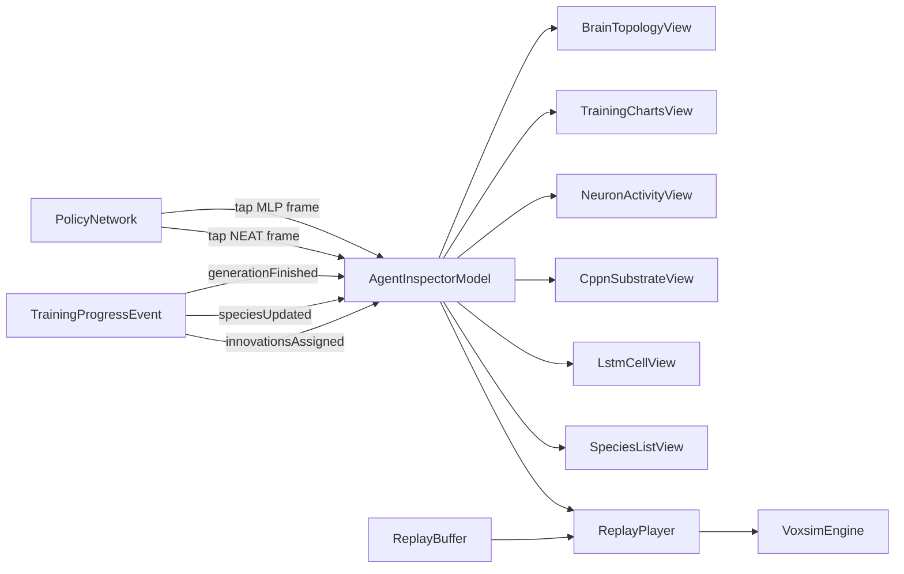

# Title

Visualization And Inspection: Topology, Charts, Neuron Activity, And Replay Plan

## Goal

Make brains and training visible. The agent inspector binds five complementary views to the same selected `Agent`: a Cytoscape brain topology graph (with NEAT-aware layout, species coloring, and disabled-edge styling), tfjs-vis training charts (with a NEAT species panel), a custom Canvas neuron activity panel inspired by TensorFlow Playground, a `CppnSubstrateView` for HyperNEAT phenotypes, and a `LstmCellView` for NEAT-LSTM cell internals. A separate replay viewer reuses the `VoxsimEngine` in `preview` mode to play back stored episodes from `05-training-evolution-and-workers.md` without re-running physics; the replay header's `policyKind` field tells the inspector which views to mount. Each tool has a clear job; together they answer "what is this brain made of?", "how is training going?", "what is each neuron doing right now?", and (for NEAT runs) "what does evolution look like across species and generations?".

## Scope

- Define the `AgentInspectorModel` that the routes in `07-persistence-and-route-integration.md` consume.
- Implement view models and corresponding Svelte components in `packages/ui/src/lib/voxsim/inspector/`:
  - `BrainTopologyView` (Cytoscape) — handles fixed-topology MLPs, classic NEAT, NEAT-LSTM, and the HyperNEAT CPPN itself
  - `TrainingChartsView` (tfjs-vis) — adds NEAT species panel and innovation-count chart
  - `NeuronActivityView` (custom Canvas/WebGL)
  - `CppnSubstrateView` (custom Canvas) — HyperNEAT-only
  - `LstmCellView` (custom Canvas) — NEAT-LSTM-only
  - `SpeciesListView` — NEAT-only sidebar
- Implement the `ReplayPlayer` and `ReplayViewer` Svelte component using the engine in `preview` mode; mount NEAT-specific views when `policyKind` is a NEAT variant.
- Widen the mutation diff overlay so add-node and add-connection events are legible alongside the existing weight-only diff for fixed MLPs.
- Provide a small data-flow contract that lets the inspector attach to either a live `Agent` (live tap on `PolicyNetwork`) or a replayed `Agent` (frame-by-frame from a `ReplayBuffer`).

Out of scope for this step:

- Engine, physics, morphology, brain, training, persistence, and routes. Those belong in plans 01, 02, 03, 04, 05, and 07.
- Long-term storage of inspector view state and chart presets. Those belong in `07-persistence-and-route-integration.md` (per-route page model).

## Architecture

- `packages/ui/src/lib/voxsim/inspector`
  - Owns `AgentInspectorModel`, `BrainTopologyView`, `TrainingChartsView`, `NeuronActivityView`, `CppnSubstrateView`, `LstmCellView`, `SpeciesListView`, and `ReplayPlayer`.
  - Depends only on the engine surface from `01-voxel-world-and-domain.md`, the brain types from `04-brain-and-policy-runtime.md` (via the local mirror, including `BrainDna.topology` and `NeatGenome` mirrors), the training event types from `05-training-evolution-and-workers.md` (via the local mirror, including `speciesUpdated` and `innovationsAssigned`), `cytoscape`, `cytoscape-cose-bilkent` for force layout on NEAT graphs, `@tensorflow/tfjs-vis`, and `@tensorflow/tfjs` for fixed-topology activation taps. NEAT activation taps need no TFJS.
  - Local types mirror lives in `packages/ui/src/lib/voxsim/inspector/types.ts`.
- `packages/domain/src/shared/voxsim/inspector`
  - Browser-safe types only. Owns `InspectorBrainNode`, `InspectorBrainEdge`, `InspectorBrainGraph`, `InspectorChartSeries`, `InspectorActivationFrame`, `MlpActivationFrame`, `NeatActivationFrame`, `InspectorReplayCursor`, `InspectorSpeciesSnapshot`, `InspectorMutationDiff`.
  - Re-exports through `packages/domain/src/shared/voxsim/index.ts`.
- `packages/ui/src/lib/voxsim/inspector/components`
  - Svelte components: `<BrainTopologyPanel />`, `<TrainingChartsPanel />`, `<NeuronActivityPanel />`, `<CppnSubstratePanel />`, `<LstmCellPanel />`, `<SpeciesListPanel />`, `<ReplayViewer />`, `<AgentInspector />` orchestrator.
  - All components are layout-only per the clean-architecture rule. Logic lives in `.svelte.ts` view models.
  - The orchestrator dynamically mounts panels based on `BrainDna.topology` (or replay `policyKind`): MLP gets topology + charts + activity, NEAT adds the species panel and the diff overlay, NEAT-LSTM adds the LSTM cell panel, HyperNEAT adds the CPPN substrate panel.

## Implementation Plan

1. Add the new shared inspector subdomain.
   - `packages/domain/src/shared/voxsim/inspector/`
     - `index.ts`
     - `brain-graph.ts`
     - `chart-series.ts`
     - `activation-frame.ts`
     - `replay-cursor.ts`
     - `species-snapshot.ts`
     - `mutation-diff.ts`
   - Export through `packages/domain/src/shared/voxsim/index.ts`.
2. Define `InspectorBrainGraph` types.
   - `InspectorBrainNode`:
     - `id: string` deterministic, for example `input_3`, `dense_0_unit_5`, `neat_node_42`, or `cppn_node_7`
     - `kind: 'input' | 'hidden' | 'output' | 'bias' | 'lstm' | 'cppn'`
     - `layerIndex: number` fixed-topology only; `0` for input column, `layers.length + 1` for output column
     - `unitIndex: number` fixed-topology unit position; ignored for NEAT graphs
     - `label?: string` for inputs the bound `sensorId` and channel; for outputs the bound `actuatorId` and channel; for NEAT hidden/lstm nodes a short id-based label
     - `activation?: ActivationKind | NeatActivationKind | CppnActivationKind` per-node activation function
     - `currentValue?: number` populated by the live tap (fixed-topology hidden/output activations or NEAT per-node activations)
     - `speciesId?: number` NEAT-only; populated when the brain is part of a NEAT run so the topology view colors the whole genome by species
     - `bias?: number` NEAT-only; per-node bias from `NeatNodeGene.bias`
   - `InspectorBrainEdge`:
     - `id: string`
     - `sourceId: string`
     - `targetId: string`
     - `weight: number`
     - `weightDelta?: number` populated when comparing two checkpoints (mutation diff overlay)
     - `enabled?: boolean` NEAT-only; defaults to `true` for fixed-topology edges. Disabled edges render as dashed faded lines.
     - `lstmGate?: 'input' | 'output' | 'forget' | 'candidate'` NEAT-LSTM-only; the topology view groups multiple gate-typed edges between the same two nodes into a single visual edge with a small inset showing the four gates
     - `innovation?: number` NEAT-only; surfaced in tooltips and used by the diff overlay
     - `isNew?: boolean` set by the diff overlay when the edge is newly added in this generation
   - `InspectorBrainGraph`:
     - `nodes: InspectorBrainNode[]`
     - `edges: InspectorBrainEdge[]`
     - `bounds: { minWeight: number; maxWeight: number }`
     - `topology: 'mlp' | 'recurrentMlp' | 'neat' | 'hyperNeat' | 'neatLstm'`
     - `speciesPalette?: Record<number, string>` NEAT-only; deterministic per-run palette mapping `speciesId` to a CSS color (HSL hue chosen by hashing `(runId, speciesId)` so colors are stable across re-renders)
   - The graph is derived from a `BrainDna` plus a `Float32Array` of weights (fixed-topology) or from a `BrainDna` plus a `NeatGenome` (NEAT variants). Two graphs computed for the same inputs are deep-equal.
3. Define `InspectorChartSeries`.
   - `InspectorChartSeries`:
     - `id: string`
     - `label: string`
     - `unit?: string`
     - `points: { x: number; y: number }[]`
   - The chart layer treats `x` as generation index and `y` as the metric value.
4. Define `InspectorActivationFrame`.
   - `InspectorActivationFrame` is a discriminated union over `MlpActivationFrame` and `NeatActivationFrame`.
   - `MlpActivationFrame`:
     - `kind: 'mlp'`
     - `stepIndex: number`
     - `inputs: Float32Array`
     - `hidden: Float32Array[]` per-layer activations
     - `outputsRaw: Float32Array`
     - `outputsDecoded: Float32Array`
   - `NeatActivationFrame`:
     - `kind: 'neat' | 'hyperNeat' | 'neatLstm'`
     - `stepIndex: number`
     - `inputs: Float32Array`
     - `nodeActivations: Map<number, number>` per-node activation keyed by `nodeId`; for HyperNEAT this is the phenotype node activation, with the parallel `cppnNodeActivations` map carrying the underlying CPPN
     - `cppnNodeActivations?: Map<number, number>` HyperNEAT-only; CPPN-side activations for the most recently queried `(sourceCoord, targetCoord)` pair (sampled, not exhaustive)
     - `lstmGates?: Map<number, { input: number; forget: number; output: number; candidate: number; cellState: number; hiddenState: number }>` NEAT-LSTM-only; one entry per LSTM node
     - `outputsRaw: Float32Array`
     - `outputsDecoded: Float32Array`
   - The size of each `Float32Array` matches the corresponding `BrainDna` shape so the consumer can render without re-deriving widths. NEAT consumers iterate `nodeActivations` keyed by the node id from the `InspectorBrainGraph`.
5. Define `InspectorReplayCursor`.
   - `InspectorReplayCursor`:
     - `replayRefId: string`
     - `frameIndex: number`
     - `frameCount: number`
     - `playing: boolean`
     - `playbackRate: number`
     - `policyKind: 'mlp' | 'recurrentMlp' | 'neat' | 'hyperNeat' | 'neatLstm'` mirrored from the replay header so the inspector mounts the right NEAT-specific panels even in replay mode
5a. Define `InspectorSpeciesSnapshot` and `InspectorMutationDiff`.
   - `InspectorSpeciesSnapshot`:
     - `runId: string`
     - `generation: number`
     - `species: { id: number; size: number; bestScore: number; meanScore: number; stagnation: number; representativeGenomeId: string; color: string }[]` color is sourced from the deterministic species palette
   - `InspectorMutationDiff`:
     - `kind: 'mlp' | 'neat'`
     - For `mlp`: `edgeWeightDeltas: { edgeId: string; delta: number }[]`
     - For `neat`: `addedNodes: { nodeId: number; kind: NodeKind; bias: number }[]`, `addedEdges: { edgeId: string; sourceNodeId: number; targetNodeId: number; weight: number; innovation: number; lstmGate?: 'input' | 'output' | 'forget' | 'candidate' }[]`, `toggledEdges: { edgeId: string; nowEnabled: boolean }[]`, `weightDeltas: { edgeId: string; delta: number }[]`
6. Mirror inspector types in `packages/ui/src/lib/voxsim/inspector/types.ts`.
   - Re-declare the structural shapes used by the view models so `packages/ui` stays free of `packages/domain` imports.
7. Define `AgentInspectorModel`.
   - Lives in `packages/ui/src/lib/voxsim/inspector/AgentInspector.svelte.ts`.
   - State (Svelte 5 runes):
     - `selectedAgentId: string | null`
     - `mode: 'live' | 'replay' | 'idle'`
     - `brainDna: BrainDna | null`
     - `bodyDna: BodyDna | null`
     - `weights: Float32Array | null` fixed-topology only
     - `genome: NeatGenome | null` NEAT variants only
     - `previousGenome: NeatGenome | null` populated when comparing the current generation to the previous; feeds the diff overlay
     - `activationFrame: InspectorActivationFrame | null`
     - `chartSeries: InspectorChartSeries[]`
     - `replayCursor: InspectorReplayCursor | null`
     - `speciesSnapshot: InspectorSpeciesSnapshot | null` NEAT-only; updated from `speciesUpdated` events
     - `mutationDiff: InspectorMutationDiff | null` opt-in; populated when the user toggles the diff overlay
     - `panels: { topology: boolean; charts: boolean; activity: boolean; cppnSubstrate: boolean; lstmCell: boolean; species: boolean; replay: boolean }` derived from `BrainDna.topology` (or `replayCursor.policyKind`)
   - Methods:
     - `attachLive(input: { agentHandle: AgentHandle; engine: VoxsimEngine }): void`
     - `attachReplay(input: { replayRefId: string; replay: Uint8Array; brainDna: BrainDna; bodyDna: BodyDna }): void`
     - `detach(): void`
     - `setSelectedAgent(agentId: string): void`
     - `seek(frameIndex: number): void`
     - `play(): void`
     - `pause(): void`
     - `setPlaybackRate(r: number): void`
     - `pushChartProgress(event: TrainingProgressEvent): void` handles `generationFinished`, `speciesUpdated`, and `innovationsAssigned`
     - `setComparePrevious(genome: NeatGenome | null): void` NEAT-only; computes a fresh `InspectorMutationDiff` against the current genome
     - `setDiffOverlayEnabled(enabled: boolean): void`
   - The model owns a single `policy.tap()` subscription in `live` mode so only the selected agent pays the activation-capture cost.
   - On `attachLive` and `attachReplay`, the model branches on `BrainDna.topology` (or replay `policyKind`) to decide which entries in `panels` are `true`. The orchestrator component uses this to mount or skip Svelte panels.
8. Add an opt-in `tap()` extension to `PolicyNetwork`.
   - Reserved by `04-brain-and-policy-runtime.md`; defined here as the inspector consumer.
   - `PolicyNetwork.tap(cb: (frame: InspectorActivationFrame) => void): UnsubscribeTap`
   - Default no-op for implementations that do not support introspection.
   - `TfjsPolicyNetwork` and `WorkerPolicyNetwork` emit `MlpActivationFrame` by capturing intermediate layer outputs via `tf.model({ inputs, outputs: [hidden0, hidden1, ..., outputsRaw] }).predict(...)` once per fixed step while a tap is active.
   - `NeatPolicyNetwork`, `HyperNeatPolicyNetwork`, and `NeatLstmPolicyNetwork` emit `NeatActivationFrame` directly during the forward pass with no extra cost beyond writing into the per-instance `nodeActivations` map (already needed by the forward pass).
   - Tap is off by default. The inspector enables it on `attachLive` and disables it on `detach` so general training does not pay the capture cost.
9. Implement `BrainTopologyView`.
   - Lives in `packages/ui/src/lib/voxsim/inspector/BrainTopologyView.svelte.ts`.
   - `update(brainDna: BrainDna, weightsOrGenome: Float32Array | NeatGenome, options?: { collapseHiddenAbove?: number; weightThreshold?: number; speciesId?: number; speciesPalette?: Record<number, string>; diff?: InspectorMutationDiff; showDiff?: boolean }): void` produces an `InspectorBrainGraph`.
   - Layout switch driven by `brainDna.topology`:
     - `mlp`/`recurrentMlp`: `layout: { name: 'preset' }` with the existing deterministic columnar layout (one column per layer; vertical positions evenly distributed)
     - `neat`/`neatLstm`: `layout: { name: 'cose-bilkent', animate: false, idealEdgeLength: 80, nodeRepulsion: 4500 }` (or built-in `cose` if the bilkent extension is unavailable) because the graph has no fixed layer structure. Input nodes are pinned to a left column and output nodes to a right column (Cytoscape `position` plus `pannable: false`); hidden and LSTM nodes are placed by the force layout in between.
     - `hyperNeat`: shows the CPPN itself (a small NEAT genome) using the NEAT layout. The phenotype substrate is rendered separately by `CppnSubstrateView`.
   - Node styles per `kind`:
     - `input` renders in a subdued color with the bound `sensorId` label
     - `output` renders in an accent color with the bound `actuatorId` label
     - `hidden` renders with size proportional to `Math.abs(currentValue)` when available
     - `lstm` renders as a slightly larger square with a small inset glyph showing the four gate activations sourced from `lstmGates`
     - `bias` renders as a small fixed-size pill
     - `cppn` renders identically to `hidden` but with a stripe pattern to disambiguate from phenotype nodes when both are visible
   - Species coloring (NEAT only):
     - Cytoscape data-driven node color mapped from `speciesId` via `speciesPalette`. The selected agent's species is outlined with a heavier border so it stays visible when many species are colored.
     - When `speciesId` is `undefined` (fixed-topology), the existing palette applies.
   - Edge styles:
     - line width proportional to `Math.abs(weight)`
     - color (positive vs. negative) via a single CSS-variable-driven palette so the desktop dark theme stays consistent
     - `enabled === false` renders as dashed and ~40% opacity
     - `lstmGate` colors are mapped per gate (input/forget/output/candidate) and shown as a small four-dot inset on the target LSTM node; multiple gate-typed edges between the same two nodes share one visual edge with the four-dot inset rather than four overlapping edges
     - tooltip on hover shows `weight`, `enabled`, `lstmGate?`, and `innovation?`
   - Mutation diff overlay (opt-in via `showDiff: true`):
     - For fixed MLPs: renders a small badge or color shift on edges with non-zero `weightDelta` (existing behavior).
     - For NEAT: badges newly-added nodes (`addedNodes` from `InspectorMutationDiff`) with a small `+node` icon, badges newly-added edges (`addedEdges`) with a `+edge` icon, marks toggled edges with a flipped-arrow glyph, and applies the existing weight-delta shift to `weightDeltas`.
   - Pan, zoom, selection, and node hover are handled by the default Cytoscape interaction layer.
   - `dispose()` calls `cy.destroy()` and removes any DOM listeners.
10. Implement `TrainingChartsView`.
    - Lives in `packages/ui/src/lib/voxsim/inspector/TrainingChartsView.svelte.ts`.
    - Maintains `InspectorChartSeries[]` keyed by metric:
      - `meanReward`
      - `bestReward`
      - `survivalSteps`
      - `goalRate`
      - `actorLoss` (RL only)
      - `criticLoss` (reserved)
      - `speciesCount` (NEAT only)
      - `meanGenomeSize` (NEAT only) average node + connection count across the population
      - `addedConnectionsPerGen` (NEAT only) sourced from `innovationsAssigned.addedConnections.length`
      - `addedNodesPerGen` (NEAT only) sourced from `innovationsAssigned.addedNodes.length`
    - On every `TrainingProgressEvent.kind = 'generationFinished'`, appends a point to the universal metric series.
    - On `kind = 'speciesUpdated'`, appends to `speciesCount` and `meanGenomeSize` (the latter computed from the snapshot's per-species best representative).
    - On `kind = 'innovationsAssigned'`, appends to `addedConnectionsPerGen` and `addedNodesPerGen`.
    - Uses `tfjs-vis`:
      - `tfvis.render.linechart(container, { values, series }, opts)` for each metric
      - `tfvis.render.histogram(container, weightsArray, opts)` for the weight distribution panel (computed from the currently displayed checkpoint; for NEAT genomes the histogram is over `connections.map(c => c.weight)` filtered to enabled connections)
      - `tfvis.render.barchart(container, { x, y })` for the metric breakdown panel and for the per-species best-score bar chart on NEAT runs
    - The view never imports `tfjs-node`; the browser inference build of `@tensorflow/tfjs` is enough.
    - Charts auto-resize to their container via a single `ResizeObserver` registered by the panel.
11. Implement `NeuronActivityView`.
    - Lives in `packages/ui/src/lib/voxsim/inspector/NeuronActivityView.svelte.ts`.
    - Renders to a `<canvas>` per panel, not Three, to keep this view independent of the simulation render pipeline.
    - Three sub-panels driven from `InspectorActivationFrame`:
      - `ActivationHeatmap`: a sliding window of the last `N` activation frames (default `N = 256`) drawn as a column-major heatmap, one row per neuron. For `MlpActivationFrame`, rows are per layer flattened. For `NeatActivationFrame`, rows are sorted by `nodeId` and a small left-margin label colors each row by the node's `kind` (input/hidden/lstm/output). Colormap is the same diverging palette used by topology weights.
      - `SensorTraces`: a stack of small line charts, one per sensor channel, sourced from `activationFrame.inputs` over the same window.
      - `MotorOutputs`: a stack of bars showing `activationFrame.outputsDecoded` with the actuator's `range` overlaid as a faint outline so saturation is visible.
    - Optional `LatentProjection` sub-panel:
      - selects the last hidden layer (fixed-topology) or, for NEAT, a configurable subset of hidden node ids
      - applies a small 2D PCA computed offline once per `attachLive`/`attachReplay` (eigendecomposition of the centered hidden activations covariance over the first window of frames)
      - renders the projected point as a moving dot with a fading trail
      - PCA basis is recomputed on demand; UMAP is reserved
11a. Implement `CppnSubstrateView` (HyperNEAT only).
    - Lives in `packages/ui/src/lib/voxsim/inspector/CppnSubstrateView.svelte.ts`.
    - Renders to a `<canvas>`. Inputs:
      - `BrainDna.neat.cppnSubstrate`
      - the materialized phenotype connection list (sourced from the worker via the replay header for replays, or from a one-shot `policy.dumpPhenotype()` extension for live mode; the extension is added to `HyperNeatPolicyNetwork` here as part of plan 06's contract on plan 04)
    - Layout:
      - Renders the substrate as a 2D scatter for `kind === 'grid2d'` (`x` from `inputCoords` to `outputCoords`, `y` from substrate rows). For `kind === 'grid3d'` projects `z` to point size.
      - Each `(sourceCoord, targetCoord)` cell is drawn as a small square colored by the CPPN-queried weight on a diverging palette (consistent with topology weights). Pruned cells (below `weightThreshold`) are blank.
    - Hover tooltip shows `(sourceBindingId, targetBindingId)`, `sourceCoord`, `targetCoord`, and the queried weight.
    - Selecting a cell highlights the source and target nodes in the phenotype overlay (when both views are mounted in the same orchestrator).
    - `dispose()` releases the canvas listeners.
11b. Implement `LstmCellView` (NEAT-LSTM only).
    - Lives in `packages/ui/src/lib/voxsim/inspector/LstmCellView.svelte.ts`.
    - Renders to a `<canvas>` per LSTM node. Driven from `NeatActivationFrame.lstmGates`.
    - Per LSTM node, renders the four gate activations (`input`, `forget`, `output`, `candidate`) and the `cellState` and `hiddenState` values as small bars over the same sliding window used by `NeuronActivityView` (default `N = 256`).
    - The orchestrator decides which LSTM node to feature based on the `selectedAgentId`'s currently selected node in the topology view; if none is selected, defaults to the first LSTM node in id order.
    - `dispose()` releases the canvas listeners.
11c. Implement `SpeciesListView` (NEAT only).
    - Lives in `packages/ui/src/lib/voxsim/inspector/SpeciesListView.svelte.ts`.
    - Driven from `InspectorSpeciesSnapshot`. Renders a list of species with:
      - the deterministic species color swatch (matches the topology view)
      - `id`, `size`, `bestScore`, `meanScore`, `stagnation`
      - a small inline sparkline of the species' best-score history (sourced from a per-species point series the model accumulates from successive `speciesUpdated` events)
      - a "stagnant" badge when `stagnation >= stagnationCutoffGenerations - 1`
    - Clicking a species filters the topology view's selection to that species (via `AgentInspectorModel.setSelectedSpeciesId(id)` — added here as a small additional method on the model).
12. Implement `ReplayPlayer`.
    - Lives in `packages/ui/src/lib/voxsim/inspector/ReplayPlayer.svelte.ts`.
    - Decodes a replay `Uint8Array` (format from `05-training-evolution-and-workers.md`) into a typed reader without copying frames.
    - Drives a `VoxsimEngine` instance constructed in `preview` mode:
      - `engine.loadArena` runs once with the arena referenced by the replay header
      - on each frame advance, applies recorded `Transform`s directly to the agent's segment meshes (bypassing physics; physics is not stepped during replay)
      - feeds recorded observation and decoded action into `AgentInspectorModel.activationFrame` so `NeuronActivityView` and `BrainTopologyView` light up in sync
    - Playback control:
      - `play`, `pause`, `seek`, `setPlaybackRate`
      - default rate `1.0x`; rates `0.25x`, `0.5x`, `2.0x`, `4.0x` are presets
      - the player advances frames on `engine.renderFrame` events using accumulated wall-clock time, not Three's internal time, so `pause` is exact
    - Replay never advances physics. `JoltSystem.step` is not called during replay.
13. Implement Svelte components.
    - `<BrainTopologyPanel />` mounts the Cytoscape container and binds `BrainTopologyView`.
    - `<TrainingChartsPanel />` mounts the chart containers and binds `TrainingChartsView`.
    - `<NeuronActivityPanel />` mounts the canvases and binds `NeuronActivityView`.
    - `<CppnSubstratePanel />` mounts the substrate canvas and binds `CppnSubstrateView`. Mounted only when `panels.cppnSubstrate === true`.
    - `<LstmCellPanel />` mounts the LSTM canvases and binds `LstmCellView`. Mounted only when `panels.lstmCell === true`.
    - `<SpeciesListPanel />` mounts the species list and binds `SpeciesListView`. Mounted only when `panels.species === true`.
    - `<ReplayViewer />` mounts a Three canvas via `VoxsimEngine` in `preview` mode plus playback controls.
    - `<AgentInspector />` is the orchestrator that lays out the panels (topology, charts, activity, replay, plus optionally CPPN substrate, LSTM cell, species list) and binds them to a single `AgentInspectorModel`. Tabs collapse when not applicable so the MLP path stays simple.
    - Each component receives its model via props and only renders. No business logic in `.svelte` files.
14. Mutation diff overlay.
    - For fixed-topology brains:
      - When the inspector receives a `WeightCheckpointRef` for the previous generation alongside the current weights, it computes per-edge `weightDelta` and feeds it into `BrainTopologyView` as an `InspectorMutationDiff` of `kind: 'mlp'`.
      - The Cytoscape view renders a small badge or color shift on changed edges, following the user's "what changed?" use case from neuroevolution.
    - For NEAT brains:
      - When the inspector receives a previous-generation `NeatGenome` alongside the current genome (via `setComparePrevious`), it computes an `InspectorMutationDiff` of `kind: 'neat'`:
        - `addedNodes`: nodes whose id is in the current genome but not the previous (sourced by symmetric-difference of `nodes` arrays keyed by `id`)
        - `addedEdges`: connections whose `innovation` is in the current but not the previous
        - `toggledEdges`: connections whose `enabled` flipped between generations
        - `weightDeltas`: connections present in both with `|currentWeight - previousWeight| > tolerance`
      - The Cytoscape view badges new nodes and edges, marks toggled edges, and applies the existing color shift to weight deltas.
    - The diff is opt-in via `BrainTopologyView.update(..., { showDiff: true })` and toggleable from the topology panel UI.
15. Cleanup.
    - Every view exposes `dispose()` and the orchestrator calls them on `detach` and on Svelte component teardown.
    - Cytoscape, tfjs-vis chart canvases, and any tap subscriptions on `PolicyNetwork` are released so navigating away from the inspector leaves no leaked DOM nodes or GPU resources.

## Tests

- Pure shared-type tests in `packages/domain/src/shared/voxsim/inspector/`.
  - `InspectorBrainGraph` derived from a known `BrainDna` plus weights matches a fixture
  - `InspectorChartSeries` reducer appends one point per `generationFinished`
  - replay cursor seek clamps to `[0, frameCount - 1]`
- View-model tests in `packages/ui/src/lib/voxsim/inspector/`.
  - `BrainTopologyView`:
    - produces deterministic node positions for the same fixed-topology `BrainDna`
    - for a NEAT genome, uses the force layout (`cose-bilkent` or fallback `cose`) and pins inputs/outputs to left/right columns
    - colors NEAT nodes by `speciesId` using the deterministic palette
    - disabled NEAT connections render as dashed
    - mutation diff overlay (NEAT) badges newly-added nodes and edges; toggled edges show the flipped-arrow glyph
    - mutation diff overlay (MLP) marks edges whose `weightDelta` exceeds the tolerance
    - `dispose` calls `cy.destroy()` exactly once
  - `TrainingChartsView`:
    - aggregates `generationFinished` events into the right series
    - aggregates `speciesUpdated` events into `speciesCount` and `meanGenomeSize`
    - aggregates `innovationsAssigned` events into `addedConnectionsPerGen` and `addedNodesPerGen`
    - histogram values bucket weights correctly given a synthetic weight buffer or NEAT genome
  - `NeuronActivityView`:
    - heatmap sliding window discards the oldest frame past `N`
    - sensor traces draw one trace per `inputs` channel
    - PCA basis is stable on the same first-window data
    - rows are sorted by `nodeId` and color-coded by `kind` for `NeatActivationFrame`
  - `CppnSubstrateView`:
    - deterministic for the same CPPN genome and substrate (snapshot test against a fixture)
    - cells below `weightThreshold` render blank
    - hovering a cell exposes the right `(sourceBindingId, targetBindingId)` and queried weight
  - `LstmCellView`:
    - advances correctly over the activation tap stream
    - shows four gate bars plus cellState plus hiddenState per LSTM node
    - sliding window discards old samples past `N`
  - `SpeciesListView`:
    - renders one row per entry in the latest snapshot
    - "stagnant" badge appears when stagnation crosses the threshold
    - clicking a row updates the model's selected species
  - `ReplayPlayer`:
    - frame seek `0`, `mid`, `last` apply the recorded transforms exactly
    - `play` advances frames at the configured rate within tolerance
    - playback never calls `JoltSystem.step`
    - replay header `policyKind` populates `replayCursor.policyKind` and the orchestrator mounts the right NEAT panels
- Component-shape tests verify each panel renders its container and hands off all interaction to the view model. No logic lives inside `.svelte` files.

## Acceptance Criteria

- The inspector attaches to either a live agent (via `PolicyNetwork.tap`) or a stored replay (via `ReplayBuffer`) through one model.
- All views share a single source of truth (`AgentInspectorModel`) and never reach into the engine, the trainer, or the database directly.
- The replay viewer never advances physics. It drives meshes from recorded transforms.
- The Cytoscape topology view supports both a fixed columnar layout (MLPs) and a force layout with species coloring (NEAT variants), and a mutation diff overlay legible to both fixed-topology Gaussian mutation and NEAT structural mutations.
- The training charts panel renders reward curves, weight histograms, metric breakdowns, and (for NEAT runs) species count, mean genome size, and per-generation added-connections/added-nodes using `tfjs-vis`.
- The neuron activity panel renders sliding-window activations for both `MlpActivationFrame` (per-layer) and `NeatActivationFrame` (per-node sorted by id), sensor traces, motor outputs, and an optional 2D PCA latent projection.
- The `CppnSubstrateView` is mounted whenever the selected agent is a HyperNEAT brain (live or replay) and renders a 2D scatter of CPPN-queried substrate weights.
- The `LstmCellView` is mounted whenever the selected agent is a NEAT-LSTM brain and renders the four gate activations plus cell and hidden state per LSTM node.
- The `SpeciesListView` is mounted whenever the selected agent is in a NEAT run and reflects the latest `speciesUpdated` event.
- All views clean up cleanly on `detach` and Svelte teardown.

## Dependencies

- `01-voxel-world-and-domain.md` provides `VoxsimEngine` `preview` mode, `agents` and `overlay` layers, and the `renderFrame` event.
- `03-morphology-joints-and-dna.md` provides `BodyDna`, `Segments`, sensor and actuator metadata.
- `04-brain-and-policy-runtime.md` provides `BrainDna`, `WeightLayout`, the `PolicyNetwork` interface, the `tap()` extension contract (`MlpActivationFrame` and `NeatActivationFrame`), `NeatGenome`, `CppnSubstrate`, `LstmCellState`, and reserves the `HyperNeatPolicyNetwork.dumpPhenotype()` extension consumed here.
- `05-training-evolution-and-workers.md` provides `TrainingProgressEvent` (including `speciesUpdated` and `innovationsAssigned`), `EpisodeSummary`, `ReplayChunkRef`, the replay header `policyKind`, and the replay binary format.
- Planned package adoption:
  - `cytoscape`
  - `cytoscape-cose-bilkent` for the NEAT force layout (falls back to built-in `cose` if unavailable)
  - `@tensorflow/tfjs-vis`
  - `@tensorflow/tfjs` (already adopted by `04-brain-and-policy-runtime.md`)
- Reference docs the implementation should align with:
  - [Cytoscape.js Documentation](https://js.cytoscape.org/)
  - [cytoscape-cose-bilkent](https://github.com/cytoscape/cytoscape.js-cose-bilkent)
  - [tfjs-vis Documentation](https://js.tensorflow.org/api_vis/latest/)

## Risks / Notes

- The five tools are complements, not substitutes. Cytoscape answers structure, tfjs-vis answers training health, the custom panel answers per-step behavior, the CPPN substrate view answers HyperNEAT phenotype shape, and the LSTM cell view answers memory behavior. Building only one would leave a real gap in the user's workflow.
- The TensorFlow Playground experience is custom UX. Cytoscape and tfjs-vis give us the parts; reproducing Playground exactly is not in scope for v1. The neuron activity panel is the deliberate stand-in.
- Activation taps are off by default. Always-on capture would dominate worker training cost. The inspector enables it only for the selected agent in live mode. NEAT taps are essentially free because the forward pass already computes per-node activations.
- Cytoscape DOM cost grows with the network; `collapseHiddenAbove` lets large hidden layers render as a single grouped node so the view stays usable. For NEAT graphs that grow many connections over a long run, the topology view auto-degrades to "edges above weight threshold only" with a small slider exposed in the panel.
- The `cose-bilkent` layout is non-deterministic by default; the view seeds it from `runId` so re-renders within the same run give the same node positions.
- Species color palette is generated by hashing `(runId, speciesId)` so colors are stable across re-renders and across sessions.
- Replay decode is zero-copy from the buffer to keep memory predictable. Every read uses a `DataView` over the underlying `Uint8Array`. The replay header is widened to include `policyKind` so the inspector reconstructs the correct view set even without database access.
- HyperNEAT phenotype access for live mode requires a small `dumpPhenotype()` extension on `HyperNeatPolicyNetwork`; it returns the materialized connection list captured during the most recent `setGenome`. The trainer never calls it.
- The `three-jolt` addon may appear here as an optional debug wireframe overlay for the replay viewer (the only place in the codebase where coupling Three to physics shape rendering is acceptable). It must not bypass `JoltSystem` for anything else.

## Handoff

- `07-persistence-and-route-integration.md` consumes `AgentInspectorModel`, the inspector components, and the replay viewer when laying out the lab dashboard and replay routes; provides Surreal-backed loaders for `BrainDna`, weight checkpoints, `ReplayChunkRef`s, `NeatGenome`s, `NeatSpeciesSnapshot`s, and innovation logs. The lab page mounts the species panel and the substrate panel automatically when the selected run uses a NEAT algorithm.
