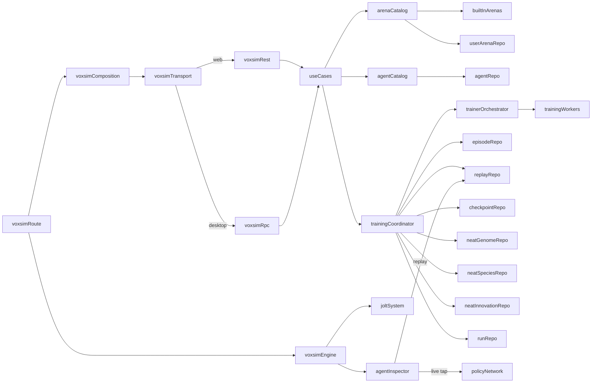

# Title

Voxsim Persistence, Application Services, Transport Adapters, Routes, And End-To-End Tests Plan

## Goal

Define the persistence model, the application use cases, the thin transport adapters, and the desktop app routes that turn the engine, the physics, the morphology, the brain, the trainer, and the inspector into a usable platform. Built-in arenas load from backend-owned JSON; user arenas, agents (`BodyDna` + `BrainDna` + `TrainingDna` triples), weight checkpoints, NEAT genomes, NEAT species snapshots, NEAT innovation logs, training runs, episodes, and replays live in SurrealDB. Genomes are persisted independently from learned weights per the user's design; NEAT genomes live in their own dedicated tables and are pointed at via the discriminated `CheckpointRef` from `04-brain-and-policy-runtime.md`. The app stays thin: per-route page models in `.svelte.ts` own composition, transport selection, and engine and trainer lifecycle. Cover the arena viewer, the voxel editor, the lab dashboard (including a NEAT-aware inspector layout), and the replay player with Playwright e2e tests using the existing `mem://` SurrealDB pattern.

## Scope

- Add a new voxsim subdomain in `packages/domain` complementing the shared types from plans 01, 03, 04, 05, and 06.
- Keep use cases, ports, and `ArenaCatalogService` and `AgentCatalogService` in `packages/domain/src/application/voxsim/`.
- Keep SurrealDB repositories for arenas, agents, training runs, episodes, replays, weight checkpoints, NEAT genomes, NEAT species, and NEAT innovation logs in `packages/domain/src/infrastructure/database/voxsim/`.
- Keep backend-owned built-in arena JSON in `packages/domain/src/infrastructure/voxsim/builtins/`.
- Keep HTTP routes and Electrobun RPC handlers thin in `apps/desktop-app`.
- Surface `ResolvedArenaEntry`, `AgentSummary`, `TrainingRunSummary`, `EpisodeSummary`, `LineageNode`, `NeatGenomeSummary`, and `NeatSpeciesSummary` to the controller layer.
- Add the four desktop routes under `apps/desktop-app/src/routes/experiments/voxsim/` with page models and composition; the lab page conditionally mounts NEAT-specific inspector panels and a species list when the selected run uses a NEAT algorithm.
- Add Playwright e2e tests under `apps/desktop-app/e2e/voxsim/`, including a NEAT smoke test and a HyperNEAT phenotype-build smoke test.

Out of scope for this step:

- Engine, physics, morphology, brain, training, and inspector internals. Those belong in plans 01 through 06.
- Multi-machine training, distributed orchestration, or cloud queuing. Single-machine workers via `WorkerHostFactory` from `05-training-evolution-and-workers.md` only.

## Architecture

- `packages/domain/src/shared/voxsim`
  - Already owns `ArenaDefinition`, `ArenaMetadata`, `BodyDna`, `BrainDna`, `TrainingDna`, `WeightCheckpointRef`, `CheckpointRef`, `NeatGenome`, `NeatBrainConfig`, `CppnSubstrate`, `EpisodeSummary`, `TrainingProgressEvent`, `NeatTrainingConfig`, validation helpers from earlier plans.
  - Add `ResolvedArenaEntry`, `AgentSummary`, `LineageNode`, `TrainingRunSummary`, `NeatGenomeSummary`, `NeatSpeciesSummary`, `NeatInnovationLogEntry`, `ListAgentsFilter`, `ListEpisodesFilter`, `ListCheckpointsFilter`, `ListRunsFilter`, `ListNeatGenomesFilter`, `ListNeatSpeciesFilter`, `ListNeatInnovationsFilter` here for browser-safe service-facing DTOs.
- `packages/domain/src/application/voxsim`
  - Owns ports, use cases, `ArenaCatalogService`, `AgentCatalogService`, and the trainer wiring.
  - Depends only on shared types and abstract ports. No `tfjs-node`, no Surreal, no `worker_threads` imports here.
- `packages/domain/src/infrastructure/database/voxsim`
  - Owns Surreal repositories for `voxsim_arena`, `voxsim_agent`, `voxsim_training_run`, `voxsim_episode`, `voxsim_replay`, `voxsim_weight_checkpoint`, `voxsim_neat_genome`, `voxsim_neat_species`, `voxsim_neat_innovation_log`. Owns mappers and id normalization local to repository code, following the todo reference pattern.
- `packages/domain/src/infrastructure/voxsim/builtins`
  - Owns raw JSON built-in arenas and a loader that converts them into shared types.
- `packages/domain/src/infrastructure/voxsim/training`
  - Already owns `WorkerPolicyNetwork`, `TrainingWorker`, and `WorkerHostFactory` from `05-training-evolution-and-workers.md`. The application use cases consume `WorkerHostFactory` via dependency injection.
- `apps/desktop-app/src/lib/adapters/voxsim`
  - Owns transport interfaces and runtime adapters mirroring `src/lib/adapters/chat`, `src/lib/adapters/platformer`, and `src/lib/adapters/rts`.
- `apps/desktop-app/src/routes/api/voxsim`
  - Owns thin REST handlers that delegate to application services.
- `apps/desktop-app/src/routes/experiments/voxsim`
  - Owns the runtime, editor, lab, and replay routes with `.svelte.ts` page models and composition helpers.

## Implementation Plan

1. Add the new voxsim subdomain folders.
   - `packages/domain/src/application/voxsim/`
     - `index.ts`
     - `ports.ts`
     - `ArenaCatalogService.ts`
     - `AgentCatalogService.ts`
     - `TrainingCoordinator.ts`
     - `use-cases/`
       - `list-arenas.ts`
       - `load-arena.ts`
       - `save-user-arena.ts`
       - `update-user-arena.ts`
       - `delete-user-arena.ts`
       - `duplicate-built-in-arena.ts`
       - `validate-arena.ts`
       - `create-agent.ts`
       - `update-agent-dna.ts`
       - `mutate-agent.ts`
       - `list-agents.ts`
       - `load-agent.ts`
       - `delete-agent.ts`
       - `start-training-run.ts`
       - `pause-training-run.ts`
       - `resume-training-run.ts`
       - `stop-training-run.ts`
       - `list-training-runs.ts`
       - `record-episode.ts`
       - `list-episodes.ts`
       - `save-weight-checkpoint.ts`
       - `load-weight-checkpoint.ts`
       - `list-checkpoints.ts`
       - `record-replay.ts`
       - `load-replay.ts`
       - `list-lineage.ts`
       - `load-neat-genome.ts`
       - `list-neat-genomes.ts`
       - `record-neat-genome.ts`
       - `record-neat-species-snapshot.ts`
       - `list-neat-species.ts`
       - `record-neat-innovation-log.ts`
       - `list-neat-innovation-log.ts`
   - `packages/domain/src/infrastructure/database/voxsim/`
     - `index.ts`
     - `SurrealUserArenaRepository.ts`
     - `SurrealAgentRepository.ts`
     - `SurrealTrainingRunRepository.ts`
     - `SurrealEpisodeRepository.ts`
     - `SurrealReplayRepository.ts`
     - `SurrealWeightCheckpointRepository.ts`
     - `SurrealNeatGenomeRepository.ts`
     - `SurrealNeatSpeciesRepository.ts`
     - `SurrealNeatInnovationLogRepository.ts`
     - `mappers.ts`
   - `packages/domain/src/infrastructure/voxsim/builtins/`
     - `index.ts`
     - `loader.ts`
     - `flat-arena.json`
     - `slope-arena.json`
     - `obstacle-course.json`
   - Export the new voxsim surfaces through `domain/shared`, `domain/application`, and `domain/infrastructure`.
2. Add shared service-facing DTOs in `packages/domain/src/shared/voxsim/`.
   - `ResolvedArenaEntry`:
     - `id: string`
     - `metadata: ArenaMetadata`
     - `definition: ArenaDefinition`
     - `source: 'builtin' | 'user'`
     - `builtInId?: string`
     - `inheritsFromBuiltInId?: string`
     - `isEditable: boolean`
   - `AgentSummary`:
     - `id: string`
     - `name: string`
     - `bodyDnaId: string`
     - `brainDnaId: string`
     - `trainingDnaId?: string`
     - `bestCheckpointRefId?: string`
     - `bestScore?: number`
     - `generation: number`
     - `lineageParentAgentId?: string`
     - `kind: OrganismKind`
     - `createdAt: string`
     - `updatedAt: string`
   - `LineageNode`:
     - `agentId: string`
     - `parentAgentId?: string`
     - `generation: number`
     - `bestScore?: number`
     - `mutationSummary?: string`
   - `TrainingRunSummary`:
     - `id: string`
     - `agentId: string`
     - `trainingDnaId: string`
     - `algorithm: 'evolution' | 'reinforce' | 'ppoLite' | 'neat' | 'hyperNeat' | 'neatLstm'` (mirrored from the snapshot's `TrainingDna.algorithm` so consumers can branch UI without loading the full DNA)
     - `arenaCurriculumIds: string[]`
     - `status: TrainingRunStatus`
     - `startedAt: string`
     - `finishedAt?: string`
     - `bestCheckpointRef?: CheckpointRef` discriminated pointer; can be `flat` or `neatGenome`
     - `bestScore?: number`
     - `totalEpisodes: number`
     - `totalGenerations: number`
     - `totalSpeciesEverSeen?: number` NEAT only
     - `currentSpeciesCount?: number` NEAT only
   - `NeatGenomeSummary`:
     - `id: string`
     - `agentId: string`
     - `runId: string`
     - `generation: number`
     - `speciesId: number`
     - `score?: number`
     - `nodeCount: number`
     - `connectionCount: number`
     - `enabledConnectionCount: number`
     - `lstmNodeCount: number`
     - `bytes: number` size of the persisted genome JSON, useful for storage telemetry
     - `createdAt: string`
   - `NeatSpeciesSummary`:
     - `id: number`
     - `runId: string`
     - `generation: number`
     - `size: number`
     - `bestScore: number`
     - `meanScore: number`
     - `representativeGenomeId: string`
     - `stagnationGenerations: number`
     - `createdAt: string`
     - `updatedAt: string`
   - `NeatInnovationLogEntry`:
     - `runId: string`
     - `generation: number`
     - `addedConnections: { innovation: number; sourceNodeId: number; targetNodeId: number }[]`
     - `addedNodes: { innovation: number; splitConnectionInnovation: number }[]`
     - `createdAt: string`
   - `ListAgentsFilter`:
     - `kind?: OrganismKind`
     - `bodyDnaId?: string`
     - `lineageRootId?: string`
     - `since?: string`
     - `limit?: number`
   - `ListEpisodesFilter`:
     - `runId?: string`
     - `agentId?: string`
     - `arenaId?: string`
     - `outcome?: EpisodeOutcome['kind']`
     - `since?: string`
     - `limit?: number`
   - `ListRunsFilter`:
     - `agentId?: string`
     - `status?: TrainingRunStatus`
     - `since?: string`
     - `limit?: number`
   - `ListCheckpointsFilter`:
     - `agentId?: string`
     - `runId?: string`
     - `minScore?: number`
     - `limit?: number`
   - `ListNeatGenomesFilter`:
     - `agentId?: string`
     - `runId?: string`
     - `speciesId?: number`
     - `generation?: number`
     - `minScore?: number`
     - `limit?: number`
   - `ListNeatSpeciesFilter`:
     - `runId: string`
     - `generation?: number` if absent, returns the latest snapshot per species
     - `limit?: number`
   - `ListNeatInnovationsFilter`:
     - `runId: string`
     - `sinceGeneration?: number`
     - `limit?: number`
3. Define agent-style persistence rules.
   - Built-in arenas are never stored in the DB.
   - The DB stores user arenas, agents (DNA triples), training runs, episodes, replays, weight checkpoints (fixed-topology), NEAT genomes, NEAT species snapshots, and NEAT innovation logs.
   - Genomes (`BodyDna`, `BrainDna`, `TrainingDna`) live on the `voxsim_agent` row as embedded JSON. Weights for fixed-topology brains live in `voxsim_weight_checkpoint` rows. NEAT genomes (the per-generation `NeatGenome` value) live in dedicated `voxsim_neat_genome` rows. This mirrors the user's "persist genomes separately from learned weights" rule and extends it to topology-evolving brains.
   - The discriminated `CheckpointRef` from `04-brain-and-policy-runtime.md` is the canonical pointer used by `EpisodeRecord.checkpointRef` and `TrainingRunRecord.bestCheckpointRef`. The discriminator routes consumers to the right table (`voxsim_weight_checkpoint` for `kind: 'flat'`, `voxsim_neat_genome` for `kind: 'neatGenome'`).
   - NEAT species snapshots live in `voxsim_neat_species` keyed by `(runId, speciesId)` with a generation series; the trainer's `onSpeciesUpdate` callback persists one row per species per generation snapshot.
   - NEAT innovation logs live in `voxsim_neat_innovation_log` keyed by `(runId, generation)`; the trainer's `onInnovations` callback persists one row per generation summarizing newly-assigned innovations. The full innovation map is reconstructable by replaying these logs in order.
   - Replays are stored in their own `voxsim_replay` table to keep agent and episode rows light. An `EpisodeSummary.replayRef` points at the row by id. The replay header includes `policyKind` so the inspector reconstructs the right view set without DB joins.
   - A "duplicated built-in arena" is stored as a full user arena with no future linkage (mirrors platformer pattern). `inheritsFromBuiltInId` is reserved for forward compatibility.
   - HyperNEAT substrates are persisted inline on `BrainDna.neat.cppnSubstrate` (part of the agent row); no separate substrate library table is introduced in v1.
4. Define repository and service ports in `packages/domain/src/application/voxsim/ports.ts`.
   - `IBuiltInArenaSource`:
     - `listArenas(): Promise<{ id: string; metadata: ArenaMetadata; definition: ArenaDefinition }[]>`
     - `findArena(id): Promise<{ id; metadata; definition } | undefined>`
   - `IUserArenaRepository`:
     - `list(): Promise<UserArenaRecord[]>`
     - `findById(id): Promise<UserArenaRecord | undefined>`
     - `create(input): Promise<UserArenaRecord>`
     - `update(id, patch): Promise<UserArenaRecord>`
     - `delete(id): Promise<void>`
   - `IAgentRepository`:
     - `list(filter?: ListAgentsFilter): Promise<AgentRecord[]>`
     - `findById(id): Promise<AgentRecord | undefined>`
     - `create(input): Promise<AgentRecord>`
     - `update(id, patch): Promise<AgentRecord>`
     - `delete(id): Promise<void>`
     - `listLineage(rootAgentId): Promise<LineageNode[]>`
   - `ITrainingRunRepository`:
     - `list(filter?: ListRunsFilter): Promise<TrainingRunRecord[]>`
     - `findById(id): Promise<TrainingRunRecord | undefined>`
     - `create(input): Promise<TrainingRunRecord>`
     - `updateStatus(id, status, fields?): Promise<TrainingRunRecord>`
   - `IEpisodeRepository`:
     - `list(filter?: ListEpisodesFilter): Promise<EpisodeRecord[]>`
     - `record(input): Promise<EpisodeRecord>`
   - `IReplayRepository`:
     - `findById(id): Promise<ReplayRecord | undefined>`
     - `record(input): Promise<ReplayRecord>`
   - `IWeightCheckpointRepository`:
     - `list(filter?: ListCheckpointsFilter): Promise<WeightCheckpointRecord[]>`
     - `findById(id): Promise<WeightCheckpointRecord | undefined>`
     - `record(input): Promise<WeightCheckpointRecord>`
   - `INeatGenomeRepository`:
     - `record(input: RecordNeatGenomeInput): Promise<NeatGenomeRecord>`
     - `findById(id): Promise<NeatGenomeRecord | undefined>`
     - `list(filter?: ListNeatGenomesFilter): Promise<NeatGenomeRecord[]>`
   - `INeatSpeciesRepository`:
     - `recordSnapshot(input: RecordNeatSpeciesSnapshotInput): Promise<NeatSpeciesRecord>` upserts on `(runId, speciesId)` and appends to a `generationHistory` field
     - `list(filter?: ListNeatSpeciesFilter): Promise<NeatSpeciesRecord[]>`
   - `INeatInnovationLogRepository`:
     - `record(input: RecordNeatInnovationLogInput): Promise<NeatInnovationLogRecord>`
     - `list(filter?: ListNeatInnovationsFilter): Promise<NeatInnovationLogRecord[]>`
   - `IArenaValidator`:
     - `validate(arena: ArenaDefinition): ArenaValidationResult`
   - `IBodyDnaValidator`, `IBrainDnaValidator`, `ITrainingDnaValidator`, `INeatGenomeValidator` proxies for the shared validators.
5. Add `ArenaCatalogService` in the application layer.
   - Loads built-in arenas via `IBuiltInArenaSource`.
   - Loads user arenas via `IUserArenaRepository`.
   - Resolves each into `ResolvedArenaEntry`:
     - built-in entries get `source: 'builtin'`, `isEditable: false`, `builtInId` set
     - user entries get `source: 'user'`, `isEditable: true`, `inheritsFromBuiltInId` populated when set
   - Order:
     - built-in arenas first in declared order
     - user arenas after, ordered by `metadata.updatedAt desc`
   - Provides:
     - `listResolved(): Promise<ResolvedArenaEntry[]>`
     - `loadResolved(id): Promise<ResolvedArenaEntry | undefined>`
6. Add `AgentCatalogService` in the application layer.
   - Wraps `IAgentRepository` with summary mapping into `AgentSummary` (joins best checkpoint info from `IWeightCheckpointRepository`).
   - Provides:
     - `listSummaries(filter?: ListAgentsFilter): Promise<AgentSummary[]>`
     - `loadAgent(id): Promise<{ summary: AgentSummary; bodyDna: BodyDna; brainDna: BrainDna; trainingDna?: TrainingDna }>`
     - `mutate(id, mutation): Promise<AgentSummary>` clones the agent's DNA, applies the requested mutation (body or brain), persists the new agent with `lineageParentAgentId` set
7. Add `TrainingCoordinator` in the application layer.
   - The single front door to the trainer pipeline from `05-training-evolution-and-workers.md`.
   - Constructed with `WorkerHostFactory`, `IAgentRepository`, `ITrainingRunRepository`, `IEpisodeRepository`, `IReplayRepository`, `IWeightCheckpointRepository`, `INeatGenomeRepository`, `INeatSpeciesRepository`, `INeatInnovationLogRepository`, and an arena resolver from `ArenaCatalogService.loadResolved`.
   - Methods:
     - `start(input: StartTrainingRunInput): Promise<TrainingRunSummary>`
     - `pause(runId): Promise<TrainingRunSummary>`
     - `resume(runId): Promise<TrainingRunSummary>`
     - `stop(runId): Promise<TrainingRunSummary>`
     - `subscribe(runId, listener: (e: TrainingProgressEvent) => void): Unsubscribe`
   - On `start`:
     - resolves the agent's `BodyDna`, `BrainDna`, `TrainingDna`
     - persists a `TrainingRunRecord` with `status: 'starting'` and `algorithm` mirrored from the `TrainingDna` snapshot
     - constructs the `TrainerOrchestrator` from `05-training-evolution-and-workers.md` with `onCheckpoint`, `onEpisode`, `onSpeciesUpdate`, and `onInnovations` wired to the Surreal repositories
     - calls `TrainerOrchestrator.start(...)` and updates `status: 'running'`
   - On lifecycle events from the orchestrator:
     - persists every `EpisodeSummary` via `IEpisodeRepository.record` and the associated replay via `IReplayRepository.record` when present (the replay header carries `policyKind` for the inspector)
     - `onCheckpoint` branches on `ref.kind`:
       - `'flat'`: persists the weights via `IWeightCheckpointRepository.record`
       - `'neatGenome'`: persists the genome via `INeatGenomeRepository.record` (includes the genome JSON, species id, scores, node and connection counts)
     - `onSpeciesUpdate` (NEAT only): persists each species snapshot via `INeatSpeciesRepository.recordSnapshot`; updates `TrainingRunRecord.currentSpeciesCount` and `totalSpeciesEverSeen`
     - `onInnovations` (NEAT only): persists the innovation summary via `INeatInnovationLogRepository.record`
     - updates `TrainingRunRecord.bestCheckpointRef` (full discriminated `CheckpointRef`) and `bestScore` on each new high score
     - updates `status: 'completed' | 'failed'` on `runFinished` or `runFailed`
8. Add explicit application use cases.
   - Arena use cases:
     - `ListArenas` returns `ResolvedArenaEntry[]`
     - `LoadArena` returns a single `ResolvedArenaEntry`
     - `SaveUserArena` validates and persists
     - `UpdateUserArena` validates and patches
     - `DeleteUserArena` deletes
     - `DuplicateBuiltInArena` snapshots a built-in arena into a user arena
     - `ValidateArena` proxies the shared validator
   - Agent use cases:
     - `CreateAgent` accepts `{ name, bodyDna, brainDna, trainingDna? }`, validates, persists
     - `UpdateAgentDna` accepts `{ id, bodyDna?, brainDna?, trainingDna? }`, validates, persists
     - `MutateAgent` accepts `{ id, mutation: BodyMutationSpec | BrainMutationSpec | NeatStructuralMutationSpec }`, validates, creates a child agent. The `NeatStructuralMutationSpec` variant (defined in `05-training-evolution-and-workers.md`) lets the lab UI manually inject a structural mutation (`addNode`, `addConnection`, `toggleEnabled`, `addLstmNode`) between training runs; the use case applies the mutation to the agent's current best `NeatGenome`, registers innovations against a fresh `InnovationLedger` for the child agent, and persists the new genome via `INeatGenomeRepository.record`.
     - `ListAgents` returns `AgentSummary[]`
     - `LoadAgent` returns the full DNA triple
     - `DeleteAgent` deletes (and orphans associated checkpoints, NEAT genomes, species snapshots, and innovation logs; runs and episodes stay for audit)
   - Training use cases:
     - `StartTrainingRun` accepts `{ agentId, trainingDnaId?, arenaCurriculumIds?, initialCheckpointRefId? }` and returns the new `TrainingRunSummary`
     - `PauseTrainingRun`, `ResumeTrainingRun`, `StopTrainingRun`
     - `ListTrainingRuns` returns `TrainingRunSummary[]`
     - `RecordEpisode` (used internally by `TrainingCoordinator`; exposed for tests)
   - Checkpoint and replay use cases:
     - `SaveWeightCheckpoint` records weights blob and metadata
     - `LoadWeightCheckpoint` returns the binary weights for inference or visualization
     - `ListCheckpoints`
     - `RecordReplay`, `LoadReplay`
     - `ListLineage` returns `LineageNode[]` rooted at an agent
   - NEAT use cases (NEAT-only; consumed by the lab page when the selected run uses a NEAT algorithm):
     - `RecordNeatGenome` records a `NeatGenome` blob plus its summary fields (used internally by `TrainingCoordinator`; exposed for tests and for the manual `MutateAgent` flow)
     - `LoadNeatGenome` returns the full `NeatGenome` JSON for the inspector
     - `ListNeatGenomes` returns `NeatGenomeSummary[]` filtered by run, species, generation, or score
     - `RecordNeatSpeciesSnapshot` records (or upserts) a per-generation species snapshot
     - `ListNeatSpecies` returns `NeatSpeciesSummary[]` filtered by run and optional generation
     - `RecordNeatInnovationLog` records a per-generation innovation summary
     - `ListNeatInnovationLog` returns `NeatInnovationLogEntry[]` filtered by run and generation range
9. Define record shapes in `packages/domain/src/infrastructure/database/voxsim/`.
   - `UserArenaRecord`:
     - `id: string`
     - `metadata: ArenaMetadata`
     - `definition: ArenaDefinition`
     - `inheritsFromBuiltInId?: string`
     - `createdAt: string`
     - `updatedAt: string`
   - `AgentRecord`:
     - `id: string`
     - `name: string`
     - `kind: OrganismKind`
     - `bodyDna: BodyDna`
     - `brainDna: BrainDna`
     - `trainingDna?: TrainingDna`
     - `lineageParentAgentId?: string`
     - `generation: number`
     - `mutationSummary?: string`
     - `bestCheckpointRefId?: string`
     - `bestScore?: number`
     - `createdAt: string`
     - `updatedAt: string`
   - `TrainingRunRecord`:
     - `id: string`
     - `agentId: string`
     - `trainingDnaSnapshot: TrainingDna` snapshot at `start` time so replays survive later edits to the agent's `trainingDna`
     - `algorithm: 'evolution' | 'reinforce' | 'ppoLite' | 'neat' | 'hyperNeat' | 'neatLstm'` (mirrored at `start` time)
     - `arenaCurriculumIds: string[]`
     - `status: TrainingRunStatus`
     - `startedAt: string`
     - `finishedAt?: string`
     - `bestCheckpointRef?: CheckpointRef` discriminated pointer (`flat` or `neatGenome`)
     - `bestScore?: number`
     - `totalEpisodes: number`
     - `totalGenerations: number`
     - `currentSpeciesCount?: number` NEAT only; updated from `speciesUpdated` events
     - `totalSpeciesEverSeen?: number` NEAT only; monotonic counter of distinct species ids seen during the run
     - `innovationLedgerSnapshot?: InnovationLedgerSnapshot` NEAT only; written when the run pauses so resume produces identical innovation ids
   - `EpisodeRecord` mirrors `EpisodeSummary` with database id normalization. The `checkpointRef` field carries the discriminated pointer; the schema stores both kinds in a JSON column so the discriminator is preserved.
   - `ReplayRecord`:
     - `id: string`
     - `episodeId: string`
     - `bytes: Uint8Array`
     - `frames: number`
     - `createdAt: string`
   - `WeightCheckpointRecord`:
     - `id: string`
     - `agentId: string`
     - `runId?: string`
     - `brainDnaId: string`
     - `generation: number`
     - `score?: number`
     - `weights: Uint8Array` flat `Float32Array` byte view
     - `createdAt: string`
   - `NeatGenomeRecord`:
     - `id: string`
     - `agentId: string`
     - `runId: string`
     - `brainDnaId: string`
     - `generation: number`
     - `speciesId: number`
     - `score?: number`
     - `scoreHistory?: { generation: number; score: number }[]` per-generation score for genomes that survive multiple generations as elites
     - `nodeCount: number`
     - `connectionCount: number`
     - `enabledConnectionCount: number`
     - `lstmNodeCount: number`
     - `genome: NeatGenome` the full genome JSON
     - `bytes: number` byte size of the JSON for storage telemetry
     - `createdAt: string`
   - `NeatSpeciesRecord`:
     - `id: string` composite of `${runId}:${speciesId}` to enable upsert on the natural key
     - `runId: string`
     - `speciesId: number`
     - `latestGeneration: number`
     - `latestSize: number`
     - `latestBestScore: number`
     - `latestMeanScore: number`
     - `latestStagnationGenerations: number`
     - `representativeGenomeId: string`
     - `generationHistory: { generation: number; size: number; bestScore: number; meanScore: number; stagnation: number; representativeGenomeId: string }[]` appended on each `recordSnapshot`
     - `createdAt: string`
     - `updatedAt: string`
   - `NeatInnovationLogRecord`:
     - `id: string` composite of `${runId}:gen:${generation}`
     - `runId: string`
     - `generation: number`
     - `addedConnections: { innovation: number; sourceNodeId: number; targetNodeId: number }[]`
     - `addedNodes: { innovation: number; splitConnectionInnovation: number }[]`
     - `createdAt: string`
   - Record mappers normalize Surreal record ids to and from strings inside the repositories.
10. Implement the Surreal repositories.
    - `SurrealUserArenaRepository`: persists `voxsim_arena`. ISO timestamps. `update` patches `metadata` and `definition` independently.
    - `SurrealAgentRepository`: persists `voxsim_agent`. Implements `listLineage` via a recursive `SELECT ... FETCH` query rooted at the agent id.
    - `SurrealTrainingRunRepository`: persists `voxsim_training_run`. `updateStatus` accepts a status plus optional fields (`bestCheckpointRefId`, `bestScore`, `totalEpisodes`, `totalGenerations`, `finishedAt`).
    - `SurrealEpisodeRepository`: persists `voxsim_episode`. List supports `runId`, `agentId`, `arenaId`, `outcome`, `since`, `limit`.
    - `SurrealReplayRepository`: persists `voxsim_replay`. Stores the raw `Uint8Array` blob in a Surreal `bytes` field; the mapper preserves the byte length on round-trip.
    - `SurrealWeightCheckpointRepository`: persists `voxsim_weight_checkpoint`. List supports `agentId`, `runId`, `minScore`, `limit`.
    - `SurrealNeatGenomeRepository`: persists `voxsim_neat_genome`. The `genome` field is stored as a Surreal `object` so partial queries can target `genome.nodes.length` etc. without parsing JSON. List supports `agentId`, `runId`, `speciesId`, `generation`, `minScore`, `limit`.
    - `SurrealNeatSpeciesRepository`: persists `voxsim_neat_species`. `recordSnapshot` performs an `UPSERT` on the composite id `${runId}:${speciesId}`, replacing the `latest*` fields and appending to `generationHistory`. List supports `runId`, optional `generation` (returns the entry whose `generationHistory` contains that generation, or the latest), `limit`.
    - `SurrealNeatInnovationLogRepository`: persists `voxsim_neat_innovation_log`. `record` is `CREATE` only (innovation logs are immutable per generation). List supports `runId`, `sinceGeneration`, `limit`.
    - Reuse the existing database client conventions from `packages/domain/src/infrastructure/database`.
11. Implement the built-in arena loader.
    - `BuiltInArenaSource` reads `*-arena.json` files from `packages/domain/src/infrastructure/voxsim/builtins/`.
    - Validates each arena with `validateArenaDefinition` at load time and throws on invalid bundled data.
    - Bundled arenas:
      - `flat-arena`: small `4x1x4` chunk-grid, fully ground floor, used by e2e tests
      - `slope-arena`: gentle ramps for early curriculum
      - `obstacle-course`: voxel walls and pits for later curriculum stages
12. Add transport interfaces in `apps/desktop-app/src/lib/adapters/voxsim/`.
    - `VoxsimTransport.ts`:
      - arena: `listArenas()`, `loadArena(id)`, `createUserArena(input)`, `updateUserArena(id, patch)`, `deleteUserArena(id)`, `duplicateBuiltInArena(input)`
      - agents: `listAgents(filter?)`, `loadAgent(id)`, `createAgent(input)`, `updateAgentDna(id, patch)`, `mutateAgent(input)`, `deleteAgent(id)`, `listLineage(rootAgentId)`
      - training: `startTrainingRun(input)`, `pauseTrainingRun(id)`, `resumeTrainingRun(id)`, `stopTrainingRun(id)`, `listTrainingRuns(filter?)`, `subscribeRunProgress(runId)` returns an event source (carries the new `speciesUpdated` and `innovationsAssigned` events alongside the existing variants)
      - episodes and replays: `listEpisodes(filter?)`, `loadReplay(id)`
      - checkpoints: `listCheckpoints(filter?)`, `loadCheckpoint(id)`
      - NEAT: `loadNeatGenome(id)`, `listNeatGenomes(filter)`, `listNeatSpecies(filter)`, `listNeatInnovationLog(filter)`
    - `web-voxsim-transport.ts`: fetch adapter against `/api/voxsim/**`. `subscribeRunProgress` is implemented as an SSE stream against `/api/voxsim/runs/[runId]/stream`.
    - `desktop-voxsim-transport.ts`: Electrobun RPC adapter mirroring the same shape; `subscribeRunProgress` uses Electrobun's RPC event channel.
    - `create-voxsim-transport.ts`: runtime mode resolver mirroring `create-chat-transport.ts`, `create-platformer-transport.ts`, and `create-rts-transport.ts`.
13. Add REST routes in `apps/desktop-app/src/routes/api/voxsim/`.
    - Arena:
      - `GET /api/voxsim/arenas` calls `ListArenas`
      - `POST /api/voxsim/arenas` calls `SaveUserArena`
      - `GET /api/voxsim/arenas/[arenaId]` calls `LoadArena`
      - `PUT /api/voxsim/arenas/[arenaId]` calls `UpdateUserArena`
      - `DELETE /api/voxsim/arenas/[arenaId]` calls `DeleteUserArena`
      - `POST /api/voxsim/arenas/duplicate` calls `DuplicateBuiltInArena`
    - Agent:
      - `GET /api/voxsim/agents` calls `ListAgents`
      - `POST /api/voxsim/agents` calls `CreateAgent`
      - `GET /api/voxsim/agents/[agentId]` calls `LoadAgent`
      - `PUT /api/voxsim/agents/[agentId]` calls `UpdateAgentDna`
      - `POST /api/voxsim/agents/[agentId]/mutate` calls `MutateAgent`
      - `DELETE /api/voxsim/agents/[agentId]` calls `DeleteAgent`
      - `GET /api/voxsim/agents/[agentId]/lineage` calls `ListLineage`
    - Training:
      - `POST /api/voxsim/runs` calls `StartTrainingRun`
      - `POST /api/voxsim/runs/[runId]/pause` calls `PauseTrainingRun`
      - `POST /api/voxsim/runs/[runId]/resume` calls `ResumeTrainingRun`
      - `POST /api/voxsim/runs/[runId]/stop` calls `StopTrainingRun`
      - `GET /api/voxsim/runs` calls `ListTrainingRuns`
      - `GET /api/voxsim/runs/[runId]/stream` returns an SSE stream of `TrainingProgressEvent`
    - Episodes, replays, checkpoints:
      - `GET /api/voxsim/episodes` calls `ListEpisodes`
      - `GET /api/voxsim/replays/[replayId]` calls `LoadReplay` returning the binary payload with the right content-type
      - `GET /api/voxsim/checkpoints` calls `ListCheckpoints`
      - `GET /api/voxsim/checkpoints/[checkpointId]` calls `LoadWeightCheckpoint` returning the binary weights
    - NEAT (only mounted when the application registers the NEAT use cases; harmless to expose on non-NEAT runs since the filters are typed):
      - `GET /api/voxsim/neat/genomes` calls `ListNeatGenomes`
      - `GET /api/voxsim/neat/genomes/[genomeId]` calls `LoadNeatGenome` returning the genome JSON
      - `GET /api/voxsim/neat/species` calls `ListNeatSpecies` (requires `runId` query param)
      - `GET /api/voxsim/neat/innovations` calls `ListNeatInnovationLog` (requires `runId` query param)
    - All handlers stay thin: parse body, delegate to use case, return JSON or binary. The streaming endpoint subscribes to `TrainingCoordinator.subscribe` and forwards events as SSE; the unified event stream carries both fixed-topology events and NEAT-only `speciesUpdated` / `innovationsAssigned` events as defined in `05-training-evolution-and-workers.md`.
14. Extend the Electrobun RPC schema with the same operations so `dev:app` works without a server.
    - Match the same input and output shapes.
    - Stream events flow through Electrobun's RPC event channel; the desktop transport translates them into the same `subscribeRunProgress` listener shape the web transport returns. NEAT-only event variants (`speciesUpdated`, `innovationsAssigned`) flow through the same channel without a separate subscription.
    - Expose the NEAT methods (`loadNeatGenome`, `listNeatGenomes`, `listNeatSpecies`, `listNeatInnovationLog`) on the RPC schema so the lab page works identically under `dev:app`.
15. Add the experiment entry point and routes.
    - Add a Voxsim card on `apps/desktop-app/src/routes/+page.svelte` with three links: Arena, Editor, Lab.
    - `apps/desktop-app/src/routes/experiments/voxsim/+page.svelte` (Arena viewer):
      - layout-only
      - states: arena select, agent picker, live in-arena view (Three canvas), agent inspector pane, debug overlays toggle
      - wraps content with `<Tooltip.Provider>` from `ui/source` per `apps/desktop-app/AGENTS.md`
    - `apps/desktop-app/src/routes/experiments/voxsim/editor/+page.svelte` (Voxel editor):
      - layout-only
      - left: voxel kind palette and brush size; center: Three canvas with the engine in `editor` mode; right: arena metadata, validation panel, dirty state, save/save-as/load/duplicate-built-in, exit
      - wraps content with `<Tooltip.Provider>`
    - `apps/desktop-app/src/routes/experiments/voxsim/lab/+page.svelte` (Training dashboard):
      - layout-only
      - left: agent list (filter by lineage); center: selected agent inspector (`<AgentInspector />` from `06-visualization-and-inspection.md`) which dynamically mounts the right panel set based on `BrainDna.topology` (or the active run's `algorithm`); right: training controls (start/pause/stop), training progress charts, run history
      - bottom (conditional, NEAT runs only): a docked `<SpeciesListView />` (from `06-visualization-and-inspection.md`) bound to the selected run; clicking a species selects its representative genome in the inspector
      - wraps content with `<Tooltip.Provider>`
    - `apps/desktop-app/src/routes/experiments/voxsim/replays/[runId]/+page.svelte` (Replay player):
      - layout-only
      - center: `<ReplayViewer />` from `06-visualization-and-inspection.md`
      - bottom: episode list for the run, seek bar, playback controls
      - wraps content with `<Tooltip.Provider>`
    - `+layout.ts` for these routes stays limited to global flags per `apps/desktop-app/AGENTS.md`.
16. Implement page models.
    - `voxsim-page.svelte.ts` (Arena viewer):
      - State: `catalog`, `selectedArenaId`, `selectedAgentId`, `engine`, `agentInspector`, `debugOverlays`
      - Lifecycle: `bootstrap()` loads arenas and agents; `selectArena()` rebuilds the engine and chunks; `selectAgent()` builds morphology, attaches `TfjsPolicyNetwork`, attaches the inspector
      - Engine event bindings: `arenaLoaded`, `agentSpawned`, `agentDied`, `entityConsumed`
      - `dispose()` stops and disposes the engine on route teardown
    - `editor-page.svelte.ts`:
      - State: `catalog`, `currentEntryId`, `editorEngine`, `dirty`, `saving`, `validation`
      - Bindings: `requestSave` calls `transport.updateUserArena`; `requestSaveAs` calls `transport.createUserArena`; `requestNew` instantiates a fresh `ArenaDefinition` template; `requestDuplicateBuiltIn` calls `transport.duplicateBuiltInArena`
      - Editor tools: paint, erase, fill, line, set spawn, set goal; chunk-level dirty tracking so the engine can rebuild only changed chunks via `02-jolt-physics-boundary.md`'s per-chunk path
      - Guards: leaving while `dirty` shows a confirm dialog
    - `lab-page.svelte.ts`:
      - State: `agentSummaries`, `selectedAgentId`, `agentDetail`, `runs`, `selectedRunId`, `progressEvents`, `inspector`, `neat: { speciesList, selectedSpeciesId, latestGenomeBySpecies, recentInnovations } | null`
      - Lifecycle: `bootstrap()` loads agents and runs; `startRun()` calls `transport.startTrainingRun` and subscribes to progress; progress events feed `TrainingChartsView` and update `runs[selectedRunId].status`. When the selected run uses a NEAT algorithm, the page model also bootstraps `neat` by calling `transport.listNeatSpecies({ runId })` and `transport.listNeatInnovationLog({ runId, limit: 32 })`, then keeps `neat.speciesList` and `neat.recentInnovations` in sync by handling `speciesUpdated` and `innovationsAssigned` events from the same SSE stream
      - Inspector wiring: `setSelectedAgent()` loads the DNA triple and attaches `<AgentInspector />` in live or replay mode based on whether a run is active. If the agent's `BrainDna.topology` is a NEAT variant, the page model also calls `transport.loadNeatGenome(...)` for the agent's `bestCheckpointRef` (when `kind === 'neatGenome'`) and seeds `inspector.genome` so the topology view, CPPN substrate view, and LSTM cell view can mount with real data
      - Species selection: `selectSpecies(speciesId)` looks up the latest representative genome via `transport.loadNeatGenome` and routes it into the inspector's compare slot so the user can diff species against the current best
    - `replay-page.svelte.ts`:
      - State: `runId`, `episodeList`, `selectedEpisodeId`, `replayBytes`, `bodyDna`, `brainDna`, `cursor`
      - Lifecycle: `bootstrap()` loads the run, loads the episode list, selects the most recent; `selectEpisode()` calls `transport.loadReplay` and feeds `<ReplayViewer />`
17. Compose each page in its `*.composition.ts` file.
    - Build the transport via `create-voxsim-transport.ts`.
    - Instantiate the relevant page model with the transport.
    - Return the model for the `+page.svelte` to bind.
18. Cover the desktop bundle.
    - Confirm `electrobun.config.ts` includes the new route assets and the `voxsim/jolt/jolt-physics.wasm` static asset.
    - The runtime, editor, lab, and replay routes must all work under `dev:web`, `dev:app`, and packaged desktop builds.

## Tests

- Shared and application tests use `bun:test` and stay framework-free.
- Application-layer tests for `ArenaCatalogService` use:
  - in-memory fakes for `IBuiltInArenaSource` (JSON-backed, allowed by the testing rule)
  - real Surreal repository for `IUserArenaRepository`
  - Cover:
    - merges built-in and user arenas into one ordered list
    - duplicate creates a snapshot user arena with no future linkage
    - resolved order: built-in first, user arenas by `updatedAt desc`
    - editability flags
- Application-layer tests for `AgentCatalogService`:
  - `mutate` creates a child agent with `lineageParentAgentId` set and incremented `generation`
  - `loadAgent` returns the DNA triple intact
  - `listSummaries` joins the best checkpoint info correctly
- Application-layer tests for `TrainingCoordinator`:
  - injects an in-process fake `WorkerHostFactory` from `05-training-evolution-and-workers.md`
  - `start` persists a `TrainingRunRecord` in `starting` then `running`, with `algorithm` mirrored from the snapshot's `TrainingDna.algorithm`
  - episode events persist to `IEpisodeRepository` and replays to `IReplayRepository`
  - `onCheckpoint` with `kind: 'flat'` persists to `IWeightCheckpointRepository` only (NEAT repos untouched)
  - `onCheckpoint` with `kind: 'neatGenome'` persists to `INeatGenomeRepository` only (weight repo untouched), and `TrainingRunRecord.bestCheckpointRef` round-trips the discriminator
  - `onSpeciesUpdate` upserts each species snapshot (asserted via `INeatSpeciesRepository.list`) and updates `TrainingRunRecord.currentSpeciesCount` / `totalSpeciesEverSeen`
  - `onInnovations` records one `NeatInnovationLogRecord` per generation; subsequent calls for the same `(runId, generation)` are rejected (immutability test)
  - `runFinished` marks `status: 'completed'` and updates `bestCheckpointRef` (full discriminated value)
  - `pause` and `resume` update status atomically; for NEAT runs `pause` snapshots the `InnovationLedger` onto the run record
- Use-case tests follow the `TodoService` pattern.
  - In-memory fakes for ports where the test focuses on application logic.
  - Cover the input validation and orchestration of every use case listed in step 8.
- Repository tests follow the real-instance pattern in [SurrealTodoRepository.test.ts](/Users/walker/Documents/Dev/AI Maker Lab/ai-maker-lab/packages/domain/src/infrastructure/database/SurrealTodoRepository.test.ts).
  - `createDbConnection({ host: 'mem://', ... })` per test, unique namespace and database per test.
  - Cover:
    - user arena CRUD and `inheritsFromBuiltInId` round-trip
    - agent CRUD, lineage walk
    - training run create + status transitions, including `algorithm` round-trip and `innovationLedgerSnapshot` round-trip on pause/resume
    - episode list filters; `EpisodeRecord.checkpointRef` discriminator round-trip for both `flat` and `neatGenome`
    - replay record + load preserves byte length and `policyKind` header
    - weight checkpoint record + load preserves byte length and `Float32Array` view
    - NEAT genome record + load round-trips the full `NeatGenome` JSON, including LSTM gate annotations and CPPN node activations
    - NEAT species `recordSnapshot` upsert: same `(runId, speciesId)` across generations appends to `generationHistory` without duplicating the row, and `latest*` fields reflect the most recent snapshot
    - NEAT innovation log: `record` succeeds once per `(runId, generation)` and rejects duplicates; `list` with `sinceGeneration` returns only newer entries in generation order
- Transport adapter tests stay thin.
  - Verify HTTP and RPC handlers delegate to application services.
  - Verify catalog transports return DTOs and never leak raw Surreal record ids.
  - Verify `subscribeRunProgress` translates SSE events into the same listener shape across web and desktop.
- Page model tests in `apps/desktop-app/src/routes/experiments/voxsim/`.
  - Use in-memory transport fakes that satisfy `VoxsimTransport`.
  - Cover:
    - arena viewer `bootstrap()` loads catalog and agents
    - arena viewer `selectAgent()` attaches morphology and inspector
    - editor `requestSave` calls update with the right id; per-chunk dirty triggers per-chunk rebuild
    - lab `startRun` subscribes and feeds chart series
    - lab with a NEAT run: `bootstrap()` populates `neat.speciesList` and `neat.recentInnovations` from the transport; subsequent `speciesUpdated` and `innovationsAssigned` events update those slices; `selectSpecies(id)` calls `transport.loadNeatGenome` with the species' representative genome id and routes the genome into the inspector compare slot
    - lab `setSelectedAgent` for a NEAT-topology agent calls `transport.loadNeatGenome` for the agent's `bestCheckpointRef` (when `kind === 'neatGenome'`) and skips the call entirely for fixed-topology agents
    - replay page loads the most recent episode by default; for replays whose header `policyKind` is a NEAT variant, the page model surfaces that to `<ReplayViewer />` so the inspector mounts NEAT panels
- E2E tests in `apps/desktop-app/e2e/voxsim/`.
  - Use the existing `patchEmptyTableErrors` helper from `apps/desktop-app/e2e/helpers.ts` per the chat e2e pattern.
  - `voxsim.e2e.ts`:
    - load the experiments index, click Arena
    - select `flat-arena`, attach a default biped agent
    - assert the Three canvas mounts and that the inspector lights up with non-empty topology and activation streams
  - `voxsim-editor.e2e.ts`:
    - load the experiments index, click Editor
    - paint a small ground patch, set a spawn, save the arena
    - reload the route and re-open the saved arena; verify voxels and spawn round-trip
  - `voxsim-lab.e2e.ts`:
    - load the experiments index, click Lab
    - create an agent (default biped + small MLP brain + tiny `flat-arena` curriculum)
    - start a training run with a very small `populationSize`, `episodesPerCandidate`, and `episodeSteps`
    - assert at least one `episodeFinished` event arrives via SSE within the test timeout
    - assert at least one `WeightCheckpointRecord` is persisted (intercept `POST /api/voxsim/runs` and a follow-up `GET /api/voxsim/checkpoints`)
  - `voxsim-lab-neat.e2e.ts`:
    - load the experiments index, click Lab
    - create an agent with `BrainDna.topology: 'neat'` and a minimal `NeatBrainConfig` (default biped + tiny `flat-arena` curriculum)
    - start a NEAT training run with very small `populationSize` (e.g. 6), one or two species, and a few generations
    - assert at least one `speciesUpdated` event arrives via SSE
    - assert at least one `innovationsAssigned` event arrives via SSE
    - assert `GET /api/voxsim/neat/genomes?runId=...` returns at least one `NeatGenomeSummary`
    - assert `GET /api/voxsim/neat/species?runId=...` returns at least one `NeatSpeciesSummary`
    - assert `<SpeciesListView />` renders at least one row and clicking it loads a genome into the inspector (`BrainTopologyView` shows non-empty NEAT topology)
  - `voxsim-lab-hyperneat.e2e.ts` (HyperNEAT phenotype-build smoke test):
    - create an agent with `BrainDna.topology: 'hyperNeat'` and a small `cppnSubstrate`
    - start a HyperNEAT training run with `populationSize: 4` and one generation
    - assert at least one `episodeFinished` event arrives via SSE
    - assert `<CppnSubstrateView />` mounts in the inspector (verify a canvas element with the expected node count) when the resulting CPPN genome is loaded
    - assert no errors from the substrate builder appear in `console.error`
  - `voxsim-replay.e2e.ts`:
    - seed the DB with a recorded episode + replay
    - navigate to `/experiments/voxsim/replays/[runId]`
    - assert the replay viewer loads, plays, pauses, and seeks without calling `JoltSystem.step`
  - Gate any live-network tests behind environment flags following the chat test pattern.

## Acceptance Criteria

- The plan keeps shared, application, infrastructure, and app-adapter responsibilities cleanly separated.
- The catalog is explicitly modeled as backend JSON built-in arenas plus DB-backed user arenas merged by an application service.
- Genomes (`BodyDna`, `BrainDna`, `TrainingDna`) live on `voxsim_agent`; fixed-topology learned weights live separately on `voxsim_weight_checkpoint`; NEAT genomes live separately on `voxsim_neat_genome`; NEAT species snapshots on `voxsim_neat_species`; NEAT innovation logs on `voxsim_neat_innovation_log`. Genomes and weights never co-mingle on a single row.
- The discriminated `CheckpointRef` from `04-brain-and-policy-runtime.md` is the canonical pointer used by `EpisodeRecord.checkpointRef` and `TrainingRunRecord.bestCheckpointRef`; the `kind` field cleanly routes consumers to the right table.
- All repositories are tested against a real `mem://` SurrealDB instance, including the three NEAT repositories.
- Application orchestration is tested with in-memory fakes only at the JSON-backed boundary and at `WorkerHostFactory`.
- Web and desktop handlers stay thin and return the unified DTO shapes; NEAT endpoints expose `NeatGenomeSummary`, `NeatSpeciesSummary`, and `NeatInnovationLogEntry` via the same conventions.
- The four desktop routes (arena, editor, lab, replays) render under `dev:web`, `dev:app`, and packaged desktop builds. The lab page conditionally mounts the species list, CPPN substrate view, and LSTM cell view when the selected agent or run uses a NEAT variant.
- `subscribeRunProgress` works identically across web (SSE) and desktop (RPC events) for both fixed-topology and NEAT-only event variants (`speciesUpdated`, `innovationsAssigned`).
- E2E tests cover the arena viewer, the voxel editor, a tiny fixed-topology training run, a tiny NEAT training run, a HyperNEAT phenotype-build smoke test, and the replay player against `mem://` SurrealDB.

## Dependencies

- `01-voxel-world-and-domain.md` provides `ArenaDefinition`, `ArenaMetadata`, validation helpers, and the `VoxsimEngine` lifecycle.
- `02-jolt-physics-boundary.md` provides the per-chunk dirty rebuild path used by the voxel editor.
- `03-morphology-joints-and-dna.md` provides `BodyDna` and `MorphologyBuilder`.
- `04-brain-and-policy-runtime.md` provides `BrainDna`, `WeightLayout`, the discriminated `CheckpointRef`, the `NeatGenome` / `CppnSubstrate` / `LstmCellState` types, the `NeatBrainConfig`, and the inference path (including pure-JS NEAT variants).
- `05-training-evolution-and-workers.md` provides `TrainingDna`, `TrainerOrchestrator`, `WorkerHostFactory`, `EpisodeSummary`, `TrainingProgressEvent` (including the NEAT-only `speciesUpdated` and `innovationsAssigned` variants), `NeatTrainingConfig`, `InnovationLedger`, `SpeciesRegistry`, `NeatStructuralMutationSpec`, the `onSpeciesUpdate` / `onInnovations` orchestrator callbacks, and the replay binary format (including the `policyKind` header).
- `06-visualization-and-inspection.md` provides `<AgentInspector />`, `<ReplayViewer />`, `<SpeciesListView />`, `<CppnSubstrateView />`, `<LstmCellView />`, and the dynamic panel-mount logic the lab page consumes.
- SurrealDB access reuses the existing database client conventions from `packages/domain/src/infrastructure/database`.
- Web transport aligns with the existing chat, platformer, and rts REST conventions.
- `apps/desktop-app/AGENTS.md` constraints on `+layout.ts`, `Tooltip.Provider`, and per-route composition.

## Verification

- `bun run dev:web`
- `bun run dev:app`
- `bun run dev:app:hmr`
- `bun run check:desktop-app`
- `bun run build:desktop-app`
- `bun run test:e2e`
- `bun run test:e2e:voxsim` (new script that filters Playwright to `e2e/voxsim/`, including the NEAT and HyperNEAT smoke tests)

## Risks / Notes

- Letting raw worker payloads or Surreal record ids leak across the transport boundary would be a regression. Only `ResolvedArenaEntry`, `AgentSummary`, `TrainingRunSummary`, `EpisodeSummary`, `LineageNode`, `NeatGenomeSummary`, `NeatSpeciesSummary`, `NeatInnovationLogEntry`, and binary blobs (replays, weights) cross the controller boundary. NEAT genome JSON crosses the boundary as a typed `NeatGenome`, never as an opaque Surreal `Object`.
- The Three `WebGLRenderer` and Jolt WASM must dispose on route teardown or the canvas and memory leak between navigations. Page models call `engine.dispose()` and trainer pause on `onDestroy`.
- The page models must not import Three, Jolt, or TFJS directly. Engine instantiation lives behind the `VoxsimEngine` surface from `ui/source`. Trainer instantiation lives behind `TrainingCoordinator` from the application layer.
- The packaged desktop build serves static assets from `views://mainview`. Confirm `voxsim/jolt/jolt-physics.wasm` and the bundled built-in arena JSON resolve under that scheme. If not, add a thin asset rewrite at the engine and loader boundaries, not at the route boundary.
- Replay and weight blobs can grow unbounded over long training runs. Consider a rolling cap (for example: keep only the top-K checkpoints per agent and the most recent N replays per run) in a follow-up if storage becomes a concern. The first cut keeps everything to make the inspector useful.
- NEAT genome JSON also grows over long runs (more so than fixed-topology weights once topologies expand). The first cut persists every elite genome; a rolling cap keyed on `(runId, speciesId)` (keep the top-K elites per species, plus the most recent representative) is a good follow-up if storage becomes a concern. `NeatGenomeRecord.bytes` is included in the summary so the lab UI can surface a storage telemetry view.
- NEAT innovation logs are immutable per `(runId, generation)`. Any retry of `onInnovations` for the same generation is rejected by the repository; the trainer is expected to dedupe before persisting. This avoids silently double-counting innovations when a worker retries.
- `InnovationLedger` snapshots written on `pause` must round-trip exactly so that `resume` produces identical innovation ids. Diverging here would silently corrupt the species mapping across pause/resume boundaries.
- E2E timing for training flakes if asserting on absolute episode counts. Assert on the first `episodeFinished`, `speciesUpdated`, or `innovationsAssigned` event surfaced through the page model, not on raw progress timings.
- The `inheritsFromBuiltInId` field is reserved for forward compatibility. The first cut treats `DuplicateBuiltInArena` as a snapshot only; live override merging is out of scope.
- SSE under desktop mode is not used directly; the desktop transport translates RPC events into the same listener shape the web transport returns. Keep both transports tested so a future desktop-specific bug does not silently disable training visibility, and so NEAT-only event variants don't get dropped.
- The lab page must mount only the panels relevant to the selected agent's `BrainDna.topology` (or the active run's `algorithm`). Mounting `<CppnSubstrateView />` for a fixed-topology MLP would crash the layout, since the substrate field is absent. The page model centralizes this branching; do not duplicate it inside individual views.

## Handoff

- This is the last plan in the experiment. It closes the loop on the seven-layer design (World, Physics, Morphology, Brain, Training, Visualization, Persistence) by wiring every previous plan into the desktop app and exposing them through routes and tests.
- With the NEAT, HyperNEAT, and NEAT-LSTM extensions threaded through plans 04, 05, 06, and 07, the system supports both gradient-based fixed-topology learning (PPO-lite, REINFORCE, fixed-topology evolution) and topology-evolving neuroevolution (Classic NEAT, HyperNEAT, NEAT-LSTM) on the same engine, using the same arena catalog, the same agent catalog, the same training coordinator, and the same inspector — with branching only at the brain/policy and persistence layers, where it belongs.
