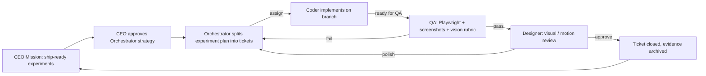

# Title

Experiment Redo Workflow Plan (End-to-End Company Run)

## Goal

Run the paperclip company defined in `03-company-org-chart.md` against an existing experiment plan and prove the loop works end-to-end: CEO sets the goal, Orchestrator splits the plan into tickets, Coder implements each ticket, QA validates with Playwright + vision, Designer reviews, and the run report is archived under `docs/sprint/003/runs/`. The default target for sprint 003 is [docs/experiment/000/](../../../experiment/000/).

## Scope

- Pick one experiment as the sprint 003 acceptance target. Default: `docs/experiment/000`.
- Define the per-experiment lifecycle, from CEO mission to archived run report.
- Define the run-report folder layout under `docs/sprint/003/runs/`.
- Define the single sprint-wide acceptance criterion: at least one experiment passes the full loop.

Out of scope for this step:

- Running the loop on `docs/experiment/001` or `docs/experiment/002` (those follow the same recipe; sprint 003 only requires one to complete).
- Replacing or rewriting the experiment plans themselves; this plan is about *running them through* the company.
- Productionizing the run reports (e.g. publishing them outside the repo).

## Architecture

- The company defined in `03-company-org-chart.md` is the only mover.
- The repo is the target. The Coder writes branches; QA and Designer write reports under `docs/sprint/003/runs/`; nothing else in the repo changes as part of this plan.
- Run reports are append-only per ticket; re-running a ticket overwrites the same folder cleanly (per QA's idempotency rule in `04-qa-agent.md`).

### End-to-End Loop



## Implementation Plan

1. Pick the sprint 003 acceptance target.
   - Default: `docs/experiment/000` (Pixi.js platformer experiment, smallest scope).
   - Alternatives if 000 is already in flight elsewhere: `docs/experiment/001` or `docs/experiment/002`.
   - Document the choice in the eventual run summary file (step 7).
2. CEO action.
   - File a top-level ticket in paperclip: *"Raise `docs/experiment/<id>` to ship-ready."*.
   - Approve the Orchestrator's strategy proposal before any work starts.
3. Orchestrator action.
   - Read every plan file under the chosen experiment.
   - Create one Coder ticket per plan file. Required fields per the Orchestrator skill in `05-skills-and-context-isolation.md`:
     - `id`
     - `branch` = `sprint-003/<experiment>/<ticket-id>`
     - `experiment_id` = `000` (or chosen)
     - `acceptance_criteria` copied from the plan's "Acceptance Criteria" section
     - `tags` (e.g. `animation`, `juice`, `interaction-feel`) so QA knows whether to capture video
   - Define dependency order between tickets (e.g. engine before runtime; persistence before route integration).
4. Coder action (per ticket).
   - Implement the ticket on its branch.
   - Run unit tests for affected packages.
   - Add or extend a Playwright spec covering the ticket's acceptance criteria (per `04-qa-agent.md` step 1).
   - Push the branch and flip the ticket to "ready for QA" with a one-paragraph summary.
5. QA action (per ticket).
   - Follow the pipeline in `04-qa-agent.md` step 2.
   - Write the report to `docs/sprint/003/runs/<experiment>/<ticket-id>/qa.md`.
   - Return `pass` or `fail` to the Orchestrator.
6. Designer action (per QA-pass ticket).
   - Review screenshots and any videos against the visual rubric in the Designer skill.
   - Write the report to `docs/sprint/003/runs/<experiment>/<ticket-id>/design.md`.
   - Return `approve` or file a linked polish ticket back to the Orchestrator.
7. Run summary.
   - When every ticket for the experiment is closed (or explicitly deferred), the Orchestrator produces `docs/sprint/003/runs/<experiment>/RUN.md`:
     - Ticket inventory with final verdicts.
     - Aggregate Playwright stats (specs run, duration, failures fixed).
     - Aggregate visual-review notes from Designer.
     - Total spend per agent vs. budget.
     - One-paragraph retrospective: what worked, what to retune (heartbeats, budgets, page caps).

### Run-Report Folder Layout

```
docs/sprint/003/runs/
  <experiment>/
    RUN.md
    <ticket-id>/
      qa.md
      design.md
      screenshots/
        <scenario>.png
      videos/
        <scenario>.mp4
```

## Tests

- The "trivial-change" smoke ticket from `04-qa-agent.md` and `03-company-org-chart.md` must succeed before this plan executes. It validates the loop on a no-op change.
- Forced-fail injection: deliberately introduce a regression in one Coder branch and confirm QA flips the ticket to `fail`, the Orchestrator files a linked bug, and the Coder closes it with a follow-up branch.
- Polish loop: confirm a Designer polish request creates a linked ticket the Coder can pick up under the same experiment folder.

## Acceptance Criteria

- One full experiment (default `docs/experiment/000`) has every plan file represented by a closed ticket.
- Each closed ticket has both `qa.md` and `design.md` under `docs/sprint/003/runs/<experiment>/<ticket-id>/`.
- A `RUN.md` exists at `docs/sprint/003/runs/<experiment>/RUN.md` with the inventory, stats, spend table, and retrospective.
- Total spend across the five agents stays under the `$200/mo` cap from `03-company-org-chart.md` for the duration of the run.
- No edits to `apps/desktop-app/`, `packages/ui/`, or `packages/domain/` source were caused by anything other than the Coder's tickets; QA and Designer only wrote under `docs/sprint/003/runs/**`.

## Dependencies

- All previous plans in this sprint (`01` through `05`) complete.
- The chosen experiment's plan files exist (already true for `docs/experiment/000`, `001`, `002`).
- The repo's existing skills used by Coder: `clean-architecture-frontend-svelte`, `svelte-frontend`, `backend-implementtion`.

## Risks / Notes

- The first run will surface mis-tuned heartbeats and budgets. Capture the retune list in `RUN.md` so sprint 004 (whatever it is) starts with corrections, not guesses.
- If a ticket bounces between Coder and QA more than three times, the Orchestrator should escalate to the CEO. Endless ping-pong is a signal that the acceptance criteria were too vague when the ticket was filed.
- Polish tickets from the Designer can compound. Cap them at one polish round per ticket for sprint 003; anything beyond that becomes a follow-up ticket in a future sprint.
- The "Coder is the only writer" rule from `03-company-org-chart.md` is what makes the run report trustworthy. If anyone else writes to source, the audit trail in `RUN.md` becomes a lie.
