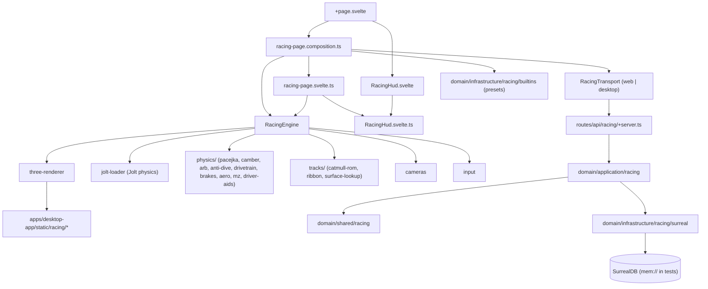

## Context

The single-file prototype at `.design_sketch/racing-sim-working-prototype.html` co-locates ~3,650 lines of game and physics logic, the HUD HTML/CSS, the Three.js renderer, the Jolt physics setup, the engine + drivetrain + tire models, the track and vehicle catalogs, and the input handling. It runs as an ES-module-only HTML page, loads `three` and `jolt-physics` from `esm.sh`, and persists setup tunables in `localStorage`. Helper math is partially extracted to `.design_sketch/racing-sim-physics.js` and `.design_sketch/track-geometry.test.js`, with matching `*.test.js` files exercised by Bun's test runner.

The desktop app (`apps/desktop-app`) is a SvelteKit shell wrapped by Electrobun. It hosts existing experiments at `/experiments/{chat,platformer,rts,storyboard,todo}`. Each experiment follows the same shape:

- `+page.svelte` is a thin shell that imports a `createXyzPage()` composition factory.
- `xyz-page.svelte.ts` owns the page model (state, actions, lifecycle).
- `xyz-page.composition.ts` wires app-local adapters and constructs the page model.
- App-local adapters (under `apps/desktop-app/src/lib/adapters/xyz/`) translate UI intent into HTTP or RPC calls.
- The shared engine lives under `packages/ui/src/lib/<feature>/engine/` (Pixi for `rts` and `platformer`).
- The shared HUD model and components live under `packages/ui/src/lib/<feature>/runtime/`.
- Domain types and use cases live under `packages/domain/src/{shared,application}/<feature>/`, with infrastructure (Surreal repos, built-in catalogs) under `packages/domain/src/infrastructure/<feature>/`.
- Tests use real SurrealDB `mem://` connections per workspace rules.

This change re-expresses the racing prototype's content through these existing boundaries: domain stays Three.js / Jolt-free, the engine stays HTTP / Surreal-free, the route stays a thin composition shell, and the renderer is built once inside the engine package rather than duplicated in the app.

## Goals / Non-Goals

**Goals:**

- Match the prototype's vehicle behaviour and HUD presentation inside `experiments/racing`, with no physics regressions.
- Promote `racing-sim-physics.js` and `track-geometry.test.js` from the design sketch into `packages/ui/src/lib/racing/engine/physics/` and `packages/ui/src/lib/racing/engine/tracks/`, with their tests preserved and extended.
- Side-load Three.js GLTF assets via SvelteKit's static folder, with a primitive-mesh fallback while assets resolve or if any fail.
- Surface vehicle / track / camera selection through querystring plus a minimal in-route picker, without rebuilding the entire prototype's setup screen on day one.
- Persist sessions, lap times, and per-user setups through a new `RacingTransport` adapter pair backed by SurrealDB, mirroring the existing chat / RTS persistence pattern.
- Preserve workspace clean-architecture boundaries: domain free of Three.js / Jolt, engine free of Surreal / HTTP, route thin and adapter-driven.
- Land the prototype's already-merged tuning fixes (camber-thrust `lateralSign`, ~250 hp/ton engine curve, 2.5 rad/s steering rate, ARB contact gating, smoothed off-throttle pumping drag) in the migrated engine on day one.

**Non-Goals:**

- No multiplayer, no AI opponents, no replays, no in-app track or vehicle authoring UI on day one.
- No controller / wheel input mapping beyond keyboard for the first cut.
- No mobile / touch input redesign.
- No engine / tire / impact audio synthesis on day one (audio is a follow-up; the page model exposes a `setMuted` no-op so future audio integration is non-breaking).
- No changes to the existing `chat`, `platformer`, `rts`, `storyboard`, or `todo` experiments.
- No new third-party packages beyond `three` and `jolt-physics`, both already used by the prototype.
- No replacement of `localStorage` for setup persistence; the transport synchronises on top of it, it does not displace it.

## Decisions

### 1. Mirror the `rts` / `platformer` route shape

Add `apps/desktop-app/src/routes/experiments/racing/` with `+page.svelte`, `racing-page.svelte.ts`, and `racing-page.composition.ts`. The composition root constructs the `RacingTransport`, the `RacingEngine`, and a no-op `AudioBus` (today; a `WebAudioBus` later) and hands them to the page model. The route's `+page.svelte` adds a single `<canvas>` host plus a Svelte HUD overlay and binds the keyboard hotkeys; everything else delegates downward.

**Alternatives considered:**

- *Inline the prototype HTML as a static asset.* Rejected because it sidesteps clean architecture, can't share code with the rest of the workspace, and forfeits TypeScript typing on the entire physics surface.
- *Add a separate top-level route (`/racing`).* Rejected because every other slice lives under `experiments/`; staying consistent reduces churn in nav and deploy paths.

### 2. Keep Three.js + Jolt; isolate them inside the engine package

The existing prototype already proves Three.js and Jolt are sufficient for the target physics quality. Promote them to first-party workspace dependencies, install them under `packages/ui` (where the engine lives), and avoid using them anywhere else. The renderer factory at `packages/ui/src/lib/racing/engine/three-renderer.ts` is the single Three.js entry point; the simulation loop at `RacingEngine.ts` is the single Jolt entry point.

**Alternatives considered:**

- *Replace Three.js with a Canvas2D / WebGPU renderer.* Rejected because Three.js handles the GLTF prop loading, lighting, shadow mapping, and picking that the prototype already uses; rewriting would burn a sprint for no behavioural gain.
- *Replace Jolt with a custom rigid-body solver.* Rejected because the prototype's quality bar (Pacejka tire forces with combined slip, anti-roll bars, anti-dive geometry) needs a stable rigid-body integrator; Jolt already provides that and the team has invested in tuning the override mass / inertia path.

### 3. Engine package layout mirrors `rts/engine` and `platformer/engine`

```
packages/ui/src/lib/racing/
  engine/
    RacingEngine.ts          // public engine API: start/stop/tick/event emitter
    three-renderer.ts        // Three.js scene, lights, camera rig, prop draws
    jolt-loader.ts           // Jolt initialisation, ground body, collision filters
    fixed-step-loop.ts       // 240 Hz fixed step + render interpolation (shared pattern)
    physics/
      pacejka.ts             // tireD + pacejkaLat + pacejkaLong + Gyk + thermal mu
      tire-thermal.ts        // tireTempMu curve + heat balance
      camber.ts              // static + roll-induced + caster camber, thrust
      arb.ts                 // anti-roll bar precomputation + contact gating
      anti-dive.ts           // antiDivePct / antiSquatPct geometry
      drivetrain.ts          // engine torque curve + slipping clutch + diff variants
      brakes.ts              // bias + thermal fade + ABS hold/release
      aero.ts                // drag, downforce, yaw-aware drag, yaw-restoring moment
      mz.ts                  // pneumatic-trail self-aligning moment
      driver-aids.ts         // ABS / TC / ESC interventions
      ackermann.ts           // computeAckermannPair + toe offset
      bump-stop.ts           // computeBumpStopForce
      motion-ratio.ts        // computeMotionRatio
    tracks/
      catmull-rom.ts         // centerline sample + ribbon points
      ribbon-geometry.ts     // ribbon mesh + side strips (curb / rubber / marbles)
      surface-lookup.ts      // surfaceAt(x, z) over zones
    cameras.ts               // chase / hood / far / map cameras with horizon decoupling
    input.ts                 // keyboard input with smoothing + handbrake + reset
    index.ts                 // public exports
  runtime/
    RacingHud.svelte         // HUD root: top bar + input + per-wheel + drift
    RacingHud.svelte.ts      // HUD model
    components/
      SpeedCard.svelte
      RpmCard.svelte
      GearCard.svelte
      LapCard.svelte
      InputCard.svelte
      WheelCard.svelte
      DriftPanel.svelte
      DebugTrace.svelte
      GgPlot.svelte
    index.ts
  index.ts                   // Racing namespace barrel re-exported from ui/source
```

Each `physics/` file has a single responsibility, exports pure functions where possible, and is unit-tested in isolation. `RacingEngine.ts` orchestrates them per simulation step; nothing in `physics/` imports Jolt or Three.js — those are passed as parameters.

**Alternatives considered:**

- *One big `physics.ts` like the prototype's `updateVehicle()`.* Rejected because the prototype is ~700 lines for a single function and is the hardest part of the codebase to review; splitting along the same axes used for tests keeps each file scannable.
- *Keep helpers in `racing-sim-physics.js` as a sibling JS module.* Rejected because the workspace standardises on TypeScript and we want IDE-level types across the boundary.

### 4. Domain types model authoring data, not the simulation

The simulation lives in the engine package; the domain models the `data` that crosses the wire and round-trips through the catalog. That keeps `packages/domain` tiny and Three.js / Jolt-free. Concretely:

- `domain/shared/racing/vehicle-types.ts`: `VehiclePreset`, `VehicleDrivetrain`, `WheelLayout`, `SuspensionConfig`, `DiffConfig`, `AeroConfig`. No `Body`, no `Vector3`, no Jolt or Three references.
- `domain/shared/racing/track-types.ts`: `TrackPreset`, `CenterlineCtrl`, `SurfaceZone`, `SceneryHint`. `CenterlineCtrl` is plain `[number, number]` tuples; the engine builds the `CatmullRomCurve3` from those tuples.
- `domain/shared/racing/setup-types.ts`: `SetupValues` with toe / caster / Ackermann / motion ratios / bump-stops, plus `clampSetup` and `defaultSetup` helpers.
- `domain/shared/racing/surface-types.ts`: the seven named surfaces and their `mu / roll / color` payload.
- `domain/shared/racing/match-types.ts`: `RacingSession`, `LapResult`, `SectorTime`.
- `domain/application/racing/RacingTransport.ts`: the port consumed by the page model and implemented by the app-local adapter.
- `domain/application/racing/use-cases/{start-session,record-lap,get-best-lap,get-setup,set-setup}.ts`: thin orchestration that takes a `RacingTransport` (or repository) and returns a domain-shaped result.
- `domain/infrastructure/racing/builtins/{*.json}`: authored vehicle and track presets, validated at load time.
- `domain/infrastructure/racing/surreal/`: Surreal repository implementations following `SurrealTodoRepository.ts`.

**Alternatives considered:**

- *Move tire / drivetrain / aero math into `domain/shared`.* Rejected because that math is engine logic, not authoring data; keeping it in the engine avoids dragging numerics into the domain barrel and into anything that imports `domain`.
- *Skip the domain layer and import authoring data directly from JSON in the app.* Rejected because the existing experiments (RTS, todo, chat) all funnel through the domain layer and the consistency is worth more than the file count.

### 5. `RacingTransport` and adapter pair, mirroring `RtsTransport`

Define `RacingTransport` in `domain/application/racing/`:

```ts
export interface RacingTransport {
  startSession(input: StartSessionInput): Promise<RacingSession>;
  recordLap(lap: LapResult): Promise<LapResult>;
  getBestLap(trackId: string, vehicleId: string): Promise<LapResult | null>;
  getSetup(userId: string): Promise<SetupValues | null>;
  setSetup(userId: string, setup: SetupValues): Promise<void>;
}
```

App-local adapters live under `apps/desktop-app/src/lib/adapters/racing/`:

- `RacingTransport.ts` re-exports the domain interface as the local boundary.
- `web-racing-transport.ts` implements it over `fetch` to `/api/racing/...`.
- `desktop-racing-transport.ts` implements it over Electrobun RPC for packaged builds.
- `create-racing-transport.ts` resolves which adapter to use at runtime.

The API route at `apps/desktop-app/src/routes/api/racing/` resolves the use cases and writes through Surreal repositories. The `+server.ts` files mirror the chat / RTS conventions, including the empty-table-returns-200 semantics tested by the e2e helper `patchEmptyTableErrors`.

**Alternatives considered:**

- *Skip persistence on day one and store everything in `localStorage`.* Rejected because the prototype already proved out best-lap value and the workspace already has a Surreal pipeline; reusing it is cheap and matches the other experiments.
- *Single transport with mode flags, no adapter pair.* Rejected because `dev:web` and packaged desktop builds resolve URLs differently; the adapter pair already exists everywhere else and keeps mode-specific logic at the boundary.

### 6. Setup persistence keeps `localStorage` as the authoritative cache

The prototype writes setup edits to `localStorage` under `aml_racing_setup` and reads them back on load. Keep that behaviour: edits write through to `localStorage` first (offline-first), then fire-and-forget through `RacingTransport.setSetup`. On bootstrap, read `localStorage`, then if `RacingTransport.getSetup` returns a value, override the cache and update `localStorage`. This way the user keeps their setup even if the API is unreachable, and authenticated users get cross-device sync once the server is reachable.

**Alternatives considered:**

- *Drop `localStorage` entirely.* Rejected because the prototype's "open-and-go" feel relies on values being immediately available, even before a network round-trip.
- *Server is the source of truth.* Rejected for the same reason; the desktop build and offline use cases benefit from local-first.

### 7. Three.js + Jolt as workspace dependencies on `packages/ui`

Both libraries are already pulled into the prototype via `esm.sh`. Promote them to real workspace dependencies in `packages/ui/package.json` so TypeScript types resolve and the bundler can tree-shake. `apps/desktop-app` does not import them directly; its only racing dependency is on `ui/source` (engine + HUD) and `domain/shared` (types).

The engine boots Jolt with `await initJolt()` at construction time. The page model awaits `engine.bootstrap()` before the first render so the simulation never ticks against an uninitialised Jolt module.

**Alternatives considered:**

- *Lazy-load Three.js / Jolt at runtime via dynamic `import()`.* Rejected for the first cut because the route is heavy regardless and lazy-loading complicates SSR / hydration; can revisit once we measure bundle impact.
- *Polyfill Jolt with a custom rigid-body solver.* Rejected as covered in Decision 2.

### 8. Renderer is one factory with primitive fallback for missing assets

Inside `three-renderer.ts`, the renderer accepts a `getAsset(name)` callback that returns either a Three.js `Group` (loaded GLTF) or `null`. The renderer renders the asset when available and falls back to a deterministic primitive (e.g. `BoxGeometry` for barriers, `CylinderGeometry` for cones) when null. The page composition starts asset loading on bootstrap; the engine doesn't wait for assets before running. If an asset load promise rejects, the engine logs once and the renderer permanently uses the primitive.

**Alternatives considered:**

- *Block the simulation until all assets resolve.* Rejected because Jolt and the simulation are already responsive; gating on slow GLTF loads would degrade time-to-interactive for no gameplay value.
- *Bake assets into the bundle as base64.* Rejected because GLTF bytes are not small; HTTP caching of `apps/desktop-app/static/racing/*` is cheaper.

### 9. HUD lives in `packages/ui/src/lib/racing/runtime/`, talks via the page model

The Svelte HUD components are dumb: they take props and render. The HUD model (`RacingHud.svelte.ts`) snapshots the engine's per-frame state into reactive `$state` (Svelte 5) values that the components subscribe to via `chat.messages`-style getters (no destructuring). The page model owns the HUD model and feeds it from the engine's `tick` event. This isolates DOM updates from the simulation's hot path: the engine emits a snapshot, the HUD model maps it, components react.

**Alternatives considered:**

- *Render the HUD inside Three.js as 3D billboards.* Rejected because the prototype's HTML+CSS HUD is already designed to a high quality bar and rebuilding it in Three.js is a sprint of UI work for no gain.
- *Read engine state directly inside `.svelte` files.* Rejected because mixing simulation reads with rendering breaks the workspace's separation between visual logic (`.svelte.ts`) and visual elements (`.svelte`), and makes the HUD untestable in isolation.

### 10. Camera modes belong to the renderer, not the page model

The four camera modes (`chase`, `hood`, `far`, `map`) are functions of chassis state plus a mode enum. They live in `cameras.ts` inside the engine package. The page model exposes `setCameraMode(mode)` and persists the active mode through the URL (`?cam=hood`) and `localStorage`. Horizon decoupling (camera tracks chassis yaw but stays world-vertical) is a property of every mode and is implemented once.

**Alternatives considered:**

- *Each route renders its own camera.* Rejected because the prototype already proves a single camera rig works for all modes; copying it per app would re-derive the smoothing constants.
- *Promote camera state into the domain.* Rejected because cameras are presentation, not authoring data.

### 11. Lap timing and session bookkeeping live in the engine, persistence in the transport

The engine watches the chassis crossing the start/finish line (a `THREE.Plane` derived from the track's first sample tangent) and emits `lapStarted` / `lapFinished` events. The page model receives these events, increments the running lap, and calls `RacingTransport.recordLap` when a lap finishes. Best-lap state is derived from `RacingTransport.getBestLap` on bootstrap; the engine doesn't manage persistence directly.

**Alternatives considered:**

- *Track lap timing in the page model.* Rejected because the relevant signals (chassis position, last position) are already in the engine; routing them out and back is unnecessary indirection.
- *Persist best laps on the engine side.* Rejected to keep the engine HTTP-free; the page model owns the "when to call the transport" decision.

### 12. Migrate existing helper tests, then extend

`.design_sketch/racing-sim-physics.test.js` already covers `tireD`, `pacejkaLat`, `pacejkaLong`, `engineTorqueAt`, `computeToeSlipOffset`, `computeAckermannAngles`, `computeMotionRatio`, `computeBumpStopForce`, and `computeCasterCamber`. Move these tests into `packages/ui/src/lib/racing/engine/physics/*.test.ts` alongside the migrated sources. Then add the missing coverage called out in the spec: camber-thrust mirror cancellation, ARB transfer with both wheels grounded vs one airborne, anti-dive sign, brake fade past `BRAKE_FADE_T0`, yaw-aero moment direction, `Mz` decay past peak slip, and slipping-clutch torque limits.

`.design_sketch/track-geometry.test.js` exercises ribbon geometry helpers; move it to `packages/ui/src/lib/racing/engine/tracks/*.test.ts`.

**Alternatives considered:**

- *Re-derive tests from scratch.* Rejected because the existing tests already pin down behaviour the migration must preserve; carrying them is the cheapest regression guard.

### 13. Promote already-merged tuning fixes from the prototype on day one

The prototype's most recent tuning pass fixed:

- Camber thrust direction (`Fy += w.lateralSign * 1.5 * camberRad * fz`).
- Engine torque scaled to ~250 hp/ton (peak ~405 Nm at 5500 rpm).
- Steering rate slowed from `5.0/s` to `2.5/s`, self-center from `6.0` to `3.5`.
- ARB pre-pass gated on contact (no transfer if either wheel of the axle is airborne).
- Smoothed off-throttle pumping drag (`8 + 20·clamp(1 − thr·4, 0, 1)` instead of a step at exactly 0).

These ship in the migrated engine on day one. The migration is not a place to re-debate already-validated tunings.

**Alternatives considered:**

- *Migrate the pre-tuning version and re-tune in the new home.* Rejected because the tuning was driven by user feedback against the prototype; re-running that loop in the production app wastes a sprint.

## Risks / Trade-offs

- **Bundle size.** Three.js + Jolt are heavy. We accept the cost on day one; track bundle size against the existing experiments and revisit dynamic imports if it regresses the rest of the desktop app's load time.
- **Jolt initialisation timing.** Jolt is a wasm module; `await initJolt()` must complete before any `Jolt.*` access. The page composition awaits it before the first tick, but a missing `await` anywhere in the migrated code crashes silently in dev. Mitigation: a single `jolt-loader.ts` that owns the initialisation promise and exposes a typed `getJolt()` accessor; use that everywhere.
- **Asset fallback parity.** Some Three.js GLTF props look meaningfully better than primitives; the route always boots in vector / primitive mode. Mitigation: ship a "fallback while loading" badge in dev builds, hidden in prod, so we know whether assets resolved.
- **HUD performance budget.** The per-wheel cards update at frame rate. Mitigation: snapshot the engine state once per frame in the HUD model and let Svelte's fine-grained reactivity diff the values; avoid per-row Svelte components that thrash the DOM.
- **Setup screen scope creep.** The prototype's setup UI is a meaningful surface in its own right (sliders, validation, reset to defaults). Day-one ships querystring + hidden defaults plus the persistence transport; a richer in-route setup UI is an immediate follow-up.
- **Track cataloging churn.** The three built-in tracks are tuned to not self-intersect at 240–280 sample counts. If the renderer's ribbon geometry differs subtly (e.g. side-strip widths), the visual seam may shift. Mitigation: migrate the prototype's `ribbonGeometry`, `placeProps`, and `pointInRotatedRect` helpers verbatim and snapshot one frame in the e2e to catch obvious regressions.
- **No audio on day one.** Vehicle audio (engine, tires, impacts, wind) is a notable absence vs the prototype's already-present sense of motion. Mitigation: stub the AudioBus, document the follow-up, ensure the page model exposes `setMuted` so future audio work is a non-breaking change.
- **Jolt API drift.** Jolt's wasm module exposes inertia overrides through `mInertia.SetDiagonal3` (already used). If we upgrade Jolt later, those APIs may move. Mitigation: keep Jolt initialisation and chassis creation in `jolt-loader.ts` so any API changes are a single-file edit.
- **Domain bloat.** The vehicle preset alone has many fields (drivetrain, gears, suspension, ARB, diff, aero, geometry). Mitigation: keep the type definitions tight (no helpers, no behaviour), document each field with a single-line JSDoc, and let the engine carry the simulation-side derived structures.

## Integration diagram


