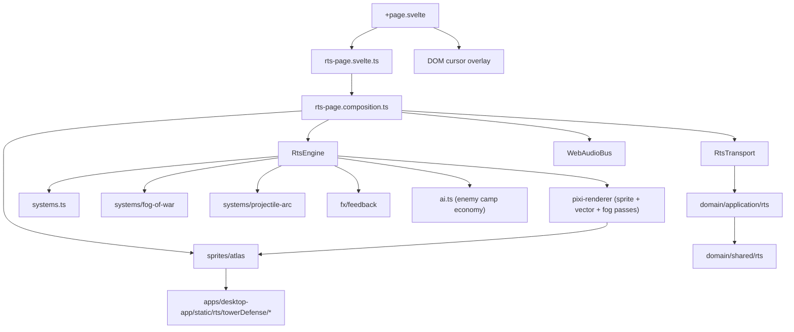

## Context

`apps/desktop-app/src/routes/experiments/rts/+page.svelte` already wires:

- A SvelteKit route → `rts-page.svelte.ts` (page model) → `rts-page.composition.ts` (composition root with `RtsTransport`).
- A workspace-shared engine in `packages/ui/src/lib/rts/engine/`: `RtsEngine.ts` (loop + state), `world.ts` (ECS-lite world), `systems.ts` (combat/economy/AI ticks), `pixi-renderer.ts` (Pixi 8 renderer factory), `audio-bus.ts` (interface + `NullAudioBus`), and supporting files (`pathfinding.ts`, `iso.ts`, `tile-grid.ts`, `events.ts`, `fx.ts`, `ai.ts`).
- Domain layer types already covering the prototype's vocabulary: `UnitKind` includes `worker | rifleman | rocket | scout`, `BuildingKind` includes `hq | barracks | factory | refinery | depot | turret`, `ResourceKind` is `mineral | gas`, and `TerrainKind` includes `cliff` with `blocksVision: true` and `blocksProjectiles: true`. The skeleton is in place; the engine and renderer just don't use it yet.

The single-file design sketch at `.design_sketch/rts-working-game-prototype.html` proves the target experience: altitude-aware Kenney sprites, dual mineral/gas economy, fog of war, scout/rocket units, parabolic projectiles, hit-stop, audio synthesis, and an enemy camp economy. The single file packs five layered `<script>` blocks of game logic and a sixth Kenney sprite skin with inlined pre-parsed frame rectangles.

This change re-expresses the sketch's content through the existing workspace boundaries: domain stays Pixi-free, the engine stays HTTP-free, the route stays a thin composition shell, and the renderer extends rather than replaces the existing `createPixiRtsRendererFactory`.

## Goals / Non-Goals

**Goals:**

- Match the prototype's in-match presentation, game feel, and gameplay inside the existing route, with no renderer rewrite.
- Side-load Kenney TD assets via SvelteKit's static folder and resolve atlas frames from a hand-curated frame map (no XML parsing at runtime).
- Surface mineral/gas split, scout/rocket training, and patrol/repair orders through the existing HUD without breaking the lobby or current command card.
- Default the runtime audio bus to a WebAudio implementation while keeping `NullAudioBus` available for tests.
- Add fog of war, altitude combat bonuses, parabolic projectiles, and an enemy camp economy on top of the existing `systems.ts` simulation.
- Preserve the workspace's clean architecture: domain free of Pixi, engine free of SurrealDB and HTTP, route thin and adapter-driven.

**Non-Goals:**

- No new top-level routes, no new SvelteKit API endpoints, no replacement for `createPixiRtsRendererFactory`.
- No multiplayer, no replays, no in-match save/load, no asymmetric AI factions.
- No marketing-flow integration, no mobile/touch input redesign.
- No new third-party packages: WebAudio is browser-native and PixiJS is already a workspace dependency.
- No persistence schema changes beyond the existing `RtsTransport` surface area.

## Decisions

### 1. Keep Pixi, extend the existing renderer

Reuse `createPixiRtsRendererFactory` as the single renderer entry point. Inside `pixi-renderer.ts`, add three new draw passes that compose with the current vector pass:

- A sprite tile pass that resolves a Kenney landscape sprite per tile based on altitude.
- A sprite building/decor pass that swaps the existing vector building geometry for `PIXI.Sprite` instances at fixed pixel widths.
- A fog overlay pass that blits a soft alpha mask over the world container.

The vector pass remains the fallback. The runtime starts in vector mode and upgrades to sprite mode once the atlases finish loading. The `T` key toggles between them at runtime for debugging.

**Alternatives considered:**

- *Replace Pixi with a Canvas2D renderer copied from the prototype.* Rejected because it throws away depth sorting, particle containers, and the existing renderer factory contract; it would also force every consumer to revalidate.
- *Add a second renderer factory.* Rejected because dual factories double the integration surface for transient debugging value; a `T` toggle inside the existing factory is enough.

### 2. Side-load Kenney TD atlases via static folder + inlined frame map

Drop the four PNG sheets used by the prototype (landscape, towers grey, towers red, towers brown) under `apps/desktop-app/static/rts/towerDefense/Spritesheet/`, alongside Kenney's `License.txt` so attribution ships with the build. Build a frame-rect map at module load time inside `packages/ui/src/lib/rts/engine/sprites/atlas.ts` by inlining only the rectangles we use (the prototype's frame map is already a hand-pruned subset of Kenney's XML).

**Alternatives considered:**

- *Parse the XML at runtime.* Rejected because the XML adds load latency and XML parsing surface area without gain; Kenney's frame layout is stable.
- *Bake the atlases into TypeScript as base64.* Rejected because it bloats the JS bundle and defeats HTTP caching for static images.
- *Publish the atlases as a separate npm package.* Rejected as overkill for a single-app skirmish prototype.

### 3. Fixed pixel widths for buildings, decoupled from collision radius

The prototype proved that scaling sprites by `radius * scale` makes depot/turret/refinery look identical because their collision radii cluster around 22–23 px. Render width is therefore decoupled from collision radius and set as an absolute pixel width: HQ `116`, refinery `78`, depot `60`, turret `38`, enemy camp `134`. Collision/footprint logic in `systems.ts` continues to use the building's domain `radius` independently.

**Alternatives considered:**

- *Tune collision radii to match silhouettes.* Rejected because collision and visual silhouette serve different purposes; coupling them entangles gameplay tuning with art tuning.
- *Adopt the Kenney pack's relative scales.* Rejected because the pack is a tower-defense set, not designed for an isometric RTS hierarchy.

### 4. Custom water polygon instead of `landscape_36.png`

Kenney's `landscape_36.png` is a small pond-on-grass sprite, not a full water tile. Drawing it for every water tile produces a "grass with a circle on it" look that breaks at the boundary between water and shore. The renderer therefore paints water and shallow tiles as a custom blue/teal isometric diamond polygon with two short wave strokes. Fast, deterministic, and consistent with the grid math the renderer already uses.

**Alternatives considered:**

- *Author a new sprite atlas with full-water tiles.* Rejected because a procedural polygon is simpler, ships immediately, and matches the rest of the iso math.
- *Tile a textured water sub-rect over the whole tile.* Rejected because Kenney's water texture isn't seamless at iso angles.

### 5. WebAudioBus replaces NullAudioBus as runtime default

`AudioBus` already exists as an interface. Add `WebAudioBus` next to `NullAudioBus` in `packages/ui/src/lib/rts/engine/audio-bus.ts`. It wraps an `AudioContext`, lazy-resumes on the first user gesture, exposes a master mute, and synthesizes per-event tones using `OscillatorNode` + `GainNode` envelopes plus a small white-noise burst helper for impacts. The prototype's tone palette (`select`, `move`, `attack`, `build-place`, `build-complete`, `unit-die`, `rocket-hit`, `wave-alarm`, `victory`, `defeat`) is reused verbatim. The composition root injects the WebAudio bus by default and the existing test seam stays available for unit tests.

**Alternatives considered:**

- *Ship pre-recorded `.ogg`/`.wav` clips.* Rejected because synthesized tones avoid an asset pipeline, license headache, and bundle bloat; quality is sufficient for prototype game-feel.
- *Wire Howler.js or a similar library.* Rejected to avoid a new dependency for a feature the browser handles natively.

### 6. Fog of war as a per-faction grid + Pixi mask container

Add `packages/ui/src/lib/rts/engine/systems/fog-of-war.ts`. Each tick, the system rebuilds the player faction's visibility grid by sweeping every player-owned unit/building's sight radius and accounting for altitude (high ground sees over low cliffs; cliffs block low-altitude sightlines). Tiles previously visible degrade to `explored`; tiles that were never visible stay `unexplored`. The renderer adds a `fogOverlay` PIXI container above the world container with a tinted alpha mask: opaque dark for `unexplored`, dim for `explored`, transparent for `visible`. Enemy entities only render on `visible` tiles.

**Alternatives considered:**

- *Per-tile alpha tint without a separate container.* Rejected because it interleaves rendering and visibility, makes culling enemy entities awkward, and complicates rendering of explored static content (decor stays, units don't).
- *Shader-based fog.* Rejected because the prototype proves a CPU grid plus blitted sprites is fast enough at our grid size.

### 7. Parabolic projectiles via dedicated engine system

Add `packages/ui/src/lib/rts/engine/systems/projectile-arc.ts`. Standard projectiles use the existing straight-line system in `systems.ts`; rocket projectiles route through the new system, which integrates a parabola in tile space, samples cliff occlusion only on the descent (so they arc over cliff lines), and applies splash damage on impact through the engine's existing damage application path. The renderer draws the projectile sprite plus a soft trail and a directional muzzle effect at launch.

**Alternatives considered:**

- *Special-case rockets inside `systems.ts`.* Rejected because `systems.ts` is already 388 lines and densely interleaves combat/economy/AI; a separate file keeps the math reviewable and tests focused.
- *Ignore cliff occlusion for rockets entirely.* Rejected because part of rockets' tactical value is "I can shoot over a cliff a soldier can't"; we want the line to be observable by the player.

### 8. Feedback layer in `fx/feedback.ts`, layered over the existing fx pass

Add `packages/ui/src/lib/rts/engine/fx/feedback.ts`. It owns:

- An order-acknowledgement ripple pool drawn at order targets.
- Selection-pop tween state that overshoots and decays into the steady selection ring.
- A combat-heat scalar updated on damage events; the renderer reads it to scale particle density and a screen vignette.
- A hit-stop scheduler the engine consults between ticks: when active, the simulation step is skipped while interpolation still runs.
- A directional camera-shake offset accumulator the renderer applies before world transforms.

The custom canvas cursor stays in the page boundary: a DOM overlay above the Pixi canvas in `+page.svelte` reads the engine's currently armed order and selected-entity hover target. Putting the cursor in the DOM avoids paying for a Pixi cursor texture on every frame, and makes pointer events trivially passthrough.

**Alternatives considered:**

- *Render the cursor inside Pixi.* Rejected because it forces a top-most container, fights pointer-events on HTML overlays, and adds a Pixi sprite per tick for no gain.
- *Feedback as ad-hoc tweens inside `pixi-renderer.ts`.* Rejected because it scatters responsibility and makes audio/visual ordering fragile across ticks.

### 9. Domain-side extension instead of redesign

The domain layer already enumerates `scout`, `rocket`, `refinery`, `depot`, `turret`, and `gas`. The work is to fill in stats (`packages/domain/src/shared/rts/stats.ts`), add the `patrol` and `repair` order kinds to the engine's order vocabulary plus any domain-side validation in `validation.ts`, and wire the altitude combat bonuses where combat resolution lives (engine `systems.ts` consumes domain stats; the bonuses are pure functions kept in `domain/shared/rts/stats.ts` so they remain UI-free).

**Alternatives considered:**

- *Move combat resolution into `domain/application`.* Rejected because the simulation tick is engine-side by design; the domain only owns deterministic shared math/types.
- *Add a new `RtsTransport` method per new feature.* Rejected because the in-match simulation is client-side once a match is started; only `start-match` and `record-match-result` cross the transport, and both stay backwards-compatible.

### 10. Built-in maps grow gas anchors and ramp slots

`packages/domain/src/infrastructure/rts/builtins/{tiny-skirmish,dual-ramps,cliffside}.json` gain gas resource anchors near each starting position and along ramps, and an enemy-camp slot that the AI uses for its production economy. Existing player starts and mineral patches are preserved so existing snapshots don't regress. The map generator/lobby continues to load these files unchanged.

**Alternatives considered:**

- *Author entirely new maps.* Rejected because the named maps are already wired through the lobby and tests; growing them avoids a router/UI change.
- *Procedurally inject gas at runtime.* Rejected because it makes the maps less testable and less authorable.

### 11. Composition layer wires WebAudio + atlas loader through deps, not globals

`rts-page.composition.ts` constructs the renderer factory, the audio bus (WebAudio by default, swappable for `NullAudioBus`), and the atlas loader, and hands them to `RtsEngine` via its existing constructor inputs. The page model (`rts-page.svelte.ts`) gets new HUD slots (gas counter, scout/rocket/patrol/repair buttons) but keeps its public method names; the route's `+page.svelte` adds key bindings for `M` (mute) and `T` (renderer toggle) and renders the cursor overlay.

**Alternatives considered:**

- *Singletons in the engine module.* Rejected because it makes test seams brittle and breaks SSR fall-through.
- *A new `RtsTransport` capability surface.* Rejected because audio and atlas loading are pure browser concerns, not transport concerns.

## Risks / Trade-offs

- **Sprite mode vs vector mode parity.** The renderer must handle every overlay (selection rings, projectiles, fog, particles, building damage tints) consistently in both modes. Mitigation: keep the overlays mode-agnostic (they live above the tile/building passes), and exercise both modes in the Playwright e2e via the `T` toggle.
- **WebAudio autoplay policy.** Browsers require a user gesture before resuming an `AudioContext`. The prototype already proves the lazy-resume pattern; tests must use `NullAudioBus` to stay deterministic.
- **Performance budget.** The fog mask, particle density, and combat-heat vignette could thrash GC if implemented naively. Mitigation: pool overlay objects, use `PIXI.ParticleContainer`, and prefer typed arrays for the visibility grid.
- **Asset attribution.** Kenney's CC0 license still requires us to ship the bundled `License.txt` and credit the pack in the route's footer / about. The change includes the file copy and a one-line footer credit.
- **HUD churn.** Adding mineral/gas split and four new command-card buttons risks crowding the existing layout. Mitigation: reuse the existing HUD model and add buttons through enablement flags so disabled buttons stay legible.
- **Engine system count.** Splitting fog-of-war and projectile-arc into separate files increases the number of moving parts. Mitigation: each system has a single tick entry point, owns its own state, and is unit-tested in isolation; `RtsEngine.ts` only orchestrates ordering.

## Integration diagram

